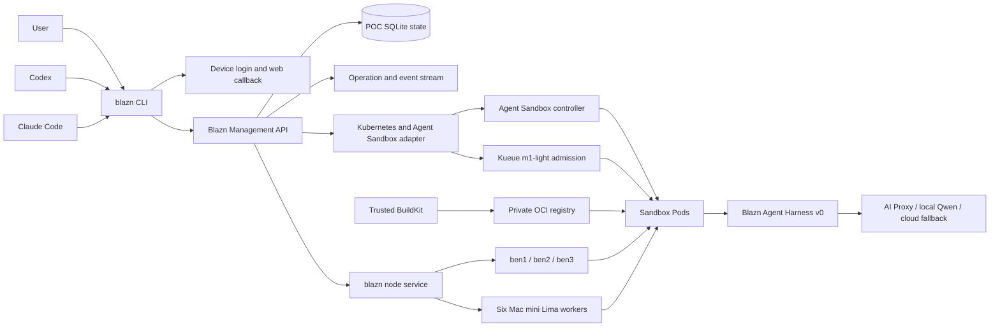

# Blazn Proof-of-Concept Execution Plan

**Status:** Execution-ready draft

**Date:** 2026-08-21

**Audience:** Product, platform, security, and implementation owners

**Purpose:** Build and verify a narrow but complete Blazn vertical slice on the existing Linux Kubernetes fleet and Mac mini workers

## Executive decision

The POC should reuse the existing Frontro agent fleet as its execution substrate and prove the Blazn product contract above it. It should not replace the working MicroK8s, Kueue, registry, BuildKit, agent runtime, or Mac worker foundation during the first proof.

The POC will add:

- A distributable `blazn` CLI for macOS and Linux.
- Browser/device authentication and secure local session storage.
- Users, workspaces, invitations, membership, and roles.
- Blazn node enrollment and complete safe node lifecycle management.
- A Blazn Management API and durable Operations.
- Kubernetes Agent Sandbox as an isolated POC adapter for Sandbox, SandboxTemplate, SandboxClaim, and optional warm-pool behavior.
- Blazn SandboxTemplate and Sandbox resources mapped onto Kubernetes.
- A minimal development workflow that validates, builds, tests, publishes, and runs an immutable agent and sandbox template.
- A minimal Blazn Agent Harness built from the proven runtime and supervisor patterns.
- Machine-readable commands that Codex, Claude Code, and other harnesses can invoke.
- End-to-end evidence proving installation, authentication, workspace collaboration, node management, sandbox lifecycle, agent execution, cleanup, and cross-architecture behavior.

The POC must run in dedicated Blazn namespaces and use the existing Kueue capacity envelope. It must not interrupt current Frontro agent work, widen existing credentials, or claim production-grade untrusted-code isolation before a hardened RuntimeClass is qualified.

## POC outcome

The proof is complete when two users can install `blazn`, authenticate, join the same workspace, register and manage the existing Linux and Mac nodes, publish a versioned sandbox template, create sandboxes on AMD64 and ARM64 workers, publish and run a versioned agent, and observe and control that work through the CLI and Management API.

The same authenticated CLI must be usable from an ordinary terminal and when invoked by Codex or Claude Code. External harnesses are control clients: they invoke `blazn` to manage Blazn agents and environments. Blazn-managed agents still execute through the Blazn Agent Harness so run state, credentials, events, policy, and cleanup remain consistent.

## Reviewed sources

This plan is based on:

- [`product-overview.md`](product-overview.md), including the detailed Node, SandboxTemplate, Sandbox, Queue, Agent, Development, CLI, Management API, Agent Harness, analytics, metrics, and security contracts.
- `FrontRowXP/blaze-internal` at `origin/main` commit `5e553c6`, reviewed on 2026-08-21.
- The live MicroK8s cluster, inspected read-only on 2026-08-21.
- `frontro-agent-fleet-m1-plan.md` and `frontro-agent-fleet-kubernetes-plan.md` from the existing workspace.
- `KingJammin/blaze-proxy` at commit `66188a1` and release `v0.6.0`.
- [Kubernetes SIG Agent Sandbox overview](https://agent-sandbox.sigs.k8s.io/docs/getting_started/overview/).
- [Kubernetes SIG Agent Sandbox release v0.5.6](https://github.com/kubernetes-sigs/agent-sandbox/releases/tag/v0.5.6).
- The official Agent Sandbox Kueue and warm-pool examples in the `kubernetes-sigs/agent-sandbox` repository.

Any code moved from the private `FrontRowXP/blaze-internal` repository into `KingJammin/blazn` requires an explicit ownership and licensing decision. Until that is recorded, reuse means adopting proven contracts and patterns or creating an interface-compatible implementation, not silently copying private code.

## Verified starting state

### Live cluster

The read-only inspection on 2026-08-21 confirmed:

| Item | Observed state |
| --- | --- |
| Kubernetes | MicroK8s `v1.35.6`, HA enabled |
| Linux control and worker nodes | `ben1`, `ben2`, and `ben3`, all Ready, AMD64, and agent-eligible |
| Mac workers | `mac-mini-1-agent` through `mac-mini-6-agent`, all Ready, ARM64, and agent-eligible |
| Mac isolation boundary | One Ubuntu ARM64 Lima VM per Mac mini; macOS is not joined directly to Kubernetes |
| Kueue | Installed and active with `m1-light` ClusterQueue |
| Kueue envelope | 64 CPU, 128 GiB memory, and 320 GiB ephemeral storage |
| Runtime LocalQueues | `frontro-agent`, `blaze-interactive`, `agent-temporary`, `agent-regular`, and `agent-delivery` |
| Current activity | Existing admitted and running work was present; the POC must not assume an idle cluster |
| Metrics | Metrics Server is deployed with two ready replicas |
| Agent Control | API, MCP adapter, supervisor, and supporting agent components are deployed |
| Local model | Current repository and runtime target Qwen 3.8 with bounded cloud failover behavior |
| Registry and builds | Private authenticated registry and trusted BuildKit workflow with immutable image digests |
| Sandbox CRDs | No `agents.x-k8s.io` or Agent Sandbox extension CRDs installed |
| Hardened runtime | No gVisor or Kata RuntimeClass observed |
| Dynamic sandbox storage | No general dynamic StorageClass; current persistent volumes are explicitly provisioned local volumes |

### Existing implementation assets

The current `blaze-internal` main branch already contains reusable patterns for:

- Kueue admission, resource profiles, quotas, queue routing, and overflow verification.
- Immutable multi-architecture runtime images.
- AMD64 Linux and ARM64 Mac mini Kubernetes execution.
- Mac worker installation through Lima, bridged networking, MicroK8s worker join, taints, labels, and serial qualification.
- A TypeScript agent-control API and generated client package.
- Durable SQLite-backed agent and Operation state.
- Authentication with bearer principals, authorization checks, confirmation, idempotency, optimistic concurrency, and audit evidence.
- Agent launch, status, logs, events, follow-up messages, cancellation, results, nodes, capacity, and queues.
- Scheduled and persistent workload lifecycle executors.
- A supervisor for local-model agent lanes.
- Fail-closed local Qwen-to-cloud fallback behavior.
- A `frontro-agent` CLI and a private MCP adapter.
- Static, unit, contract, security, manifest, lifecycle, capacity, and cleanup tests.
- Guarded deployment, rollout, rollback, and qualification workflows.

### Blaze Proxy reference

Blaze Proxy provides useful reference patterns for:

- Homebrew and curl installation UX.
- A headless CLI plus optional desktop process.
- Cross-platform capability reporting.
- OpenAI-compatible Responses and Chat Completions routing.
- Localhost control surfaces and live SSE request feeds.
- Listener-scoped API keys stored only as hashes.
- macOS Keychain use and explicit non-macOS capability gaps.
- Codex custom-provider configuration and nested-invocation warnings.

The POC should improve two distribution weaknesses instead of copying them:

- The reviewed Blaze Proxy Homebrew formula points at an older release than the package version.
- The curl installer installs from a moving Git branch and requires a preinstalled Node runtime.

Blazn should use signed, versioned static release binaries, checksums, automated formula updates, and no runtime dependency for the CLI.

## Gap analysis

| Capability | Existing state | POC work |
| --- | --- | --- |
| Installable Blazn CLI | No Blazn CLI | Build static Go binary, Brew formula, and curl installer |
| User login | Existing system-admin and bearer-token patterns | Add device/browser login, user sessions, logout, revocation, and secure token storage |
| Workspaces | Not present in Agent Control | Add workspace, membership, invitation, roles, and active-context model |
| Node enrollment | Kubernetes nodes already exist; current bootstrap is operator-oriented | Add Blazn enrollment tokens, node identity, host daemon, capability reporting, and binding to Kubernetes Node UID |
| Node management | Read and limited operational scripts | Add list, get, label, cordon, uncordon, drain, pause, update, rotate, and remove Operations |
| Sandboxes | Disposable Jobs and persistent workers | Install Agent Sandbox and implement Blazn Sandbox adapter |
| Sandbox templates | Runtime JSON/YAML templates only | Add immutable Blazn template versions, validation, repository and image inputs, and publication |
| Refreshes | Immutable runtime images and BuildKit caches | Prove one image-based dependency refresh artifact |
| Development | GitHub workflows and repository scripts | Add `blazn dev` validate, build, test, publish, and run workflow |
| Agents | Runtime Jobs and agent-control records | Add stable Agent, immutable AgentVersion, exact template/model references, and runs |
| Agent Harness | Supervisor and runtime foundations | Normalize lifecycle, events, tool boundary, results, steering, and cancellation as Blazn Harness v0 |
| Any-harness control | Existing private MCP and CLI patterns | Make CLI JSON contract sufficient for Codex and Claude Code; add opt-in harness helper files |
| Management API | Agent-specific API | Expand into workspace-scoped Blazn resource and Operation API |
| Strong sandbox isolation | No hardened RuntimeClass observed | POC orchestration with non-sensitive workloads; separately qualify gVisor/Kata before untrusted production use |
| Persistent sandbox storage | No general dynamic provisioner | Use disposable `emptyDir` plus exported artifacts in POC; treat restart-persistent workspaces as a follow-up gate |
| Anonymous distribution | Blazn repository is currently private | Choose a public release channel or public distribution repository before Brew/curl acceptance |

## Scope

### Required POC scope

- macOS ARM64 and Linux AMD64/ARM64 `blazn` CLI binaries.
- Homebrew installation on macOS.
- Curl installation on macOS and Linux.
- Authentication, logout, status, and device revocation.
- Workspace create, invite, join, list, use, members, and leave.
- Owner, administrator, operator, member, and viewer roles, with a smaller implemented subset allowed if the API preserves the model.
- One-time node enrollment and an outbound-authenticated node service.
- Binding the three existing Linux nodes and six existing Mac worker VMs into Blazn Node records.
- Node capability, capacity, health, architecture, local-model, Kubernetes, and sandbox-backend reporting.
- Safe node cordon, uncordon, drain, pause, update-status, certificate rotation, and removal workflows.
- Agent Sandbox v0.5.6 installed from a pinned, reviewed manifest in a dedicated system namespace.
- Blazn SandboxTemplate draft, validation, publication, and immutable versioning.
- Disposable Sandbox create, get, list, watch, exec, stop, and delete.
- A minimal SandboxClaim path; SandboxWarmPool is a stretch goal unless cold-start results make it necessary for proof.
- One AMD64 and one ARM64 sandbox template variant under the same logical template version.
- One repository and dependency refresh artifact built through the existing trusted BuildKit path and referenced by immutable image digest.
- Agent create, validate, publish, run, watch, logs, send, cancel, result, and history.
- One local Qwen route through the current runtime plus one existing approved cloud fallback path.
- CLI use from both Codex and Claude Code.
- Management API coverage for every implemented POC resource.
- Events, basic metrics, audit receipts, and a versioned evidence bundle.
- Rollback that removes only Blazn POC resources and leaves current Frontro workloads operational.

### Explicitly out of scope

- Replacing the existing MicroK8s cluster, registry, BuildKit, Kueue, Agent Control, or current workloads.
- Production multi-tenant isolation claims before gVisor, Kata, or an equivalent RuntimeClass is qualified.
- General persistent sandbox storage, live migration, snapshots, and disaster recovery.
- Full warm-pool autoscaling and recycling.
- Windows binaries or Windows nodes in the first proof.
- Full desktop application.
- Billing, commercial plans, broad organizational analytics, or the complete company brain.
- General Slack, email, and Blazn Button delivery; only CLI-driven POC workflows are required.
- Arbitrary Kubernetes administration or remote host shell through Blazn.
- Automatic joining or removal of Kubernetes control-plane members.
- Secret reveal, cross-workspace sharing, or production credential migration.
- Publishing the repository or changing DNS, CDN, GitHub organization, or cluster infrastructure without separate authorization.

## POC architecture



### Component decisions

#### `blazn` CLI and node service

Use one Go module and one statically linked `blazn` binary for the POC. The same binary provides:

- Interactive and non-interactive CLI commands.
- `blazn node daemon` for the system service.
- Local configuration and secure credential-store adapters.
- Version, capability, update, and diagnostics commands.

Go is selected because it produces small cross-compiled binaries, does not require Node on target machines, and supports reliable macOS/Linux service and networking code. Windows remains a future build target.

#### Control API

Use TypeScript on Node 22 for the POC Management API so the implementation can adapt the proven `blaze-internal` Agent Control contracts, persistence, authorization, SSE, idempotency, and Kubernetes adapters quickly.

The API remains contract-first. Store the OpenAPI and JSON schemas under source control and generate the Go client used by the CLI. The CLI must not carry hand-written request/response copies that drift from the API.

#### Persistence

Use a single-replica SQLite database on an explicit retained POC volume for the first proof. This matches the proven Agent Control pattern and keeps the POC small. It is not an HA claim.

The database stores users, device sessions, workspaces, memberships, invitations, Nodes, node identities, Agents, AgentVersions, SandboxTemplates, Sandboxes, Runs, Operations, events, and audit metadata. Secret values are not stored in ordinary resource tables.

PostgreSQL migration is a post-POC architecture decision and should be tested before adding API replicas that can mutate state concurrently.

#### Kubernetes adapter

Use a dedicated service account and namespace-scoped adapter. It can:

- Read the nine allowlisted Kubernetes Nodes and required Kueue state.
- Create and manage only Blazn-labeled Sandbox, SandboxClaim, Pod, Job, ConfigMap, ServiceAccount, NetworkPolicy, and bounded PVC resources in POC namespaces.
- Apply the `blazn-poc` LocalQueue label that targets the existing `m1-light` ClusterQueue.
- Cordon and drain only Nodes already bound to a Blazn Node and only through confirmation, expected UID/resourceVersion, idempotency, and audit.

It cannot read arbitrary Secrets, mutate current Frontro namespaces, change the `m1-light` envelope, or administer CRDs after the reviewed installation step.

#### Agent Sandbox

Pin Agent Sandbox to `v0.5.6` for the POC and vendor or checksum the exact release manifest used. Install core plus extensions only after static review and a disposable-cluster qualification.

Agent Sandbox supplies the Sandbox, SandboxTemplate, SandboxClaim, and SandboxWarmPool orchestration abstractions. It does not provide low-level isolation. The official project delegates isolation to runtimes such as gVisor or Kata through Kubernetes RuntimeClass.

Because no hardened RuntimeClass was observed, the first proof uses synthetic or non-sensitive code on the current container runtime. The POC report must label this `orchestration isolation only`. Real untrusted or cross-tenant workloads remain blocked until a hardened runtime is installed and qualified on the target architectures.

#### Queueing

Create one LocalQueue named `blazn-poc` in the POC sandbox namespace targeting the existing `m1-light` ClusterQueue. Do not create a second overlapping cluster-wide quota.

Use low/default priority with no preemption. Begin only when current cluster activity and maintenance ownership allow it. Prove that overflow remains queued and that Blazn never bypasses Kueue by creating an unmanaged Pod.

#### Storage

Use `emptyDir` with explicit size limits for POC source, home, cache, and temporary data. Export selected results and patches as Blazn artifacts before sandbox deletion.

Do not claim restart-persistent sandboxes. A separate storage decision must select and qualify dynamic provisioning, node locality, backups, deletion, and Mac worker behavior before enabling Agent Sandbox volumeClaimTemplates broadly.

#### Images and refreshes

Build native Linux AMD64 and ARM64 images with the existing trusted BuildKit workflow and publish an OCI manifest by immutable digest to the existing authenticated registry.

The first refresh artifact is an image layer containing the versioned toolchain and installed dependencies for one sample repository. Source code and credentials are not baked into the image. Sandbox initialization clones an exact repository commit into ephemeral storage using a short-lived read capability.

## Proposed repository structure

```text
blazn/
  cmd/blazn/                         # Go CLI and node daemon entrypoint
  internal/cli/                      # command handlers and output contracts
  internal/auth/                     # device login and credential-store adapters
  internal/node/                     # node daemon, enrollment, capabilities, service install
  internal/client/                   # generated Management API Go client
  services/control-api/              # TypeScript Management API
  packages/contracts/                # OpenAPI, JSON schemas, generated TypeScript types
  packages/harness/                  # minimal Blazn Agent Harness runtime contract
  deploy/k8s/agent-sandbox/          # pinned upstream install and checksums
  deploy/k8s/control-plane/          # namespace, API, RBAC, network policy, volume
  deploy/k8s/runtime/                # sandbox namespace, LocalQueue, policy, runner
  deploy/k8s/environments/ben-poc/   # secret-free existing-cluster overlay
  images/agent-runtime/              # multi-architecture runtime
  examples/coding-agent/             # complete POC project and evaluation
  scripts/install.sh                 # release asset installer
  Formula/blazn.rb                   # generated or release-updated formula
  docs/poc-execution-plan.md
  docs/poc-runbook.md
  docs/poc-qualification.md
  tests/contract/
  tests/integration/
  tests/e2e/
  evidence/.gitignore
```

## Resource model for the POC

### User and device

- `User`: stable identity, display information, status, and identity-provider subject.
- `Device`: CLI installation identity, platform, public key or session binding, last use, and revocation state.
- `Session`: short-lived access and renewable device authorization without exposing provider tokens to the node runtime.

### Workspace

- `Workspace`: stable ID, slug, name, owner, status, and default policy.
- `Membership`: user, role, status, invited by, joined at, and version.
- `Invitation`: one-time hashed token, workspace, role, creator, expiry, use count, and revocation.

### Node

- `Node`: physical host or managed capacity identity.
- `NodeEnrollment`: one-time hashed enrollment token, expected platform, owner, workspace, expiry, and status.
- `NodeIdentity`: renewable mTLS or signed identity bound to one Node.
- `NodeCapability`: architecture, operating system, CPU, memory, disk, Kubernetes identity, sandbox backend, local models, and labels.
- `NodeOperation`: cordon, uncordon, drain, pause, resume, rotate, update, or remove.

### Sandbox

- `SandboxTemplate`: stable identity and mutable draft pointer.
- `SandboxTemplateVersion`: immutable manifest, image digests, architectures, repositories, resources, network, refresh, policy, and digest.
- `Sandbox`: desired and observed state, template version, node placement, run/session relationship, expiry, and Agent Sandbox references.
- `SandboxAccessGrant`: short-lived exec or file-transfer grant bound to a user, Sandbox, operation, and expiry.

### Development

- `DevelopmentProject`: repository, agent, template, tests, and owners.
- `Build`: source commit, template, builder, output digest, status, evidence, and Operation.
- `RefreshArtifact`: immutable image digest, toolchain and dependency lock identities, architecture set, and validation.
- `Evaluation`: test inputs, assertions, result, cost, time, and evidence.

### Agent

- `Agent`: stable identity, workspace, owner, name, tags, status, and current version.
- `AgentVersion`: immutable instructions, model policy, tools, SandboxTemplateVersion, repository, resource profile, and digest.
- `Run`: exact AgentVersion, Sandbox, Operation, queue state, events, result, cost, and terminal state.

## CLI contract

### Global behavior

All commands support:

- `--context`, `--workspace`, `--output table|json|jsonl`, and `--request-id` where applicable.
- Stable exit-code categories.
- Standard output for data and standard error for progress and diagnostics.
- No color or prompts in JSON/JSONL mode.
- Idempotency keys for creates and lifecycle actions.
- Expected versions for mutable resources.
- Operation IDs for asynchronous work.
- `--wait`, bounded timeouts, and resumable event cursors.

Secrets and enrollment tokens must use hidden prompts, standard input, or one-time files. They must not be accepted as ordinary command-line arguments.

### Authentication commands

```text
blazn auth login
blazn auth status
blazn auth logout
blazn auth devices
blazn auth revoke-device DEVICE_ID
```

`auth login` starts a device authorization, opens a browser when available, and prints a URL and short code for headless use. The CLI never receives the user's identity-provider password.

### Workspace commands

```text
blazn workspace create NAME
blazn workspace list
blazn workspace get WORKSPACE
blazn workspace use WORKSPACE
blazn workspace invite --role member
blazn workspace join INVITE
blazn workspace members
blazn workspace leave
```

The invite plaintext is shown once, stored only as a hash, expires, and is bound to the intended workspace and role.

### Node commands

```text
blazn node enrollment create --name NAME --platform linux|macos
blazn node install --enrollment-stdin
blazn node list
blazn node get NODE
blazn node watch NODE
blazn node label NODE KEY=VALUE
blazn node cordon NODE
blazn node uncordon NODE
blazn node drain NODE --deadline 15m
blazn node pause NODE
blazn node resume NODE
blazn node rotate-identity NODE
blazn node update NODE
blazn node remove NODE
blazn node doctor
```

For the POC, existing Kubernetes workers are bound to Blazn Nodes by exact Kubernetes Node UID after enrollment. Node removal removes the Blazn binding and workload eligibility; it does not delete a Mac VM, wipe a host, or remove a Kubernetes control-plane member.

### Template and sandbox commands

```text
blazn template init
blazn template validate -f sandbox-template.yaml
blazn template publish -f sandbox-template.yaml
blazn template list
blazn template get TEMPLATE[@VERSION]
blazn sandbox create --template TEMPLATE[@VERSION]
blazn sandbox list
blazn sandbox get SANDBOX
blazn sandbox watch SANDBOX
blazn sandbox exec SANDBOX -- COMMAND...
blazn sandbox upload SANDBOX SOURCE DESTINATION
blazn sandbox download SANDBOX SOURCE DESTINATION
blazn sandbox stop SANDBOX
blazn sandbox delete SANDBOX
```

`sandbox exec` obtains a short-lived access grant through the API and uses a dedicated transport. It does not expose Kubernetes credentials or run `kubectl` on behalf of the caller.

### Development commands

```text
blazn dev init
blazn dev validate
blazn dev build --ref COMMIT
blazn dev test --suite poc
blazn dev publish
blazn dev status OPERATION
blazn dev evidence OPERATION --output-dir DIRECTORY
```

The POC build accepts committed repository source and an exact commit. Arbitrary uncommitted directory upload is deferred.

### Agent and run commands

```text
blazn agent create -f agent.yaml
blazn agent validate AGENT
blazn agent publish AGENT
blazn agent list
blazn agent get AGENT[@VERSION]
blazn agent run AGENT --task TEXT
blazn run list
blazn run get RUN
blazn run watch RUN
blazn run logs RUN --follow
blazn run send RUN --stdin
blazn run cancel RUN
blazn run result RUN
```

Task text is accepted through a protected file or standard input for automation that should avoid shell history.

### Harness helper commands

```text
blazn harness doctor codex
blazn harness doctor claude
blazn harness instructions codex
blazn harness instructions claude
```

The POC helpers print or write, only after explicit confirmation, small instruction files describing the stable CLI commands and JSON contracts. They do not install a management MCP server or give the external harness Kubernetes credentials.

## Authentication and workspace flow

### POC identity provider

Implement a provider-neutral Blazn device authorization flow. For the first proof, use one existing approved identity provider behind the web callback. GitHub OAuth is a practical POC choice if the OAuth application and device/web flow are approved; existing Frontro authentication is another option if it can issue user-scoped Blazn identities without requiring `system_admin`.

The chosen provider is a Phase 0 decision because it affects application registration, callback URLs, public hostname, and test accounts.

### Login sequence

1. CLI creates an ephemeral device key and requests a device code.
2. API returns verification URL, short user code, expiry, and polling interval.
3. User completes browser login and authorizes the device.
4. CLI polls using the device code and proof of key possession.
5. API issues short-lived access and renewable device authorization.
6. CLI stores renewal material in macOS Keychain or Linux Secret Service.
7. If no secure Linux credential store exists, persistent login fails with guidance; `--no-store` supports an in-memory session.
8. Logout revokes the server session and clears the local secure item.

Do not place a long-lived bearer token in `~/.config/blazn/config.yaml`.

### Workspace collaboration sequence

1. User A creates a workspace and becomes owner.
2. User A creates a one-time, expiring invitation for role `member`.
3. User B authenticates and joins with the invitation.
4. Both users select the workspace context.
5. User B can list and run approved agents but cannot enroll, drain, or remove nodes unless granted operator or administrator authority.
6. Membership removal immediately invalidates future workspace access and active event-stream reconnects.

## Node implementation

### Node service

Install the node service through the same binary:

- Linux: root-owned systemd unit.
- macOS: root-owned or explicitly managed launch daemon, separate from the user's CLI session.
- Configuration: root-readable file containing Node ID, API origin, and identity reference, but no user refresh token.
- Connection: outbound encrypted connection to the control plane; no inbound management port required.
- Identity: short-lived mTLS or signed tokens renewed from a revocable node credential.

The service reports a signed capability document and heartbeats. The control plane does not trust caller-supplied capacity without matching node observation and Kubernetes state.

### Linux node binding

For `ben1` through `ben3`:

1. Create a Blazn enrollment for the exact hostname and Linux AMD64 platform.
2. Install and start the node service without changing MicroK8s membership.
3. Bind to the matching Kubernetes Node UID after administrator approval.
4. Compare host and Kubernetes architecture, capacity, labels, readiness, and runtime version.
5. Advertise Kubernetes worker, BuildKit or registry proximity, and approved local-model capability separately.

### Mac mini binding

The six Mac minis already expose Kubernetes capacity through Ubuntu ARM64 Lima workers. The POC should preserve this design:

1. Install `blazn` and the node service on macOS.
2. Detect the exact `mac-mini-N` host and expected `mac-mini-N-agent` Kubernetes worker.
3. Verify Lima instance, VM architecture, MicroK8s version, bridged network, taint, label, registry trust, and node UID.
4. Bind the physical Mac Blazn Node to its worker adapter.
5. Report macOS host capacity and Lima/Kubernetes allocatable capacity separately.
6. Do not join macOS itself to Kubernetes or remove the existing taint.

### Node lifecycle safeguards

- Cordon uses exact Node UID and resourceVersion.
- Drain confirms another healthy eligible node and never drains more than one HA Linux member at a time.
- Mac drain respects the `frontro.io/mac-mini=true:NoSchedule` taint and exact Blazn workload labels.
- Existing non-Blazn workloads block destructive action unless separately authorized.
- Remove first pauses new Blazn admission, drains Blazn workloads, revokes node identity, and removes only Blazn eligibility.
- Uninstalling the node service is separate from deleting the Kubernetes worker VM or cluster membership.
- Every operation is idempotent and produces a receipt.

## Sandbox implementation

### Namespace and installation

Use:

- `agent-sandbox-system` for the pinned upstream controller if the manifest requires its standard namespace.
- `blazn-poc-system` for the Management API and Blazn controllers.
- `blazn-poc-sandboxes` for Sandbox resources and Pods.

Before installation:

1. Capture current CRDs, cluster roles, webhooks, deployments, and namespace UIDs.
2. Verify there are no existing Agent Sandbox CRDs.
3. Download release `v0.5.6`, verify checksums or record the manifest digest, and vendor the reviewed manifest.
4. Render and inspect CRDs, RBAC, webhooks, image references, security contexts, and namespace behavior.
5. Qualify the exact manifest on a disposable cluster running a compatible Kubernetes version.
6. Write an uninstall plan that enumerates POC resources before CRD removal.

Never delete Agent Sandbox CRDs while Sandbox, SandboxClaim, SandboxTemplate, or SandboxWarmPool objects exist.

### Blazn-to-Kubernetes mapping

| Blazn resource | Kubernetes representation |
| --- | --- |
| SandboxTemplateVersion | Immutable Agent Sandbox `SandboxTemplate` name containing the Blazn version or digest |
| Sandbox | Agent Sandbox `Sandbox` for direct creation or `SandboxClaim` for template allocation |
| Queue policy | `kueue.x-k8s.io/queue-name: blazn-poc` on the generated Pod template |
| Resource profile | CPU, memory, ephemeral-storage, PID, and deadline policy in the Pod template |
| Node policy | Architecture, Blazn eligibility labels, Mac toleration, and bounded placement rules |
| Network policy | Template-linked default-deny policy plus explicit DNS, registry, source, and model egress |
| Identity | Dedicated no-token ServiceAccount unless an explicit capability requires one |
| SandboxAccessGrant | Short-lived API record authorizing a controlled exec/file channel |
| Expiry | Blazn Operation plus Agent Sandbox shutdown/deletion policy and cleanup verification |

### First templates

Create two variants under one logical template:

- `coding-small/linux-amd64`
- `coding-small/linux-arm64`

Both use the same OCI manifest digest, where possible, and the same semantic configuration:

- 1 CPU, 2 GiB memory, 6 GiB ephemeral-storage budget.
- Non-root user.
- Read-only root filesystem.
- Dropped Linux capabilities.
- Default seccomp.
- No service-account token.
- Explicit `emptyDir` size limits.
- Default-deny network policy.
- Immutable runtime image digest.
- Exact repository and commit supplied at Sandbox creation.
- Sandbox expiry and cleanup deadline.

The ARM64 variant adds the existing Mac worker toleration. The AMD64 variant initially targets `ben2` and `ben3` to avoid combining the first Agent Sandbox proof with control/registry pressure on `ben1`.

### Isolation statement

The POC must display and record:

> Agent Sandbox orchestration is active. Hardened runtime isolation is not qualified on this cluster; use only approved non-sensitive POC workloads.

The next security milestone should compare gVisor and Kata support on MicroK8s 1.35.6, AMD64 Linux, and ARM64 Lima workers. Until then, standard container isolation and the Lima VM boundary are not equivalent to hostile multi-tenant sandboxing.

## Development workflow

Use one example under `examples/coding-agent` containing:

- `blazn.yaml`: development project and resource references.
- `agent.yaml`: Agent draft.
- `sandbox-template.yaml`: logical template and variants.
- `Dockerfile`: runtime or refresh layer.
- Locked dependency files.
- `tests/`: deterministic, replay, and lifecycle cases.
- `README.md`: exact POC commands.

### Build sequence

1. `blazn dev validate` validates schemas, references, resources, platforms, image policy, tools, network, and secrets.
2. `blazn dev build --ref COMMIT` creates a durable Build Operation.
3. The control plane verifies the source repository and exact commit.
4. A bounded build Job uses the existing mTLS BuildKit service and approved egress window.
5. Native AMD64 and ARM64 images are built.
6. A multi-platform manifest is published to the private registry.
7. The digest, source commit, dependency locks, builder identity, and evidence are recorded.
8. A SandboxTemplateVersion is rendered with the immutable digest.
9. Static and live template tests run on one Linux and one Mac worker.
10. `blazn dev publish` moves the template and AgentVersion from draft to published only after gates pass.

### Required tests

- Schema and reference validation.
- Secret scan.
- Image digest and architecture verification.
- Non-root/read-only/capability/security-context assertions.
- Kueue label and resource bounds.
- Default-deny network behavior.
- Repository clone at exact commit.
- Dependency availability from the refresh layer.
- Sandbox create, ready, exec, artifact export, stop, and cleanup.
- Agent one-shot run, follow-up, cancellation, and result.
- AMD64 and ARM64 behavioral parity.

## Agent Harness v0

Adapt the existing runtime and supervisor into a minimal Blazn Agent Harness with:

- Exact AgentVersion and SandboxTemplateVersion capture.
- Durable Run identity and state transitions.
- Objective and follow-up message input.
- Local Qwen model request path.
- Existing bounded cloud failover rules for eligible infrastructure failures.
- Structured lifecycle events and resumable watch.
- Logs and final result artifact.
- Cancellation with acknowledgement and cleanup.
- Tool boundary limited to repository inspection/editing and approved commands.
- No user credential mounted directly into the main agent container.

The first Agent is a coding agent that checks out one approved repository at an exact commit, performs a bounded task, and returns a patch plus summary. It does not push, merge, deploy, or write to production services.

## External harness integration

### Codex proof

From an authenticated developer machine:

1. Run `blazn harness doctor codex`.
2. Provide Codex with the generated Blazn CLI instruction snippet.
3. Ask Codex to use `blazn --output json` to list workspaces and nodes.
4. Ask it to create a Sandbox from the published template.
5. Ask it to launch the sample Blazn Agent and watch the Run.
6. Confirm Codex reads the structured result and reports the Run and artifact IDs.

### Claude Code proof

Repeat the same sequence with Claude Code using the same CLI and JSON contracts. No Claude-specific control API or MCP server should be required.

### Safety requirements

- The external harness runs the CLI as the authenticated local user.
- The CLI never exposes refresh tokens or Kubernetes credentials in output.
- Non-interactive mutations require explicit IDs, scope, idempotency, and confirmation behavior.
- Harness instructions cannot make an unauthorized action eligible.
- The test captures prompts and outputs only after redaction and user approval.

## AI Proxy relationship

The POC does not need to merge Blaze Proxy into the CLI to prove fleet management. It should preserve a clean integration point:

- Blazn Agent Harness model calls use the existing local Qwen and approved fallback path through an adapter.
- External Codex can continue using a custom OpenAI-compatible provider configuration where model routing is desired.
- Claude Code management uses the Blazn CLI; Anthropic protocol translation is not required for the POC.
- A later `blazn proxy` service can reuse Blaze Proxy's model routing, SSE, API-key, capability-reporting, and client-configuration patterns.

The POC should document that Codex nested invocations read persistent configuration; one-off `-c` flags may not reach nested processes. It must not silently claim that a routed model was used when a WebSocket bypasses interception.

## Installation and release

### Release artifacts

For each POC release, publish:

- `blazn_Darwin_arm64.tar.gz`
- `blazn_Darwin_amd64.tar.gz` if required for developer compatibility
- `blazn_Linux_amd64.tar.gz`
- `blazn_Linux_arm64.tar.gz`
- `checksums.txt`
- Signature or provenance bundle
- Release notes and supported API range

The binary reports version, commit, build time, platform, and supported Management API contract.

### Curl installer

The public install command should have this shape:

```bash
curl -fsSL https://<approved-public-distribution-origin>/install.sh | sh
```

The script:

1. Detects OS and architecture.
2. Resolves an immutable release version.
3. Downloads the matching archive and checksum manifest over HTTPS.
4. Verifies checksum and signature/provenance.
5. Installs into a user-writable directory by default.
6. Refuses an unsupported platform or architecture.
7. Never invokes a remote shell fragment other than the reviewed installer itself.
8. Prints the installed version and `blazn auth login` next step.

Because the source repository is currently private, Phase 0 must choose one of:

- Make the source and release assets public.
- Create a separate public distribution repository and Homebrew tap.
- Publish signed binaries and the installer to a public object-storage/CDN origin.

The POC cannot claim anonymous curl or Homebrew installation until this is resolved.

### Homebrew

Use a public tap, such as a separately approved `KingJammin/homebrew-blazn`, or a public formula location. The release workflow updates the formula version and SHA-256 from the same signed assets and opens or commits a reviewed change.

Acceptance requires:

```bash
brew tap kingjammin/blazn <approved-tap-url>
brew install blazn
blazn version
brew upgrade blazn
```

Formula drift is a release failure.

### Node service installation

`blazn node install` creates but does not silently start a privileged service until it has:

- Verified the binary signature and platform.
- Read an enrollment through standard input.
- Displayed the exact service path and API origin.
- Received the required privilege confirmation.
- Written root-owned configuration without user tokens.
- Registered and received administrator approval.

Uninstall stops the service and removes only enumerated Blazn files. Removing a Lima VM or Kubernetes worker is a separate operator action.

## Management API POC surface

Implement versioned endpoints for:

- Device authorization and session exchange.
- Current user and devices.
- Workspace, membership, and invitations.
- Nodes, enrollments, capabilities, health, and lifecycle Operations.
- SandboxTemplates, versions, validation, and publication.
- Sandboxes, access grants, watch, stop, and deletion.
- DevelopmentProjects, Builds, tests, evidence, and publication.
- Agents, AgentVersions, Runs, messages, cancellation, events, logs, and results.
- Operations and resumable event streams.

Every mutation supports an idempotency key. Updates use an expected version. Long work returns an Operation. Errors carry a stable code and request ID. Workspace scope is explicit in the path or token audience.

Publish the OpenAPI document and generate the CLI client in CI. Contract drift between server, CLI, fixtures, and documentation fails CI.

## Security boundaries

### Required

- Browser and external harnesses receive no Kubernetes credential.
- CLI user sessions are distinct from node identities.
- Node services receive no user refresh token.
- Enrollment and invitation tokens are one-time, expiring, hashed at rest, and redacted.
- Nodes initiate outbound authenticated connections.
- Workspaces scope all resources and events.
- RBAC distinguishes owner, administrator, operator, member, and viewer actions.
- Secrets are delivered by capability and short-lived lease, not stored in templates or AgentVersions.
- Sandbox Pods have no service-account token unless a reviewed capability requires one.
- Images use immutable digests and native architecture manifests.
- Kueue controls admission; no direct unmanaged Pod fallback.
- Network policy is default deny.
- Audit records cover authentication, invitations, enrollment, node lifecycle, template publication, exec grants, runs, cancellation, and deletion.
- Logs, events, test evidence, and installer output pass secret scanning.

### POC limitations that must remain visible

- Standard container runtime is not hardened multi-tenant isolation.
- SQLite single-replica persistence is not HA.
- Ephemeral sandbox storage is not restart-persistent.
- The existing cluster is shared with active workloads.
- The initial identity provider and public distribution origin are POC choices, not permanent architecture.

## Execution phases

### Phase 0 — Decisions, baseline, and safety

Deliver:

- Name owners for platform, API, CLI, security, release, and qualification.
- Resolve private-source reuse rights between FrontRowXP and KingJammin.
- Choose identity provider and register the POC web/device client.
- Choose the public binary distribution and Homebrew tap model.
- Choose the POC API hostname and TLS delivery path.
- Capture live cluster, CRD, RBAC, workload, queue, storage, RuntimeClass, and capacity state.
- Record current active workloads and maintenance windows.
- Create an exact rollback inventory.
- Pin Agent Sandbox `v0.5.6` manifest and image digests after review.
- Test Agent Sandbox and Kueue integration in a disposable cluster.

Gate 0:

- No unresolved ownership, identity, distribution, DNS/TLS, cluster-change, or rollback decision.
- Disposable-cluster Agent Sandbox install, Sandbox lifecycle, and Kueue admission pass.
- Existing cluster remains unchanged.

### Phase 1 — Repository, contracts, and release skeleton

Deliver:

- Go CLI/node module.
- TypeScript control API service.
- OpenAPI and JSON schema package.
- Generated Go client.
- CI for lint, type-check, unit, contract, security, and release builds.
- Version command, capability negotiation, JSON output, and structured errors.
- Signed/checksummed cross-platform release assets.
- Curl installer and Homebrew formula automation against a test release.

Gate 1:

- Fresh macOS and Linux test machines install the same version through the intended channels.
- CLI/API contract tests pass.
- Formula and release version/checksum match.
- No runtime dependency is required for the CLI binary.

### Phase 2 — Authentication and workspaces

Deliver:

- Device login web flow.
- Secure credential-store adapters.
- User, Device, Session, Workspace, Membership, Invitation, and role records.
- CLI authentication and workspace commands.
- API authorization and workspace scoping.
- Device, session, invite, and membership revocation.

Gate 2:

- Two real test identities authenticate and join one workspace.
- Member cannot perform operator actions.
- Revocation terminates future API and stream access.
- No provider password or long-lived token appears in CLI config, logs, or evidence.

### Phase 3 — Node service and existing fleet registration

Deliver:

- One-time enrollment.
- Node service for systemd and launchd.
- mTLS or signed node identity and rotation.
- Capability and heartbeat reporting.
- Kubernetes Node UID binding.
- Node list, get, watch, doctor, label, pause, resume, cordon, uncordon, drain, rotate, update, and remove Operations.
- Linux and Mac adapter verification.

Rollout order:

1. Register `ben3` as the first Linux canary without changing its Kubernetes membership.
2. Register `mac-mini-3` as the first Mac canary and bind its existing worker.
3. Prove read-only state and identity rotation.
4. Prove cordon/uncordon on the Mac canary while it has no active Blazn Sandbox.
5. Prove a bounded Blazn-only drain after a Sandbox exists in Phase 5.
6. Register remaining nodes serially.

Gate 3:

- Nine Node records reconcile with exact host and Kubernetes identities.
- Removing or revoking one Blazn node identity does not remove the Kubernetes Node.
- A non-operator cannot mutate node lifecycle.
- Existing Frontro workloads and queue state remain healthy.

### Phase 4 — Control plane and Agent Sandbox installation

Deliver:

- `blazn-poc-system` and `blazn-poc-sandboxes` namespaces.
- API service account, RBAC, network policies, quota, and retained POC state volume.
- Pinned Agent Sandbox core and extensions.
- `blazn-poc` LocalQueue mapped to `m1-light`.
- Controller health, CRD ownership, and uninstall tests.
- Blazn Sandbox adapter and Operation reconciliation.

Gate 4:

- Existing Frontro Jobs remain unaffected.
- One synthetic Sandbox remains queued when quota is unavailable and starts when admitted.
- Controller restart does not duplicate a Sandbox.
- Uninstall is rehearsed in a disposable cluster and exact POC resource enumeration works live.

### Phase 5 — Templates and sandbox lifecycle

Deliver:

- SandboxTemplate drafts and immutable versions.
- AMD64 and ARM64 `coding-small` variants.
- Create, watch, get, exec, upload, download, stop, and delete.
- Access grants and audit.
- Expiry, cleanup, and artifact export.
- One direct Sandbox and one SandboxClaim flow.
- Optional one-entry warm pool only after cold lifecycle passes.

Gate 5:

- Five complete Sandbox lifecycles on AMD64 and five on ARM64.
- Exact template and image digests are captured.
- Kueue admission is visible for every lifecycle.
- Exec grants expire and cannot be reused.
- All Pods, claims, temporary ConfigMaps, access grants, and volumes are absent after cleanup.
- Results explicitly state the non-hardened RuntimeClass limitation.

### Phase 6 — Development build and publication

Deliver:

- Example coding-agent project.
- Validate, build, test, evidence, and publish commands.
- Trusted multi-architecture BuildKit build.
- Image-based refresh artifact.
- Template publication gates.
- Reproducible source, dependency, builder, and digest evidence.

Gate 6:

- A fresh commit builds native AMD64 and ARM64 images.
- Both images pass template security and lifecycle tests.
- Repeating the build from unchanged inputs either yields the same material digest or records explained nondeterminism.
- Publication refuses a mutable tag, failed test, missing architecture, or secret finding.

### Phase 7 — Agents and Harness v0

Deliver:

- Agent and immutable AgentVersion resources.
- Minimal Agent Harness lifecycle.
- Local Qwen route and bounded existing fallback adapter.
- Run events, watch, logs, follow-up, cancellation, result, and artifact.
- Coding task producing a patch without pushing it.

Gate 7:

- Five successful local runs on AMD64 and five on ARM64.
- One follow-up message uses the same Session or Run relationship.
- One cancellation acknowledges, terminates, and cleans up.
- One eligible simulated local-provider failure creates no more than one approved fallback attempt.
- Model, node, template, AgentVersion, cost/time, and result provenance are recorded.

### Phase 8 — External harness proof

Deliver:

- Codex and Claude Code instruction helpers.
- Harness doctor commands.
- Recorded, redacted end-to-end sessions.

Gate 8:

- Codex independently uses `blazn` to list nodes, create a Sandbox, start an Agent, watch it, and retrieve the result.
- Claude Code repeats the same workflow without a management MCP server.
- Both receive the same JSON schemas and stable IDs.
- Neither receives Kubernetes credentials, node credentials, or refresh tokens.

### Phase 9 — Qualification, rollback, and decision

Deliver:

- Complete automated POC qualification suite.
- Evidence manifest and checksums.
- Rollback rehearsal.
- Gap and production-readiness report.
- Recommendation to adopt, revise, or stop.

Gate 9:

- All required acceptance criteria pass twice from a clean POC namespace.
- API restart, node loss, duplicate requests, stream reconnect, token revocation, queue overflow, and cleanup tests pass.
- POC removal leaves existing Frontro namespaces, queues, Nodes, workloads, registry data, and control services healthy.

## End-to-end acceptance journey

The final recorded proof should use commands equivalent to:

```bash
# Machine A
brew install blazn
blazn auth login
blazn workspace create poc-company
invite=$(blazn workspace invite --role member --output json)

# Machine B, using the one-time value through protected input
curl -fsSL https://<distribution>/install.sh | sh
blazn auth login
blazn workspace join --stdin

# Operator
blazn node list
blazn node get ben3
blazn node get mac-mini-3

# Developer
git commit the example project
blazn dev validate
build=$(blazn dev build --ref <exact-commit> --output json)
blazn operation wait <build-operation>
blazn dev test --suite poc
blazn dev publish

sandbox=$(blazn sandbox create --template coding-small --output json)
blazn sandbox watch <sandbox-id>
blazn sandbox exec <sandbox-id> -- uname -m

run=$(printf '%s' 'Inspect the sample repository and return a minimal patch.' |
  blazn agent run coding-agent --task-stdin --output json)
blazn run watch <run-id>
blazn run result <run-id> --output json
blazn sandbox delete <sandbox-id> --wait
```

The second half is then repeated by Codex and Claude Code invoking the CLI.

## Verification matrix

| Area | Required verification |
| --- | --- |
| Distribution | Brew install and upgrade; curl install on macOS ARM64, Linux AMD64, and Linux ARM64; checksum/signature rejection |
| Authentication | Browser and headless device flow, expiry, cancellation, logout, device revocation, missing keyring behavior |
| Workspace | Create, invite, join, switch, role denial, membership removal, cross-workspace isolation |
| API | OpenAPI conformance, idempotency, expected version, errors, pagination, SSE resume, rate limits |
| Node | Enrollment replay rejection, heartbeat, capability drift, identity rotation, offline, cordon, drain, resume, removal |
| Linux | Exact binding to ben nodes, AMD64 placement, no control-plane membership mutation |
| Mac | macOS service, Lima binding, ARM64 placement, taint/toleration, VM and host capacity separation |
| Agent Sandbox | Install, CRD ownership, direct Sandbox, template, claim, optional warm pool, controller restart, uninstall preconditions |
| Kueue | LocalQueue mapping, pending, admission, overflow, no preemption, no unmanaged bypass |
| Template | Schema, immutable digest, resources, architecture, network, security context, expiry, deprecation |
| Build | Exact source commit, multi-architecture output, refresh layer, provenance, secret scan, immutable registry digest |
| Sandbox | Create, readiness, exec grant, files, expiry, stop, delete, orphan scan, AMD64/ARM64 parity |
| Agent | Version capture, local model, events, logs, follow-up, cancellation, result, artifact, bounded fallback |
| Harness clients | Codex and Claude Code CLI invocation with identical JSON contracts |
| Security | No kubeconfig in clients, no token in args/logs/evidence, RBAC denials, network denial, expired grants, cross-workspace denial |
| Resilience | API restart, controller restart, node disconnect, duplicate request, stream reconnect, partial build failure |
| Cleanup | No POC Pods, claims, Jobs, ConfigMaps, temporary Secrets, access grants, finalizers, or workspace data after deletion |
| Rollback | Remove POC components in reverse order and verify all preexisting services and workloads |

## Scale and reliability targets

The POC is not a production capacity certification, but it should prove:

- 100 synthetic no-op submissions still satisfy the existing exactly-once and cleanup contract after POC installation.
- 25 Sandbox lifecycle runs across AMD64 and ARM64 are each accounted for exactly once.
- 20 Agent Runs complete across both architectures with no duplicate run or fallback attempt.
- A request beyond the reviewed Kueue envelope remains queued.
- POC controller or API restart does not duplicate resources.
- Event-stream reconnect produces no missing terminal event and only documented deduplicable overlap.
- POC cleanup completes within ten minutes after the final resource reaches terminal state.
- Cold Sandbox readiness p50 and p95 are measured rather than guessed; a warm-pool stretch target can be set only after the cold baseline exists.

## Evidence contract

Every qualification run produces a directory containing:

- Manifest with POC version, Git commits, API version, Agent Sandbox version, Kubernetes version, Kueue image digest, runtime image digests, and timestamps.
- Redacted cluster and Blazn resource inventory before and after.
- Test catalog and result for every case.
- Operation and event IDs.
- Queue admission and placement evidence.
- Node, architecture, template, AgentVersion, model route, and result linkage.
- Cleanup and orphan scan.
- Secret scan results.
- Installer checksums and signatures.
- Rollback result.
- SHA-256 checksums for every evidence file.

Evidence must not contain kubeconfigs, bearer tokens, OAuth codes, enrollment tokens, invite tokens, provider credentials, source contents beyond approved fixtures, or user conversation data.

## Rollback plan

Rollback proceeds in reverse dependency order:

1. Stop new POC submissions and pause `blazn-poc` admission.
2. Wait for or cancel exact active POC Runs using their IDs.
3. Export redacted evidence and selected artifacts.
4. Delete exact POC Sandboxes, Claims, templates, and warm pools.
5. Verify no POC Pods, Workloads, Jobs, ConfigMaps, temporary Secrets, access grants, PVCs, or finalizers remain.
6. Remove the `blazn-poc` LocalQueue only after no Workload references it.
7. Remove POC runtime and control-plane resources.
8. Remove Agent Sandbox instances, then extensions, controller, and CRDs only after a cluster-wide zero-resource check.
9. Revoke POC node identities and remove Blazn eligibility without deleting Kubernetes Nodes or Lima VMs.
10. Remove public POC release assets only if retention policy and user installations are addressed.
11. Verify all nine Kubernetes Nodes, Kueue, existing LocalQueues, Frontro Agent Control, registry, BuildKit, Metrics Server, and current workloads.

Never delete a namespace, CRD, Kubernetes Node, Lima instance, host directory, or registry path as a shortcut for POC cleanup.

## Risks and mitigations

| Risk | Mitigation |
| --- | --- |
| Shared cluster disruption | Dedicated namespaces, existing Kueue envelope, no preemption, low concurrency, maintenance owner, exact rollback |
| Agent Sandbox incompatibility with MicroK8s or Kueue version | Disposable-cluster spike, pinned manifest, one synthetic canary, preserve existing Job adapter fallback |
| False isolation confidence | Visible limitation, synthetic/non-sensitive work only, hardened RuntimeClass as separate production gate |
| ARM64 image or dependency mismatch | Native BuildKit build, manifest inspection, Mac canary before fleet rollout |
| Private repository blocks anonymous installation | Decide public source, public distribution repo, or CDN before distribution gate |
| Auth flow expands scope | Provider-neutral device flow, test accounts, short-lived access, device revocation, workspace RBAC |
| CLI/API schema drift | OpenAPI source of truth, generated client, CI contract tests |
| Node management harms existing work | Exact Node UID/version, Blazn-only workload checks, safety confirmation, one-node-at-a-time drains |
| SQLite loss or corruption | Explicit retained volume, backup before migrations, single writer, no HA claim, restore test |
| BuildKit privilege boundary | Reuse guarded existing workflow; do not expose raw BuildKit credentials to users or sandboxes |
| Secret leakage through harness or evidence | Capability delivery, no user tokens in nodes, redaction, secret scanning, protected inputs |
| External harness issues unsafe commands | Same API authorization, explicit confirmations, JSON contract, no Kubernetes credentials |
| Duplicate work after retry | Idempotency records, durable Operations, create-or-get reconciliation, event IDs |
| Cleanup debt | Expiry, owner references, explicit finalizers, exact orphan scan, fail qualification on residue |

## PR and delivery sequence

Keep changes reviewable and independently reversible:

1. `poc/contracts-and-repo-layout`
2. `poc/cli-release-and-installers`
3. `poc/auth-and-workspaces`
4. `poc/node-service-and-enrollment`
5. `poc/node-kubernetes-binding`
6. `poc/agent-sandbox-installation`
7. `poc/sandbox-template-api`
8. `poc/sandbox-lifecycle-and-access`
9. `poc/development-build-and-refresh`
10. `poc/agent-and-harness-v0`
11. `poc/codex-and-claude-cli-proof`
12. `poc/qualification-and-rollback`

Do not combine cluster-wide CRD installation, authentication, node drains, and runtime rollout in one PR or maintenance window.

## Critical path

The critical path is:

1. Identity provider and public API origin.
2. CLI/API contracts and release distribution.
3. Authentication and workspaces.
4. Node enrollment and fleet binding.
5. Agent Sandbox compatibility and installation.
6. Template and Sandbox lifecycle.
7. Build and publication.
8. Agent Harness and Run lifecycle.
9. External harness proof.
10. Qualification and rollback.

CLI release automation, example project authoring, disposable-cluster Agent Sandbox tests, node-service platform adapters, and test fixture work can run in parallel after contracts are frozen.

## Planning estimate

Assuming two to three experienced engineers with access to the current fleet:

| Workstream | Initial estimate |
| --- | ---: |
| Phase 0 decisions and disposable-cluster spike | 3–5 engineering days |
| CLI, contracts, and distribution | 5–8 days |
| Authentication and workspaces | 5–8 days |
| Node service and fleet registration | 6–10 days |
| Agent Sandbox, templates, and lifecycle | 8–12 days |
| Development build and publication | 6–10 days |
| Agent Harness v0 and agents | 8–12 days |
| External harness proof and qualification | 5–8 days |

The likely elapsed POC is five to seven weeks with parallel work. Re-estimate after Phase 0 because identity registration, public distribution, Agent Sandbox/Kueue compatibility, and hardened-runtime expectations can materially change the schedule.

## Decisions required before implementation

1. Can code from `FrontRowXP/blaze-internal` be moved into `KingJammin/blazn`, and under what license?
2. Which identity provider backs the POC device login?
3. What hostname and TLS delivery path expose the POC API and verification page?
4. Will the Blazn source repository become public, or will binaries use a separate public distribution repository or CDN?
5. Which team owns Homebrew tap and release signing credentials?
6. Is SQLite acceptable for the POC control plane with an explicit no-HA statement?
7. May Agent Sandbox v0.5.6 CRDs and controller be installed on the existing cluster after disposable testing?
8. Is orchestration-only isolation acceptable for synthetic POC work, with hardened runtime qualification deferred?
9. Which repository and task are approved for the coding-agent proof?
10. Which two test identities and workspace roles will verify collaboration?
11. Which existing local Qwen endpoint and cloud fallback identity are approved for the POC?
12. Which maintenance windows allow Mac/Linux node lifecycle and queue-overflow tests?

## Final POC acceptance criteria

The POC is accepted only when:

- Brew and curl installation work from the approved public distribution channel.
- Two users authenticate and collaborate in one workspace.
- All nine existing worker Nodes appear with correct platform, architecture, health, capacity, and Kubernetes identity.
- Node lifecycle commands are authorized, idempotent, audited, and safe around existing workloads.
- Agent Sandbox is pinned, isolated to POC use, Kueue-admitted, observable, and removable.
- One immutable logical SandboxTemplate runs on AMD64 Linux and ARM64 Mac workers.
- A committed repository and dependency refresh build into a verified multi-architecture digest.
- A versioned Agent runs through Blazn Harness v0, uses the approved model route, returns a patch/result, and cleans up.
- Codex and Claude Code both complete the workflow by invoking the same CLI contract.
- No client receives Kubernetes credentials, node credentials, or raw workspace secrets.
- Retry, restart, disconnect, cancellation, queue overflow, permission denial, and cleanup tests pass.
- The evidence bundle is complete, redacted, and checksummed.
- Full POC rollback leaves the preexisting fleet healthy.
- The final report distinguishes proven behavior from deferred production requirements, especially hardened isolation, persistent storage, HA state, and Windows support.

## Decision after the POC

The final review chooses one outcome:

- **Adopt:** continue building Blazn on the reused fleet and Agent Sandbox adapter.
- **Revise:** keep the contracts but replace a failed substrate, storage, auth, or distribution choice.
- **Stop:** preserve evidence and remove the POC if the operational cost or security boundary does not support the product.

No production migration should begin merely because the happy-path demo works. Adoption requires the qualification and rollback gates above.
