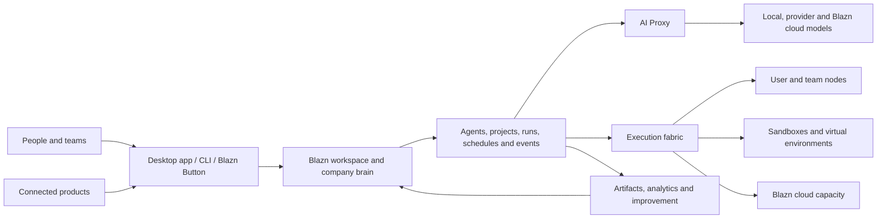

# Blazn Product Overview

**Status:** Vision draft  
**Audience:** Founders, product, design, engineering, and early collaborators  
**Scope:** High-level product definition; detailed requirements and architecture will follow

## The idea

Blazn is the operating workspace for an AI-enabled company.

It allows individuals and teams to interact with agents as a coordinated team at scale. People, agents, models, tools, knowledge, projects, and compute live in a shared workspace, so useful context and learning accumulate into a unified company brain instead of disappearing inside isolated chats and applications.

Blazn is available as a desktop application for macOS, Windows, and Linux, a CLI, and an optional managed cloud. A user can begin on one computer, invite a team, contribute additional machines as workers, and adopt managed infrastructure only where it is useful.

## The problem

AI work today is fragmented:

- Conversations and decisions are scattered across assistants, IDEs, terminals, and chat tools.
- Agents operate independently, with limited knowledge of company goals, prior work, or one another.
- Local and cloud models require separate configuration, credentials, and routing.
- Agent environments are difficult to provision consistently, secure, observe, and clean up.
- Runs produce logs and artifacts, but rarely create reusable organizational memory.
- Teams cannot easily understand what agents are doing, why they made a decision, what they cost, or whether their performance is improving.
- Project plans and agent execution live in separate systems, leaving people to translate roadmaps into prompts and results back into tasks.
- Connecting agents to a live product, customer issue, or support interaction usually requires custom infrastructure.

The result is a collection of powerful tools without a shared operating model. Teams spend time managing agents instead of working with them.

## Product promise

Blazn gives every person and team one place to:

1. Organize people and agents around shared objectives.
2. Run agents safely on local, contributed, or managed compute.
3. Use the right model for each request without changing tools.
4. Preserve work, knowledge, artifacts, and decisions as organizational memory.
5. Observe outcomes and help agents improve over time.
6. Connect agent work directly to projects, products, and customers.

The experience should feel local-first, collaborative, inspectable, and progressively adoptable: valuable to one person on one machine, then capable of growing into a company-wide agent platform.

## Who it is for

### Individuals

Developers, founders, researchers, operators, and creators who want one interface for their agents, models, machines, projects, and reusable knowledge.

### Teams

Groups that want shared agents, governed access, coordinated execution, common artifacts, project visibility, and a durable record of how work was completed.

### Organizations

Companies that want a unified agent layer across local infrastructure and cloud services, with control over data, models, cost, security, and operational quality.

## The product

### 1. Blazn desktop application

The desktop application is the primary visual workspace on macOS, Windows, and Linux. It allows users to:

- Create, join, and manage workspaces.
- Invite people and manage roles, access, and shared resources.
- Talk with one agent or assemble a team of specialized agents.
- Follow live work, steer active runs, review decisions, and approve sensitive actions.
- Manage local machines, remote workers, sandboxes, and virtual environments.
- Browse agents, projects, runs, schedules, triggers, tools, resources, instructions, objectives, and metrics.
- Pin and share artifacts such as documents, plans, dashboards, reports, code changes, and research.
- Use an integrated agent harness for conversations and work performed in an isolated environment or directly on the local machine.

### 2. Blazn CLI

The CLI gives people and automation access to the same workspace and control plane. It is designed for terminals, scripts, CI systems, and agent-to-agent operation.

Core responsibilities include:

- Authentication and workspace selection.
- Agent creation, discovery, configuration, and invocation.
- Starting, inspecting, steering, and stopping runs.
- Managing nodes, environments, schedules, triggers, tools, and resources.
- Routing model requests through the Blazn AI Proxy.
- Publishing and retrieving artifacts.
- Exposing Blazn capabilities through automation-friendly and MCP-compatible interfaces.

The desktop app and CLI are two clients of the same product, not separate systems.

### 3. Workspaces and the company brain

A workspace is the shared boundary for a person or organization. It contains:

- Members, teams, roles, and policies.
- Agents and their identities, capabilities, objectives, and instructions.
- Knowledge, resources, tools, integrations, and credentials.
- Projects, roadmaps, milestones, tasks, and decisions.
- Runs, events, artifacts, metrics, schedules, and triggers.
- Nodes, execution environments, models, budgets, and usage.

The company brain is the connected, permission-aware memory formed by these elements. It is not simply a document store or transcript archive. It preserves relationships between objectives, decisions, work, evidence, outcomes, and the agents and people involved.

### 4. Agent library and teams

Users can create and manage a reusable library of agents. Each agent can have:

- A name, role, purpose, and measurable objectives.
- Instructions, skills, tools, resources, and model preferences.
- Environment and machine requirements.
- Permissions, budgets, and escalation rules.
- Schedules, triggers, and event subscriptions.
- Run history, metrics, evaluations, and improvement history.

Agents may work independently, be assigned to projects, or collaborate as a team. Larger coordinating agents can delegate work, combine results, detect gaps, and help specialized agents improve how they work together.

### 5. Agent harness

The built-in harness is where people and agents work together. It supports:

- Persistent conversations and task-oriented sessions.
- Live progress, events, intermediate results, and structured approvals.
- Follow-up instructions and steering during a run.
- Work in isolated sandboxes or approved local-machine contexts.
- Multiple harnesses and agent runtimes behind a consistent Blazn experience.
- Resumable work and durable outputs rather than disposable chat history.

The harness should make an agent's environment, tools, actions, and state visible without forcing users to understand the underlying orchestration system.

### 6. Nodes, workers, and environments

A user can choose to make a machine available as a Blazn node. Eligible work is then scheduled onto contributed macOS, Windows, or Linux capacity according to its capabilities and the workspace's policies.

Blazn can provision an isolated sandbox or virtual environment for a run, attach the required tools and resources, stream progress, preserve selected outputs, and clean up when the work is complete. It should support:

- Personal machines and team-owned hardware.
- Linux container and sandbox workloads.
- Native platform workloads, including work that requires macOS or Windows capabilities.
- Managed environments supplied by Blazn cloud.
- Capability-aware placement, queues, quotas, priorities, and concurrency controls.
- Clear consent, pause/drain controls, resource limits, and visibility for machine owners.

Kubernetes Agent Sandbox is a candidate foundation for selected persistent or interactive Linux environments. It is an implementation component, not a requirement for every workload or platform.

### 7. Blazn AI Proxy

The AI Proxy provides one compatible endpoint for tools such as Codex, Claude Code, IDEs, agents, and internal applications. It can route requests to:

- Models running locally on a user's machine or team hardware.
- Third-party model providers configured by the workspace.
- Models and capacity offered by Blazn cloud.

Routing can account for model capability, privacy, availability, latency, cost, policy, and fallback preferences. Users should be able to understand where a request went and why, while existing tools continue to work with minimal configuration.

This capability builds on the approach established by Blaze Proxy and brings it into the shared Blazn workspace.

### 8. Blazn cloud

Blazn cloud is optional managed infrastructure for teams that do not want to operate every component themselves. It can provide:

- Hosted workspace collaboration and synchronization.
- Managed model access and AI routing.
- On-demand agent environments and elastic execution capacity.
- Durable run history, artifacts, schedules, triggers, and organizational memory.
- Secure remote access to a user's authorized Blazn workspace.
- Administrative controls, usage reporting, policy, and billing.

Local and self-hosted use remain first-class. Cloud adoption should add capacity and convenience without making contributed machines or local models second-class citizens.

### 9. Runs, events, analytics, and improvement

Every meaningful execution is represented as a run. A run connects the initiating person or event, agent, objective, instructions, environment, model activity, tool calls, approvals, outputs, cost, timing, and outcome.

Structured events and metrics make runs observable in real time and reviewable afterward. They support:

- Progress and health monitoring.
- Cost, latency, reliability, and quality analysis.
- Auditing and incident investigation.
- Comparison across agents, models, tools, and workflows.
- Evaluation against the run's objective and expected outcome.

After a run, an agent can perform bounded introspection: identify what worked, what failed, and what reusable learning should be proposed. Improvements to instructions, tools, memory, or collaboration patterns should be evidence-based, versioned, and subject to workspace policy rather than silently rewriting an agent.

Coordinating agents can analyze patterns across multiple agents and runs to improve delegation, handoffs, shared tools, and team performance.

### 10. Projects and execution

Blazn includes project management so plans and agent work share the same context. Workspaces can organize:

- Product and company roadmaps.
- Milestones, projects, tasks, owners, dependencies, and status.
- Objectives, success measures, decisions, risks, and evidence.
- Human and agent assignments.

An agent run can begin from a task, update it with live progress, attach evidence and artifacts, surface blockers, and propose next work. People retain control of priorities and commitments while agents reduce the coordination overhead between planning and execution.

### 11. Artifacts and shared library

Blazn provides a durable, searchable home for useful outputs. Users can pin, organize, version, and share:

- Documents and research.
- Plans, specifications, and decisions.
- Dashboards and reports.
- Code changes and release evidence.
- Data, images, recordings, and other generated files.
- Reusable prompts, instructions, tools, workflows, and agent templates.

Artifacts retain provenance: which objective and run created them, what inputs were used, who approved them, and what superseded them.

### 12. Blazn Button

The Blazn Button connects an application or website to a workspace and its agents. It is the product-facing bridge for real-time work.

Potential experiences include:

- Starting an agent session from the context of the current screen or record.
- Showing live progress and results from a connected execution environment.
- Reporting an issue with relevant application context attached.
- Handling customer support with human and agent collaboration.
- Requesting analysis, remediation, content, or operational work without leaving the host product.

The Button inherits the interaction patterns and visual language of the existing Blaze Button while using Blazn's identity, policy, orchestration, and run history underneath.

## How the pieces fit

## Product principles

### Local-first, cloud-optional

One person and one machine should be enough to get value. Cloud services add collaboration, reach, and capacity without taking ownership away from the user.

### People remain in control

Users can see what agents are doing, interrupt work, approve sensitive actions, set boundaries, and understand outcomes.

### One system, many models and harnesses

Blazn should provide a stable experience across different model providers, coding agents, general agents, and execution runtimes rather than locking the workspace to one vendor.

### Work creates memory

Important context, decisions, evidence, and artifacts should become reusable workspace knowledge with provenance and permissions.

### Improvement is observable and governed

Agents learn through measured outcomes and explicit, versioned changes. Improvement must remain reviewable, reversible, and aligned with workspace policy.

### Secure by default

Isolation, identity, least privilege, secrets handling, auditability, and data boundaries are product requirements, not deployment options.

### Progressive complexity

Simple tasks should feel simple. Infrastructure, routing, queues, and orchestration details should become visible only when a user needs control over them.

## Brand direction

Blazn belongs to the existing Blaze product family and should reuse the visual system established by Blaze Proxy and Blaze Button:

- Dark, focused surfaces led by a `#101010` canvas and `#171717` panels.
- Blaze orange as the primary signal color, using the established orange/red range (`#f97316` and `#ff2e00`).
- Clear neutral typography with restrained status colors.
- Rounded, compact application surfaces and the existing flame language for iconography.
- A technical, fast, confident tone without making the product feel inaccessible.

The visual identity should evolve as one system across desktop, CLI output, web surfaces, embedded Button experiences, documentation, and cloud administration. Existing Blaze assets are references; final naming, trademarks, and asset licensing should be confirmed before public release.

## Initial product boundary

The first version should prove the core loop:

> Create a workspace, configure an agent, choose a model, run useful work in a controlled environment, follow and steer it, and preserve the outcome for the team.

It does not need to deliver the full company-brain vision on day one. The early product can focus on:

- A single-user workspace with a clear path to team collaboration.
- Desktop and CLI access to the same local control plane.
- A small agent library and one integrated harness.
- Blazn AI Proxy routing across a local model and selected cloud providers.
- One contributed machine acting as a worker.
- Isolated Linux execution for an initial class of workloads.
- Runs with live events, logs, artifacts, and basic metrics.
- A minimal project/task connection.
- Secure remote control through an MCP-compatible interface.

Native macOS and Windows execution, broad multi-agent coordination, advanced organizational memory, autonomous improvement, elastic cloud capacity, and the full Blazn Button platform can then be introduced in deliberate stages.

## What Blazn is not

- It is not only another chat interface.
- It is not only a model gateway.
- It is not only a Kubernetes or sandbox manager.
- It is not a replacement for every specialized IDE, model provider, or project tool.
- It does not give agents unrestricted access to a user's machines or company data.
- It does not treat unreviewed self-modification as learning.

Blazn is the connective operating layer that makes these capabilities work together as a trusted agent team.

## Measures of success

At a high level, Blazn succeeds when:

- A new user completes useful agent work quickly on their existing machine.
- A team can find and reuse prior work instead of recreating context.
- Agents complete more objectives with fewer failed runs and less human coordination.
- Users can understand and control model routing, execution, cost, permissions, and data location.
- Adding a machine or managed capacity increases throughput without increasing operational burden.
- Agent and team improvements are supported by measurable run evidence.
- Product and customer interactions initiated through the Blazn Button become traceable work with timely outcomes.

## Documents to develop next

This overview establishes the product direction. Follow-on documents should define:

1. Target users, jobs to be done, and initial launch persona.
2. Version-one scope and end-to-end user journeys.
3. Product architecture and trust boundaries.
4. Workspace, agent, run, artifact, project, and event data models.
5. Node enrollment, sandboxing, native execution, and scheduling model.
6. AI Proxy compatibility, routing, policy, and provider strategy.
7. MCP and public API surface, authentication, and authorization.
8. Company-brain memory, retrieval, provenance, retention, and privacy model.
9. Agent evaluation, introspection, and governed improvement process.
10. Blazn Button SDK and embedded interaction model.
11. Desktop/CLI technology choices and release strategy.
12. Commercial model for local, team, and cloud offerings.

