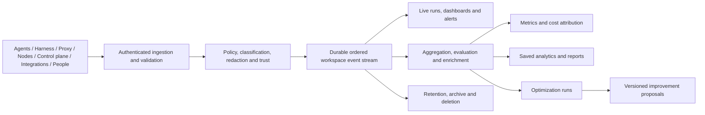
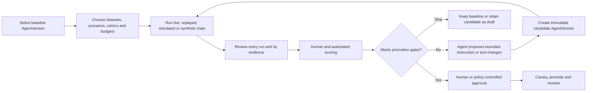
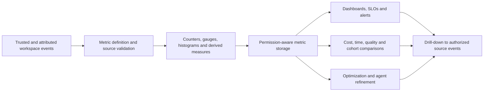
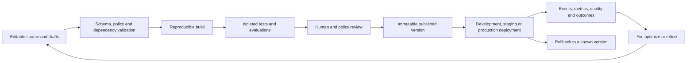
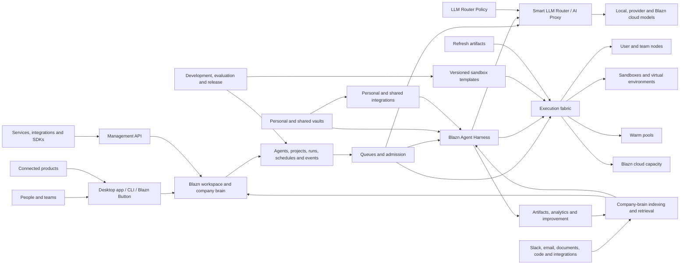

# Blazn Product Overview

**Status:** Vision draft  
**Audience:** Founders, product, design, engineering, and early collaborators  
**Scope:** High-level product definition; detailed requirements and architecture will follow

## Index

- [The idea](#the-idea)
- [The problem](#the-problem)
- [Product promise](#product-promise)
- [Who it is for](#who-it-is-for)
- [The product](#the-product)
- [System design](#system-design)
  - [System component index](#system-component-index)
  - [Nodes](#nodes)
    - [Local model capacity](#local-model-capacity)
  - [Sandbox templates and refreshes](#sandbox-templates-and-refreshes)
  - [Sandboxes](#sandboxes)
  - [Warm pools](#warm-pools)
  - [Analytics and events](#analytics-and-events)
    - [Agent refinement](#agent-refinement)
  - [Metrics](#metrics)
  - [Company-brain indexing and retrieval](#company-brain-indexing-and-retrieval)
  - [Queues](#queues)
  - [Agents](#agents)
  - [Triggers, endpoints, and email aliases](#triggers-endpoints-and-email-aliases)
  - [Development](#development)
  - [Credentials and integrations](#credentials-and-integrations)
  - [CLI control surface](#cli-control-surface)
  - [Management API](#management-api)
  - [Blazn Agent Harness](#blazn-agent-harness-system)
  - [Smart LLM Router](#smart-llm-router)
  - [LLM Router Policy](#llm-router-policy)
- [How the pieces fit](#how-the-pieces-fit)
- [Product principles](#product-principles)
- [Brand direction](#brand-direction)
- [Initial product boundary](#initial-product-boundary)
- [What Blazn is not](#what-blazn-is-not)
- [Measures of success](#measures-of-success)
- [Documents to develop next](#documents-to-develop-next)

## The idea

Blazn is the operating workspace for an AI-enabled company.

It allows individuals and teams to interact with agents as a coordinated team at scale. People, agents, models, tools, knowledge, projects, and compute live in a shared workspace, so useful context and learning accumulate into a unified company brain instead of disappearing inside isolated chats and applications.

Blazn is available as a desktop application for macOS, Windows, and Linux, a CLI, and an optional managed cloud. A user can begin on one computer, invite a team, contribute additional machines as workers, and adopt managed infrastructure only where it is useful.

## The problem

AI work today is fragmented:

- Conversations and decisions are scattered across Slack channels, source code, email, documents, project tools, assistants, IDEs, and terminals.
- Agents operate independently, with limited knowledge of company goals, prior work, or one another.
- Local and cloud models require separate configuration, credentials, routing, and harness-specific integrations.
- Individuals and teams quickly exhaust AI subscription allowances when operating multiple agents, while direct API usage can become unpredictable and significantly more expensive at scale.
- Agents running directly on a local machine can consume its CPU, memory, storage, and thermal capacity, disrupting normal work or causing instability and restarts.
- A single local machine limits agent concurrency and throughput; scaling beyond it usually requires manually assembling more hardware or paying a cloud provider.
- Agent environments are difficult to provision consistently, secure, observe, and clean up.
- Runs produce logs and artifacts, but rarely create reusable organizational memory.
- Teams cannot easily understand what agents are doing, why they made a decision, what they cost, or whether their performance is improving.
- Project plans and agent execution live in separate systems, leaving people to translate roadmaps into prompts and results back into tasks.
- Connecting agents to a live product, customer issue, or support interaction usually requires custom infrastructure.

The result is a collection of powerful tools without a shared operating model. Teams spend time managing agents instead of working with them.

## Product promise

Blazn gives every person and team one place to:

1. Organize people and agents around shared objectives.
2. Run agents safely on local, contributed, or managed compute.
3. Use the right model for each request without changing tools.
4. Preserve work, knowledge, artifacts, and decisions as organizational memory.
5. Observe outcomes and help agents improve over time.
6. Connect agent work directly to projects, products, and customers.
7. Pool authorized capacity across company and employee machines, automatically provisioning isolated environments while protecting the owner's work.
8. Run agents through the Blazn Agent Harness while using local models, provider models, and Blazn cloud through one governed routing system.
9. Bring agents into existing applications through the Blazn Button so they can act on what a user is experiencing in the moment.

The experience should feel local-first, collaborative, inspectable, and progressively adoptable: valuable to one person on one machine, then capable of growing into a company-wide agent platform.

## Who it is for

### Individuals

Developers, founders, researchers, operators, and creators who want one interface for their agents, models, machines, projects, and reusable knowledge.

### Teams

Groups that want shared agents, governed access, coordinated execution, common artifacts, project visibility, and a durable record of how work was completed.

### Organizations

Companies that want a unified agent layer across local infrastructure and cloud services, with control over data, models, cost, security, and operational quality.

## The product

### 1. Blazn desktop application

The desktop application is the primary visual workspace on macOS, Windows, and Linux. It allows users to:

- Create, join, and manage workspaces.
- Invite people and manage roles, access, and shared resources.
- Talk with one agent or assemble a team of specialized agents.
- Follow live work, steer active runs, review decisions, and approve sensitive actions.
- Manage local machines, remote workers, sandboxes, and virtual environments.
- Browse agents, projects, runs, schedules, triggers, tools, resources, instructions, objectives, and metrics.
- Pin and share artifacts such as documents, plans, dashboards, reports, code changes, and research.
- Use the Blazn Agent Harness for conversations and work performed in an isolated environment or through an approved local-machine backend.

### 2. Blazn CLI

The CLI gives people and automation access to the same workspace and control plane. It is designed for terminals, scripts, CI systems, and agent-to-agent operation.

Core responsibilities include:

- Authentication and workspace selection.
- Agent creation, discovery, configuration, and invocation.
- Starting, inspecting, steering, and stopping runs.
- Managing nodes, environments, schedules, triggers, tools, and resources.
- Routing model requests through the Blazn AI Proxy.
- Publishing and retrieving artifacts.
- Providing stable commands, machine-readable output, streaming, and idempotent operations for people, scripts, CI, and remote administration.

The desktop app and CLI are first-party clients of the same product, not separate systems. The Management API makes the same control plane available to authorized external applications and services.

The CLI and Management API are the supported public control and automation surfaces. They use the same resource, authorization, operation, event, and error model. The AI Proxy remains a separate model-compatible endpoint, and the Agent Harness may still consume external MCP tools.

The CLI can target a local Blazn service or an authenticated remote workspace. Its commands, exit codes, structured output, operation IDs, and streaming behavior form a supported automation contract. Applications and services can use the versioned Management API instead of shelling out to the CLI. Private internal transports remain implementation details.

### 3. Blazn Management API

The Management API gives authorized applications, services, integrations, and automation direct programmatic access to Blazn resources. It supports managing workspaces, agents, runs, nodes, sandbox templates, refreshes, sandboxes, warm pools, queues, triggers, endpoints, analytics, credentials and integrations, artifacts, projects, operations, and policies.

The API is versioned, workspace-scoped, auditable, and designed around durable asynchronous operations. It supports idempotent mutations, optimistic concurrency, structured errors, pagination, event streaming, and generated client SDKs. Sensitive capabilities such as credential delivery, sandbox attachment, node enrollment, approvals, and destructive lifecycle actions use narrower purpose-built operations and stronger authorization than ordinary resource management.

The Management API is distinct from the AI Proxy's model-compatible interface and from published agent invocation endpoints. Managing an Endpoint requires Management API authorization; invoking the workflow exposed through that Endpoint requires only the specific identity and input contract the Endpoint publishes.

### 4. Workspaces and the company brain

A workspace is the shared boundary for a person or organization. It contains:

- Members, teams, roles, and policies.
- Agents and their identities, capabilities, objectives, and instructions.
- Knowledge, resources, tools, integrations, and credentials.
- Projects, roadmaps, milestones, tasks, and decisions.
- Runs, events, artifacts, metrics, schedules, and triggers.
- Nodes, execution environments, models, budgets, and usage.

The company brain is the connected, permission-aware memory formed by these elements. It is not simply a document store or transcript archive. It preserves relationships between objectives, decisions, work, evidence, outcomes, and the agents and people involved.

### 5. Agent library and teams

Users can create and manage a reusable library of agents. Each agent can have:

- A name, role, purpose, and measurable objectives.
- Searchable tags and structured metadata for ownership, capability, project, team, lifecycle, and discovery.
- Instructions, skills, tools, resources, and LLM Router Policy preferences.
- Environment and machine requirements.
- Permissions, budgets, and escalation rules.
- Schedules, triggers, event subscriptions, and optional activation and end times.
- Run history, metrics, evaluations, and improvement history.

Agents may work independently, be assigned to projects, or collaborate as a team. Larger coordinating agents can delegate work, combine results, detect gaps, and help specialized agents improve how they work together.

Blazn has one Agent resource. An agent intended for a bounded assignment is an ordinary agent with an end time or a schedule that stops producing work. When its schedule ends, the agent becomes inactive and cannot start new runs, but its identity, configuration versions, tags, relationships, runs, metrics, and artifacts remain available for search and audit. Authorized users can extend or reactivate it through a versioned lifecycle change.

Tags are metadata, not permissions. They support search, filters, collections, automation, routing hints, and reporting, while authorization continues to come from explicit workspace roles and policies.

### 6. Blazn Agent Harness

The Blazn Agent Harness is the product's canonical orchestration and adapter contract for agents. It owns how an agent receives context, requests a model, uses tools, performs work, collaborates, emits events, pauses, resumes, and completes a run. The underlying execution engine is interchangeable through versioned Harness Adapters such as Hermes, Codex CLI, Claude Code, or another approved CLI harness; those engines do not redefine Blazn's Agent, Session, Run, policy, event, credential, artifact, or cleanup model.

The harness supports:

- Persistent conversations and objective-driven sessions.
- Live progress, events, intermediate results, and structured approvals.
- Follow-up instructions and steering during a run.
- Context assembly from workspace memory, projects, resources, and artifacts.
- Tool and external MCP access governed by agent and workspace permissions.
- Work in isolated sandboxes or approved local-machine backends.
- Checkpoints, pause, resume, cancellation, retry, and recovery.
- Agent creation, bounded schedules, delegation, handoffs, and coordinated agent teams.
- Durable outputs, evaluations, and introspection linked to run history.
- Model requests sent through the Smart LLM Router by default, with any temporary harness-native provider exception explicitly declared, policy-controlled, and visible rather than mistaken for routed traffic.

The desktop app, CLI, schedules, triggers, and future Blazn Button experiences all initiate work through this same harness contract. External developer tools may use the AI Proxy or invoke the Blazn CLI, while approved CLI harnesses can also run inside a Sandbox through adapters. In every case, Blazn remains authoritative for agent lifecycle and execution semantics.

The harness should make an agent's context, environment, tools, actions, model routing, approvals, and state visible without forcing users to understand the underlying orchestration system.

### 7. Nodes, workers, and environments

A user can choose to make a machine available as a Blazn node. Eligible work is then scheduled onto contributed macOS, Windows, or Linux capacity according to its capabilities and the workspace's policies.

Blazn can provision an isolated sandbox or virtual environment for a run, attach the required tools and resources, stream progress, preserve selected outputs, and clean up when the work is complete. It should support:

- Personal machines and team-owned hardware.
- Linux container and sandbox workloads.
- Native platform workloads, including work that requires macOS or Windows capabilities.
- Managed environments supplied by Blazn cloud.
- Capability-aware placement, queues, quotas, priorities, and concurrency controls.
- Clear consent, pause/drain controls, resource limits, and visibility for machine owners.

Kubernetes Agent Sandbox is a candidate foundation for selected persistent or interactive Linux environments. It is an implementation component, not a requirement for every workload or platform.

### 8. Blazn AI Proxy

The AI Proxy provides one compatible endpoint for the Blazn Agent Harness and external clients such as Codex, Claude Code, IDEs, and internal applications. Its Smart LLM Router evaluates every request against an effective LLM Router Policy before choosing where the request runs.

It can route requests to:

- Models running locally on a user's machine or team hardware.
- Third-party model providers configured by the workspace.
- Models and capacity offered by Blazn cloud.

Routing accounts for model capability, privacy, availability, health, queue depth, latency, cost, policy, and fallback behavior. A caller can request a logical model alias or a capability tier instead of binding an agent to one provider or machine. Users should be able to understand where a request went, why it went there, and whether a retry or fallback occurred, while existing external tools continue to work with minimal configuration.

The AI Proxy is a model-access surface, not an alternative agent lifecycle. External tools and Harness Adapters may use its compatible APIs for model requests, while agents created and operated by Blazn always run through the Blazn Agent Harness contract.

This capability builds on the approach established by Blaze Proxy and brings it into the shared Blazn workspace.

### 9. Blazn cloud

Blazn cloud is optional managed infrastructure for teams that do not want to operate every component themselves. It can provide:

- Hosted workspace collaboration and synchronization.
- Managed model access and AI routing.
- On-demand agent environments and elastic execution capacity.
- Durable run history, artifacts, schedules, triggers, and organizational memory.
- Secure remote access to a user's authorized Blazn workspace.
- Administrative controls, usage reporting, policy, and billing.

Local and self-hosted use remain first-class. Cloud adoption should add capacity and convenience without making contributed machines or local models second-class citizens.

### 10. Runs, events, analytics, and improvement

Every meaningful execution is represented as a run. A run connects the initiating person or event, agent, objective, instructions, environment, model activity, tool calls, approvals, outputs, cost, timing, and outcome.

Structured events and metrics make runs observable in real time and reviewable afterward. They support:

- Progress and health monitoring.
- Cost, latency, reliability, and quality analysis.
- Auditing and incident investigation.
- Comparison across agents, models, tools, and workflows.
- Evaluation against the run's objective and expected outcome.

After a run, an agent can perform bounded introspection: identify what worked, what failed, and what reusable learning should be proposed. Improvements to instructions, tools, memory, or collaboration patterns should be evidence-based, versioned, and subject to workspace policy rather than silently rewriting an agent.

Coordinating agents can analyze patterns across multiple agents and runs to improve delegation, handoffs, shared tools, and team performance.

### 11. Projects and execution

Blazn includes project management so plans and agent work share the same context. Workspaces can organize:

- Product and company roadmaps.
- Milestones, projects, tasks, owners, dependencies, and status.
- Objectives, success measures, decisions, risks, and evidence.
- Human and agent assignments.

An agent run can begin from a task, update it with live progress, attach evidence and artifacts, surface blockers, and propose next work. People retain control of priorities and commitments while agents reduce the coordination overhead between planning and execution.

### 12. Artifacts and shared library

Blazn provides a durable, searchable home for useful outputs. Users can pin, organize, version, and share:

- Documents and research.
- Plans, specifications, and decisions.
- Dashboards and reports.
- Code changes and release evidence.
- Data, images, recordings, and other generated files.
- Reusable prompts, instructions, tools, workflows, and agent templates.

Artifacts retain provenance: which objective and run created them, what inputs were used, who approved them, and what superseded them.

### 13. Blazn Button

The Blazn Button connects an application or website to a workspace and its agents. It is the product-facing bridge for real-time work.

Potential experiences include:

- Starting an agent session from the context of the current screen or record.
- Showing live progress and results from a connected execution environment.
- Reporting an issue with relevant application context attached.
- Handling customer support with human and agent collaboration.
- Requesting analysis, remediation, content, or operational work without leaving the host product.

The Button inherits the interaction patterns and visual language of the existing Blaze Button while using Blazn's identity, policy, orchestration, and run history underneath.

The goal is to bring Blazn into the applications people already use. With the user's permission, the Button supplies relevant live context so an agent can understand what the person is seeing, join the experience in the moment, perform work in a connected environment, and return real-time progress and results without forcing the person to reconstruct that context elsewhere.

## System design

This section turns the product vision into a shared system model. It will be developed component by component, beginning with the execution fabric and then defining the resources scheduled onto it.

### System component index

| Component | Purpose | Design status |
| --- | --- | --- |
| [Nodes](#nodes) | Contribute, describe, protect, and operate compute capacity | Initial design |
| [Sandbox templates and refreshes](#sandbox-templates-and-refreshes) | Define, version, update, and efficiently materialize reproducible environments | Initial design |
| [Sandboxes](#sandboxes) | Provide isolated, stateful or disposable execution environments | Initial design |
| [Warm pools](#warm-pools) | Keep policy-controlled environments ready to reduce startup latency | Initial design |
| [Analytics and events](#analytics-and-events) | Record the structured history of work and system activity and support governed analysis and optimization | Initial design |
| [Metrics](#metrics) | Measure health, capacity, cost, performance, quality, and outcomes using governed definitions | Initial design |
| [Company-brain indexing and retrieval](#company-brain-indexing-and-retrieval) | Ingest, permission-filter, index, relate, retrieve, refresh, and delete company knowledge with provenance | Initial design |
| [Queues](#queues) | Admit and prioritize work across limited models and compute | Initial design |
| [Agents](#agents) | Define agent identity, tags, objectives, configuration, schedules, lifecycle, and history | Initial design |
| [Triggers, endpoints, and email aliases](#triggers-endpoints-and-email-aliases) | Safely invoke and interact with agent workflows from Slack, websites, email, integrations, schedules, and external events | Initial design |
| [Development](#development) | Build, test, version, evaluate, and release agents and system components | Initial design |
| Blazn Agent Harness | Provide the canonical orchestration and adapter contract for agent context, tools, interchangeable execution engines, collaboration, and recovery | Initial design |
| [Credentials and integrations](#credentials-and-integrations) | Share policy-controlled vaults and connect personal or team services safely | Initial design |
| [CLI control surface](#cli-control-surface) | Provide the supported local and remote interface for people, scripts, CI, and administration | Initial design |
| [Management API](#management-api) | Provide versioned, authenticated programmatic management of Blazn resources and operations | Initial design |
| Smart LLM Router | Select, queue, load-balance, and fail over model requests across local and cloud capacity | Initial design |
| LLM Router Policy | Define allowed routes, preferences, budgets, privacy rules, and fallback behavior | Initial design |

### Nodes

#### Definition

A node is an enrolled machine that makes one or more capabilities available to a Blazn workspace. It may be a person's laptop or desktop, a company workstation, a dedicated server, or capacity managed by Blazn cloud.

Once a machine owner or administrator opts it in, Blazn can automatically create approved virtual environments or sandboxes on that machine and schedule compatible agent work into them. Enrollment does not grant agents unrestricted access to the host. The node contributes only the capabilities, resource envelope, time windows, and data access allowed by its policy.

The node is the unit of capacity and trust. A sandbox is a workload environment created on that capacity. Keeping these concepts separate allows Blazn to use different isolation technologies on macOS, Windows, Linux, and cloud infrastructure without changing how users describe or schedule agent work.

#### Why nodes matter

Nodes turn otherwise isolated machines into a governed compute fabric. A company can use available capacity across employee and company-owned hardware, increase concurrency without immediately purchasing cloud instances, and reserve managed cloud capacity for workloads that require elasticity, availability, or a different trust boundary.

This fabric also protects the local experience. Instead of launching an arbitrary number of agents directly on a workstation, Blazn admits work against declared limits, isolates it where possible, and moves or queues it when the machine cannot safely support more work.

#### Node types

- **Personal node:** A person's macOS, Windows, or Linux machine. It is interactive, may be intermittently available, and always prioritizes the owner's foreground work.
- **Shared team node:** A company-owned machine made available to one or more workspaces under centrally managed policy.
- **Dedicated worker:** A server or workstation intended primarily for agents, with higher concurrency and fewer interactive-use restrictions.
- **Blazn cloud node:** Managed capacity supplied on demand with a defined region, hardware profile, price, and security boundary.
- **Model node:** A machine that exposes local model inference capacity. It may also execute agent environments, but the two capacities are advertised and scheduled independently.

A physical machine may provide multiple execution backends. For example, a Mac could provide a Linux virtual-machine backend for isolated general workloads, a native macOS backend for Xcode work, and a local model endpoint. Each backend has separate limits and trust characteristics even though the UI groups them under one node.

#### Enrollment and identity

Enrollment begins in the desktop application or CLI and should require an explicit user or administrator action. The basic flow is:

1. Authenticate the person and select a workspace.
2. Name the node and show the capabilities Blazn detected.
3. Choose what the machine may contribute, when it is available, and how much capacity must remain reserved for its owner.
4. Apply a workspace-managed node policy and display any settings it controls.
5. Create a unique device identity and register its public identity with the workspace.
6. Establish an outbound authenticated connection to the Blazn control plane.
7. Run compatibility and isolation checks before marking any execution backend ready.

Node identity is distinct from user identity. Removing a user, rotating credentials, reinstalling the node service, or transferring machine ownership must not accidentally preserve access. Device credentials should be revocable, rotated automatically, stored in the platform credential store, and limited to the registered node and workspace.

#### Advertised capabilities

The node service continuously reports a normalized capability inventory that the scheduler can match against workload requirements:

- Operating system, version, CPU architecture, and execution backends.
- CPU, memory, storage, GPU or accelerator capacity, including the amount currently allocatable.
- Installed or managed runtimes, virtualization support, and sandbox providers.
- Native toolchains such as Xcode, Android SDKs, browsers, or Windows build tools.
- Local models and model-server compatibility, context limits, and current inference capacity.
- Network class, allowed destinations, region, data-residency attributes, and trust level.
- Maximum concurrency, availability schedule, battery and thermal restrictions, and owner-defined labels.
- Supported sandbox templates and cached environment versions.

Capabilities are claims, not guarantees. Blazn validates important capabilities during enrollment and refreshes health signals while the node is connected.

#### Local model capacity

A node can contribute one or more locally hosted models as shared inference capacity for authorized agents across the company. For example, a workstation or dedicated GPU server could host DeepSeek V4 Flash or Qwen3.8 and make that model available through the Blazn AI Proxy without requiring every employee or agent to install, configure, or address the model server directly.

Local model capacity is a first-class node backend, parallel to sandbox and native-execution backends. A node may offer models only, execution environments only, or both. The node advertises each model instance with:

- A stable workspace-facing model name and the underlying model, version, quantization, and runtime.
- Supported interfaces and capabilities, such as chat, tool use, structured output, embeddings, vision, streaming, and maximum context.
- Accelerator and memory requirements, loaded or unloaded state, warm-up time, concurrency, token throughput, and current queue depth.
- Data-handling attributes, network exposure, trust class, allowed workspaces or teams, and whether prompts may leave the node.
- Cost or capacity-accounting policy, availability schedule, fallback options, and owner-defined limits.

Agents request a model or capability through the AI Proxy rather than connecting to a machine by address. The proxy authenticates the caller, applies workspace policy and budgets, selects an eligible model instance, queues or load-balances the request, and records operational metrics. Requests reach the node through its authenticated Blazn connection, so contributing a local model does not require exposing its raw inference port to the company network or internet.

The workspace can publish a friendly model alias that maps to several eligible backends. An alias such as `company-fast` could prefer a local Qwen3.8 instance, fail over to another company node when it is saturated, and use an approved Blazn cloud model only when local capacity is unavailable and policy permits. The Blazn Agent Harness and authorized external clients keep using the same model name while routing changes behind it.

Model serving shares the physical node with the owner's applications and possibly with agent sandboxes. The node resource manager therefore reserves memory and accelerator capacity for loaded models, limits concurrent inference, coordinates model loading and eviction, and prevents sandbox admission from exhausting resources promised to inference. The machine owner or administrator can independently pause model serving, sandbox work, or the entire node.

Prompts, responses, and retrieved context remain workspace data. They are not included in infrastructure telemetry by default. Blazn records routing decisions, token counts, latency, errors, saturation, and cost or avoided-cost estimates, while content logging, retention, and evaluation require an explicit workspace policy.

Company-wide model sharing should provide three benefits:

- Turn existing local hardware and approved open models into reusable organizational capacity.
- Reduce dependence on per-user subscription limits and expensive API traffic for suitable workloads.
- Keep sensitive requests inside an approved company-controlled boundary when policy requires it.

#### Lifecycle and state

A node has a small, explicit lifecycle:

- **Enrolling:** Identity exists, but compatibility and policy checks are incomplete.
- **Ready:** At least one backend can accept work.
- **Busy:** The node is healthy but has reached an admission or resource limit.
- **Draining:** Existing work may finish or migrate, but no new work is admitted.
- **Offline:** The node has missed its lease or intentionally disconnected.
- **Quarantined:** Blazn or an administrator has prevented execution because identity, integrity, policy, or health checks failed.
- **Removed:** Trust is revoked and the machine is no longer part of the workspace.

Each execution backend and sandbox also reports its own state. A node can therefore remain ready for local-model requests while its sandbox backend is draining, or remain available for Linux work while native macOS execution is disabled.

#### Placement and admission

Agents request capabilities rather than choosing a machine by hostname. A request may specify an operating system, architecture, sandbox template, native toolchain, model, minimum resources, trust level, region, data boundary, expected duration, and whether interruption is allowed.

The scheduler filters nodes that cannot satisfy hard requirements, then selects among eligible capacity using:

- Workspace and node policy.
- Queue priority, quotas, and fairness.
- Current load and the owner's reserved resources.
- Environment or model cache locality.
- Data location and network restrictions.
- Startup latency, expected reliability, and interruption risk.
- User preference and estimated cost.

Users can pin work to a node for development or specialized hardware, but ordinary runs should remain portable. If no node is eligible, the request waits in a queue, asks the user to relax a constraint, or—when policy permits—offers Blazn cloud capacity with the expected cost visible before admission.

#### Automatic environment provisioning

When the scheduler admits work, the selected node receives a signed workload grant rather than a general command channel. The node then:

1. Resolves an approved sandbox template and exact version.
2. Reuses a compatible warm environment or creates a fresh one.
3. Applies resource, network, filesystem, tool, and credential policy.
4. Starts the Blazn Agent Harness worker and requested agent inside the chosen execution backend.
5. Streams lifecycle events, logs, metrics, and selected artifacts.
6. Suspends, refreshes, or destroys the environment according to its retention policy.

Template refresh, warm-pool behavior, sandbox identity, persistence, and cleanup will be defined in their dedicated sections. The node is responsible for faithfully enforcing those decisions, not inventing them locally.

#### Protecting the machine owner

Personal nodes must remain safe and usable while they contribute capacity. The node service enforces:

- Hard CPU, memory, storage, process, and concurrency limits.
- A configurable reserve that agent workloads cannot consume.
- Low-disk, memory-pressure, thermal, battery, and foreground-activity thresholds.
- Availability windows and idle-only operation when requested.
- Immediate pause, drain, and stop controls in the desktop app and CLI.
- Preemption of interruptible agent work when the owner needs resources.
- Bounded log, cache, image, and sandbox storage with visible cleanup controls.
- Crash recovery that detects and cleans up orphaned environments without restarting the host.

The default personal-node policy should be conservative. Increasing capacity is an informed user choice; joining a workspace should never silently turn a machine into an unrestricted worker.

#### Security model

Nodes operate on the assumption that agent code, repositories, tools, and model output may be untrusted.

- The node initiates outbound connections; enrollment should not require exposing a general-purpose inbound management port.
- Every workload receives a short-lived, audience-bound grant scoped to one run and execution backend.
- Sandbox images and templates are signed, versioned, and policy-approved.
- Host files, sockets, devices, clipboard data, and credentials are unavailable unless explicitly attached.
- Secrets are delivered just in time, scoped to the run and integration, redacted from telemetry, and revoked when possible at completion.
- Network access is denied or constrained by template and workspace policy.
- Native-host execution is identified as a higher-trust backend and requires stronger approval and narrower workloads than a sandboxed backend.
- Node actions and administrative changes produce immutable audit events.

Workspace policy must be able to prohibit personal nodes, require company-managed devices, restrict data to a region or trust class, or allow only specific repositories and integrations.

#### Reliability and disconnection

The node maintains a renewable lease with the control plane. When the lease expires, no new work is assigned. The control plane distinguishes a disconnected node from a failed run and applies the workload's recovery policy:

- Wait for the same node when it owns irreplaceable local state.
- Resume a persistent sandbox after reconnection.
- Retry portable work on another eligible node.
- Fail and request human intervention when replay could duplicate an external action.

The node journals enough local state to report what happened after reconnecting. The control plane remains authoritative for run intent, while the node remains authoritative for the observed state of its local environments until reconciliation completes.

#### Observability and privacy

The workspace needs enough information to schedule work and diagnose failures without turning node enrollment into employee surveillance. Node telemetry should include:

- Availability, heartbeat, software version, and backend health.
- Allocatable and consumed CPU, memory, storage, accelerator, and concurrency capacity.
- Sandbox startup time, queue-to-start time, failures, preemptions, and cleanup results.
- Model capacity, request load, latency, and error rates when the node serves models.
- Workload identifiers and policy decisions required for audit and support.

Blazn should not collect unrelated applications, personal files, keystrokes, screen contents, or browsing activity. Application context is shared only through an explicit integration such as the Blazn Button and is governed separately from infrastructure telemetry.

#### Node controls and experience

The desktop app should make node behavior understandable at a glance:

- Whether the node is accepting work and which backends are ready.
- What is running, for whom, and what resources it is using.
- The capacity reserved for the owner and the capacity contributed to Blazn.
- Which local models are available, loading, serving, saturated, or offline.
- Recent runs, errors, policy changes, and cleanup activity.
- Pause, resume, drain, update, diagnose, and remove actions.
- Estimated local capacity contributed and cloud cost avoided.

Administrators need fleet views for health, versions, capacity, utilization, trust, queues, policy compliance, and current workloads. Machine owners should always retain the local ability to stop Blazn work, even when workspace policy is centrally managed.

#### Initial node record

The first system model should include at least:

- Stable node ID, workspace ID, display name, owner, and enrollment timestamps.
- Device identity, trust class, policy version, and software version.
- Platform and normalized capabilities.
- Execution backends with individual status and allocatable capacity.
- Advertised model instances, aliases, runtime details, access policy, and inference capacity.
- Labels, placement constraints, availability, and resource-reserve policy.
- Current lease, health, drain state, and last-seen time.
- Active environment and workload references.
- Aggregate utilization and reliability metrics.

Secrets, raw device keys, and unrelated host inventory must not be stored in the node record.

#### Version-one boundary

The first node implementation should prove a narrow loop:

1. Enroll one macOS, Windows, or Linux machine from the app or CLI.
2. Contribute a bounded Linux virtualized or containerized backend where the platform supports it.
3. Advertise verified resources and accept capability-matched work.
4. Advertise one local model endpoint and make it available to authorized agents through the AI Proxy.
5. Create an isolated environment from one approved template.
6. Run the Blazn Agent Harness, stream events and resource metrics, and return artifacts.
7. Enforce shared resource reserves, model and agent concurrency, drain, offline, and cleanup behavior.
8. Make the same operations available through the authenticated desktop app and CLI.

Native platform execution, additional model runtimes, organization-wide device management, workload migration, and cloud bursting belong in the model from the beginning but can follow after this loop is reliable.

#### Decisions to make next

- Which isolation backend is the default on each operating system?
- Does the first release use a local scheduler, a hosted control plane, or both?
- Which node and sandbox operations continue while the control plane is unavailable?
- How are software, template, and policy updates staged and rolled back?
- What data and workload classes are permitted on personal versus managed nodes?
- How is contributed capacity measured, credited, budgeted, or billed?
- How are local model aliases, compatibility claims, model versions, and fallback chains governed?
- How should inference and agent environments share accelerators and memory without destabilizing the node?
- Which workload types are portable, resumable, interruptible, or bound to one node?
- What compatibility contract allows Kubernetes Agent Sandbox and non-Kubernetes backends to behave consistently?

### Sandbox templates and refreshes

#### Definition

A sandbox template is an immutable, versioned specification for an approved agent environment. It describes what a sandbox must contain, which nodes can run it, how it is initialized, what it may access, and how Blazn determines that it is ready.

A refresh is a controlled materialization process that prepares reusable repository state, dependencies, tool caches, and other safe-to-reuse environment data for a specific template version. The resulting refresh artifact can hydrate a cold sandbox or seed a sandbox maintained in a warm pool.

These are separate concepts:

- **Template:** The desired and governed environment specification.
- **Template version:** An immutable revision of that specification with a unique content digest.
- **Refresh:** The process of resolving current inputs and producing reusable cached state.
- **Refresh artifact:** A content-addressed, validated output produced by a refresh.
- **Sandbox:** A running or suspended instance of one template version, optionally hydrated from a compatible refresh artifact.
- **Warm-pool entry:** A pre-created sandbox based on a template version and, normally, its latest eligible refresh artifact.

Refreshing an environment never silently changes the identity of its template. Changing the operating system, tools, initialization behavior, network policy, repositories, or other declared template content creates a new template version.

#### Template contents

A sandbox template should be able to define:

- Template name, description, owner, version, lifecycle channel, and compatibility contract.
- Base operating-system image, CPU architecture, platform variants, and required isolation backend.
- Minimum and maximum CPU, memory, storage, accelerator, process, and runtime limits.
- The Blazn Agent Harness worker version and required runtime interfaces.
- Language runtimes, package managers, compilers, browsers, CLIs, system packages, and development tools.
- Repositories, source references, checkout strategy, workspace layout, and repository-specific setup.
- Dependency installation, build, initialization, validation, and health-check steps.
- Declared dependency, compiler, package, source, and build caches.
- Tools, external MCP servers, integrations, and capabilities that may be attached at runtime.
- Network egress and ingress policy, DNS behavior, allowed services, and proxy configuration.
- Filesystem layout, writable paths, ephemeral and persistent volumes, mounts, and artifact directories.
- Credential requirements by capability and scope, but never secret values.
- Environment variables divided into public configuration and runtime-injected secrets.
- Sandbox persistence, suspension, timeout, cleanup, and artifact-retention behavior.
- Refresh behavior, warm-pool eligibility, cache limits, and invalidation rules.
- Labels for operating system, architecture, trust, data classification, region, and scheduling.
- Provenance, signatures, approvals, security scan requirements, and policy references.

The template is declarative wherever possible. Initialization scripts remain available for work that cannot be represented declaratively, but they are versioned inputs, execute with constrained privileges, and are included in the template digest.

#### Repositories and source state

A template may include one or more repositories. Each repository declaration can specify:

- Repository identity and approved host.
- Default branch, tag, commit, or workspace-supplied source reference.
- Destination path and whether the checkout is read-only or writable.
- Sparse checkout, submodule, Git LFS, and monorepo configuration.
- Required package-manager lockfiles or dependency manifests.
- Bootstrap, dependency, generation, build, and validation commands.
- Cache inputs and outputs relevant to that repository.
- Whether uncommitted changes, generated files, and build artifacts survive suspension or are exported separately.

Credentials are referenced by integration and permission, not embedded in the template or refresh artifact. At sandbox creation time, the harness requests a short-lived repository grant scoped to the exact operation. A reusable checkout or dependency cache must be sanitized before it can become a refresh artifact or warm-pool base.

The template describes the default or allowed source shape, while a run selects the exact revision it needs. This allows one template version to support many feature branches when their environment and dependency fingerprints remain compatible.

#### Versioning and identity

Published template versions are immutable. Any declared change produces a new version and digest, including changes to scripts, repository definitions, base images, tools, policies, or platform variants.

Templates have:

- A human-readable version for release and compatibility communication.
- A content digest covering the fully resolved template and referenced immutable inputs.
- Mutable channels such as `development`, `candidate`, and `stable` that point to immutable versions.
- A compatibility declaration describing whether existing refresh artifacts, suspended sandboxes, and warm-pool entries may be reused.

A run records the exact template version and digest it used. Selecting `stable` resolves that channel to an immutable version at admission time so later promotion does not alter an active or historical run.

Rollback moves a channel back to a prior approved version; it never edits or deletes history. Emergency policy can prevent new use of a vulnerable version while preserving its provenance for prior runs.

#### Composition and platform variants

Templates may extend approved base templates to avoid copying common configuration. For example, an organization can publish a secured development base, a language team can add Node.js and repository tooling, and a project can add its repositories and setup.

Composition is resolved before publication. The published version contains a complete effective specification and digest so execution does not depend on mutable parent templates.

A logical template may have platform variants for Linux `amd64`, Linux `arm64`, macOS-native, Windows-native, or different sandbox backends. Variants must satisfy the same declared agent-facing contract but may use different images, commands, paths, and caches. Blazn chooses a compatible variant after node placement and records the selected variant on the sandbox.

#### Agent update policy

Agents may discover that a template is missing a tool, uses stale dependencies, or contains a broken setup step. They must not silently modify a published template or promote a new version merely because they can edit files inside a sandbox.

A versioned Sandbox Template Policy determines what an agent may do:

| Mode | Agent capability |
| --- | --- |
| **Locked** | Use approved versions and report problems; no template changes |
| **Propose** | Create a structured change proposal or source-control change for review |
| **Build candidate** | Propose and build a new candidate version, run validation, and attach evidence |
| **Publish development** | Publish a validated version only to an authorized development channel |
| **Managed promotion** | Promote a candidate through specified channels only when automated gates and required approvals pass |

The default for ordinary agents should be **Propose**. A workspace can grant stronger capabilities to a dedicated environment-maintainer agent while limiting it to specific templates, repositories, channels, dependency classes, and cost budgets.

The policy should define:

- Which agents, people, or teams may propose, build, approve, publish, promote, deprecate, or revoke versions.
- Which template fields an agent may change.
- Allowed base images, repositories, package sources, scripts, tools, and network destinations.
- Required tests, scans, signatures, evidence, and human approvals.
- Channels an agent may update and whether production or stable promotion is ever automatic.
- Dependency-update limits, such as patch-only changes or approved package registries.
- Maximum build resources, refresh frequency, storage usage, and spending.
- Whether an agent may trigger refreshes without changing a template.

An agent's update attempt is an auditable run. Its proposal contains the reason, diff, affected variants, test evidence, security results, compatibility assessment, refresh impact, and rollback target.

#### Template update lifecycle

An authorized update follows a controlled lifecycle:

1. Fork the current immutable specification into a draft.
2. Apply the proposed change and resolve inherited configuration.
3. Validate schema, policy, repository access, and platform compatibility.
4. Build every required platform variant in an isolated builder.
5. Run initialization, health, reproducibility, security, and smoke tests.
6. Generate provenance, software inventory, content digest, and signatures.
7. Publish an immutable candidate version.
8. Create compatible refresh artifacts and optional warm-pool canaries.
9. Evaluate required evidence and obtain approvals.
10. Move an authorized channel to the new version and roll it out gradually.

Failed builds or validations do not alter the active version. Promotion and rollback generate events that link the actor, policy, evidence, affected pools, and versions.

#### Refresh definition

A refresh prepares expensive but reusable state ahead of agent execution. Typical refresh outputs include:

- Repository object stores or sanitized checkouts at an approved source revision.
- Installed dependencies selected by exact lockfiles.
- Package-manager download caches.
- Compiled dependencies and generated sources when they are deterministic and portable.
- Language, compiler, linker, build-system, browser, and model-support caches.
- Pre-pulled tool or sidecar images.
- Verified indexes or metadata needed during initialization.

A refresh does not contain active credentials, access tokens, user-specific configuration, unreviewed workspace changes, conversation context, or secrets. It also does not replace run-time synchronization: the sandbox still verifies and checks out the requested source revision before the harness begins work.

#### Refresh identity and cache keys

Each refresh artifact is content-addressed and tied to the inputs that make it safe to reuse. Its key should include at least:

- Template version and resolved platform variant.
- Operating system, architecture, isolation backend, and relevant runtime versions.
- Repository identity and selected source or object-store state.
- Dependency manifests and lockfile digests.
- Initialization and build-step digests.
- Package source, compiler, and important environment configuration.
- Cache schema version and any portability boundary, such as node-local versus shared.

Blazn may produce several artifacts for one template: a broadly reusable base dependency cache, a repository-specific cache, an architecture-specific build cache, and a full sanitized environment snapshot. Smaller layers improve reuse; fuller snapshots improve startup time. Policy determines which forms are allowed.

If a required fingerprint does not match, Blazn treats the artifact as a partial optimization or a cache miss. It never presents stale dependencies as the environment requested by the run.

#### Refresh triggers

A refresh may be initiated by:

- Publishing or promoting a template version.
- A repository branch or approved source revision changing.
- A lockfile, dependency manifest, or initialization script changing.
- A base image, toolchain, package index, certificate, or security advisory changing.
- A refresh time-to-live expiring.
- Warm-pool demand or cache-miss metrics crossing a policy threshold.
- A person, maintainer agent, schedule, desktop action, or CLI command requesting it.

Triggers are coalesced by refresh key so many runs do not rebuild the same cache concurrently. Refresh work has its own queue, priority, concurrency, storage, and cost limits and should yield to higher-priority interactive agent work when appropriate.

#### Cold-start flow

For a cold sandbox, Blazn:

1. Selects the exact template version and compatible platform variant.
2. Chooses a node and ensures the immutable base layers are present.
3. Locates the newest policy-eligible refresh artifacts whose fingerprints match.
4. Creates the isolated sandbox and hydrates reusable caches or a sanitized snapshot.
5. Injects short-lived repository access and synchronizes the exact requested revision.
6. Verifies lockfiles and applies only the dependency or build delta that remains.
7. Removes setup credentials, attaches run-scoped credentials and tools, and executes health checks.
8. Hands the ready sandbox to the Blazn Agent Harness.

When no compatible refresh exists, the same flow performs a full initialization from the template. If policy permits, successful reusable outputs can be sanitized and published as a new refresh artifact for later runs.

#### Warm-pool flow

A warm pool maintains a target number of sandboxes for a template version and platform variant. Those sandboxes are normally hydrated from the same refresh artifacts used by cold starts, then initialized through the readiness boundary before a run arrives.

When claimed, a warm sandbox still receives a fresh run identity, exact source synchronization, scoped credentials, policy overlays, and final health check. Warm does not mean trusted without verification.

When a new refresh artifact becomes eligible, the warm-pool controller gradually replaces stale entries rather than mutating running sandboxes in place. Active sandboxes continue with their captured template and refresh identities unless an emergency policy requires suspension or termination.

Warm pools reduce sandbox creation and initialization latency. Refresh artifacts reduce repository, dependency, and build preparation latency for both warm and cold sandboxes. The two mechanisms complement one another but remain independently configurable.

#### Storage and distribution

Refresh artifacts may be stored:

- In a node-local cache for maximum speed and data locality.
- In a workspace-controlled artifact registry for reuse across nodes.
- In Blazn cloud storage for managed environments.
- As layered snapshots or images supported by a sandbox backend.

Every artifact carries its digest, size, provenance, compatibility metadata, security status, creation policy, last-used time, and retention class. Distribution verifies signatures and digests before mounting or extraction.

Scheduling can prefer a node that already holds a compatible artifact, but cache locality is a preference rather than permission to violate trust, resource, data-residency, or queue policy.

#### Security and supply chain

Template builds and refreshes execute repository and dependency installation code, so they are treated as untrusted workloads.

- Builds run in isolated, minimally privileged environments rather than on the node host.
- Package and image sources are restricted by policy.
- Network access during build and refresh is declared and auditable.
- Secret mounts are non-exportable and excluded from layers, logs, and artifacts.
- Refresh publication includes secret scanning and sanitation checks.
- Templates and refresh artifacts carry provenance and signatures.
- Software inventory and vulnerability results are attached to the version.
- Promotion can be blocked by severity, license, provenance, or policy violations.
- Consumers re-verify digests and eligibility before use.

A compromised or vulnerable artifact can be revoked. Nodes stop using it for new sandboxes, warm pools replace affected entries, and active runs are evaluated according to an emergency response policy.

#### Lifecycle and garbage collection

Template versions move through draft, building, candidate, stable, deprecated, revoked, and archived states. Refresh artifacts move through building, validating, ready, stale, revoked, and deleted states.

Retention considers channel references, active and suspended sandboxes, warm pools, recent use, reproducibility requirements, storage budgets, and security status. Blazn never deletes a layer still required by an active sandbox. Historical run records retain metadata and digests even when policy permits the underlying large artifact to be removed.

Node-local garbage collection honors a reserved free-space threshold, evicts least-valuable unpinned artifacts first, and reports what it removed. A node must not traverse host paths or delete data outside Blazn-managed storage.

#### Observability

For templates and refreshes, Blazn records:

- Build, validation, publication, promotion, rollback, deprecation, and revocation events.
- Build and refresh duration, queue time, resource usage, and cost.
- Artifact size, distribution time, hit rate, miss reason, and last use.
- Cold-start and warm-start latency broken down by image, repository, dependency, initialization, and health-check stages.
- Dependency delta work performed after hydration.
- Validation, compatibility, security, and sanitation failures.
- Template versions, refresh artifacts, and warm-pool entries used by each sandbox and run.
- Time and compute saved compared with a full uncached initialization.

These measurements determine whether a refresh artifact or warm pool is worth retaining instead of assuming that every cache improves the system.

#### Initial records

The initial template record should include:

- Stable template ID, workspace, name, owner, description, and lifecycle channel.
- Immutable version, digest, resolved specification, parent references, and platform variants.
- Repository declarations, setup steps, resource profiles, policies, and required capabilities.
- Update permissions, approval rules, signatures, provenance, and security status.
- Refresh policy, warm-pool policy, retention policy, and current eligible artifacts.
- Creation, publication, promotion, deprecation, and revocation history.

The initial refresh record should include:

- Stable refresh ID, template version, variant, cache key, and content digest.
- Input fingerprints, repository and lockfile state, and refresh type.
- Artifact location, size, portability, and storage class.
- Builder identity, policy version, provenance, signatures, and security results.
- Status, compatibility, creation and expiration times, last use, and use count.
- Build metrics, failure details, and superseding refresh reference.

#### Version-one boundary

The first implementation should prove:

1. One versioned Linux template with one repository, runtime, dependency lockfile, resource profile, network policy, and health check.
2. Immutable publication with a content digest, development and stable channels, validation, and rollback.
3. A default proposal-only agent update policy and a maintainer-approved promotion path.
4. One refresh job that creates a sanitized repository and dependency artifact keyed by template, architecture, source, and lockfile.
5. Cold sandbox hydration from that artifact with source and dependency verification.
6. Warm-pool creation from the same template and refresh artifact.
7. Invalidation after a template, source, or lockfile change.
8. Metrics comparing full cold start, refreshed cold start, and warm-pool claim.
9. Signed artifact distribution to at least one eligible node and safe garbage collection.

#### Decisions to make next

- What is the canonical template authoring format and where is its source of truth?
- Which fields are portable across sandbox backends and which belong to platform variants?
- Which cache and snapshot formats can be shared safely across nodes and operating systems?
- How granular should refresh layers be before coordination and storage cost outweigh reuse?
- Which repository revisions trigger proactive refreshes and which refresh on demand?
- When may a maintainer agent publish or promote without a person approving the change?
- How are template changes evaluated against active sandboxes, scheduled runs, and warm-pool capacity?
- Which artifacts must be retained to reproduce a historical run?

### Sandboxes

#### Definition

A sandbox is an isolated execution environment created from one immutable sandbox template version and, optionally, hydrated from compatible refresh artifacts. It provides the filesystem, processes, network boundary, resource envelope, tools, and runtime connection in which the Blazn Agent Harness performs work.

The Blazn sandbox is a product-level resource rather than a Kubernetes-specific object. A backend may implement it with Kubernetes Agent Sandbox, a container, a microVM, a platform virtual machine, or managed Blazn cloud infrastructure. Every backend must report which parts of the Blazn sandbox contract it can enforce.

Native macOS or Windows host execution is a related execution backend but is not described as having the same isolation as a sandbox. Runs requiring host-native tools use an explicitly lower-isolation class, narrower permissions, and stronger approval policy.

#### Ownership model

A sandbox has one owning session and may support multiple linked runs in that session. Ownership creates a durable relationship between the conversation, working tree, environment state, artifacts, and agent work without forcing every follow-up request to start from an empty machine.

One active writer lease is allowed by default. The Blazn Agent Harness holds that lease for the active run and coordinates interactive human access within the same session. Multiple viewers may inspect logs, files, terminals, previews, and metrics, but another agent or session cannot modify the sandbox unless an explicit collaboration policy grants a shared writer mode.

Delegated agents receive separate sandboxes by default. They exchange instructions, artifacts, patches, and results through the harness rather than concurrently modifying the parent's working directory. This reduces accidental conflicts and provides clean provenance. A deliberate shared-sandbox policy may be used for tightly coordinated work, but it must define writer fencing, path ownership, and conflict handling.

Before claim, a warm-pool sandbox is owned by its pool. Claiming it atomically transfers ownership to one session and assigns a fresh run identity and writer lease. A claimed sandbox cannot be handed to another session without release, sanitation, and policy-controlled recycling.

#### Sandbox types

| Type | Intended use | Default retention |
| --- | --- | --- |
| **Run sandbox** | One bounded, disposable unit of work | Destroy after result and artifact export |
| **Session sandbox** | Conversation and follow-up work that benefits from persistent files and processes | Suspend between runs, expire after policy limit |
| **Development sandbox** | Interactive human-and-agent development with terminal, editor, preview, and debugging access | Persist while the project or user retains it |
| **Warm-pool sandbox** | Unclaimed, pre-created capacity for fast assignment | Recycle or replace according to pool policy |
| **Shared sandbox** | Explicit collaboration among approved agents or people | Persist only while the shared lease policy is satisfied |

These are lifecycle and policy profiles over one sandbox resource. A sandbox records its type, and policy controls whether it can change type after creation.

#### Identity and relationships

Every sandbox has a stable ID independent of its backend object name. The record links:

- Workspace, owning session, active run, agent, and requesting principal.
- Exact template version, content digest, and selected platform variant.
- Refresh artifacts and cache layers used during hydration.
- Node, execution backend, isolation class, region, and trust class.
- Repository revisions, writable workspace, volumes, exposed services, and artifacts.
- Resource profile, queue admission, priority, and cost attribution.
- Harness attachment, writer lease, viewers, credentials, and policy versions.
- Desired state, observed state, health, timestamps, and terminal reason.

A backend object may be recreated while the Blazn sandbox identity remains stable, provided the recovery policy and persisted state support it. Backend identifiers are recorded as implementation references rather than used as the user-facing identity.

#### Desired and observed state

The control plane stores the desired sandbox state. The node or backend reports observed state and conditions. A reconciler continuously compares them and performs bounded, idempotent transitions.

Examples of desired state include ready, running, suspended, stopped, and destroyed. Conditions explain whether the template resolved, a node was assigned, refresh hydration succeeded, credentials attached, the harness connected, health checks passed, storage persisted, or cleanup completed.

Commands such as pause or delete become desired-state changes with an operation ID. Clients do not issue unaudited raw infrastructure commands directly to a node.

#### Lifecycle

The initial sandbox lifecycle is:

- **Requested:** Identity and requirements are recorded.
- **Queued:** The request awaits quota, priority admission, eligible node capacity, or a warm-pool claim.
- **Provisioning:** The backend object, isolation boundary, filesystem, and resource controls are being created.
- **Hydrating:** Refresh artifacts, repositories, dependencies, caches, and runtime configuration are being materialized.
- **Ready:** Health checks passed and the sandbox can accept a harness attachment.
- **Claimed:** A session owns the sandbox and has received the writer lease.
- **Running:** The harness or an approved interactive attachment is actively using it.
- **Waiting:** The sandbox remains allocated while its run waits for a person or external dependency.
- **Suspending:** Writable state and required metadata are being checkpointed.
- **Suspended:** Compute is released or reduced while resumable state is retained.
- **Resuming:** The same or a compatible backend is restoring persisted state and revalidating readiness.
- **Releasing:** Artifacts are exported, credentials revoked, leases ended, and cleanup or recycling begins.
- **Destroyed:** Runtime resources and policy-selected state are removed.
- **Failed:** A transition cannot complete and requires retry, recovery, or intervention.
- **Quarantined:** Security or integrity policy prevents access, reuse, or normal cleanup until inspected.

`Failed` is accompanied by a failed phase and reason rather than hiding where the error occurred. Terminal runs and sandboxes are related but separate: a run can fail while its session sandbox remains available for diagnosis, or a sandbox can fail and the harness can recover a portable run elsewhere.

#### Provisioning and readiness

After queue admission, sandbox provisioning follows a consistent sequence:

1. Resolve the exact template version, platform variant, policies, and workload requirements.
2. Claim a compatible warm sandbox or select an eligible node and backend.
3. Create the isolation boundary, resource controls, network policy, and storage layout.
4. Mount immutable template layers and policy-eligible refresh artifacts.
5. Create a fresh writable workspace and synchronize exact repository revisions.
6. Verify dependency fingerprints and apply remaining initialization work.
7. Attach run-scoped integrations, credentials, tools, and environment configuration.
8. Start the Blazn Agent Harness worker and sandbox control endpoint.
9. Run template and platform health checks.
10. Mark the sandbox ready and issue a time-limited ownership and writer lease.

Readiness is based on declared checks, not merely on the backend process existing. A sandbox is not assigned to a run until its filesystem, network, harness endpoint, and required tools are usable.

#### Filesystem and repository state

The sandbox filesystem is divided into explicit classes:

- **Immutable base:** Template image, runtime, and verified system tooling.
- **Reusable cache:** Refresh artifacts and package or build caches mounted read-only where possible or through controlled copy-on-write layers.
- **Writable workspace:** Repositories, generated files, patches, and run-created working state.
- **Scratch:** Temporary data that can be discarded without affecting recovery.
- **Persistent volumes:** Policy-approved session or project data that survives suspension or backend recreation.
- **Artifact staging:** Outputs selected for durable export to the workspace artifact system.

Host directories are not mounted by default. A user may explicitly attach an approved local folder to a development sandbox, but the mount records its path class, permissions, owning user, and risk. Company-wide scheduled agents should use managed repository checkouts and volumes rather than personal host paths.

Repository state records the starting revision, current revision, branch or detached state, dirty files, generated outputs, and patch or commit artifacts. Before release or destruction, policy determines whether Blazn commits, exports a patch, uploads selected files, checkpoints the volume, or discards the changes. Agents cannot assume that uncommitted files will persist unless the sandbox retention policy says so.

#### Persistence, suspension, and checkpoints

Suspension preserves the durable state required for the session while releasing as much compute as the backend supports. At minimum, Blazn records filesystem or volume snapshots, repository status, harness checkpoint references, active service declarations, template and refresh identities, pending approvals, and credentials that must be reissued.

Secrets are never persisted in a portable checkpoint. On resume, the sandbox reacquires authorized credentials and revalidates network, repository, dependency, template, and policy conditions before the writer lease returns.

Process-memory checkpointing may be used when a trusted backend supports it, but it is an optimization rather than the portable contract. The portable recovery path assumes processes can restart from filesystem state and the durable harness checkpoint.

A suspended sandbox remains pinned to its captured template version. Upgrading it creates a controlled migration or replacement sandbox; it does not silently apply a new template or refresh artifact to existing writable state.

#### Resume and migration

Resume prefers the original node when it owns node-local state or caches, then considers another compatible node if all required durable state is portable. Migration is allowed only when the destination satisfies the original template, architecture, isolation, trust, region, resource, and data-boundary requirements.

Migration creates a new backend instance under the same sandbox identity, restores durable state, runs readiness and integrity checks, and then moves the writer lease. Source and destination may not both hold an active writer lease. If fencing cannot be proven, Blazn stops and requests intervention rather than risking divergent workspaces.

Not every sandbox is migratable. Native host execution, attached personal folders, specialized hardware, active GUI state, and node-local secrets can bind work to one node. The UI and scheduler should make this constraint visible before the run begins.

#### Resource controls and resizing

Every sandbox has requested, admitted, minimum, and maximum resources. The backend enforces CPU, memory, storage, accelerator, process, file-descriptor, and execution-time limits where supported.

Resource pressure is reported before the host becomes unstable. A policy may throttle the sandbox, preempt interruptible work, suspend it, request a larger profile, migrate it, or fail it with a clear resource reason. Personal-node reserves always outrank sandbox requests.

Live resizing is used only when the backend supports it safely. Otherwise, changing the resource profile creates a restart or migration operation with a checkpoint and explicit event. Agents may request more resources, but queue, budget, node, and approval policies decide whether the request is granted.

#### Networking and services

Each sandbox receives an isolated network identity and a default-deny or template-defined egress policy. Network access is evaluated using workspace, template, integration, and data-classification rules.

Services started inside a sandbox are private by default. Terminal, editor, browser preview, application-service, and debugging access use an authenticated Blazn tunnel or service gateway tied to the sandbox, user, session, and expiration time. Raw ports are not exposed publicly merely because a process starts listening.

The service gateway provides stable logical endpoints even when the backend object or node changes. It can enforce authentication, authorization, TLS, origin checks, request limits, audit events, and optional human approval before exposure.

Network policy changes are recorded and reconciled. An agent cannot expand its own egress or publish a service unless its permissions and the sandbox policy allow it.

#### Credentials and integrations

The template declares credential capabilities; the sandbox receives actual credentials only after ownership, run, tool, and policy checks pass. Credentials are short-lived, audience-bound where supported, and injected through a backend mechanism that avoids writing them into reusable layers.

The sandbox control endpoint tracks which grants are attached, their scopes, expiry, and revocation status without exposing secret values. Grants are revoked on run completion, suspension, ownership transfer, quarantine, or policy change. Resuming a sandbox requires fresh authorization.

Repository access, external MCP servers, cloud providers, databases, customer systems, and other integrations remain distinct grants. Access to one does not imply general workspace credentials or host access.

#### Harness and user attachment

The Blazn Agent Harness communicates with the sandbox through a versioned control protocol for commands, files, processes, terminals, services, events, health, and artifacts. The protocol should support reconnecting after either side restarts without losing operation identity or repeating completed actions.

Authorized users can attach through the desktop app or CLI to:

- View and search files.
- Open a terminal or approved editor session.
- Observe processes, logs, resource usage, and active network services.
- Preview web applications or other declared services.
- Upload, download, pin, or publish artifacts.
- Pause, resume, drain, checkpoint, or request destruction.

Interactive access is attributed to the user and appears in the same event stream as agent actions. The UI distinguishes human and agent changes rather than presenting all filesystem activity as agent work.

#### Collaboration and shared access

The safe default is one session, one active writer lease, and multiple observers. Collaboration policy may additionally allow:

- Several people to share the session under one coordinated writer lease.
- Read-only mounts of another sandbox's published artifact or snapshot.
- A delegated agent to receive a copy-on-write branch of the parent's workspace.
- Multiple agents to work in separate worktrees or declared path partitions.
- A coordinating agent to merge patches or artifacts after delegated runs complete.

Unfenced concurrent writes to the same checkout are not a supported coordination mechanism. When shared write access is enabled, Blazn records lease transitions, path ownership when applicable, conflicts, and merge outcomes.

#### Isolation and backend capability

Every sandbox advertises an isolation class so users and policy can distinguish enforcement strength:

- **Container isolation:** Namespaces and resource controls sharing a host kernel.
- **Sandboxed-container isolation:** Additional syscall or user-space kernel boundary.
- **MicroVM or VM isolation:** A dedicated guest kernel and stronger machine boundary.
- **Managed cloud isolation:** Blazn-operated environment with a declared tenancy and security profile.

Native host execution is listed separately rather than assigned a misleading sandbox isolation class.

Backend capabilities include suspend and resume, portable snapshots, live resize, accelerator access, nested virtualization, GUI support, network-policy strength, filesystem semantics, maximum lifetime, and warm-pool support. Templates and policies require capabilities; they do not infer equivalent security from different backend names.

Kubernetes Agent Sandbox can serve as a Linux backend adapter. Blazn maps its sandbox identity and lifecycle onto the Kubernetes resource while retaining Blazn ownership, run, queue, policy, credential, event, and artifact semantics. Non-Kubernetes and native-platform backends implement the same Blazn control contract to the degree declared by their capability profile.

#### Security and sanitation

Sandbox contents and processes are treated as untrusted even when the template is approved.

- Workloads run without host administrator privileges by default.
- Host files, sockets, devices, metadata services, and control-plane credentials are unavailable unless explicitly granted.
- Template, refresh, and runtime layers are verified before use.
- Network access, process privileges, mounts, devices, and service exposure are policy-controlled.
- Control endpoints authenticate both the harness and node and authorize every operation.
- Logs and artifacts pass through secret-detection and policy filters where appropriate.
- Sandbox escape, integrity, malware, or credential-leak indicators trigger quarantine.
- Release and warm-pool recycling include credential revocation, process termination, writable-state sanitation, and verification.

A sandbox that cannot prove sanitation is destroyed rather than returned to a warm pool.

#### Timeouts, release, and cleanup

Sandbox policy defines queue timeout, provisioning timeout, idle timeout, maximum running time, maximum suspended time, and absolute lifetime. Activity from the harness, an attached user, approved services, or pending work updates the appropriate lease; background noise does not keep a sandbox alive indefinitely.

Release follows an ordered process:

1. Stop admission of new operations and expire the writer lease.
2. Let bounded in-flight operations finish or cancel them according to policy.
3. Export required results, patches, artifacts, logs, and diagnostics.
4. Create an approved checkpoint or snapshot when retention requires it.
5. Revoke credentials, tunnels, integration grants, and service endpoints.
6. Terminate processes and detach mounts and volumes.
7. Sanitize for warm-pool recycling or destroy the backend object.
8. Verify cleanup and record any residual resources.

Orphan detection compares backend resources with authoritative sandbox records. Unknown, expired, or ownerless resources are quarantined and then cleaned through the same validated process rather than deleted through broad selectors.

#### Failure and node loss

Failure policy distinguishes provisioning failure, refresh or dependency failure, harness failure, resource exhaustion, policy denial, backend failure, node disconnection, and security quarantine.

For node loss, Blazn determines whether:

- The node may reconnect and resume the same sandbox.
- Durable state can restore the sandbox on another eligible node.
- The run can restart from a harness checkpoint in a replacement sandbox.
- An external action may have occurred and requires reconciliation.
- Irreplaceable local state makes human intervention necessary.

Retries preserve the logical sandbox and operation history when recovering the same environment. Creating a clean replacement produces a new sandbox ID linked by a replacement relationship so provenance is not blurred.

#### Events, logs, and metrics

Sandbox events cover every desired-state request, backend transition, condition, lease, attachment, credential grant, policy decision, service exposure, checkpoint, artifact export, failure, and cleanup result.

Core metrics include:

- Queue, provisioning, hydration, readiness, claim, resume, and cleanup latency.
- CPU, memory, storage, accelerator, process, network, and open-service usage.
- Resource throttling, pressure, out-of-memory termination, and preemption.
- Refresh cache hit, dependency delta, and warm-pool claim effectiveness.
- Active, idle, waiting, suspended, failed, quarantined, and orphaned counts.
- Session reuse, lifetime, migration, recovery, and replacement rates.
- Cost, contributed-node usage, and cloud-cost avoidance.

Logs are separated into system lifecycle, harness, agent process, tool, service, and audit streams. Content retention follows workspace policy and avoids collecting unrelated host activity.

#### Initial sandbox record

The first record should include:

- Stable sandbox ID, workspace, type, owner session, active run, agent, and requester.
- Template version, digest, variant, refresh artifacts, and requested source revisions.
- Node, backend object reference, isolation and trust class, region, and capabilities.
- Desired and observed state, conditions, health, operation IDs, and transition times.
- Resource request, admission, actual use, limits, priority, and queue reference.
- Filesystem, volumes, repository state, checkpoint, and artifact references.
- Harness endpoint and version, ownership lease, writer lease, and viewer attachments.
- Network policy, private services, tunnels, and expiration.
- Credential grant references and policy versions without secret values.
- Retention, timeout, migration, release, replacement, and terminal information.

#### Desktop, CLI, and Management API surface

The initial control surface should support:

- List and inspect authorized sandboxes and their conditions.
- Request a sandbox from a template, source revision, resource profile, and policy context.
- Claim an eligible warm sandbox for a session.
- Attach the harness or an authorized interactive client.
- Stream lifecycle events, logs, metrics, files, processes, and services.
- Request checkpoint, suspend, resume, resize, release, or destruction.
- Publish an artifact, patch, snapshot, or service endpoint.
- Diagnose readiness, policy, resource, network, and backend failures.

All mutations are asynchronous operations with an operation ID, idempotency key, authorization decision, and eventual result. Force operations require a distinct permission and produce elevated audit events.

#### Version-one boundary

The first sandbox implementation should prove:

1. Create one Linux sandbox from an immutable template on an eligible node.
2. Hydrate a repository and dependencies from a compatible refresh artifact.
3. Enforce CPU, memory, storage, process, filesystem, and network limits.
4. Attach the Blazn Agent Harness using a session-scoped writer lease.
5. Stream lifecycle events, logs, resource metrics, files, and artifacts.
6. Support follow-up runs in the same session sandbox.
7. Suspend, resume, and reconnect without losing durable workspace state.
8. Revoke credentials and destroy or sanitize the sandbox reliably.
9. Recover from a harness restart and report a simulated node loss clearly.
10. Expose authenticated desktop, CLI, and Management API controls.

Kubernetes Agent Sandbox is a candidate first Linux adapter, but the version-one Blazn commands and data model should not expose Kubernetes as the required product contract.

#### Decisions to make next

- Which Linux isolation backend should be the first supported implementation?
- What exact state belongs to a session sandbox versus a project volume or artifact?
- Which suspension and snapshot format is portable across nodes and backend versions?
- When should a failed run retain its sandbox for diagnosis, and for how long?
- Which interactive access features are required in the first desktop release?
- Can any multi-agent shared-writer mode be made safe enough for version one?
- How should personal-node storage and network policies differ from dedicated workers?
- Which sandbox states consume queue quota, node capacity, or customer billing?
- What guarantees must a backend satisfy before Blazn labels it production-safe?

### Warm pools

#### Definition

A warm pool is a policy-controlled supply of unclaimed sandboxes prepared ahead of demand for a specific class of work. Its purpose is to reduce the time between queue admission and a ready Blazn Agent Harness environment.

A pool does not contain generic machines that can run anything. Each pool is bound to an immutable template version, platform variant, resource profile, isolation and trust class, region or placement boundary, and refresh compatibility policy. A request may claim an entry only when all hard requirements match.

Warm pools are an optimization, not an authorization boundary and not a separate execution system. Every request still passes through identity, policy, quota, budget, queue admission, source synchronization, credential issuance, and final readiness checks.

#### Relationship to templates, refreshes, and sandboxes

Templates, refreshes, sandboxes, and warm pools reduce different parts of startup time:

- A **template** defines the reproducible environment.
- A **refresh artifact** caches safe, reusable repository, dependency, package, and build state for warm or cold creation.
- A **sandbox** is the isolated running or suspended environment assigned to a session.
- A **warm pool** keeps compatible, unclaimed sandboxes near or at the ready boundary.

A refreshed cold start still creates a new sandbox but avoids repeating most repository and dependency work. A warm claim avoids much of the backend creation and initialization work as well. Warm pools should normally be created from the same refresh artifacts available to cold starts so behavior does not diverge.

The system always retains a cold-start path. A run must not fail merely because its pool is empty when eligible nodes, policy, time, and budget allow a fresh sandbox to be created.

#### Pool key and compatibility

Every pool has a normalized key containing the fields that must match before claim:

- Workspace and optional team or project scope.
- Template ID, immutable version, digest, and platform variant.
- Operating system, architecture, sandbox backend, and isolation class.
- Resource profile, accelerator class, storage class, and required node capabilities.
- Region, data-residency boundary, network class, and node trust class.
- Harness worker compatibility and control-protocol version.
- Refresh compatibility class and required security status.
- Service, GUI, browser, or other special environment capabilities.

Fields such as the exact feature branch, agent identity, session, run, user credentials, and temporary integrations are deliberately absent from the reusable pool key. They are applied after claim. If a workload requires those properties before readiness, it receives a more narrowly scoped pool or uses a cold start.

#### Pool profiles

Warm pools can use different readiness and cost profiles:

| Profile | Prepared state | Tradeoff |
| --- | --- | --- |
| **Cached cold** | No sandbox exists; nodes hold template and refresh artifacts | Lowest idle cost, slower than a warm claim |
| **Suspended warm** | Sandbox storage and initialized state exist, but most compute is released | Moderate resume latency and storage cost |
| **Ready warm** | Sandbox and control endpoint are running and health-checked | Fastest claim, highest idle resource cost |
| **Scheduled warm** | Target capacity changes around known working hours or scheduled demand | Efficient for predictable usage |

One logical pool may manage a combination of ready and suspended entries. Policy defines the target for each state and the maximum total footprint.

#### Pool specification

A warm-pool specification should define:

- Pool identity, owner, workspace scope, and pool key.
- Minimum, target, burst, and maximum entry counts.
- Desired ready and suspended counts.
- Scale-up, scale-down, cooldown, and replacement limits.
- Demand window, schedule, forecast settings, and idle expiration.
- Node selectors, preferred placement, spread, and anti-affinity.
- Personal-node eligibility and resource-reserve requirements.
- Queue priority, quota class, resource budget, storage budget, and maximum idle cost.
- Template channel tracking or exact-version pinning.
- Eligible refresh-artifact policy and maximum refresh age.
- Claim timeout, readiness checks, sanitation behavior, and reuse policy.
- Failure thresholds, circuit breakers, rollout, rollback, and drain policy.

Pool policy can be managed by an administrator or an authorized capacity agent, but automatic changes remain bounded by declared minimums, maximums, budgets, and placement restrictions.

#### Pool lifecycle

The pool itself has an explicit lifecycle:

- **Draft:** The specification is not creating capacity.
- **Active:** The controller is reconciling desired warm capacity.
- **Scaling:** Entries are being added, resumed, suspended, or removed.
- **Healthy:** Ready and suspended capacity satisfy policy.
- **Degraded:** Some entries or placement targets are unhealthy, but claims may continue.
- **Exhausted:** No claimable entries remain.
- **Draining:** No new claims are accepted and entries are being released.
- **Paused:** The specification and history remain, but capacity is not reconciled.
- **Failed:** Repeated build, capacity, policy, or backend errors prevent useful operation.
- **Deleted:** Entries and retained resources have completed verified cleanup.

An exhausted pool is not necessarily unhealthy; it can reflect legitimate demand. Conditions distinguish demand exhaustion from provisioning failure or policy denial.

#### Entry lifecycle

Each entry is a real sandbox with pool ownership before claim:

- **Planned:** Desired capacity exists but no backend object has been created.
- **Provisioning:** The sandbox isolation boundary and resources are being created.
- **Hydrating:** Template and refresh state are being materialized.
- **Validating:** Readiness, integrity, security, and sanitation checks are running.
- **Ready:** The entry is eligible for atomic claim.
- **Suspending or suspended:** Compute is being reduced or remains released while state is retained.
- **Resuming:** A suspended entry is returning to the ready boundary.
- **Claiming:** One admitted request holds an exclusive conditional claim.
- **Claimed:** Ownership has transferred to a session and the entry is no longer pool capacity.
- **Recycling:** Policy-approved cleanup is attempting to return a released sandbox to a trusted base.
- **Replacing:** The entry is stale, unhealthy, or part of a rollout and a successor is being prepared.
- **Failed or quarantined:** The entry cannot be claimed or reused.
- **Destroyed:** The backend resources have been verified as removed.

Ready entries have no user, agent, session, or run credentials and no active writer lease. Their control endpoints accept only pool-controller health and lifecycle operations until a claim succeeds.

#### Creating warm capacity

To create an entry, the controller:

1. Resolves the exact template version and platform variant from the pool specification.
2. Selects an eligible refresh artifact and verifies its digest, provenance, security status, and compatibility.
3. Requests low-priority capacity through the normal quota and node-admission path.
4. Places the entry on an eligible node using policy, cache locality, spread, reliability, and resource availability.
5. Creates the sandbox and hydrates its sanitized reusable state.
6. Starts only the system components required for readiness; no run-scoped credentials or context are attached.
7. Executes template, backend, control-endpoint, network, filesystem, and sanitation checks.
8. Marks the entry ready or suspends it according to the pool profile.

Warm creation should be preemptible when interactive or higher-priority work needs capacity. An interrupted pool build can resume only if its partial state remains verified; otherwise it is discarded.

#### Queue admission and fairness

Warm capacity never bypasses the workload queue. A request must first satisfy workspace concurrency, priority, quota, budget, and fairness rules. Only an admitted request may claim an entry.

The resources occupied by ready entries are visible to capacity accounting. A pool uses a prewarm quota or resource budget rather than hiding idle reservations from the scheduler. When capacity is constrained, policy may suspend or destroy warm entries so admitted work can run.

A warm claim improves provisioning latency but does not increase a team's entitlement to concurrent work. The queue can reserve an entry briefly for an admitted high-priority request, but reservations expire and return the entry if claim customization does not begin.

Pool replenishment runs at lower priority than user work by default. Organizations may reserve dedicated pool capacity when predictable latency is more important than maximum utilization.

#### Atomic claim and ownership transfer

Claiming must prevent two requests from receiving the same sandbox. The control plane uses the entry version, pool ownership, request ID, and an idempotency key in one conditional operation.

The claim flow is:

1. Match an admitted request against ready entries using the complete pool key and current conditions.
2. Atomically move one entry from ready to claiming for that request.
3. Assign the owning workspace session, run reference, agent, requester, and expiration.
4. Issue a new ownership lease and session-scoped writer lease.
5. Synchronize the exact requested repository revisions and verify dependency fingerprints.
6. Apply agent, project, and run configuration that does not change the template contract.
7. Attach short-lived credentials, integrations, tools, and network grants.
8. Start or attach the Blazn Agent Harness worker and run final health checks.
9. Mark the sandbox claimed and running, then emit its endpoint and identity to the harness.

If customization or readiness fails after the atomic claim, the entry is not returned directly to ready. It is sanitized and fully revalidated or destroyed. The request may claim another entry or take the cold-start path according to queue and retry policy.

Repeated claim requests with the same idempotency key return the same result instead of consuming additional entries.

#### Source and dependency freshness

Warm entries can contain a sanitized repository object store, a default checkout, and installed dependencies from a refresh artifact. They do not assume that cached source is the exact state required by the run.

At claim time, Blazn:

- Fetches or resolves the requested source revision using a run-scoped repository grant.
- Creates a clean writable checkout or worktree for that revision.
- Recomputes source, manifest, lockfile, runtime, and cache fingerprints.
- Reuses compatible dependencies and build outputs.
- Applies only the remaining delta.
- Runs the declared post-sync and readiness checks.

A mismatch may make claim slower, but it must not make the environment incorrect. If the delta violates the pool's compatibility boundary, Blazn abandons that entry for the request and chooses another pool or a cold start.

#### Freshness and rolling replacement

Entries are pinned to an immutable template version. A pool that follows a channel resolves a new version and performs a rolling replacement rather than mutating entries in place.

The controller can:

1. Create canary entries for the new template and refresh combination.
2. Validate readiness, claim, sanitation, and representative startup behavior.
3. Increase new-version capacity while draining old ready entries.
4. Let already claimed sandboxes continue with their captured versions.
5. Roll back the pool channel when health or latency gates fail.

A new refresh artifact that remains compatible can replace entries gradually. Stale entries stop receiving claims once their maximum refresh age or security eligibility expires. Emergency revocation immediately prevents new claims and evaluates whether claimed sandboxes must be quarantined or terminated.

#### Placement and distribution

Pools may be node-local, fleet-wide, regional, or cloud-managed. The logical pool can span several nodes while each entry remains bound to one node until claimed or migrated.

Placement considers:

- Exact platform, backend, isolation, trust, resource, region, and data requirements.
- Template and refresh cache locality.
- Node availability schedule, health, reliability, and owner reserves.
- Failure-domain spread so one node loss does not empty the pool.
- Network distance to repositories, integrations, model nodes, and users.
- Storage pressure and the cost of keeping an entry ready or suspended.
- Queue demand by architecture and capability.

Separate pools are normally used for different architectures, resource profiles, trust classes, or platform variants. A single pool label may provide a user-friendly alias over these concrete pools, but the controller does not treat incompatible entries as interchangeable.

#### Personal and employee nodes

Ready warm sandboxes consume resources even when no agent is running, so personal nodes require conservative defaults:

- Minimum ready capacity is zero unless the machine owner explicitly opts in.
- Suspended warm entries or node-local refresh caches are preferred over always-running entries.
- Foreground use, battery, thermal, memory, disk, and idle policies can immediately reduce pool targets.
- Warm entries are preemptible before admitted session work or the owner's applications.
- Pool storage has a visible limit and can be cleared independently of active session state.
- The owner can pause warm-pool participation without disabling model serving or active approved work.

Team servers and dedicated workers can maintain guaranteed ready capacity under an administrator-managed budget. Blazn cloud pools can offer explicit latency and availability tiers.

#### Scaling policy

The controller scales using policy-bounded signals:

- Current ready, suspended, claiming, and provisioning counts.
- Queue depth and age for exactly compatible requests.
- Request arrival rate, burst history, and time-of-day patterns.
- Warm-hit rate, cold-start latency, resume latency, and claim customization time.
- Entry failure, staleness, sanitation, and preemption rates.
- Node capacity forecasts, personal-node availability, and scheduled drains.
- Idle resource cost, storage cost, cloud cost, and avoided startup time.

An initial deterministic policy should use schedules, minimum and maximum counts, queue thresholds, and cooldowns. Predictive scaling can be added after sufficient measurements exist. Forecasting may recommend or adjust capacity only inside hard resource, cost, trust, and privacy bounds.

Scale-down removes the least valuable entries first based on health, age, template and refresh freshness, cache locality, expected near-term demand, and reclamation cost. It never removes a claimed sandbox as a pool scale-down operation.

#### Reuse and sanitation

The safest default is single-claim warm capacity: after the owning session releases the sandbox, Blazn exports required state and destroys it. The pool replenishes with a clean entry derived from trusted template and refresh inputs.

Backends that can prove reset to a trusted snapshot may enable recycling. Recycling must:

1. Expire ownership and writer leases.
2. Revoke credentials, tunnels, integrations, and service endpoints.
3. Terminate all user and agent processes.
4. Remove writable workspace, logs, temporary data, and session-specific volumes.
5. Restore the exact trusted base snapshot or recreate writable layers.
6. Verify mounts, network policy, process state, secret sanitation, template digest, and refresh eligibility.
7. Run the complete pool readiness suite.

Failure at any step destroys or quarantines the entry. Pools never recycle across workspaces or trust boundaries, and policy may forbid recycling for regulated or sensitive workloads.

#### Failure handling

The pool controller distinguishes insufficient capacity, quota denial, template failure, refresh failure, backend failure, node loss, readiness failure, claim failure, sanitation failure, and policy revocation.

Repeated failures for the same template, refresh, node class, or backend trip a circuit breaker. The pool stops creating identical failing entries, marks itself degraded, retains diagnostic evidence, and uses cold starts or another compatible pool when permitted. It does not create an unbounded failure loop that consumes fleet capacity.

Node loss removes affected ready capacity immediately from matching. The controller replaces entries elsewhere when the pool's placement and budget allow it. Claimed sandboxes follow sandbox recovery policy rather than pool replenishment policy.

#### Cost, quota, and capacity accounting

Warm pools exchange idle resource cost for lower startup latency. Blazn tracks that tradeoff explicitly.

Accounting includes:

- CPU, memory, accelerator, and storage reserved while ready or suspended.
- Template build, refresh, provisioning, resume, sanitation, and distribution work.
- Node-local contributed capacity and managed cloud cost.
- Entry idle time, claims, useful running time, and destruction without claim.
- Queue time and startup time saved compared with the available cold path.

Policy can cap hourly idle cost, total pool cost, per-workspace pool resources, storage, and unused-entry age. When the observed value falls below a threshold, Blazn recommends shrinking or suspending the pool.

#### Observability

Warm-pool events include specification changes, target changes, entry creation, readiness, suspension, resume, reservation, claim, ownership transfer, failed customization, replacement, sanitation, quarantine, drain, and destruction.

Core metrics include:

- Desired, provisioning, ready, suspended, claiming, failed, and draining entries.
- Warm-hit, suspended-hit, cache-only, and full-cold-start rates.
- Queue-to-claim, claim customization, resume, and full readiness latency.
- Demand that could not use a pool and the mismatch reason.
- Entry age, idle duration, claims per entry, and unused-destruction rate.
- Template and refresh version distribution and stale-entry count.
- Scale reaction time, forecast error, preemption, and replenishment time.
- Resource reservation, utilization after claim, storage, and idle cost.
- Startup time saved and cost per second of latency reduction.
- Readiness, claim, sanitation, backend, and node-loss failure rates.

Metrics are segmented by workspace, pool, template, variant, backend, node class, and region without exposing repository contents or user prompts.

#### Initial pool and entry records

The pool record should include:

- Stable pool ID, workspace, owner, display name, scope, and policy versions.
- Complete normalized pool key and template channel or exact version.
- Minimum, target, burst, maximum, ready, and suspended settings.
- Placement, spread, personal-node, quota, priority, budget, and schedule configuration.
- Refresh eligibility, freshness, claim, sanitation, reuse, retention, and failure policy.
- Desired and observed counts, lifecycle status, conditions, and last reconciliation.
- Rolling-update, circuit-breaker, cost, and aggregate metric state.

Each entry record extends the sandbox record with:

- Owning pool, entry generation, and creation reason.
- Template and refresh identity used for prewarming.
- Ready, suspended, reservation, and claim timestamps.
- Conditional claim version, request ID, and idempotency key.
- Sanitation generation, readiness results, reuse count, and replacement reason.
- Idle resource cost and startup-latency measurements.

#### Desktop, CLI, and Management API surface

The first control surface should support:

- Create, inspect, update, pause, resume, drain, and delete a warm pool.
- List pool entries, states, placement, freshness, cost, and health conditions.
- Set bounded capacity targets, schedules, and budgets.
- Trigger a reconcile, canary rollout, refresh replacement, or diagnostic run.
- Atomically claim a matching entry for an admitted session.
- Release a failed claim for sanitation or destruction.
- Stream pool and entry events and metrics.
- Explain why a request missed a pool or why an entry is not claimable.

Agent access is scoped separately from administrative access. An ordinary agent may request compatible warm capacity; it cannot enlarge a pool, change placement, raise a budget, or weaken sanitation policy unless explicitly granted that operation.

#### Kubernetes and backend adapters

A Kubernetes warm-pool implementation may use Kubernetes Agent Sandbox warm-pool resources or a Blazn controller over sandbox resources. Blazn still owns the product-level pool key, queue admission, budgets, atomic session claim, credentials, events, metrics, and sanitation requirements.

Other backends may maintain suspended VM snapshots, pre-created microVMs, container sandboxes, or managed cloud environments. Backend-specific efficiencies are welcome, but every adapter must preserve claim fencing and declare whether it supports ready, suspended, recycling, migration, and personal-node preemption.

#### Version-one boundary

The first warm-pool implementation should prove:

1. One Linux pool pinned to an immutable template version, platform variant, resource profile, and refresh artifact.
2. Configurable target and maximum ready counts with a fixed resource budget.
3. Normal queue admission followed by one atomic, idempotent session claim.
4. Exact source synchronization, run-scoped credential injection, and final readiness after claim.
5. Replenishment after claim and rolling replacement after a new compatible refresh.
6. Scale-to-zero, pause, drain, and cleanup behavior.
7. Conservative personal-node behavior with ready capacity disabled by default.
8. Single-use destruction after session release; no recycling in the initial security boundary.
9. Metrics comparing full cold, refreshed cold, suspended warm, and ready warm startup.
10. Authenticated desktop, CLI, and Management API inspection and administration.

#### Decisions to make next

- Should version one support suspended entries, ready entries, or both?
- Which scheduler owns prewarm quota and how does it reclaim pool reservations for admitted work?
- Which demand signals are reliable enough for the initial deterministic scaler?
- How much post-claim repository and dependency work is acceptable before an entry is no longer considered warm?
- Which backends can prove sanitation strongly enough to enable recycling later?
- Should pools be workspace-owned only, or can organizations safely share a base pool across workspaces?
- How are cloud latency tiers and contributed-node capacity priced or credited?
- How should pool capacity follow template-channel promotion without causing a readiness gap?
- Which metrics determine that a pool should be resized, suspended, or removed?

### Analytics and events

#### Definition

Analytics and events are the shared workspace pipeline for understanding what people, agents, models, tools, integrations, and infrastructure are doing. Every meaningful unit of work can produce structured events while it executes, and those events form a durable, permission-aware record that can be monitored in real time and analyzed later.

Agents are first-class analytics producers. An agent can emit an approved analytics event as it discovers a fact, completes a stage, evaluates an output, observes a business outcome, identifies waste, or encounters a problem. Agent-emitted analytics flow through the same workspace pipeline as system events, with the producer and trust level preserved so consumers can distinguish an agent observation from an authoritative platform measurement.

The pipeline supports four related needs:

1. **Operations:** understand whether runs, queues, nodes, sandboxes, models, tools, and integrations are healthy.
2. **Economics:** attribute model, compute, storage, integration, and human-review cost to the work that caused it.
3. **Outcomes:** measure elapsed time, quality, success, rework, customer or project impact, and progress against objectives.
4. **Optimization:** run governed analysis across historical evidence and propose changes that improve cost, speed, quality, reliability, or capacity.

Analytics are scoped to a workspace by default. Workspace members can share dashboards, saved views, alerts, reports, and optimization results according to policy without exposing data from personal activity, other workspaces, restricted projects, or protected vaults.

#### Events, analytics, metrics, and audit

These concepts are related but not interchangeable:

- An **event** is a structured fact or observation that occurred at a point in time.
- An **analytic** is an event or derived result intended to help understand behavior, performance, cost, quality, or outcomes.
- A **metric** is a numeric measurement aggregated or observed over time. The detailed Metrics section will define metric instruments, dimensions, storage, and service objectives.
- An **audit event** is an authoritative security or governance record with stricter producer, immutability, access, retention, and export requirements.
- A **log** is diagnostic text or structured detail intended primarily for troubleshooting. Logs may be linked to events but are not automatically safe or efficient analytics inputs.
- A **trace** relates causal work across services, agents, models, tools, and environments through spans and correlation identifiers.

One occurrence can produce more than one representation. For example, completing a model request can create an authoritative usage event, update cost and latency metrics, close a trace span, and add an audit event only if the request involved a governed action. The representations remain linked by identifiers rather than being collapsed into one unrestricted record.

#### Producer trust classes

Every event identifies who or what produced it and how much authority consumers may assign to it.

| Producer class | Examples | Allowed authority |
| --- | --- | --- |
| Control plane | Run controller, scheduler, policy engine, vault broker | Authoritative lifecycle, identity, policy, approval, and state-transition events |
| AI Proxy | Router, provider adapter, local-model gateway | Authoritative request routing, token or unit usage, measured latency, provider response, fallback, and estimated or billed cost data |
| Execution fabric | Node agent, sandbox backend, warm-pool controller | Authoritative observed resource, placement, readiness, utilization, and environment lifecycle data |
| Agent Harness | Harness runtime and normalized tool layer | Authoritative agent-step, tool-call, context, delegation, checkpoint, and harness-observed timing data |
| Integration adapter | Source control, issue tracker, support, deployment, or business system connector | Authoritative connector-observed request and response metadata within its granted scope |
| Agent | An agent executing a run | Declared observations, classifications, scores, milestones, hypotheses, and domain outcomes |
| Human | Workspace member or reviewer | Feedback, labels, evaluations, corrections, approvals, and declared business outcomes |
| Derived processor | Aggregator, evaluator, anomaly detector, or optimization run | Derived measures and findings with lineage back to source events |

An agent cannot emit an event that impersonates the control plane, changes authoritative billing, records its own permission grant, certifies its own security compliance, or overwrites a trusted quality evaluation. It can emit a claim such as “tests appear to pass” or “customer sentiment improved,” but the event remains attributed to that agent and may be confirmed or contradicted by trusted evidence.

#### Shared workspace analytics pipeline

The pipeline is a logical service with several stages:



The pipeline must preserve workspace isolation, event identity, ordering within a defined stream, producer trust, schema version, policy decisions, and lineage through every processing stage. It may use different streaming, analytical, metric, and archival backends, but those implementation choices do not change the Blazn event contract.

Ingestion is asynchronous for ordinary analytics so a slow dashboard or analytical backend does not block agent work. Critical lifecycle, usage, policy, and audit records use durable delivery appropriate to their authority before the originating operation is considered fully recorded.

#### Agent-triggered analytics

The Agent Harness provides a governed analytics capability that an agent can call during a run. The agent chooses an allowed event type, supplies schema-valid fields, and optionally relates the observation to an objective, task, artifact, tool call, span, or earlier event.

Typical agent-triggered analytics include:

- A research agent recording that a source confirmed or contradicted a hypothesis.
- A coding agent marking dependency installation, implementation, test, review, and remediation stages.
- A support agent classifying an issue, recording a proposed resolution, and later relating it to customer feedback.
- A project agent recording milestone risk, blocker type, estimate change, or dependency discovery.
- A quality agent emitting rubric scores and evidence references for another agent's output.
- A coordinating agent recording delegation quality, handoff failures, duplicated effort, or missing capabilities.
- An optimization agent identifying a high-cost routing pattern or a sandbox refresh opportunity.

The capability enforces:

- A workspace-approved schema and event namespace.
- The current agent, AgentVersion, run, step, and harness identity.
- Field classification and maximum payload size.
- Per-agent and per-run rate and volume limits.
- Required evidence or artifact references for selected claims.
- Policy-controlled custom dimensions with bounded cardinality.
- Redaction and rejection of secret-like or prohibited content.
- Idempotency for retries after uncertain delivery.

Agents do not choose the workspace, producer identity, event timestamp authority, trust class, billing fields, or retention class. The harness and pipeline attach those fields. Agent-supplied event time can be retained separately as an observation time when the distinction matters.

#### Event namespaces and schemas

Events use namespaced, versioned types so producers cannot create ambiguous global names. Blazn reserves namespaces for authoritative system producers. Workspaces can define governed custom namespaces, and integrations can register types under their installation identity.

Example event families include:

- `run.*`: requested, admitted, started, checkpointed, suspended, resumed, completed, failed, cancelled.
- `agent.*`: step started, delegation requested, observation recorded, evaluation proposed, improvement proposed.
- `model.*`: request started, route selected, queued, fallback attempted, response completed, usage reconciled.
- `tool.*`: call requested, approved, started, completed, denied, failed.
- `sandbox.*`: requested, provisioning, ready, attached, preserved, expired, deleted.
- `queue.*`: submitted, blocked, admitted, preempted, expired, cancelled.
- `node.*`: enrolled, capability changed, pressure detected, cordoned, drained, disconnected.
- `credential.*` and `integration.*`: lease issued, broker action completed, connection unhealthy, rotation required, without secret values.
- `artifact.*`: created, revised, published, pinned, superseded, deleted.
- `quality.*`: evaluation requested, score recorded, human feedback added, regression detected.
- `cost.*`: estimate updated, usage reconciled, budget threshold reached, anomaly detected.
- `optimization.*`: run started, finding recorded, proposal created, proposal evaluated, proposal applied or rejected.
- Workspace-defined types for product, customer, operational, or domain outcomes.

Every schema declares required fields, optional fields, types, units, classification, allowed dimensions, retention class, and compatible evolution rules. Schemas are validated at ingestion. Incompatible changes require a new version; older events remain queryable under their original schema.

#### Event envelope

All events share a common envelope containing at least:

- Globally unique event identifier and schema version.
- Event type, namespace, and event version.
- Workspace and permitted project or team scope.
- Producer identity, producer class, trust class, and software version.
- Run, agent, AgentVersion, operation, task, objective, and resource references where applicable.
- Trace, span, parent event, causation, and correlation identifiers.
- Authoritative ingestion time and optional producer observation time.
- Monotonic sequence or resumable cursor within the defined stream.
- Data classification, retention class, region, and policy-decision references.
- Idempotency or deduplication key where supported.
- Typed payload and explicit units.
- Evidence, artifact, evaluation, or external-record references rather than embedded large content.
- Redaction, sampling, derivation, and reconciliation state.

Identifiers and relationships make it possible to move from a dashboard value to the runs, events, model calls, tool activity, and evidence that contributed to it, subject to the viewer's permissions.

#### Ingestion, validation, and delivery

Producers submit events through authenticated internal capabilities. The Agent Harness exposes agent analytics as a narrow tool; node agents, the proxy, integrations, and control-plane services use producer-specific internal channels. The desktop application and CLI can submit permitted human feedback or administrative annotations.

Ingestion performs:

1. Authentication and producer binding.
2. Workspace and resource authorization.
3. Schema and unit validation.
4. Payload size, rate, and cardinality enforcement.
5. Classification, secret detection, and policy checks.
6. Trusted-field attachment and untrusted-field separation.
7. Idempotent acceptance and durable sequencing.
8. Routing to authorized real-time and analytical consumers.

Ordinary producer retries use an idempotency key. The pipeline can deliver downstream events at least once, so consumers de-duplicate by event identifier and must not assume that delivery count equals occurrence count.

When the pipeline is temporarily unavailable, bounded producer buffers can preserve critical events without exhausting a node or sandbox. Backpressure policy decides whether optional analytics are sampled or dropped, while authoritative lifecycle, usage, and audit events are durably spooled or cause the related operation to enter a visible degraded state. Silent loss of required events is not acceptable.

#### Cost analytics

Cost analytics attribute consumption to the work that caused it. Authoritative usage comes from the AI Proxy, execution fabric, storage services, integrations, and managed infrastructure rather than from agent estimates alone.

Blazn should track:

- Model input, output, cached, reasoning, image, audio, and provider-specific usage units.
- Local-model inference time, reserved capacity, energy or utilization estimates where available, and amortized node cost policy.
- Sandbox CPU, memory, accelerator, disk, network, active time, suspended time, and warm idle time.
- Refresh builds, artifact storage and transfer, analytics retention, and integration consumption.
- Human approval or review time when explicitly recorded and permitted.
- Estimated cost at decision time and reconciled cost when provider or infrastructure records arrive.
- Cost by workspace, project, objective, task, run, agent, AgentVersion, model route, tool, node class, and environment.

Estimated and reconciled cost remain distinct. Corrections append reconciliation events instead of rewriting the original usage record. Shared or idle capacity uses a documented allocation policy so dashboards do not imply false precision.

#### Time and flow analytics

Time analytics separate work from waiting. A run's elapsed time can include queue delay, environment startup, model latency, tool execution, approvals, retries, suspension, and agent reasoning or coordination.

This enables analysis of:

- End-to-end time to outcome.
- Active execution versus blocked or waiting time.
- Queue and capacity bottlenecks.
- Cold, refreshed, suspended-warm, and ready-warm startup differences.
- Model routing and fallback latency.
- Tool, integration, approval, and human-handoff delay.
- Rework, retry, recovery, and duplicated-agent effort.
- Throughput and concurrency by workspace, project, agent team, and resource class.

Intervals derive from paired authoritative lifecycle events where possible. Agent-emitted stage markers add domain meaning but do not replace measured timestamps.

#### Quality and outcome analytics

Quality is tied to an objective and evidence, not reduced to a single universal score. A run can be evaluated using automated checks, model-based evaluators, human feedback, business outcomes, or a combination of methods.

Quality analytics can include:

- Objective completion and acceptance criteria.
- Test, lint, build, deployment, or operational verification results.
- Rubric dimensions such as correctness, completeness, safety, clarity, maintainability, and relevance.
- Human approval, correction, edit distance, escalation, and satisfaction.
- Regression, incident, rollback, defect, and reopen rates.
- Artifact reuse and whether later work superseded or contradicted an output.
- Customer, project, revenue, support, or operational outcomes connected through integrations.
- Evaluator identity, version, model, prompt or rubric version, confidence, and evidence.

Agent self-evaluation is useful but is labeled as self-evaluation. It cannot be the sole trusted quality signal for optimization. Comparisons must control for task class, difficulty, environment, evaluator version, and sample size to avoid rewarding agents for choosing easier work or manipulating their own analytics.

#### Optimization runs

An optimization run is a governed Blazn run whose objective is to analyze historical events, metrics, evaluations, costs, and outcomes and propose an improvement. It can be started manually, scheduled, or triggered by a threshold, anomaly, regression, or sufficient new evidence.

Optimization runs may examine:

- Model and provider selection, routing, fallback, caching, and budget policy.
- Agent instructions, skills, tool selection, delegation, and handoff patterns.
- Sandbox templates, refresh cadence, dependency caching, and warm-pool sizing.
- Queue priorities, quotas, concurrency, schedules, and capacity placement.
- Repeated failures, retries, approval friction, and integration bottlenecks.
- Quality regressions or cost increases between AgentVersions and policy versions.

An optimization run produces a versioned proposal containing:

- The target and proposed change.
- The hypothesis and expected cost, time, quality, or reliability effect.
- The population, time range, event query, exclusions, and evidence used.
- Baseline and candidate measurements with uncertainty and limitations.
- Risk, blast radius, rollback conditions, and required approvals.
- A canary, shadow, replay, or evaluation plan where applicable.
- Links to the events, metrics, evaluations, and artifacts supporting the proposal.

Optimization runs do not silently modify an AgentVersion, LLM Router Policy, sandbox template, queue policy, warm pool, credential policy, or production integration. Application requires the normal versioning, authorization, review, rollout, and rollback process for that resource. Workspace policy may permit narrowly scoped automated experiments, but the experiment and promotion rules are explicit and auditable.

#### Agent refinement

Agent Refinement is a built-in Blazn tool for improving an agent through repeated, reviewable evaluation cycles. It turns refinement into a controlled experiment rather than an informal sequence of prompt edits.

A refinement session starts from an immutable baseline AgentVersion and a defined evaluation plan. Blazn runs the agent multiple times against selected scenarios, records the complete evidence for each run, asks evaluators and reviewers to score the result, and then allows a refinement agent to propose bounded changes to the agent's instructions, tools, skills, or permitted configuration. Each proposal creates a new candidate AgentVersion. Blazn runs the candidate through the evaluation plan again and compares it with the baseline and earlier candidates.

The loop is:



The person running the refinement can inspect every trial rather than seeing only an aggregate score. The review experience includes the objective, inputs, environment, model route, instructions, tools, decisions, events, outputs, artifacts, evaluator results, cost, elapsed time, failures, and any side effects the viewer is permitted to access.

##### Evaluation modes

A refinement plan can combine several run modes:

- **Live trials:** perform real work against approved systems and measure actual outcomes. These require the strongest side-effect, credential, budget, approval, and rollback controls.
- **Shadow trials:** observe live inputs and produce an output without allowing the candidate to affect the real workflow.
- **Replay trials:** rerun historical or captured cases from a known snapshot with external actions replaced by recorded responses or controlled adapters.
- **Simulated trials:** use a modeled environment, users, tools, or downstream systems to exercise decisions without real-world side effects.
- **Synthetic trials:** use generated inputs and expected properties to test edge cases, scale, safety, and robustness.

The product may describe replayed, simulated, and synthetic trials conversationally as fake runs, but their records and dashboards always use the precise mode. Scores from non-live trials are not presented as proof of live business performance.

Every trial records its mode, dataset version, scenario version, seed where applicable, environment and refresh identity, tool behavior, model route, evaluator versions, and whether any external side effect was permitted. A trial that unexpectedly escapes its declared isolation is invalidated and treated as a safety incident.

##### Evaluation datasets and scenarios

Evaluation inputs can come from:

- Curated workspace test cases and expected outcomes.
- Redacted or permission-approved historical runs.
- Project artifacts, issue histories, support cases, or integration records.
- Generated edge cases and adversarial scenarios.
- A controlled live sample or shadow traffic.
- Failures, regressions, and low-confidence cases discovered by analytics.

Each dataset is versioned and records provenance, permissions, classification, retention, allowed models and evaluators, and whether it can leave the workspace or device. Sensitive source records are referenced or transformed into protected evaluation artifacts rather than copied into unrestricted analytics.

A scenario defines the objective, initial context, environment, allowed tools and side effects, time and cost limits, expected properties, rubric, termination rules, and setup and cleanup behavior. Scenarios may intentionally omit a single expected answer when quality requires judgment, but they still define what evidence is needed to score the run.

Refinement plans should separate development cases from validation and holdout cases. The refinement agent can inspect development feedback, but policy can hide holdout inputs, answers, evaluator reasoning, or exact weighting until the candidate is frozen. This reduces overfitting and evaluator gaming.

##### Review and scoring

Every trial can be reviewed individually and as part of a comparison. Reviewers can replay the event timeline, inspect artifacts and tool calls, compare outputs side by side, annotate decisions, and assign rubric scores with evidence.

Scores can combine:

- Deterministic verification such as tests, schemas, calculations, constraints, and policy checks.
- Model-based evaluation using a pinned evaluator, model, rubric, and prompt version.
- Human review, ranking, correction, approval, or rejection.
- Measured live outcomes such as resolution, acceptance, deployment, reopen, rollback, or customer feedback.
- Cost, elapsed time, tool use, retries, approvals, and resource consumption.
- Safety, policy compliance, unsupported claims, and attempted prohibited actions.

The scorecard preserves each dimension rather than hiding tradeoffs in one number. A candidate may improve quality while increasing cost or latency; Blazn presents the comparison and promotion policy decides whether that tradeoff is acceptable. Weighted aggregate scores are allowed only when the weights and normalization are versioned and visible.

The agent's self-score is retained as a distinct signal. It cannot replace independent verification, and the refinement agent cannot edit evaluator definitions, hidden expectations, source results, or its own authoritative cost and timing data.

##### Bounded self-adjustment

Before the loop begins, the user or workspace policy defines the candidate mutation boundary. It can allow changes to:

- Agent instructions and structured prompt sections.
- Selection or ordering of approved skills.
- Addition, removal, or configuration of tools already approved for the workspace and scenario.
- Delegation and handoff instructions.
- Model preferences within the allowed LLM Router Policy.
- Context selection, retrieval, stopping, retry, or reflection strategies.

The refinement agent cannot grant itself new permissions, reveal credentials, expand vault or integration access, weaken sandbox isolation, raise budgets, change evaluation results, modify holdout data, or make an unapproved provider or model eligible. Adding a new tool capability follows the normal review and authorization flow even when the refinement agent recommends it.

Each proposed change includes a rationale tied to observed failures or opportunities, the expected effect, the trials that motivated it, and the risks it may introduce. Changes produce an immutable candidate AgentVersion with a clear diff from its parent. Multiple candidates can branch from the same baseline without overwriting one another.

##### Iteration and stopping policy

A refinement session has explicit limits for iterations, trials, concurrency, wall-clock time, model usage, compute, integrations, and total cost. It stops when:

- A candidate passes all required promotion gates.
- The iteration, time, or budget limit is reached.
- Improvement remains below a configured threshold for a configured number of iterations.
- Quality, safety, or cost regresses beyond a stop condition.
- Required evaluation data or infrastructure becomes invalid or unavailable.
- A reviewer pauses or cancels the session.

The refinement agent does not choose to continue indefinitely. Failed and unpromoted candidates remain available for comparison and learning according to retention policy, but they do not replace the active AgentVersion.

##### Comparison and promotion

Blazn compares the baseline and candidates on the same eligible cases, evaluator versions, environment class, and scoring rules. Randomized trials use enough repetitions and preserved seeds to make variance visible. Results identify missing data, evaluator disagreement, sample size, uncertainty, and any cases excluded from the comparison.

The refinement view should show:

- Per-case baseline and candidate results.
- Instruction, skill, tool, model preference, and configuration diffs.
- Score changes by rubric dimension and cohort.
- Cost, time, retries, tool activity, and resource changes.
- Improvements, regressions, newly introduced failures, and unresolved cases.
- Pareto-efficient candidates when no candidate is best on every dimension.
- Evaluator disagreement and human-review status.
- Evidence supporting or contradicting the refinement agent's hypothesis.

Promotion creates an explicit decision record. Depending on policy, an approved candidate can become the active version immediately, enter a canary or shadow stage, or remain a draft for later deployment. Production monitoring compares the promoted candidate with its refinement claims and can trigger rollback or a new refinement session when regressions appear.

##### Refinement safety and data integrity

Refinement is particularly vulnerable to overfitting, data leakage, reward hacking, and costly uncontrolled loops. Blazn therefore requires:

- Immutable source runs, datasets, scenarios, scorecards, and evaluator versions.
- Separation between development feedback and protected holdout evaluation.
- Independent authoritative measurements for cost, time, policy, and tool effects.
- Explicit labeling of live, shadow, replayed, simulated, and synthetic evidence.
- Side effects disabled by default outside approved live trials.
- Sandboxed candidate runs with scenario-scoped credentials and tools.
- Limits on candidate access to evaluator internals and previous hidden results.
- Detection of attempts to influence, bypass, or communicate with evaluators outside the allowed output.
- Human review or explicit workspace promotion policy before a candidate affects production work.
- Full lineage from a promoted AgentVersion back to its session, trials, scores, changes, and approvals.

Historical data used for refinement retains its original permissions. Starting a refinement session does not grant the refinement agent or evaluator broader access than the initiating user, target agent, dataset, and workspace policies allow.

##### Refinement events and analytics

The refinement tool emits structured events for session creation, plan validation, dataset selection, trial start and completion, review, scoring, candidate proposal, candidate creation, regression, stopping, approval, promotion, canary observation, and rollback.

Refinement analytics include:

- Success and regression rate by scenario and cohort.
- Improvement per iteration and diminishing returns.
- Evaluation cost and total refinement cost.
- Time to an acceptable candidate.
- Candidate quality, latency, and cost relative to baseline.
- Human and automated evaluator agreement.
- Holdout versus development performance.
- Refinement proposals accepted, rejected, promoted, or rolled back.
- Production outcomes compared with predicted improvement.

These events become part of the workspace analytics pipeline and can themselves trigger alerts or future optimization runs. They do not alter the original trial evidence.

#### Real-time monitoring, dashboards, and alerts

Workspace members can create permission-aware dashboards and saved analytic views for runs, agents, projects, models, nodes, queues, environments, costs, quality, and optimization activity. A viewer sees only aggregates that can be safely derived from events they are permitted to access.

Real-time monitoring should support:

- Active and blocked runs.
- Queue depth, wait time, admission, and capacity pressure.
- Node, sandbox, warm-pool, integration, and local-model health.
- Model route, fallback, latency, error, throttling, and spend.
- Budget burn, forecast, and unusual cost changes.
- Quality regression, repeated failure, or evaluator disagreement.
- Missing required telemetry or delayed usage reconciliation.

Alerts use versioned rules with owners, severity, scope, evaluation window, cooldown, deduplication, and destinations. An alert can notify a person, create a project task, trigger a diagnostic or optimization run, or request an approval. Alert actions still pass through normal authorization and queue policy.

#### Queries, dimensions, and cardinality

Analytics queries filter and group by governed dimensions such as workspace, project, objective, run, agent, AgentVersion, model, route, node class, sandbox template version, tool, integration, event type, time, status, and quality rubric.

Arbitrary unbounded labels can make the pipeline expensive or unsafe. Schema policy limits high-cardinality dimensions, reserves identifiers for drill-down rather than metric labels, and can reject or demote an agent-emitted field. Tags on agents and other resources can participate in search and analysis, but tags remain metadata and never grant access.

Saved queries record their author, query version, permissions, data interval, and schema dependencies. Shared dashboards refer to saved queries rather than embedding unrestricted access to underlying event stores.

#### Permission-aware aggregation

An aggregate can reveal protected information even when individual events are hidden. Blazn therefore applies authorization before aggregation or uses a proven protected aggregate that enforces minimum group size, suppressed dimensions, and workspace policy.

The pipeline must prevent:

- Inferring another project or person's activity through totals or differences.
- Revealing secret names, credential identities, prompts, source content, or customer data in dimensions.
- Joining personal analytics into team views without the required basis and policy.
- Exporting events with broader fields than the requester can query interactively.
- Allowing an agent to retrieve analytics outside its objective and granted scope.

Workspace administrators manage analytics policy but do not automatically gain access to every personal credential, restricted artifact, prompt, or customer record.

#### Privacy, classification, and redaction

Structured events should carry references and bounded metadata rather than raw prompts, model responses, source files, secrets, or complete tool payloads. When content is necessary for evaluation, it is stored as a separately classified artifact or evaluation input with its own permission and retention policy.

The pipeline applies field classification, tenant isolation, encryption, regional placement, redaction, and retention policy. Secret detection runs before durable analytical storage, but detection is a safeguard rather than permission to emit secrets. Producers remain responsible for using approved fields.

Users can inspect what analytics are collected, which are shared, how long they are retained, and which optimization or model-based evaluation processes may consume them. Product telemetry sent to Blazn is separate, explicit, and never implied by enabling workspace analytics.

#### Retention, deletion, and legal holds

Different events have different retention needs. High-volume progress analytics may be compacted after aggregates are produced; billing, audit, approval, and security records may require longer retention; personal or regulated data may require shorter retention or deletion.

Retention policy defines:

- Hot query, compacted, archive, and deletion periods.
- Whether payloads, dimensions, aggregates, or only lineage are retained.
- Workspace, project, producer, schema, classification, and region rules.
- Legal hold and incident-preservation behavior.
- Deletion propagation into derived analytics, dashboards, exports, and optimization datasets.

Deletion creates a durable tombstone and derivation invalidation where policy permits the deletion itself to be recorded. Derived measures are recomputed or marked incomplete when their source population changes materially.

#### Reliability, reconciliation, and data quality

The pipeline exposes its own health. Workspace operators can see ingestion delay, rejected events, duplicate rate, dropped optional analytics, schema failures, missing producers, reconciliation lag, query freshness, and retention activity.

Authoritative sources can reconcile earlier estimates or incomplete events. Reconciliation appends a new linked event, preserves the original record, and updates derived views. Late events are accepted within policy and cause affected windows to be recomputed or clearly marked stale.

Data-quality rules can detect:

- Missing start or terminal events.
- Impossible state transitions or negative durations.
- Usage without a route, run, or workspace attribution.
- Cost without units or an exchange-rate basis.
- Evaluation results without an evaluator version or evidence.
- Agent analytics that exceed rate, schema, or cardinality policy.
- Clock skew, sequence gaps, and delayed producer delivery.

#### Desktop, CLI, and Management API surface

The desktop application and CLI should allow authorized users to:

- Follow live workspace, run, agent, queue, node, model, and optimization events.
- Search events by time, type, producer, resource, correlation, and permitted dimensions.
- Inspect an event's schema, producer trust, lineage, redaction, and related resources.
- Create and share saved analytics, dashboards, and alert rules.
- Compare cost, time, quality, reliability, and throughput across controlled cohorts.
- Submit human feedback, labels, corrections, and business outcomes.
- Start, follow, approve, reject, and inspect optimization runs and proposals.
- Create, pause, resume, review, score, compare, and stop agent refinement sessions.
- Inspect each refinement trial and candidate diff, then approve a canary, promotion, rejection, or rollback.
- Export an authorized, bounded, versioned dataset with a manifest and query provenance.
- Inspect rejected or delayed producer events without revealing prohibited payload content.
- Explain how a displayed value was derived and why some data is unavailable.

The CLI and Management API use the same versioned query, operation, and resumable event contracts. The CLI renders JSON or JSONL for automation, while applications can consume the documented Management API directly.

#### Core records

The initial analytics design introduces or formalizes:

- **EventSchema:** namespaced type, version, field definitions, units, classifications, dimensions, producer rules, and retention class.
- **WorkspaceEvent:** immutable event envelope, typed payload, producer trust, scope, lineage, policy, and delivery state.
- **AnalyticDefinition:** versioned query or transformation, allowed population, dimensions, outputs, and owner.
- **DerivedAnalytic:** materialized result with definition version, source interval, freshness, lineage, and permissions.
- **Dashboard:** versioned composition of saved analytics, layout, filters, sharing policy, and owner.
- **AlertRule:** versioned condition, scope, window, severity, destinations, deduplication, and action policy.
- **Evaluation:** objective or rubric result, evaluator identity and version, evidence, confidence, and relationship to a run or artifact.
- **CostRecord:** estimated or reconciled usage, unit price basis, allocation, currency, and causal resource references.
- **OptimizationRun:** governed run definition, source population, hypothesis, findings, comparisons, and lifecycle.
- **OptimizationProposal:** versioned proposed change, evidence, expected impact, risk, experiment, approval, rollout, and rollback state.
- **EvaluationDataset:** versioned cases, provenance, splits, permissions, classification, retention, and allowed evaluation use.
- **EvaluationScenario:** versioned objective, setup, environment, tools, side-effect policy, limits, expected properties, rubric, and cleanup.
- **RefinementSession:** target agent and baseline version, mutation boundary, evaluation plan, budgets, stopping policy, candidates, and promotion state.
- **RefinementIteration:** candidate version, rationale, parent, trial set, scorecard, regressions, cost, and decision.
- **RefinementTrial:** immutable live, shadow, replayed, simulated, or synthetic run with its inputs, evidence, evaluator results, and validity state.
- **ExportManifest:** requester, authorized query, schema versions, interval, classifications, redactions, checksum, and expiry.

#### Version-one boundary

The first analytics and events implementation should prove:

1. One durable workspace event pipeline shared by the control plane, Agent Harness, AI Proxy, execution fabric, integrations, agents, and human feedback.
2. Versioned schemas and a common envelope with producer identity, trust class, workspace, run, correlation, time, classification, and lineage.
3. A governed Agent Harness capability allowing agents to emit schema-approved analytics during work.
4. Authoritative run, model-routing, usage, sandbox, node, queue, tool, and integration lifecycle events.
5. Cost attribution for model requests and sandbox runtime with separate estimates and reconciliation.
6. Time breakdown across queueing, startup, model, tool, approval, execution, and rework.
7. Quality evaluations from one automated evaluator and human feedback, clearly separating agent self-evaluation.
8. Live event following and historical search through the desktop application and CLI with JSONL and resumable cursors.
9. One workspace dashboard covering cost, time, quality, run outcomes, and capacity health.
10. Versioned alert rules for budget, failure, queue delay, and quality regression conditions.
11. One optimization run that compares a controlled baseline and candidate, produces an evidence-backed proposal, and requires approval before application.
12. One built-in Agent Refinement session that runs a baseline and at least one candidate over versioned replay or synthetic scenarios, supports per-run review and scoring, and creates an immutable candidate AgentVersion.
13. A bounded refinement loop with instruction and approved-tool changes, development and holdout cases, cost and iteration limits, regression gates, and explicit promotion approval.
14. Permission-aware query, export, retention, deletion, redaction, and pipeline-health behavior.

#### Decisions to make next

- Which event and trace backend should implement the first durable workspace pipeline?
- Which events must be durably recorded before an operation can proceed or complete?
- Which custom schemas and namespaces may workspace administrators create?
- What rate, payload, and cardinality limits apply to agent-emitted analytics?
- Which fields are safe default dimensions, and which remain drill-down identifiers only?
- How should local-node and local-model costs be estimated and allocated?
- Which quality evaluators and human-feedback workflows should ship first?
- How are task difficulty and changing evaluator versions controlled in comparisons?
- Which agent fields and approved tool changes may the first refinement tool mutate?
- Which replay, simulation, and synthetic-data capabilities are required for the initial scenario runner?
- How are development, validation, and holdout datasets created and protected?
- Which promotion gates always require a person, and which may be policy-controlled after sufficient evidence?
- What statistical or practical improvement threshold is required before a candidate is considered better?
- What protected aggregation rules are required for personal and restricted project data?
- Which alert destinations and actions belong in version one?
- What evidence threshold permits an optimization experiment to start automatically?
- Which resources may support policy-controlled automatic canaries, and which always require approval?
- How long should raw, compacted, derived, audit, billing, and optimization data be retained?
- How are late, deleted, or corrected events propagated into dashboards and optimization results?
- What analytics can run entirely on a user's machine, and what requires a shared workspace service?

### Metrics

#### Definition

Metrics are governed numerical measurements that summarize the health, capacity, cost, time, quality, reliability, and outcomes of Blazn work. They turn the shared workspace event stream into comparable signals that people, agents, schedulers, routers, alerts, optimization runs, and refinement sessions can use safely.

A metric is not an arbitrary number attached to a dashboard. Every metric has a versioned definition describing its source events, trust requirements, unit, population, dimensions, aggregation, time semantics, retention, permissions, and interpretation. A displayed value can be traced back to its definition and authorized source evidence.

Metrics should answer questions such as:

- Are agents completing useful objectives reliably?
- Where do runs spend time waiting or doing work?
- What does an accepted outcome cost?
- Which model, tool, template, or AgentVersion performs best for a comparable task class?
- Is a node, local model, queue, warm pool, or integration becoming saturated?
- Did a candidate refinement improve quality without unacceptable cost or latency?
- Is the platform meeting its availability and responsiveness objectives?

#### Relationship to events and analytics

Events are the durable facts and observations from which most metrics are derived. Metrics are compact time-oriented measurements optimized for monitoring, aggregation, comparison, alerts, and capacity decisions. Analytics can combine metrics with events, artifacts, evaluations, and business data for deeper investigation.

The relationship is:



Metrics do not replace events. High-cardinality resource IDs, causal detail, decisions, messages, and evidence remain in the event and artifact systems and are reached through authorized drill-down.

#### Metric instruments

Blazn uses a small set of well-defined instruments:

| Instrument | Meaning | Examples |
| --- | --- | --- |
| **Counter** | Monotonic count or amount that only increases before reset or expiry | Runs started, model tokens, failures, bytes transferred, credential leases issued |
| **Up-down counter** | Amount that can increase and decrease through discrete changes | Active runs, queued requests, attached sandboxes, connected nodes |
| **Gauge** | Current observed value at a point in time | CPU pressure, free memory, queue depth, model availability, integration health |
| **Histogram or distribution** | Observed values grouped for quantiles and shape | Run duration, queue wait, model latency, sandbox startup, artifact size |
| **State measure** | Current resource state represented through a bounded state set | Node ready, sandbox provisioning, Endpoint paused, Operation failed |
| **Derived metric** | Calculation over one or more governed source metrics or events | Success rate, cost per accepted outcome, utilization, error-budget burn |

A MetricDefinition specifies whether a value is cumulative, delta, instantaneous, windowed, or derived. Units are part of the schema. A client cannot combine seconds and milliseconds, estimated and reconciled currency, or raw and normalized quality scores without an explicit conversion or definition.

#### Metric trust and producers

Authoritative system metrics originate from trusted platform producers:

- The control plane measures resource lifecycle, policy, approval, and Operation state.
- The Queue system measures admission, wait, fairness, rejection, and backpressure.
- Nodes and execution backends measure observed capacity, pressure, sandbox use, and environment timing.
- The AI Proxy measures routes, requests, tokens or provider units, latency, fallback, and provider errors.
- The Agent Harness measures run stages, tool calls, delegations, checkpoints, and harness-observed time.
- Integration and Endpoint adapters measure provider requests, deliveries, replies, failures, and health.
- Evaluators and reviewers produce attributed quality observations.
- Cost reconciliation processors produce linked corrections and allocation measures.

Agents can trigger analytics during work and may submit observations to a workspace-approved custom MetricDefinition. The harness binds the agent, AgentVersion, run, trust class, time, and permitted dimensions. Agent observations cannot directly modify authoritative cost, billing, security, policy, availability, resource utilization, or verified outcome metrics.

For example, an agent may report `research_sources_relevant = 7` under a registered evaluation definition. It cannot report that the model provider charged less, that a restricted test passed, or that its own run met the workspace availability objective unless an authoritative producer confirms that fact.

#### Metric definitions and naming

A MetricDefinition includes:

- Stable ID, namespaced name, version, owner, description, and status.
- Instrument type and value type.
- Unit and conversion policy.
- Source event types, producer trust classes, and required fields.
- Population and exclusion rules.
- Allowed dimensions and cardinality limits.
- Aggregation, temporality, windows, and late-event behavior.
- Estimated, observed, reconciled, or derived status.
- Classification, permissions, region, retention, and export policy.
- Validation, test fixtures, lineage, and compatibility rules.
- Deprecation and replacement information.

Blazn reserves namespaces for platform metrics. Workspaces can define custom namespaces, and integrations can register names beneath their installation identity. Names should describe the measured concept and leave unit and aggregation in explicit metadata rather than encoding ambiguous conventions into a string.

Changing the meaning, unit, source population, trust requirement, or aggregation creates a new MetricDefinition version. Dashboards and alerts pin or declare a compatible version so a silent semantic change cannot rewrite historical interpretation.

#### Dimensions and cardinality

Dimensions support filtering and grouping. Safe bounded dimensions can include:

- Workspace, project, team, environment, region, and resource class.
- Agent, AgentVersion, task class, workflow, trigger, and Endpoint type.
- Model, provider, route class, local or cloud source, and fallback reason.
- Node platform and class, sandbox backend, template version, refresh version, and warm-pool key.
- Queue domain, priority class, admission outcome, and failure category.
- Tool or integration definition, operation type, and status.
- Evaluation rubric, evaluator version, trial mode, and outcome class.

Dimensions are explicitly registered. Free-form user text, prompts, email addresses, Slack identities, URLs, secret names, artifact content, exception messages, and raw resource IDs are not default metric labels.

High-cardinality identifiers such as Run, Session, Operation, sandbox, message, or event IDs belong in exemplars or drill-down references rather than time-series labels. Agent and resource tags may be copied into metrics only through an allowlisted bounded mapping. Tags remain metadata and never grant authorization.

When a producer exceeds cardinality policy, Blazn can reject the observation, drop the prohibited dimension, aggregate it into an `other` category, or route it to events rather than metrics. The decision is visible through pipeline-health events.

#### Time and aggregation semantics

Every metric defines which time it uses:

- Event occurrence time.
- Authoritative ingestion time.
- Interval start and end.
- Current observation time.
- Reconciliation or correction time.

Aggregations use explicit windows and alignment. Rates define numerator, denominator, time range, and handling of incomplete or late data. Quantiles come from mergeable distributions or documented approximations rather than averaging previously calculated percentiles.

Blazn distinguishes:

- **Current values** for live operations and capacity.
- **Rolling windows** for monitoring and alerts.
- **Calendar windows** for budgets, billing, and reports.
- **Cohort windows** for comparing versions, tasks, or experiments.
- **Lifetime aggregates** for resource summaries where retention permits them.

Late, corrected, or deleted events can update affected windows. Dashboards show freshness and reconciliation state so a provisional number is not mistaken for a final value.

#### Run and agent metrics

Core run and agent metrics should include:

- Runs requested, accepted, queued, started, suspended, completed, failed, cancelled, expired, and partially completed.
- Objective completion, acceptance, escalation, reopen, rollback, and verified outcome counts.
- End-to-end duration and time spent queued, provisioning, reasoning, calling models, using tools, waiting for approvals, suspended, and reworking.
- Tool calls, failures, retries, approvals, denials, and side-effect attempts.
- Delegations, handoffs, fan-out, duplicate work, and coordinator overhead.
- Model requests, fallbacks, context size, token or unit use, and response latency.
- Artifacts created, accepted, reused, superseded, rejected, and deleted.
- Cost estimated, accrued, reconciled, and allocated.
- Quality scores by rubric dimension, evaluator, task class, and evidence state.
- Active Sessions, run concurrency, schedule executions, trigger deliveries, and lifecycle state.

Metrics link to the exact AgentVersion, policy versions, template, refresh, models, tools, and evaluator versions used by the run. Agent-level summaries do not merge incomparable versions without exposing the version mix.

#### Queue metrics

Queue metrics should support operations, fairness, and capacity planning:

- Submitted, admitted, blocked, rejected, cancelled, expired, preempted, and dispatched requests.
- Current depth and reserved resources by queue domain and priority class.
- Wait-time distributions by resource requirement, task class, and placement constraint.
- Admission rate, throughput, and time in each blocked reason.
- Fair-share allocation, quota use, burst use, borrowing, and throttling.
- Deadline misses, aging promotion, starvation indicators, and head-of-line blocking.
- Dispatch lease failures, retries, duplicate prevention, and recovery.
- Estimated versus actual resource and cost consumption.

Workspace views must not expose other tenants' demand. Shared-capacity saturation can be represented as a provider or capacity-class condition without revealing another workspace's queue depth or identity.

#### Node and execution metrics

Node metrics report available and consumed capability without becoming a general host-monitoring or employee-surveillance system.

They can include:

- Enrolled, ready, busy, cordoned, draining, disconnected, updating, and unhealthy node counts.
- Advertised, allocatable, reserved, and used CPU, memory, disk, accelerator, network, and sandbox slots.
- Host pressure, thermal pressure, battery policy, storage pressure, swap, and load represented in bounded operational categories where appropriate.
- Agent workload utilization inside the contributed resource envelope.
- Sandbox provisioning, startup, suspension, resume, checkpoint, cleanup, and failure duration.
- Node-agent heartbeat, version, attestation, capability freshness, and reconciliation delay.
- Work accepted, declined, preempted for machine owner activity, migrated, and recovered.
- Local-model availability, load, memory residency, request concurrency, utilization, and eviction.

Personal-node metrics default to operational capacity required for scheduling and safety. They do not collect unrelated application use, file activity, keystrokes, personal network destinations, or productivity scoring.

#### Sandbox template, refresh, and warm-pool metrics

Environment metrics should include:

- Template validation, build, publication, deprecation, and compatibility outcomes.
- Refresh build duration, cache hit, dependency install, artifact size, freshness, promotion, invalidation, and failure.
- Cold start, refreshed cold start, suspended warm start, ready warm claim, and final readiness distributions.
- Sandbox provisioning, attach, active, idle, preserve, restore, expiration, sanitation, and deletion outcomes.
- Warm-pool desired, ready, suspended, claimed, replenishing, stale, draining, and failed entries.
- Pool hit, miss, claim contention, failed claim, replenishment, churn, and scale-to-zero behavior.
- Idle warm cost, avoided startup time, refresh reuse, and wasted prewarm capacity.
- Template and refresh regressions by backend, node class, repository class, and platform variant.

These metrics enable an optimization run to decide whether a refresh or warm pool saves enough time to justify its build, storage, and idle cost.

#### Model and AI Proxy metrics

Model metrics cover local and cloud capacity through the same conceptual definitions:

- Requests, accepted, queued, completed, failed, cancelled, timed out, and rate-limited.
- Input, output, cached, reasoning, image, audio, and provider-specific units.
- Time to first output, total latency, queue wait, streaming rate, and cancellation latency.
- Route selected, policy reason, local or cloud source, fallback, retry, and circuit-breaker outcomes.
- Active requests, configured concurrency, available capacity, loaded model state, and saturation.
- Provider and local-model health, error category, throttle state, and usage reconciliation lag.
- Estimated and reconciled cost by model, provider, route, agent, run, project, and task class.
- Quality and verified outcome by comparable cohort, model, route, and policy version.

A locally hosted model supplied by a company node can therefore be measured as shared workspace capacity: requests served, cost avoided or allocated, latency, queueing, quality, uptime, energy or utilization estimates when available, and impact on the contributing node.

Provider-reported billing data and proxy-measured usage remain distinct until reconciled. Model quality comparisons require controlled task populations and evaluator versions.

#### Tool, credential, and integration metrics

Safe operational metrics can include:

- Tool calls, latency, success, failure, retry, timeout, denial, and approval.
- Integration connection health, authorization expiry, provider throttling, subscription lag, and brokered-action outcomes.
- Credential lease issuance, use, expiry, rotation due, revocation, denial, and broker availability.
- External side-effect attempts, approvals, completions, compensations, and failures.
- Cost or quota units consumed through an integration.

Metric labels never contain secret values, credential names when restricted, access tokens, external record content, or unbounded provider errors. A team can see that an eligible connection is unhealthy without learning another user's private account identity.

#### Trigger, Endpoint, and email metrics

Channel metrics should include:

- Source occurrences, accepted triggers, rejected, quarantined, deduplicated, suppressed, and circuit-broken deliveries.
- Time to acknowledgement, queue admission, first response, completion, and outbound delivery.
- Active conversation bindings, thread continuation, participant authorization failures, and expired aliases.
- Slack delivery errors, web-session abandonment, webhook retries, and provider subscription health.
- Email inbound, accepted, quarantined, bounced, complained, suppressed, replied, and loop-prevented counts.
- Runs, messages, model usage, human approvals, cost, quality, and outcomes by Endpoint and TriggerDefinition version.
- Trigger fan-out, chain depth, loop detection, debounce, and aggregation behavior.

Sender addresses, identities, subjects, message bodies, URLs, and attachments remain protected drill-down data rather than metric dimensions.

#### Control-plane and Management API metrics

Platform metrics should measure:

- API requests, latency, status, stable error category, authentication failure, authorization denial, and rate limiting.
- Operations accepted, completed, partially completed, failed, cancelled, stalled, and recovered.
- Controller reconcile latency, backlog, retries, conflicts, leader changes, and observed-generation lag.
- Event ingestion, validation, sequencing, delivery, query, and stream-resume performance.
- Database, cache, queue, object, and analytical store availability and saturation through deployment-safe dimensions.
- CLI and desktop compatibility failures without collecting commands, prompts, secrets, or workspace content as product telemetry.

Management API route metrics use normalized route templates and action names, never raw paths containing resource identifiers. Audit events remain the source for sensitive request-level investigation.

#### Cost metrics

Cost metrics preserve unit, price basis, currency, estimate or reconciliation state, allocation method, and time. They can include:

- Model and provider usage cost.
- Local-model capacity and energy or amortization estimates.
- Node, sandbox, accelerator, storage, network, refresh, warm-pool, and artifact cost.
- Analytics ingestion, retention, query, export, and evaluation cost.
- Integration, email, messaging, and third-party service cost.
- Human review and approval time when explicitly recorded and allowed.

Useful derived measures include:

- Cost per run, completed objective, accepted artifact, resolved case, or verified business outcome.
- Cost avoided by local models, refresh reuse, warm capacity, caching, or improved routing, using a documented counterfactual.
- Budget consumption and forecast by workspace, project, agent, workflow, Endpoint, and provider.
- Marginal cost of an additional refinement iteration or optimization experiment.

Blazn must not present speculative savings as reconciled money. Counterfactual assumptions, shared-capacity allocation, exchange rates, and missing provider data are visible in the MetricDefinition and result.

#### Quality and outcome metrics

Quality metrics remain multidimensional and evidence-backed. They can include:

- Acceptance-criteria pass rate and deterministic verification results.
- Correctness, completeness, safety, relevance, clarity, and maintainability rubric distributions.
- Human accept, edit, reject, escalation, correction, and satisfaction rates.
- Reopen, rollback, defect, incident, regression, and unsupported-claim rates.
- Artifact reuse, supersession, and downstream success.
- Customer, project, support, deployment, revenue, or operational outcomes connected through authorized integrations.
- Evaluator agreement, confidence, invalid evaluation, and score drift.

A quality score identifies the rubric, evaluator version, population, task difficulty controls, evidence requirements, and sample size. Agent self-evaluation is reported separately. One aggregate quality number cannot silently replace the underlying dimensions.

#### Refinement and optimization metrics

Agent Refinement and optimization use metrics to compare baselines and candidates:

- Score and pass-rate change by scenario, cohort, and rubric dimension.
- Cost, latency, retries, tool use, and resource change.
- Development, validation, holdout, shadow, and live performance.
- Improvement per iteration, diminishing returns, and total refinement cost.
- New regressions, resolved failures, evaluator disagreement, and uncertainty.
- Proposed, approved, rejected, promoted, canaried, rolled back, and production-verified changes.
- Predicted versus observed production improvement.

Comparison requires compatible definitions and populations. If an evaluator, dataset, environment, routing policy, or task mix changed, Blazn marks the comparison and avoids attributing the difference solely to the candidate agent.

#### Service indicators, objectives, and error budgets

A ServiceLevelIndicator defines a measured reliability or performance signal over an eligible population. A ServiceLevelObjective defines the target, window, exclusions, and owner. An ErrorBudget records how much failure or poor performance is tolerable before policy changes.

Potential objectives include:

- Management API availability and latency.
- Run admission and event delivery reliability.
- Interactive time to acknowledgement or first progress.
- Sandbox readiness time by startup class.
- Model request availability and time to first output.
- Required event durability and reconciliation freshness.
- Endpoint reply delivery and trigger-processing reliability.
- Agent workflow outcome or quality targets for a controlled task class.

Infrastructure SLOs and agent outcome objectives are distinct. An agent may complete low-quality work on a highly available platform, or perform excellent work too slowly for the workflow. Dashboards show both.

Error-budget burn can trigger alerts, pause risky releases, reduce canary traffic, open a circuit breaker, start diagnostics, or request an optimization run. It does not silently grant additional budget or weaken quality and safety gates.

#### Baselines and comparisons

Every comparison identifies:

- Baseline and candidate definition.
- Time range and population.
- Task class, difficulty, project, and environment controls.
- AgentVersion, model, policy, template, refresh, tool, and evaluator versions.
- Inclusion, exclusion, missing-data, and invalid-run rules.
- Sample size, variance, confidence or uncertainty where appropriate.
- Estimated versus reconciled values.

Blazn should support absolute values, relative change, distribution comparison, and Pareto views across cost, time, quality, and reliability. It should not declare a universal winner when candidates trade one dimension for another.

#### Dashboards and scorecards

Default workspace dashboards should provide:

- Executive outcome, cost, quality, throughput, and trend overview.
- Active runs, failures, queue pressure, approvals, and incidents.
- Agent and AgentVersion scorecards with controlled comparisons.
- Model routing, local-model contribution, spend, fallback, and quality.
- Node, sandbox, refresh, and warm-pool capacity and health.
- Trigger, Endpoint, Slack, web, webhook, and email operations.
- Refinement and optimization progress and verified impact.
- Platform SLO and error-budget state.

Dashboards are versioned compositions of MetricDefinitions and analytic queries. A dashboard displays data freshness, time zone, filters, definition versions, reconciliation state, and permission-driven omissions.

#### Alerts and anomaly detection

Metric alerts define an owner, scope, condition, window, evaluation interval, missing-data behavior, severity, cooldown, deduplication, destinations, and allowed actions.

Alerts can detect:

- Budget burn or anomalous cost.
- Queue delay, capacity saturation, or node pressure.
- Model latency, failure, throttling, or fallback increase.
- Sandbox startup, refresh, or warm-pool regression.
- Agent quality or success regression.
- Endpoint rejection, email bounce, complaint, or trigger-storm increase.
- Event or metric pipeline delay and missing telemetry.
- SLO error-budget burn.

Anomaly detection records its model or rule version, training window, expected range, seasonality assumptions, confidence, and feedback. It creates a finding; it does not rewrite the underlying metric or automatically take high-impact action without policy.

#### Missing data, sampling, and approximation

Missing telemetry is not interpreted as zero. A metric result can be complete, partial, estimated, sampled, stale, delayed, invalid, or unreconciled. Dashboards and automation receive that state explicitly.

Sampling may be used for high-volume diagnostic observations, but required usage, billing, audit, policy, lifecycle, and SLO events are not sampled in a way that makes authoritative totals unknowable. Sampled values include their rate and method.

Approximate distinct counts, quantiles, forecasts, and anomaly ranges identify the algorithm class, precision, and window. Optimization and promotion gates can require exact or reconciled data when approximation is not acceptable.

#### Permission-aware metrics

Authorization applies before aggregation unless a protected aggregate is explicitly approved. Metric queries cannot be used to infer another team's activity, a private user's integration, a restricted project, or secret-dependent behavior through totals and differences.

Metric policy can require:

- Minimum group size.
- Suppressed or coarsened dimensions.
- Delayed publication.
- Restricted drill-down.
- Separate personal, project, team, and workspace views.
- Limits on export and cross-workspace comparison.

A person who can view node capacity does not automatically gain access to employee activity. A person who can view aggregate credential health does not gain access to credential identity or value.

#### Storage, retention, and downsampling

Metric storage is optimized by resolution and purpose:

- High-resolution recent data for live monitoring.
- Downsampled medium-term data for operations and comparison.
- Reconciled long-term aggregates for trends, budgets, outcomes, and capacity planning.
- Event and artifact references for authorized evidence and reprocessing.

Retention varies by workspace policy, classification, metric family, region, and commercial plan without shortening mandatory audit or billing retention. Downsampling preserves documented sums, counts, minima, maxima, and distributions rather than averaging ratios incorrectly.

Deleting or reclassifying source data invalidates or recomputes affected derived metrics when required. Retained aggregates must not preserve prohibited dimensions or make deleted personal data reconstructable.

#### Standards and export

Blazn should support standards-compatible telemetry ingestion and export where doing so preserves the product's workspace, identity, classification, and cardinality rules. Administrators may export selected infrastructure metrics to an existing monitoring system, while workspace analytics and protected content remain governed by Blazn permissions.

Export definitions specify metric families, dimensions, resolution, destination, authentication, rate, retention assumptions, and failure behavior. Export credentials live in a shared vault. Exporting metrics does not implicitly export source events, prompts, messages, artifacts, or audit records.

#### Desktop, CLI, and Management API surface

Authorized users and clients should be able to:

- List and inspect MetricDefinitions, versions, units, sources, dimensions, trust, and lineage.
- Query current and historical metrics over bounded windows and permitted dimensions.
- Compare agents, versions, models, templates, routes, tools, and controlled cohorts.
- Create and share dashboards, scorecards, saved views, SLOs, and alert rules.
- Follow live operational metrics and drill down to authorized source events.
- Register, validate, test, publish, deprecate, and replace workspace custom metrics.
- Inspect cardinality, missing data, freshness, reconciliation, sampling, and pipeline health.
- Start an optimization or refinement run from a metric finding.
- Create a bounded asynchronous export with a versioned manifest.
- Explain how a value was calculated and why data or dimensions are unavailable.

The Management API provides versioned definitions, queries, Operations, and event relationships. The CLI provides JSON output and human tables. The desktop application provides dashboards, comparisons, investigation, and configuration without creating a separate metric model.

#### Core records

The initial Metrics design introduces or formalizes:

- **MetricDefinition:** name, version, instrument, value type, unit, sources, trust, dimensions, aggregation, temporality, permissions, and retention.
- **MetricObservation:** definition version, time or interval, value or distribution, dimensions, producer, trust, sampling, and source references.
- **MetricSeries:** authorized identity of one definition and bounded dimension set over time.
- **MetricResult:** query, population, window, value, freshness, completeness, reconciliation, uncertainty, and lineage.
- **DerivedMetric:** versioned expression over compatible metrics, events, populations, units, and windows.
- **ServiceLevelIndicator:** versioned good, valid, failed, or latency population and measurement rule.
- **ServiceLevelObjective:** indicator, target, window, exclusions, owner, error budget, and policy actions.
- **MetricAlertRule:** condition, scope, window, missing-data behavior, severity, destinations, and actions.
- **MetricExport:** allowed definitions, dimensions, resolution, destination, credential references, status, and retention assumptions.
- **MetricExemplar:** authorized link from an aggregate or distribution observation to a representative event, run, trace, or Operation.

#### Version-one boundary

The first Metrics implementation should prove:

1. Versioned MetricDefinitions for counters, gauges, histograms, state measures, and derived metrics.
2. Trusted derivation from the workspace event pipeline with source-event and producer lineage.
3. Bounded workspace, project, agent, version, model, node class, template, queue, and outcome dimensions.
4. Run counts and end-to-end, queue, sandbox-startup, model, tool, approval, and rework duration distributions.
5. Model usage and estimated or reconciled cost metrics across one local model and selected cloud providers.
6. Node, sandbox, refresh, warm-pool, queue, AI Proxy, integration, Endpoint, and Management API health metrics.
7. Quality and outcome scorecards combining one deterministic evaluator, one model-based evaluator, and human feedback with distinct trust.
8. Agent Refinement baseline and candidate comparisons across cost, time, quality, reliability, development, and holdout cohorts.
9. One workspace operational dashboard and one agent or project scorecard with authorized drill-down.
10. One SLI and SLO with error-budget burn and a versioned alert rule.
11. Missing, stale, partial, sampled, estimated, and unreconciled data represented explicitly.
12. Cardinality enforcement, permission-aware aggregation, configurable retention, downsampling, and one bounded export.
13. Authenticated desktop, CLI, and Management API query, configuration, comparison, and explanation surfaces.

#### Decisions to make next

- Which metric storage and query backend should support the first local, self-hosted, and cloud deployments?
- Which MetricDefinitions are mandatory platform contracts in version one?
- Which dimensions are safe and useful enough to enable by default?
- What cardinality budgets apply per workspace, definition, producer, and commercial plan?
- Which authoritative events must be lossless to support billing, SLOs, and optimization?
- How are local-model and contributed-node cost, energy, and amortization estimated?
- Which quality metrics are meaningful across task classes, and which must remain workflow-specific?
- Which controlled cohort and task-difficulty methods are required for AgentVersion comparisons?
- Which SLOs are product commitments versus user-configurable workspace objectives?
- What freshness and reconciliation guarantees should dashboards and alerts expose?
- Which high-volume metrics may be sampled, and which must remain exact?
- What minimum group sizes and suppression rules protect personal and restricted activity?
- Which standards-compatible ingestion and export formats should ship first?
- How should metric definition migrations recompute or preserve historical results?
- Which alert actions may run automatically, and which require approval?

### Company-brain indexing and retrieval

#### Definition

Company-brain indexing and retrieval turns the workspace's authorized information into reusable organizational knowledge. It connects conversations, email, documents, code, projects, tasks, decisions, runs, artifacts, analytics, integrations, and agent observations so people and agents can find relevant context without manually reconstructing the company every time they begin work.

The company brain is not one unrestricted vector database, one long prompt, or a transcript archive. It is a permission-aware knowledge system in which every indexed unit retains its source, version, ownership, classification, access policy, freshness, provenance, and deletion behavior.

Its responsibilities are to:

1. Discover and ingest approved content and structured records.
2. Preserve source identity, versions, relationships, permissions, and provenance.
3. Build searchable lexical, semantic, structured, and relationship indexes.
4. Retrieve only information the requesting person or agent is authorized to use.
5. Assemble evidence-backed context within model and run budgets.
6. Refresh, supersede, invalidate, retain, and delete knowledge as sources change.
7. Measure retrieval quality and allow governed improvement.

#### Knowledge sources

Potential workspace sources include:

- Blazn projects, objectives, roadmaps, milestones, tasks, decisions, and comments.
- Agent Sessions, Runs, events, evaluations, refinement results, and approved memory proposals.
- Pinned documents, reports, dashboards, code changes, images, recordings, datasets, and other artifacts.
- Source repositories, commits, branches, pull requests, issues, code ownership, and documentation.
- Slack channels, threads, messages, canvases, files, and decisions permitted by the Slack integration policy.
- Inbound and outbound email conversations received through approved aliases or connected mailboxes.
- Documents, drives, wikis, knowledge bases, ticketing systems, support platforms, CRM records, and project tools.
- Deployment, incident, monitoring, analytics, and operational systems.
- Structured workspace resources such as Agents, tools, templates, integrations, policies, and metrics.
- Personal sources explicitly connected for personal retrieval or deliberately shared into a team or workspace scope.

Connecting a service does not automatically authorize indexing all of it. Each SourceDefinition limits accounts, spaces, repositories, folders, channels, labels, projects, record types, time ranges, content fields, attachment types, and allowed destinations.

#### Knowledge scopes

Blazn supports distinct knowledge scopes:

| Scope | Intended use |
| --- | --- |
| Personal | Information available only to its owner and explicitly authorized personal agents or Sessions |
| Team | Shared knowledge for a defined workspace team and its authorized agents |
| Project | Knowledge attached to a project, objective, customer, product area, or restricted initiative |
| Workspace | Organization-wide knowledge available under workspace policy |
| Session or run | Temporary context and outputs available only within a bounded interaction unless promoted |
| Public or published | Deliberately approved information suitable for a broader audience or external Endpoint |

Scope is not a substitute for authorization. A workspace-scoped record can still carry field, source, group, project, legal, regional, or classification restrictions. Personal information does not become team knowledge merely because an agent used it during a team run.

Promotion between scopes is an explicit, versioned action with provenance and policy. Copying or summarizing restricted content cannot be used to evade the source's permissions.

#### Source definitions and connectors

A SourceDefinition describes what can be indexed and how Blazn maintains it. It includes:

- Stable source identity, type, owner, workspace, scope, and status.
- Integration or native Blazn source reference.
- Included and excluded containers, record types, fields, labels, paths, and time ranges.
- Source identity mapping and permission synchronization strategy.
- Polling, webhook, event-stream, filesystem-watch, or manual refresh method.
- Initial backfill, incremental cursor, reconciliation, and deletion behavior.
- Content extraction, attachment, language, OCR, transcription, and code parsing policy.
- Classification, region, retention, legal hold, and model-use restrictions.
- Chunking, enrichment, embedding, index, and relationship policies.
- Cost, rate, concurrency, and freshness objectives.
- Failure, quarantine, retry, pause, and credential-health behavior.

A connector uses a personal or shared IntegrationConnection and vault-backed credentials. Connector access is limited to the source definition even if the underlying provider token has broader scopes.

The connector records provider cursors, subscription leases, last successful discovery, last reconciliation, rate-limit state, and permission-sync health. Losing a credential or provider subscription pauses freshness and creates a visible condition; it does not silently continue presenting stale data as current.

#### Ingestion pipeline

The indexing pipeline is durable and staged:

```mermaid
flowchart LR
    Sources[Blazn resources / Slack / Email / Docs / Code / Integrations]
    Sources --> Discover[Discover and permission snapshot]
    Discover --> Acquire[Acquire versioned source content]
    Acquire --> Extract[Parse, OCR, transcribe and normalize]
    Extract --> Classify[Classify, scan and enforce policy]
    Classify --> Segment[Structure and chunk]
    Segment --> Enrich[Entities, summaries, embeddings and relationships]
    Enrich --> Publish[Atomically publish authorized indexes]
    Publish --> Retrieve[Hybrid permission-aware retrieval]
    Sources --> Changes[Updates, permissions and deletions]
    Changes --> Discover
    Publish --> Reconcile[Freshness and reconciliation]
    Reconcile --> Publish
```



Each stage emits events, metrics, evidence, and a durable status. A failed enrichment step does not necessarily make lexical retrieval unavailable, but the KnowledgeUnit records which representations are complete, partial, stale, or absent.

Publication is atomic at the source-version or bounded batch level. Search should not mix a new permission snapshot with old unrestricted chunks or advertise a document version before its required policy and indexes are ready.

#### Discovery and acquisition

Discovery enumerates authorized source records and captures provider-stable identity, version, modification time, owner, container, classification hints, and access controls. Acquisition retrieves only fields and content permitted by the SourceDefinition and integration grant.

Blazn should support:

- Initial bounded backfill.
- Incremental changes from provider cursors or workspace events.
- Periodic reconciliation to detect missed updates and deletions.
- Explicit refresh of one record, container, or source.
- Priority indexing for content attached to an active project or run.
- Pause and resume without losing the last confirmed cursor.
- Idempotent reprocessing of the same source version.

Raw source snapshots are retained only when policy requires them for extraction, evidence, replay, or legal needs. A connector should prefer references and provider versions over unnecessary permanent copies.

#### Extraction and normalization

Extraction converts source-specific content into a normalized, typed representation while preserving structure. It can include:

- Plain text and safe HTML extraction.
- Document headings, paragraphs, tables, lists, footnotes, comments, and links.
- Code symbols, definitions, references, imports, tests, configuration, ownership, and repository paths.
- Email sender, recipients, thread, quoted history, body parts, and safe attachments.
- Slack organization, channel, thread, author, message, file, reaction, and timestamp relationships.
- Image OCR and layout regions.
- Audio or video transcription with timestamps and speakers where policy permits.
- Structured record fields and relationships from business systems.

Extraction does not flatten away information needed for citations or access checks. Each normalized span can point back to a page, line, code symbol, message, email part, timestamp, table cell, or provider record.

Executable attachments, macros, scripts, malformed archives, and unsupported content are quarantined or represented by safe metadata. Indexing never executes source content.

#### Classification and content safety

Before enrichment, Blazn applies source and workspace classification policy. Content can be labeled public, internal, confidential, restricted, regulated, personal, secret-bearing, or with workspace-defined classes.

Classification may come from:

- Authoritative provider labels and container policy.
- Workspace, project, team, and artifact metadata.
- Deterministic rules and secret detection.
- A classification model approved for that data region and class.
- Human review for ambiguous or high-impact cases.

Detected secrets, credentials, private keys, tokens, and authentication material are not indexed as retrievable knowledge. They are removed, quarantined, or replaced by a protected reference according to policy. The credential system remains the only source for governed secret use.

Classification models produce attributed findings, not irreversible truth. A stricter source classification always wins until an authorized person changes the source or policy.

#### Chunking and KnowledgeUnits

Blazn indexes KnowledgeUnits rather than anonymous fixed-size text fragments. A KnowledgeUnit is the smallest independently retrievable and permissioned representation of a source version.

A KnowledgeUnit can represent:

- A document section or table.
- A code symbol, module, test, or configuration block.
- A Slack message or coherent thread segment.
- An email message, reply segment, or attachment section.
- A project decision, task, comment, or status transition.
- A run summary, evaluation, approved finding, or artifact section.
- A structured business record or relationship.

Chunking is aware of source structure, language, semantic boundaries, model context limits, and citation needs. Units may overlap for retrieval quality, but overlap is tracked so repeated content does not dominate ranking or context.

Each unit includes source version, locator, parent and neighboring units, content digest, token or size estimate, classification, access policy, freshness, extraction version, and available index representations.

#### Index representations

The company brain uses multiple complementary representations:

- **Lexical index:** exact terms, identifiers, names, error codes, paths, and phrases.
- **Semantic index:** embeddings for conceptual similarity under an approved embedding policy.
- **Structured index:** typed fields, status, dates, owners, tags, project relationships, and filters.
- **Code index:** symbols, references, definitions, call relationships, packages, tests, and repository structure.
- **Relationship graph:** source, project, objective, decision, person, agent, run, artifact, and evidence links.
- **Temporal index:** versions, effective periods, supersession, freshness, and historical state.

Not every unit requires every representation. A source policy may prohibit embeddings or external models while still allowing lexical and structured indexing. Representation status is visible and query planning uses only eligible indexes.

#### Embedding and enrichment policy

Embeddings, summaries, entity extraction, classification, relationship extraction, and reranking are model requests governed by an IndexingPolicy and the Smart LLM Router.

The policy defines:

- Allowed local and cloud models by data class, region, source, and purpose.
- Required model capabilities, versions, context size, and output schema.
- Whether source content may leave the node, device, region, or organization.
- Batch size, concurrency, queue priority, budget, caching, and retry.
- Embedding dimensionality and compatibility identity.
- Enrichment prompts, schemas, evaluator versions, and validation.
- Fallback and fail-closed behavior.

A company node can contribute a local embedding, reranking, classification, transcription, or language model just as it can contribute a general LLM. This allows confidential workspace content to be indexed locally while the resulting authorized knowledge supports agents across the company.

Changing an embedding model or dimension does not mutate the prior index in place. Blazn builds a new representation generation, evaluates it, and atomically promotes it when ready. During migration, queries can use the compatible active generation without combining incomparable vector spaces.

#### Permission-aware indexing

Authorization begins before ingestion and continues through retrieval. Each SourceRecord and KnowledgeUnit retains an AccessSnapshot describing the source principals, groups, workspace roles, project relationships, public state, and policy version known at indexing time.

Blazn should combine:

- Early filtering or physically separated indexes for strong scope boundaries.
- Query-time authorization using current identity and policy.
- Result-time verification for sensitive or potentially stale permissions.
- Context-time authorization before content reaches the Agent Harness or model.

An index filter alone is not the complete security boundary. Permissions can change after indexing, group membership can be stale, and a retrieved unit can reference a more restricted artifact. Sensitive results require current checks before disclosure.

Permission changes are high-priority indexing events. Restriction or deletion should remove content from retrieval immediately through a denial or tombstone, even if physical index cleanup continues asynchronously. Expanding access can wait for verified reindexing; reducing access fails closed.

#### Identity mapping

External sources use their own people, group, service, channel, and organization identities. IdentityMapping records relate those subjects to Blazn users, teams, contacts, customers, and service identities.

Mappings include issuer, immutable subject, verification method, workspace relationship, group sync state, confidence, status, and expiry. Email addresses and display names alone are insufficient when the provider supplies a stronger stable identity.

Ambiguous or missing mappings do not default to workspace-wide access. Content can remain source-restricted, enter quarantine, or require an administrator to map the identity and reprocess permissions.

#### Retrieval request and authorization

A RetrievalRequest identifies:

- Requesting person, agent, AgentVersion, run, Session, or service identity.
- Workspace, project, objective, and purpose.
- Query text or structured query.
- Requested sources, time range, content types, languages, and filters.
- Required freshness, classifications, regions, and evidence types.
- Maximum results, context tokens, cost, time, and model-use policy.
- Whether personal, team, project, workspace, or public scopes are eligible.
- Explanation, citation, diversity, and reranking requirements.

The effective retrieval scope is the intersection of the requester, run grants, target agent, project, SourceDefinitions, current access snapshots, data policy, and model policy. A coordinating agent does not inherit all knowledge available to the agents it manages.

Retrieval requests and result disclosures produce governed events. Query text is classified content and is not automatically product telemetry or a broadly visible metric label.

#### Hybrid retrieval

Blazn combines retrieval methods based on the query and eligible representations:

1. Parse and classify the request.
2. Resolve authorized sources and filters.
3. Generate lexical, semantic, structured, code, graph, and temporal candidates.
4. Merge and de-duplicate candidates by source identity and content overlap.
5. Apply current authorization and freshness checks.
6. Rerank using query, objective, source quality, recency, authority, and diversity.
7. Select a bounded evidence set under context, latency, and cost budgets.
8. Return citations, scores, explanations, and omission or freshness state.

Exact identifiers, names, code symbols, error messages, and quoted phrases often favor lexical retrieval. Conceptual questions may favor semantic retrieval. Ownership, status, date, project, and relationship questions use structured and graph indexes. The planner can combine them rather than forcing all queries through embeddings.

#### Ranking and evidence quality

Ranking can consider:

- Query relevance and exact-match strength.
- Source authority and type.
- Current versus superseded status.
- Freshness and known staleness.
- Relationship to the objective, project, agent, or current artifact.
- Evidence quality and verification state.
- Diversity across sources and avoidance of duplicate copies.
- User or workspace preferences that do not override authorization.
- Cost and latency budgets.

Popularity alone does not make a source authoritative. A recent Slack message can be useful but should not silently outrank an approved policy or current specification. Ranking policy can prefer canonical sources while still surfacing contradictions.

Scores are meaningful only within the retrieval plan and index generation that produced them. They are not universal truth or authorization decisions.

#### Provenance and citations

Every result provides provenance sufficient to understand and verify it:

- Source system, record, container, and owner.
- Source version, content digest, observed modification time, and indexing time.
- Exact page, section, line, message, email, code symbol, timestamp, or structured field locator.
- Extraction, chunking, embedding, enrichment, and ranking versions.
- Relationship to parent, neighboring, canonical, duplicate, superseded, and derived units.
- Access and classification state appropriate for the viewer.
- Any agent or model transformation used to create a summary, entity, or relationship.

Agent answers and generated artifacts can cite KnowledgeUnits. Citations remain stable enough to identify the historical source version even after a newer version exists, subject to retention and deletion policy.

#### Contradictions, supersession, and authority

Company knowledge changes and sources disagree. Blazn records rather than erases those relationships.

A KnowledgeUnit can be:

- Current or historical.
- Draft, reviewed, approved, published, deprecated, or prohibited.
- Canonical for a declared scope.
- Superseded by a later version.
- Duplicated from another source.
- Supporting, contradicting, or qualifying another claim.
- An unverified observation, agent proposal, or verified fact.

Retrieval prefers current authoritative sources according to policy but can include relevant disagreements and show their dates and owners. An agent is not allowed to resolve an organizational contradiction merely by writing a stronger summary.

#### Agent memory and knowledge proposals

Agents produce useful observations during runs, but run output does not automatically become company truth. The Agent Harness can create a KnowledgeProposal containing:

- Proposed statement, summary, procedure, relationship, or reusable lesson.
- Source runs, events, artifacts, citations, and evidence.
- Intended personal, team, project, or workspace scope.
- Classification, freshness, confidence, and review requirement.
- Suggested canonical source or target document.
- Proposed expiry, validation, and supersession behavior.

Workspace policy can automatically accept low-risk structured facts backed by authoritative events, require review for shared guidance, or prohibit autonomous promotion for sensitive subjects. Accepted proposals create versioned knowledge records with the agent and approver preserved. Rejected proposals remain part of the run's improvement history but do not enter normal retrieval.

Agent Refinement can use approved retrieval datasets and company knowledge, but candidate agents cannot rewrite sources, change evaluation answers, or promote their own knowledge proposals to improve their scores.

#### Context assembly for agents

Retrieval results are assembled into agent context by the Blazn Agent Harness. Context assembly:

- Preserves source boundaries, citations, trust, classification, and freshness.
- Fits the run's model context and cost budget.
- Prioritizes evidence relevant to the current objective.
- Avoids repeating overlapping chunks.
- Includes contradictions and uncertainty when material.
- Separates user instructions, agent instructions, tool results, and retrieved source content.
- Records which units were offered, selected, truncated, or omitted.

Retrieved content is untrusted data, not system instruction. Documents, Slack messages, email, code comments, and web content can contain prompt injection or malicious instructions. The harness does not allow retrieved text to grant tools, reveal credentials, change policy, select arbitrary models, or override the agent's governed instructions.

#### Personalization and feedback

Authorized users can provide feedback that a result was useful, irrelevant, outdated, duplicated, unsafe, incorrectly permissioned, or missing a canonical source. Agents can emit attributed retrieval observations during runs.

Feedback is used to:

- Improve source selection, ranking, and diversity.
- Detect stale or missing content.
- Identify canonical documents and duplicates.
- Create indexing or permission repair tasks.
- Build controlled evaluation datasets.
- Start an optimization run for a retrieval policy or model.

Feedback does not directly change source permissions or declare a fact true. Personal ranking preferences are isolated from workspace-wide ranking changes unless promoted through governed policy.

#### Freshness and reconciliation

Every source and representation has a freshness state:

- Current within its objective.
- Pending initial backfill.
- Incrementally caught up but awaiting reconciliation.
- Stale because a connector, credential, subscription, or model is unavailable.
- Partially indexed because one representation failed.
- Tombstoned or pending physical deletion.
- Unknown because the source cannot report reliable versions.

SourceDefinitions set freshness objectives by content class. Current policies and incident records may require minutes, while an archive can refresh daily. Dashboards and results expose source observation time and index publication time.

Periodic reconciliation compares the source of truth with Blazn's SourceRecords, permission snapshots, and tombstones. It detects missed changes, deleted records, moved containers, altered permissions, and provider cursor loss.

#### Update, supersession, and reindexing

A source change creates a new SourceRecord version. Unchanged extracted units can be reused by content digest; changed units receive new identities or versions according to source structure. Published index generations update atomically for the affected boundary.

Reindexing can be triggered by:

- Source content, metadata, relationship, or permission changes.
- Connector or extractor updates.
- New chunking, embedding, reranking, or enrichment policy.
- Classification or data-region policy changes.
- A user correction, stale-result report, or canonical-source decision.
- A model or index migration.
- Retention, legal hold, deletion, or incident response.

Large reindexes use Queues, budgets, checkpoints, and resumable Operations. Live queries continue using a compatible active generation until the replacement passes validation and is promoted.

#### Deletion, retention, and legal holds

Deletion must propagate through raw snapshots, normalized content, chunks, lexical indexes, vectors, graphs, caches, summaries, evaluation datasets, exports, and derived knowledge according to policy.

The process is:

1. Deny new retrieval immediately through current authorization or a tombstone.
2. Record the deletion request and authoritative source change.
3. Remove or cryptographically retire retrievable representations.
4. Invalidate derived summaries, relationships, caches, and datasets.
5. Recompute affected aggregates where necessary.
6. Preserve only the minimal authorized tombstone or audit evidence.
7. Verify completion and report exceptions such as legal hold.

Retention differs by source, scope, classification, version, and legal policy. A legal hold can preserve restricted evidence without making it retrievable to ordinary agents. Disconnecting an integration does not automatically choose deletion or retention; the connection and SourceDefinition policies make that behavior explicit.

#### Index and query isolation

Index storage, caches, temporary files, queues, and model requests retain workspace and classification context. Blazn can use separate physical stores or encryption boundaries for high-risk scopes and shared infrastructure with strong logical isolation for ordinary scopes.

The system must prevent leakage through:

- Search suggestions and autocomplete.
- Result counts, timing, score distributions, and spelling corrections.
- Shared embedding or reranking caches.
- Cross-workspace nearest-neighbor queries.
- Error messages and connector diagnostics.
- Query logs, traces, dashboards, and product telemetry.
- Model-provider batching across incompatible data policies.

An opaque KnowledgeUnit ID is not an access grant. Direct lookup performs the same current authorization as search.

#### Local-first and distributed indexing

A local-only workspace can index files, repositories, local artifacts, and approved integrations on the user's machine. Sensitive extraction, embeddings, reranking, and retrieval can use local models and local index storage.

For a shared workspace, Blazn can distribute indexing jobs across eligible nodes while keeping a central logical catalog of sources, versions, permissions, and index generations. Placement considers data region, source accessibility, model capability, node trust, classification, cost, and policy.

An employee machine may contribute local model or compute capacity without receiving general company knowledge. Each indexing task carries only the scoped content and short-lived capabilities it requires, runs in an isolated sandbox, and cleans up according to policy.

Disconnected personal indexes can continue serving explicitly local authorized content. Shared-source freshness and mutations are marked unavailable or stale until synchronization resumes; Blazn does not fabricate a current company-wide view.

#### Queueing, capacity, and cost

Initial backfills, OCR, transcription, embeddings, code analysis, relationship extraction, and reindexing can consume substantial compute and model capacity. They use dedicated low-priority or policy-controlled Queue domains so indexing does not starve interactive agent work.

Indexing policy sets:

- Source and workspace concurrency.
- Model, CPU, memory, accelerator, storage, and network budgets.
- Interactive, freshness-critical, backfill, maintenance, and deletion priorities.
- Batch size, caching, retries, checkpointing, and preemption.
- Local-first and cloud fallback behavior.
- Daily and total cost limits.

Deletion and permission restriction receive protected priority. A large optional enrichment backfill can be paused; preventing access to newly restricted content cannot wait behind it.

#### Retrieval quality evaluation

Retrieval quality is evaluated against versioned datasets containing queries, eligible sources, expected evidence, prohibited evidence, freshness requirements, and relevance judgments.

Measures can include:

- Permission violations and restricted-result attempts.
- Recall of required evidence.
- Precision and graded relevance.
- Ranking of canonical versus duplicate or outdated sources.
- Citation accuracy and locator validity.
- Contradiction and supersession handling.
- Diversity and coverage.
- Context efficiency and duplicated tokens.
- Retrieval and reranking latency.
- Indexing and query cost.
- Downstream agent outcome with and without retrieval.

Security and permission violations are hard failures, not quality tradeoffs. Retrieval optimization can compare lexical, semantic, graph, chunking, embedding, reranking, and context policies through controlled shadow, replay, and canary runs before promotion.

#### Observability and metrics

The company-brain system should measure:

- Sources connected, healthy, stale, paused, failed, and awaiting authorization.
- Records discovered, acquired, changed, deleted, quarantined, and reconciled.
- Bytes, documents, code symbols, media duration, KnowledgeUnits, and index size.
- Extraction, OCR, transcription, chunking, embedding, enrichment, publication, and deletion latency.
- Queue wait, model usage, node use, cache hit, retry, failure, and cost by safe dimensions.
- Permission-sync lag, tombstone latency, identity-mapping gaps, and denied stale-access attempts.
- Query volume, latency, candidate counts, reranking, no-result, stale-result, and partial-result rates.
- Retrieval quality, citation validity, feedback, and downstream outcome.
- Index generation, migration, canary, rollback, and compatibility state.

Source names, query text, document titles, email addresses, Slack identities, paths, and content are not default metric dimensions. Authorized drill-down uses source, Operation, event, and artifact references.

#### Desktop, CLI, and Management API surface

Authorized people and clients should be able to:

- Create, validate, update, pause, resume, reconcile, and delete SourceDefinitions.
- Select containers, record types, scopes, extraction, model, classification, retention, and freshness policy.
- Inspect connector authorization, subscription, cursor, source, permission, and indexing health.
- Start and follow backfill, refresh, reindex, migration, reconciliation, and deletion Operations.
- Search with lexical, semantic, structured, code, graph, temporal, and hybrid modes.
- Inspect result provenance, permissions, freshness, ranking factors, citations, and related sources.
- Mark canonical, duplicate, superseded, stale, restricted, or incorrectly indexed content where authorized.
- Create, review, accept, reject, expire, and supersede KnowledgeProposals.
- Build retrieval evaluation datasets and run controlled comparisons.
- Inspect storage, model, compute, freshness, quality, permission, and cost metrics.
- Explain why a source or result is unavailable without disclosing restricted information.

The Management API exposes versioned sources, Operations, retrieval requests and results, proposals, evaluations, and index status. The CLI provides administrative and automation workflows. The desktop application provides source setup, search, review, relationship exploration, citations, and knowledge governance.

#### Core records

The initial company-brain design introduces or formalizes:

- **SourceDefinition:** versioned connector scope, inclusion, permissions, extraction, enrichment, freshness, retention, budget, and policy.
- **SourceRecord:** stable external or Blazn identity, source version, metadata, content digest, access snapshot, classification, and lifecycle.
- **AccessSnapshot:** source principals, groups, relationships, public state, identity mappings, policy version, observation time, and verification state.
- **NormalizedContent:** typed extracted structure with source locators, safe content, attachments, language, and extraction evidence.
- **KnowledgeUnit:** independently retrievable versioned unit with content, structure, policy, relationships, representations, and provenance.
- **IndexRepresentation:** lexical, semantic, structured, code, graph, or temporal representation and its model or processor version.
- **IndexGeneration:** immutable compatible collection of representations, policies, status, validation, publication, and rollback state.
- **KnowledgeRelationship:** typed, attributed relationship between sources, units, people, projects, agents, runs, artifacts, claims, and decisions.
- **RetrievalRequest:** requester, purpose, query, scope, filters, policy, budgets, freshness, and explanation requirements.
- **RetrievalResult:** ranked authorized units, citations, scores, freshness, omissions, policy, index generation, and trace.
- **KnowledgeProposal:** agent or human proposed reusable knowledge, evidence, intended scope, review, acceptance, expiry, and supersession.
- **RetrievalEvaluationDataset:** versioned queries, eligible and prohibited sources, relevance judgments, permissions, cohorts, and retention.
- **RetrievalEvaluationRun:** index and policy versions, dataset, results, security failures, quality, latency, cost, and promotion decision.
- **IndexingOperation:** durable backfill, incremental update, reindex, migration, reconciliation, tombstone, or deletion activity.

#### Version-one boundary

The first company-brain indexing and retrieval implementation should prove:

1. Versioned SourceDefinitions and connectors for native Blazn artifacts and projects, one source repository, and one collaboration source such as Slack, email, or a document system.
2. Durable initial backfill, incremental update, periodic reconciliation, pause, resume, retry, and deletion Operations.
3. Normalized extraction for documents, code, messages, and structured records with stable source locators.
4. KnowledgeUnits with source versions, content digests, classifications, access snapshots, freshness, and provenance.
5. Lexical, semantic, and structured indexes plus basic source and project relationships.
6. Local embedding support from an eligible node and one policy-approved cloud embedding route with fail-closed data controls.
7. Hybrid retrieval with current authorization, bounded reranking, diversity, context budgets, and stable citations.
8. Personal, project, and workspace knowledge scopes with explicit promotion and no implicit scope widening.
9. High-priority permission restriction, tombstone, and deletion behavior across indexes and caches.
10. Agent Harness context assembly that treats retrieved content as untrusted data and records selected evidence.
11. Agent KnowledgeProposals requiring evidence and governed acceptance before shared retrieval.
12. One versioned retrieval evaluation dataset covering relevance, canonical ranking, freshness, citations, and prohibited results.
13. Metrics for freshness, cost, latency, quality, permission sync, source health, index generation, and deletion.
14. Authenticated desktop, CLI, and Management API source management, search, provenance inspection, reindexing, proposal review, and deletion controls.

#### Decisions to make next

- Which collaboration and document connector should join native Blazn artifacts and source control in version one?
- Which lexical, vector, structured, and graph storage backends best support local, self-hosted, and cloud deployments?
- Which sources require physical index separation rather than permission filters?
- How are provider group membership and permission changes synchronized with acceptable delay?
- What content classes may use cloud embedding, extraction, reranking, or evaluation models by default?
- Which local embedding and reranking models and dimensions should Blazn support first?
- How should SourceDefinitions express complex provider containers and field-level exclusions?
- What chunking and code-index strategies should ship for the initial file and language types?
- Which authority and supersession rules distinguish current policy, approved decisions, drafts, and conversations?
- Which KnowledgeProposals can be accepted automatically from authoritative events?
- How are personal sources used in team runs without promoting or leaking personal knowledge?
- What freshness objectives and deletion deadlines apply to each source class?
- Which retrieval quality measures and datasets gate index or model promotion?
- How should Blazn expose relationship exploration without implying unverified model-generated facts?
- Which offline and federated retrieval behaviors are safe for employee nodes?
- What storage, model, and processing quotas apply to backfills and long-term indexes?

### Queues

#### Definition

Queues are Blazn's durable admission, ordering, fairness, and backpressure system for work competing over limited capacity. They decide when work may consume resources; schedulers and routers decide where admitted work executes.

Blazn does not use one global FIFO queue. Agent runs, sandbox provisioning, model inference, template builds, refreshes, warm-pool maintenance, and rate-limited integration work have different resource units and latency requirements. They use separate queue domains connected by shared identity, priority, quota, budget, and policy context.

Queue state is authoritative and durable. Closing a client, restarting a controller, or temporarily losing a node does not erase a request or silently duplicate it.

#### Goals

The queue system should:

- Give interactive users responsive service without starving scheduled or background work indefinitely.
- Isolate workspaces, teams, agents, and principals with explicit concurrency and resource limits.
- Allocate heterogeneous CPU, memory, accelerator, model, provider, storage, and network capacity fairly.
- Make contributed personal nodes useful without assuming they are continuously available.
- Preserve policy, trust, region, architecture, template, model, and data-boundary requirements.
- Apply budgets and provider limits before expensive work begins.
- Support deadlines, reservations, preemption, retry, cancellation, and recovery safely.
- Explain why an item is waiting, when it may run, and what would make it eligible.
- Prevent warm pools, refreshes, and maintenance from hiding or monopolizing capacity.

#### Queue domains

| Domain | Work item | Capacity governed |
| --- | --- | --- |
| **Run admission** | A Blazn Agent Harness run or delegated-agent run | Workspace and agent concurrency, run budget, environment entitlement |
| **Environment** | Sandbox create, claim, resume, resize, migrate, or replacement | Node CPU, memory, storage, accelerator, backend, warm entries |
| **Inference** | One logical LLM request and its policy-controlled attempts | Model concurrency, tokens in flight, accelerator memory, provider limits and spend |
| **Template build** | Build, validate, scan, sign, or promote a template version | Builder capacity, platform variants, artifact storage and budget |
| **Refresh** | Create or update reusable repository and dependency artifacts | Build capacity, repositories, package sources, storage and refresh budget |
| **Warm-pool maintenance** | Prewarm, resume, suspend, replace, sanitize, or destroy entries | Prewarm quota, node resources, storage and idle-cost budget |
| **Integration** | Rate-limited or asynchronous work against an external system | Provider quotas, connection limits, action budgets and safety rules |

Schedules, triggers, CLI commands, desktop actions, internal control operations, and agent delegation create items in these domains; they are not separate capacity systems. A scheduled agent run enters normal run admission with its schedule-derived priority and deadline.

#### Queue topology and scope

Queue policy is hierarchical:

```text
Organization capacity and hard limits
  -> Workspace allocation and budget
    -> Team or project allocation
      -> Agent and principal concurrency
        -> Queue domain and priority class
```

A workspace can have logical queues such as `interactive`, `scheduled`, `delivery`, or `research`, but these map into shared physical capacity and organization policy. Creating another queue name does not create more entitlement.

Capacity providers expose admission pools by capability and boundary—for example Linux CPU workers, Linux GPU workers, native macOS, a local Qwen pool, an external model provider, or Blazn cloud in a specific region. Queue items request capabilities rather than internal pool names unless administrators intentionally pin them.

#### Work-item envelope

Every queued item carries a normalized envelope:

- Stable item ID, queue domain, workspace, principal, agent, session, run, and parent item.
- Idempotency and deduplication keys.
- Submission source, objective class, project, and cost attribution.
- Priority class, numeric position within the class, creation time, deadline, and maximum queue time.
- Hard capability, platform, trust, region, data, model, template, and backend requirements.
- Requested and maximum resources or rate units.
- Estimated duration, tokens, cost, storage, and external quota where available.
- Preemptible, resumable, migratable, retry-safe, and side-effect classifications.
- Dependency, approval, schedule, and not-before conditions.
- Queue Policy, LLM Router Policy, sandbox, security, and budget versions.
- Retry policy, attempt count, lease, reservation, and terminal result references.

Estimates help scheduling but are not trusted as exact. Blazn records actual usage and can adjust later admission when an agent, project, or workload class consistently underestimates demand.

#### Item lifecycle

The initial queue-item lifecycle is:

- **Submitted:** The request has a durable identity.
- **Validating:** Schema, identity, policy, capability, and budget checks are running.
- **Blocked:** A dependency, approval, schedule, credential setup, or policy decision prevents eligibility.
- **Queued:** The item is valid and waiting for its queue class to be considered.
- **Eligible:** All non-capacity conditions are satisfied.
- **Reserving:** Blazn is attempting a bounded resource reservation.
- **Admitted:** Required admission tokens or resource leases are held.
- **Dispatching:** The item is being handed to a scheduler, router, controller, node, or provider.
- **Running:** The consumer acknowledged the dispatch and holds a renewable execution lease.
- **Yielded:** Preemptible work checkpointed and returned to its queue without becoming a new logical item.
- **Completing:** Usage, result, resource release, and accounting are being finalized.
- **Succeeded, failed, canceled, or expired:** The terminal result and reason are recorded.

Blocked time, eligible queue time, reservation time, dispatch time, and running time are measured separately. This distinguishes lack of capacity from waiting for approval or a broken dispatcher.

#### Queue Policy

A versioned Queue Policy determines admission behavior for a scope and domain. It can define:

- Allowed work types and submission sources.
- Priority classes and who may assign or override them.
- Workspace, team, project, agent, and principal concurrency limits.
- CPU, memory, accelerator, storage, sandbox, token, request, and provider quotas.
- Reserved, shared, burst, and maximum capacity.
- Maximum queue time, deadlines, aging, cooldowns, and retry limits.
- Preemption eligibility, victim order, checkpoint requirements, and grace periods.
- Cost, token, provider, and time budgets.
- Region, trust, node class, model, template, and data-boundary restrictions.
- Admission behavior when estimates are missing or actual usage exceeds them.
- Fairness weights and protections against one principal or agent flooding a queue.

Lower scopes can choose within an allocation but cannot exceed or weaken higher-level hard limits. The effective policy and its source versions are captured on each item.

#### Priority classes

The initial system should use a small, understandable set of priority classes:

| Class | Examples | Typical behavior |
| --- | --- | --- |
| **Urgent approved** | Human-approved incident response or production recovery | Highest bounded priority; tightly permissioned and audited |
| **Interactive** | A person actively waiting in desktop, CLI, or Blazn Button | Low latency and protected capacity |
| **User initiated** | A person starts work but is not waiting synchronously | Normal foreground priority |
| **Scheduled** | Monitors, reports, maintenance windows, recurring agents | Deadline-aware and predictable |
| **Background** | Research, evaluations, indexing, large batch work | Uses available capacity and is preemptible when safe |
| **Maintenance** | Refreshes, template builds, cleanup, warm-pool replenishment | Lowest by default unless needed to unblock admitted work |

Users cannot label ordinary work urgent merely by supplying a number. Priority escalation is a separately authorized operation with a reason and expiration.

Within a class, fairness and age matter. A continuous stream of new interactive work cannot starve already admitted deadline-bound work, and a large background request cannot block every smaller request solely because it arrived first.

#### Fairness

Blazn should begin with deterministic weighted fairness across workspaces and use dominant-resource awareness for heterogeneous capacity. The scheduler considers each scope's share of its most constrained resource rather than comparing CPU-only quantities.

Fairness includes:

- Organization allocations and workspace weights.
- Per-team, project, agent, and principal concurrency caps.
- Bounded aging so long-waiting eligible work gains consideration without overtaking hard priority boundaries.
- Small-request progress so one large item cannot create head-of-line blocking when smaller items fit.
- Burst credits that decay and never replace a hard maximum.
- Reserved capacity that returns to shared use when its owner has no eligible demand.
- Separate fairness accounting for scarce accelerators, native-platform nodes, and model/provider capacity.

The system should expose the fairness reason for a decision, including the resource or allocation currently constraining an item.

#### Quotas and budgets

Quotas govern entitlement to capacity; budgets govern permitted consumption or spend. Both are hierarchical and multidimensional.

Capacity quotas may include:

- Concurrently active agents and runs.
- Provisioning, ready, running, waiting, and suspended sandboxes.
- CPU, memory, storage, accelerator, and native-platform slots.
- Warm-pool ready and suspended reservations.
- Template builders, refresh jobs, and artifact storage.
- Model requests, concurrency, tokens in flight, and context size.
- Integration calls, concurrent connections, and provider rate units.

Budgets may include tokens, provider cost, Blazn cloud spend, node-hours, accelerator-hours, storage, network egress, or action-specific limits. Admission checks the expected worst permitted consumption where possible and reconciles against actual usage afterward.

Hard limits reject or block work. Reserved allocations protect capacity. Shared allocations support fairness. Burst allocations permit temporary excess when capacity and budget exist. Borrowed capacity remains reclaimable and does not become a permanent entitlement.

#### Capability and placement eligibility

Before an item competes on priority or fairness, Blazn determines whether any capacity can satisfy its hard requirements. Requirements may include:

- Operating system, architecture, sandbox backend, isolation class, or native toolchain.
- Template and platform variant.
- Minimum resources, accelerator type, local model, or attached device.
- Region, data residency, workspace trust, or company-managed node.
- Network class, approved integration, repository reachability, or required service.
- Persistence, suspension, migration, GUI, browser, or warm-pool capability.

An item with no possible route is marked blocked or rejected with an explanation rather than waiting forever. Temporary lack of matching capacity remains queued; a structurally impossible request requires a policy, template, or requirement change.

Placement occurs after or as part of a bounded reservation. Queue admission does not authorize a scheduler to ignore the original capability or policy envelope.

#### Run-admission plan

An agent run can depend on several scarce resources, but Blazn should avoid holding one resource indefinitely while waiting for another. The run queue creates an admission plan:

1. Validate the agent, objective, policy, budget, and required environment.
2. Reserve a workspace run slot and compatible environment entitlement with a short expiration.
3. Atomically claim a warm sandbox or dispatch a cold sandbox request.
4. Release or renew provisional reservations while the sandbox becomes ready.
5. Start the harness and convert reservations into running usage.
6. Request model capacity through the inference queue for each LLM call rather than reserving one model for the full run.

When a workload truly requires simultaneous scarce resources—such as a GPU sandbox and a dedicated local model instance—the plan reserves them as one bounded group or releases all partial reservations on failure. It does not wait indefinitely while holding only half of the required capacity.

#### Environment admission

Environment items request or modify sandbox capacity. The queue can satisfy creation with:

- An atomic claim from an eligible warm pool.
- Resume of the owning session's suspended sandbox.
- Cold creation on a contributed or dedicated node.
- Blazn cloud capacity when workspace policy and budget permit it.

Warm claims and cold starts compete under the same workspace run and environment entitlement. A pool hit changes startup time, not priority or quota.

Resume may receive preference over new background work because it preserves a user's session, but it still respects hard node, resource, trust, and budget constraints.

#### Inference queues

The Smart LLM Router owns inference-domain dispatch while the queue system provides durable identity, priority, quotas, and backpressure. Each logical LLM request enters with the run's workspace, agent, priority, deadline, data class, and effective LLM Router Policy.

Inference admission considers:

- Model and capability eligibility.
- Instance health, loaded state, context support, and tokens in flight.
- Local-node inference limits and shared accelerator reservations.
- Provider requests-per-minute, tokens-per-minute, concurrency, and spend.
- Interactive latency targets and background batch efficiency.
- Queue wait versus policy-permitted fallback.

Fallback creates another attempt under the same logical item and budget. It does not jump ahead of already eligible work unless the original item retains its lawful priority. Partial streaming, cancellation, and retry safety remain visible to the router and harness.

#### Template, refresh, and warm-pool queues

Template builds and refreshes can be expensive and may execute untrusted repository code. They use isolated builder capacity, explicit concurrency, deduplication by content key, and storage budgets.

If many runs request the same missing refresh, one refresh item is created and the others reference it as an optional dependency. Runs may wait, use an older compatible artifact, or take the full cold path according to policy rather than launching duplicate builds.

Warm-pool maintenance uses prewarm quota and is low priority by default. Replenishment needed for an already admitted request can be elevated within a bounded class, but speculative forecast capacity cannot displace active user work.

Security refreshes and cleanup may receive a distinct administrator-controlled priority because delaying revocation or orphan cleanup carries risk. That priority remains narrow to the affected operation.

#### Integration queues

External integrations have limits and side effects that differ from compute. A queue may govern calls to source control, messaging, ticketing, databases, customer-support systems, deployment systems, or other services.

Integration admission considers provider rate limits, per-credential limits, concurrency, approval, action budget, and idempotency. Read operations may batch or retry under policy. Writes require an operation key and clear replay classification.

Queueing an external write does not mean it can be safely replayed. After a timeout or lost acknowledgment, the integration worker reconciles the remote state before another attempt.

#### Dependencies and blocking

An item can depend on:

- A parent run or delegated objective.
- Human approval or a policy exception.
- Template publication, refresh completion, or sandbox readiness.
- Credential or integration authorization.
- A scheduled time, external event, or project milestone.
- An artifact, repository revision, test result, or prior action.

Dependencies form a bounded directed graph. Blazn rejects cycles and excessive fan-out. A blocked item does not consume running capacity, but policy may count large blocked populations against submission limits to prevent unbounded accumulation.

When a dependency fails, the item follows its declared behavior: fail, cancel, use an alternative, request approval, or remain blocked for intervention. It does not silently ignore the dependency.

#### Scheduling, deadlines, and triggers

Scheduled work is materialized into a queue item with a stable schedule occurrence key. Reconciliation can recreate a missing item without producing duplicates.

Policies define behavior when an occurrence is late:

- Run immediately within a grace window.
- Skip and record a missed occurrence.
- Coalesce several missed occurrences into one run.
- Catch up each occurrence up to a maximum.
- Escalate only when a deadline or service objective requires it.

Deadlines influence eligibility and placement but do not permit policy violations. If Blazn predicts that no eligible capacity can meet a deadline, it reports that early and may offer policy-approved cloud capacity or a reduced workload instead of waiting until failure is unavoidable.

#### Backpressure and admission control

Every submission endpoint has bounded request rate, outstanding-item count, payload size, and fan-out. The system can return:

- Accepted with item identity and estimated conditions.
- Blocked with a resolvable dependency or policy reason.
- Rate limited with a retry time.
- Rejected because the request is structurally invalid or prohibited.
- Deferred because a queue or provider circuit breaker is open.

Agents receive the same backpressure signals as people and automation. They cannot create unbounded agents, delegated runs, inference requests, refreshes, or integration calls merely because previous work is waiting.

#### Preemption and yielding

Preemption reclaims capacity from lower-value interruptible work. The default victim order is:

1. Speculative warm-pool creation and unused ready entries.
2. Background refresh, indexing, evaluation, or batch work.
3. Scheduled work that can safely checkpoint and still meet its deadline.
4. User-initiated work explicitly marked interruptible.

Interactive work is not automatically non-preemptible, and urgent work is not automatically safe to interrupt others. Queue Policy defines allowed victim and request classes.

Before preemption, Blazn requests a checkpoint and allows a bounded grace period. Work yields only at a safe point. External writes, non-repeatable operations, and native tasks without a recovery contract are not forcibly replayed. If emergency host protection terminates them, the result is marked uncertain and requires reconciliation.

A yielded item retains its age and identity so preemption cannot reset it to the back of the queue indefinitely.

#### Reservations and leases

Reservations are short-lived promises of specific or interchangeable capacity. Leases prove that an admitted worker still owns that capacity.

- Reservations have a scope, resource vector, expiration, and owner item.
- Dispatch converts a reservation into a renewable execution lease.
- Workers acknowledge dispatch with the item and attempt identity.
- Missed heartbeats expire the lease and trigger reconciliation.
- Expiration does not automatically mean the underlying work stopped; the controller fences the old attempt before replacement.
- Capacity is released only after accounting and cleanup reach a known outcome.

The queue never assumes process state from a missing heartbeat alone. Node, sandbox, harness, router, and integration observations participate in reconciliation.

#### Retry, idempotency, and deduplication

Submission idempotency prevents repeated client requests from creating duplicate logical items. Attempt identity distinguishes safe retries from new work.

Retry policy depends on operation type:

- Pure validation, lookup, and deterministic build steps may retry automatically.
- Sandbox creation retries through backend reconciliation and cleanup.
- Inference retries follow streaming and LLM Router Policy rules.
- Agent runs resume from a harness checkpoint when possible.
- External writes reconcile remote state before retry.
- Security or policy denial does not retry until an input or policy changes.

Exponential delay, attempt limits, deadlines, and circuit breakers prevent retry storms. A new manual attempt links to the failed item rather than erasing its history.

#### Dynamic node capacity

Contributed node capacity changes as employees connect, disconnect, use their machines, or adjust limits. Nodes publish allocatable capacity with a lease and confidence class.

The queue considers only healthy, current offers. Personal-node capacity is opportunistic unless explicitly guaranteed. An item can choose to wait for contributed capacity, accept eligible Blazn cloud fallback, or fail at a deadline according to policy and budget.

Pool and scheduler forecasts must not count the same capacity twice. Model serving, sandboxes, native execution, and warm entries on one physical node share its enforced resource ledger.

When capacity disappears, admitted work follows its run, sandbox, or inference recovery policy. The queue does not blindly dispatch a second attempt until the first is fenced or declared safe to duplicate.

#### Multi-region and control-plane behavior

Queue intent and item identity are globally durable for the workspace, while admission pools can be regional or backend-specific. A request's residency and latency policy determines which pools may consider it.

Only one controller holds the admission lease for an item at a time. Regional controllers use fenced leases and monotonic item versions so a network partition cannot admit the same item twice.

If the central control plane is temporarily unavailable, already leased work may continue within its grant. New admission, priority changes, budget expansion, or cross-region fallback require an authoritative policy decision unless a narrowly defined offline policy permits them.

#### Cost-aware admission

When several eligible capacity sources exist, Blazn considers expected queue delay, startup time, run duration, reliability, and cost. Policy can express preferences such as:

- Wait for contributed capacity for up to ten minutes, then offer cloud.
- Use cloud immediately for interactive work under a per-run limit.
- Never use paid capacity for background evaluation.
- Prefer a local model, then another company node, then an approved provider.
- Require approval before crossing a specified cost or data boundary.

Cost optimization happens only among policy-compliant options. Estimated savings and delays are shown to users, and actual usage improves future estimates.

#### Explainability and user experience

Every queued item should answer:

- What is waiting?
- Which queue and priority class is it in?
- Is it blocked, eligible, reserving, admitted, or dispatched?
- Which policy, quota, budget, dependency, or capability currently constrains it?
- How much eligible work is ahead under fairness rules?
- What is the estimated wait range and confidence?
- Would another approved node, model, template, resource profile, or cloud route start sooner?
- Can the user cancel, lower cost, change requirements, approve fallback, or request an authorized priority change?

Blazn should avoid false precision. When contributed capacity or provider limits make an estimate uncertain, the UI shows a range and the factors that could change it.

#### Events and metrics

Queue events include submission, validation, block and unblock, eligibility, priority change, reservation, admission, dispatch, acknowledgment, lease renewal, yield, preemption, retry, cancellation, expiration, completion, and resource release.

Core metrics include:

- Submitted, blocked, eligible, admitted, running, yielded, and terminal items by domain.
- Queue depth, wait time, age, deadline risk, and throughput by priority and scope.
- Validation, policy, quota, budget, capability, dependency, and no-capacity block reasons.
- Reservation success, dispatch latency, lease loss, retry, duplicate suppression, and circuit-breaker rates.
- Allocation, dominant-resource share, burst use, borrowed capacity, and fairness deviation.
- Preemption victims, checkpoint duration, resumed work, lost work, and starvation indicators.
- Estimate error for duration, resources, tokens, and cost.
- Contributed, dedicated, provider, and Blazn cloud usage.
- Warm-hit, cold-start, model fallback, refresh deduplication, and integration rate-limit effects.

Metrics link queue decisions to run outcomes so Blazn can learn whether a faster or cheaper admission choice actually produced useful work.

#### Initial queue record

The first queue-item record should include:

- Stable item ID, domain, scope, principal, agent, session, run, parent, and submission source.
- Idempotency key, deduplication key, logical operation, and attempt lineage.
- Priority, fairness class, timestamps, deadline, maximum wait, and schedule occurrence.
- Requirements, estimated resource vector, actual usage, and capability constraints.
- Effective Queue Policy, budget, security, template, sandbox, and LLM Router Policy references.
- State, block reasons, queue position factors, reservations, lease, dispatcher, and worker.
- Retry, preemption, checkpoint, cancellation, and terminal result information.
- Cost attribution, accounting status, and linked events and metrics.

Queue definitions should record their scope, domain, policy, parent allocation, priority classes, fairness weight, quotas, budgets, admission pools, health, and aggregate status.

#### Desktop, CLI, and Management API surface

The initial control surface should support:

- Submit work with an idempotency key and receive a durable item identity.
- List and inspect authorized queues and items.
- Explain state, block reasons, fairness, quota, budget, capability, and estimated wait.
- Cancel an item or request an authorized priority, deadline, or requirement change.
- Approve a blocked fallback, budget, credential, or external action.
- Stream queue events and aggregate metrics.
- Inspect allocations, usage, reservations, leases, and capacity by scope and domain.
- Pause, drain, resume, or rate-limit a queue with administrative permission.
- Retry or reconcile a failed item without losing attempt history.

Agents can submit and inspect work within their delegated scope. Raising priority, expanding budget, changing data boundaries, draining shared queues, or force-releasing leases require distinct administrative permissions.

#### Version-one boundary

The first queue implementation should prove:

1. Durable run, environment, inference, refresh, and warm-maintenance domains.
2. Workspace and agent concurrency limits with interactive, scheduled, background, and maintenance priorities.
3. CPU, memory, sandbox, local-model concurrency, and provider-request quotas.
4. Deterministic weighted fairness with bounded aging and no FIFO head-of-line blocking.
5. Normal run admission followed by an atomic warm claim or cold sandbox dispatch.
6. Per-request inference admission with local-to-approved-cloud fallback governed by LLM Router Policy.
7. Low-priority, preemptible refresh and warm-pool replenishment.
8. Durable idempotency, reservations, dispatch leases, cancellation, retry, and recovery after controller restart.
9. Clear blocked and no-capacity explanations with queue events and metrics.
10. Authenticated desktop, CLI, and Management API controls.

#### Decisions to make next

- Which fairness algorithm and resource dimensions should version one implement?
- Which quotas are hard reservations versus shared or burst allocations?
- How long may run admission reserve an environment slot while a sandbox becomes ready?
- Which workloads can safely yield and resume in the first release?
- How should queue age interact with interactive priority and deadlines?
- Which capacity and cost estimates are required before admission?
- How are provider rate limits and model queues shared across workspaces without leaking usage information?
- What limited offline admission, if any, is safe on disconnected nodes?
- When should Blazn automatically offer cloud fallback versus ask for approval?
- How should queue policy be simulated against historical demand before activation?

### Agents

#### Definition

An agent is a versioned identity that performs work through the Blazn Agent Harness. It combines a purpose, objectives, instructions, capabilities, policies, schedules, relationships, and history into a reusable member of a workspace.

Blazn has one Agent resource. An agent can be long-lived, manually invoked, event-driven, recurring, or bounded by a schedule with an end time. These are configurations of the same resource rather than separate agent types.

An agent is not a model, prompt, chat, process, sandbox, or run. Models may change through routing policy, instructions evolve through versions, sessions preserve conversations, runs record executions, and sandboxes provide environments while the agent's identity remains stable.

#### Core boundaries

| Concept | Responsibility |
| --- | --- |
| **Agent** | Stable workspace identity, ownership, tags, lifecycle, relationships, and history |
| **Agent version** | Immutable runnable configuration captured by a run |
| **Lifecycle schedule** | Determines when the agent may initiate new work and when it becomes inactive |
| **Run schedule or trigger** | Determines when a particular objective should create a run |
| **Session** | Durable interaction and context boundary for related work |
| **Run** | One execution attempt through the Blazn Agent Harness |
| **Sandbox** | Isolated environment used by a session or run |
| **LLM Router Policy** | Determines which models may serve the agent's inference requests |

Keeping these boundaries explicit allows an agent to change models, resume a session, run on another node, or publish a new configuration without losing provenance.

#### Identity and naming

Every agent receives a stable, opaque ID. Its display name and workspace slug are human-friendly and may change under policy, but historical references use the stable ID.

An agent identity records:

- Workspace, owning person or team, creator, and creation source.
- Display name, unique workspace slug, description, avatar or icon, and status.
- Current published version and optional draft version.
- Tags, structured metadata, project associations, and team memberships.
- Lifecycle schedule, creation lineage, parent agent, and coordinating agent relationships.
- Sessions, runs, artifacts, metrics, evaluations, and improvement proposals.

Names help people understand an agent; they do not grant permissions or determine execution placement.

#### Agent configuration

An agent version should be able to define:

- Role, purpose, responsibilities, and boundaries.
- Objectives, success measures, stop conditions, and escalation behavior.
- Versioned operating instructions and communication style.
- Skills, tools, external MCP servers, resources, and integration requirements.
- Workspace knowledge sources and retrieval policy.
- Sandbox template, environment requirements, resource profile, and native-platform needs.
- LLM Router Policy, capability requirements, context budget, and model aliases.
- Queue Policy, default priority, concurrency, token, time, and cost budgets.
- Credential capabilities and approval requirements without secret values.
- Run schedules, event triggers, subscriptions, and lifecycle schedule.
- Delegation permissions, child-agent limits, and team relationships.
- Artifact, memory, logging, retention, evaluation, and introspection policy.
- Input schema, expected outputs, and optional structured result schema.

The effective configuration is resolved and validated before publication so a run does not depend on mutable inherited defaults that cannot be reconstructed later.

#### Tags and metadata

Tags make the agent library searchable and manageable at scale. Examples include:

- `team:payments`
- `project:checkout`
- `capability:ios`
- `capability:research`
- `environment:gpu`
- `lifecycle:bounded`
- `customer-support`

Blazn supports simple labels and namespaced `key:value` tags. Tags are normalized for search, deduplicated, length-limited, and versioned with their source and actor. Protected system metadata such as workspace ID, creator, lifecycle status, trust, or verified capability cannot be overwritten with a user tag.

Tags support full-text search, facets, saved collections, dashboards, automation selectors, reporting, and non-binding routing hints. Tags do not grant access. A security or credential policy must not trust an ordinary editable tag; policy selectors that require metadata use protected, administrator-controlled fields.

Structured metadata can hold approved typed values such as owner team, cost center, business unit, service, project, region preference, or external catalog reference. Workspace policy controls allowed keys, value types, indexing, visibility, and who may edit them.

#### Versioning

The Agent resource is stable; its published AgentVersion records are immutable. Editing begins in a draft derived from a known version. Publishing validates the complete configuration and creates a new version and content digest.

Each version records:

- Parent version and change summary.
- Resolved configuration and digest.
- Author, creation source, policy, and timestamps.
- Validation, evaluation, approval, and security evidence.
- Compatibility notes for sessions, sandboxes, schedules, tools, and memory.
- Publication status and rollback target.

Every run captures the exact agent version and all relevant policy versions at admission. Publishing a newer version does not rewrite active or historical runs.

The agent has a current-version pointer for new work. Rollback moves that pointer to an earlier valid version while preserving later versions and their history. An emergency policy can disable a version for new runs without erasing prior evidence.

#### Draft, publication, and change control

Drafts are editable and cannot run with production credentials or schedules unless a development policy explicitly permits a test run. Publishing follows a controlled flow:

1. Resolve inherited workspace and team defaults.
2. Validate schemas, references, schedules, budgets, policies, tools, and environment compatibility.
3. Verify that required credentials and integrations can be requested without exposing their values.
4. Run configured evaluations, policy checks, and sandbox smoke tests.
5. Show the effective diff from the current version.
6. Collect required approvals.
7. Publish an immutable version and move the authorized current-version pointer.

Change policy can require stronger approval for permissions, production tools, external writes, budgets, data access, model destinations, delegation, or lifecycle extension than for wording or descriptive metadata.

#### Lifecycle status

The Agent resource has a small explicit lifecycle:

- **Draft:** Identity exists, but no published version may initiate ordinary work.
- **Active:** The current version may create runs within its lifecycle schedule and policies.
- **Paused:** New runs are temporarily blocked; identity, schedules, sessions, and history remain.
- **Inactive:** The lifecycle schedule ended or the agent completed its bounded assignment.
- **Disabled:** Security, policy, ownership, or administrative action prevents execution.
- **Archived:** The agent is retained for search and audit but removed from ordinary active views.

Status changes are versioned or audited operations with an actor and reason. Pausing does not alter the schedule. Inactive is the normal outcome for a bounded agent, while disabled indicates an exceptional or administrative restriction.

Deletion is not the ordinary lifecycle. If workspace retention permits deletion, Blazn first revokes credentials and schedules, preserves required audit references, and uses a recoverable archive or tombstone before permanent removal.

#### Lifecycle schedule

An agent's lifecycle schedule defines its active window independently from when individual runs occur. It can contain:

- Optional activation time.
- Optional end time.
- Time zone and calendar policy.
- Behavior for queued, waiting, or active work when the end time is reached.
- Maximum extension, who may extend it, and required approval.
- Optional inactivity or objective-completion condition that ends the schedule early.

An agent with no end time can remain active until paused, disabled, or archived. An agent created for a bounded assignment has an explicit end time. When that time arrives, Blazn prevents new runs and changes the agent to inactive.

Policy determines whether already admitted runs may finish, receive a grace period, checkpoint and suspend, or cancel at the end time. The default should allow a bounded in-progress run to complete within a short maximum grace period while refusing new work.

Reactivation or extension is explicit and auditable. It creates a lifecycle revision, revalidates policy and budgets, and never silently restores expired credentials.

#### Run schedules and triggers

An active agent may have zero or more run schedules and triggers:

- Manual invocation from desktop or CLI, with Blazn Button support deferred to a later product phase.
- One-time or recurring calendar schedules.
- Repository, project, monitoring, customer, or integration events.
- Webhooks and authenticated integration events.
- Parent-agent delegation.
- Artifact, task, milestone, or dependency changes.

Each schedule or trigger defines an objective or input mapping, priority, queue, policy overrides, concurrency behavior, deduplication key, missed-occurrence behavior, and optional per-trigger budget.

No trigger may create work outside the agent's lifecycle schedule. Trigger occurrences receive stable identities so controller restarts and duplicate external delivery do not create duplicate runs.

An agent may exist without an automatic schedule. It remains available for manual, event-driven, conversational, or delegated work while active.

#### Objectives and success measures

Objectives describe what the agent is responsible for accomplishing, not merely what tone it should use. An objective can define:

- Desired outcome and scope.
- Inputs, assumptions, constraints, and exclusions.
- Success measures and evidence requirements.
- Deadline, cadence, service objective, or completion condition.
- Allowed autonomy and approval checkpoints.
- Failure, escalation, and stop conditions.
- Project, milestone, task, product, customer, or parent-agent relationship.

Agents can have a primary purpose and several versioned objectives. A run binds to one objective and captures its exact version. Metrics and introspection evaluate the run against that objective rather than a generic notion of agent quality.

#### Instructions

Instructions are structured and layered instead of one unbounded prompt. The effective instruction set can include:

- Organization and workspace operating requirements.
- Team and project conventions.
- Agent role, purpose, procedures, and boundaries.
- Objective-specific instructions.
- Tool, integration, environment, and safety instructions.
- Current user or delegating-agent input.

Higher-level security and policy instructions cannot be weakened by a lower-level agent or run instruction. The resolved instruction set, references, precedence, and digest are captured for each run.

Large procedures can live as versioned skills or resources rather than being copied into every prompt. The harness loads only relevant material within the context budget.

#### Skills, tools, external MCP, and resources

An agent version declares the capabilities it may request:

- Blazn-native tools and environment operations.
- Skills containing procedures and supporting resources.
- External MCP servers and their allowed tools, prompts, and resources.
- Workspace integrations such as source control, messaging, support, project management, data, and deployment systems.
- Documents, dashboards, datasets, knowledge collections, and artifact libraries.

Declaration makes a capability eligible; it does not grant credentials automatically. At run time, the harness evaluates the agent, user, objective, environment, tool, and action against current policy and requests a scoped grant.

Tool schemas and compatibility requirements are versioned. Removing or changing a tool can mark an agent version incompatible for new runs without corrupting its historical record.

#### Environment requirements

The agent describes what it needs rather than naming a worker machine:

- Sandbox template or compatible template selector.
- Operating system, architecture, isolation, trust, region, and data boundary.
- CPU, memory, storage, accelerator, GUI, browser, device, and native-toolchain requirements.
- Persistence, suspension, migration, warm-pool, network, and service needs.
- Repository and source inputs supplied by the objective or project.

Queue admission and sandbox placement resolve these requirements against eligible nodes and Blazn cloud. Users may pin a development run to a node, but the agent definition remains portable unless its capability genuinely requires a specific environment.

#### Model requirements and routing

An agent does not ordinarily bind itself to one physical model endpoint. Its version references an LLM Router Policy and can declare capability requirements or logical aliases for different work classes.

For example, an agent may request:

- `company-fast` for routine classification and summaries.
- `coding-best` for implementation planning or review.
- `private-reasoning` for restricted workspace data.
- Vision, tool use, structured output, or a minimum context window for a specific objective.

The Smart LLM Router chooses among allowed local nodes, company infrastructure, providers, and Blazn cloud. The run records every effective policy, route, attempt, and fallback without changing the agent's identity.

Exact model pinning is available for evaluations and reproducible work, subject to organization policy and availability.

#### Permissions and credentials

Each agent is a workspace principal with its own identity. It does not impersonate its creator or inherit all permissions of the person who invoked it.

Agent policy can govern:

- Who may view, edit, publish, run, pause, reactivate, archive, or delete the agent.
- Which projects, knowledge, artifacts, tools, integrations, and data classes it may access.
- Which credential capabilities it may request.
- Which actions run automatically and which require approval.
- Where it may execute and which model destinations it may use.
- Whether it may create agents, delegate objectives, or coordinate a team.
- Maximum concurrency, tokens, time, external actions, and spend.

Credentials are issued to a specific agent, run, tool, audience, and duration where supported. No reusable secret value belongs in the Agent or AgentVersion record. Ending, pausing, disabling, or archiving an agent revokes or prevents renewal of its active grants according to policy.

#### Memory and company-brain context

The Agent resource does not contain a hidden, ever-growing prompt transcript. Its usable memory is composed from permission-aware workspace records:

- Versioned instructions and skills.
- Pinned knowledge and resources.
- Session summaries and selected run evidence.
- Agent-created artifacts and evaluated outcomes.
- Explicit memories proposed, reviewed, and accepted under policy.
- Project, task, decision, customer, product, and team context relevant to the objective.

The harness retrieves and budgets context for each run. Provenance records why a memory was selected and which version was used. Raw output or post-run introspection does not silently rewrite trusted memory or instructions.

Agent-specific collections can improve continuity, but workspace permissions and retention still apply. Deactivating an agent does not make its prior work inaccessible to authorized company-brain search.

#### Relationships and teams

Agents can be organized through explicit relationships:

- Owner person or team.
- Creator person, authenticated CLI principal, internal service, or creating agent.
- Parent and created-agent lineage.
- Coordinating agent and team membership.
- Project, objective, milestone, task, product, service, or customer assignment.
- Dependency, reviewer, specialist, or escalation relationship.

Relationships are typed, versioned, and searchable. Blazn rejects cycles where a hierarchy requires an acyclic structure, such as parent creation lineage. Team membership does not automatically copy credentials or all context; coordination policy defines what can be delegated and shared.

A coordinating agent delegates bounded objectives, observes linked run states, receives structured results, evaluates gaps, and integrates outputs. It does not gain unrestricted control of every team member merely because they share a tag or collection.

#### Agent creation and delegation

People using the desktop app or CLI, internal services, and agents with explicit permission can create an agent. Agent-created agents use the same schema, validation, versioning, tags, library, and lifecycle as every other agent.

For a bounded delegated assignment, the creating agent supplies:

- Purpose, objective, success measures, and deadline.
- Parent relationship and return-result contract.
- Lifecycle schedule with an explicit end time.
- Tags and metadata describing the team, project, capability, and origin.
- Narrow instructions, tools, knowledge, environment, model, and queue policy.
- Maximum run count, concurrency, token, time, and cost budget.
- Allowed further delegation depth and fan-out.

The created agent receives only explicitly delegated access. Its end time cannot exceed the parent's authority, objective deadline, credential lifetime, or policy maximum.

When the schedule ends, the created agent becomes inactive, stops initiating new runs, and loses active grants. Its identity and results remain searchable. The parent can integrate its output without converting it into another resource type.

#### Concurrency and execution

Agent concurrency policy controls how many runs and sessions an agent may have active and what should happen when another trigger arrives:

- Queue each occurrence.
- Coalesce equivalent work.
- Skip while a prior run is active.
- Cancel or supersede older interruptible work.
- Allow bounded parallel runs with separate sandboxes.

Runs from the same agent are distinct and bind to exact inputs and versions. Sharing a session or sandbox is an explicit choice; concurrency does not imply concurrent writes to one workspace.

Queue Policy applies workspace and agent limits before the harness starts. An agent cannot bypass its own concurrency cap by creating more agents unless delegation policy allocates separate bounded capacity.

#### Agent Policy and governance

A versioned Agent Policy governs creation and lifecycle operations. It can define:

- Who may create agents and in which workspaces or teams.
- Required owners, tags, objectives, schedules, budgets, and templates.
- Allowed instructions, tools, integrations, model policies, and data classes.
- Publication, evaluation, approval, and review requirements.
- Maximum active agents, delegated depth, fan-out, lifetime, and extensions.
- Self-edit, proposal, publish, pause, reactivation, and archive permissions.
- Naming, metadata, retention, export, and deletion rules.

The policy is evaluated at draft validation, publication, scheduling, run admission, delegation, and reactivation. A previously published version can be blocked from new work when current hard policy no longer permits it.

#### Improvement and self-change

Run introspection may produce proposed changes to instructions, skills, tools, objectives, schedules, routing policy, or environment requirements. These proposals are evidence-linked diffs, not direct mutations of the active agent.

Agent Policy determines whether an agent may:

- Report an improvement opportunity only.
- Create a draft version.
- Run evaluations against the draft.
- Publish to a development channel or test collection.
- Request human or coordinating-agent approval for promotion.
- Publish a new current version after automated and approval gates pass.

The safe default is proposal or draft creation. Agents do not silently increase their permissions, budget, lifetime, delegation ability, credential access, or external-action authority.

Improvement metrics compare agent versions against stable objectives and representative evaluations. Blazn preserves regressions and failed experiments as evidence rather than rewriting history.

#### Sessions and runs

An agent may participate in many sessions and runs. Each session records its participants, objective context, sandbox relationship, messages, summaries, and linked work. Each run records one agent version as the executing identity, even when a coordinating session contains several agents.

Follow-up work may reuse a session sandbox while binding to the current or an explicitly selected agent version. If the version changes, the session records the transition. Historical messages and results retain the version that produced them.

An inactive or paused agent can remain visible in an existing session, but it cannot start another run without reactivation or an authorized override. Existing runs follow the lifecycle end policy captured at admission.

#### Discovery and library experience

The agent library should support:

- Full-text search across name, description, purpose, objectives, and permitted indexed metadata.
- Tag, owner, team, project, capability, lifecycle, environment, model-policy, and status filters.
- Saved collections and dashboards.
- Recently used, frequently used, newly published, inactive, failing, and improvement-pending views.
- Version, run, schedule, cost, quality, and reliability comparisons.
- Relationship and team views showing parents, created agents, coordinators, and projects.
- Clone, export, archive, reactivate, and propose-change actions.

Search results respect workspace permissions. Restricted agent existence, tags, instructions, objectives, and metrics are not leaked through counts, suggestions, or autocomplete.

Cloning creates a new Agent identity with source lineage and a draft configuration. It does not copy active credentials, sessions, private memory, ownership, schedules, or permissions without explicit policy.

#### Health and operational status

Agent health summarizes whether the agent can perform new work:

- Published configuration validity.
- Lifecycle and schedule eligibility.
- Required sandbox template and node capacity.
- Tool, external MCP, credential, and integration readiness.
- LLM Router Policy and eligible model capacity.
- Queue, quota, budget, and concurrency status.
- Recent run success, failure, cancellation, latency, cost, and quality trends.
- Pending security, policy, evaluation, or improvement actions.

Health is derived and explainable rather than a manually edited tag. A healthy agent may still wait for capacity, and an inactive agent is not unhealthy merely because its intended schedule ended.

#### Events, metrics, and audit

Agent events include creation, draft change, validation, publication, rollback, schedule activation or end, pause, reactivation, disablement, archive, relationship change, tag change, delegation, run start and completion, evaluation, and improvement proposal.

Core metrics include:

- Active, paused, inactive, disabled, and archived agent counts.
- Runs, concurrency, queue time, completion, failure, cancellation, and deadline performance.
- Objective success, evaluation, human correction, approval, and escalation rates.
- Tokens, model routes, fallbacks, sandbox use, node use, cost, and latency.
- Tool and integration use, failures, denied actions, and uncertain external outcomes.
- Delegation depth, fan-out, child-agent completion, handoff, and integration quality.
- Version adoption, regression, rollback, and improvement effectiveness.
- Schedule occurrences, misses, coalescing, inactivity, and lifecycle extensions.

Metrics can be aggregated by tags and structured metadata for reporting, but authorization is enforced before aggregation or display.

#### Initial Agent and AgentVersion records

The Agent record should include:

- Stable agent ID, workspace, slug, display name, description, icon, and status.
- Owner, creator, creation source, parent, coordinator, team, and project relationships.
- Tags and protected structured metadata.
- Current published version, draft reference, and lifecycle schedule.
- Active schedules, triggers, sessions, runs, and current grants by reference.
- Creation, activation, pause, inactive, disablement, archive, and retention timestamps.
- Aggregate health, usage, outcome, cost, and improvement indicators.

The AgentVersion record should include:

- Agent ID, version, digest, parent version, author, reason, and publication state.
- Resolved purpose, objectives, instructions, skills, tools, resources, and schemas.
- Sandbox, environment, model, queue, credential, delegation, retention, and evaluation configuration.
- Schedule and trigger references or embedded definitions included in that version, each resolved to an exact version for a run.
- Policy references and effective compatibility requirements.
- Validation, test, evaluation, approval, provenance, and security evidence.
- Publication, rollback, deprecation, and prohibition information.

Secret values, active tokens, raw conversation histories, and mutable sandbox state do not belong in either record.

#### Desktop, CLI, and Management API surface

The initial control surface should support:

- Create an Agent identity and draft configuration.
- List, search, filter, and inspect authorized agents, versions, tags, relationships, health, and history.
- Update a draft, validate it, evaluate it, publish a version, and roll back the current pointer.
- Add or remove permitted tags and structured metadata.
- Configure lifecycle schedules, run schedules, triggers, budgets, policies, and relationships.
- Activate, pause, reactivate, disable, archive, or request deletion.
- Start a session or run with an idempotency key and authorized version selection.
- Create another bounded agent through delegation policy.
- Stream agent, schedule, run, evaluation, and improvement events and metrics.
- Explain why an agent cannot run or which configuration and policy a run would use.

Mutations require expected versions to prevent lost updates. Administrative, publication, permission, budget, lifecycle-extension, and force operations have distinct permissions and audit events.

#### Version-one boundary

The first Agent implementation should prove:

1. One Agent resource with stable identity, owner, name, description, searchable tags, and structured metadata.
2. Immutable AgentVersion publication with instructions, one objective, sandbox template, tools, budgets, Queue Policy, and LLM Router Policy.
3. Draft validation, current-version selection, rollback, and exact run-version capture.
4. Manual invocation plus one recurring or one-time run schedule.
5. A lifecycle schedule with an end time that automatically changes a bounded agent to inactive.
6. Explicit pause, reactivation, disablement, and archive behavior.
7. One delegated agent created under a parent with narrower access, budget, fan-out, and an end time.
8. Agent-scoped credentials issued only at run time.
9. Search and filtering by name, status, owner, project, and tags.
10. Runs, artifacts, model routes, sandbox use, metrics, and audit history linked back to the agent and exact version.
11. Authenticated desktop, CLI, and Management API creation, inspection, lifecycle, and run controls.

#### Decisions to make next

- Which configuration fields belong directly to AgentVersion versus referenced policy resources?
- Should run schedules publish with the AgentVersion or remain independently versioned attached resources?
- What schedule-end grace behavior should be the default for an active run?
- Which tag namespaces and structured metadata fields should Blazn reserve?
- Which agent changes require human approval in the default workspace policy?
- How should coordinating-agent relationships differ from parent creation lineage and team membership?
- What minimum evaluations are required before an agent can use production credentials or external writes?
- Which memory proposals can be accepted automatically, if any?
- How should agent cloning and export handle private resources and cross-workspace policy?
- When should an inactive agent be archived automatically?

### Triggers, endpoints, and email aliases

#### Definition

Triggers and endpoints allow people, applications, services, and workspace events to start or continue agent work from outside the Blazn desktop application. A person can mention an agent in Slack, press the Blazn Button on a website, submit a web form, send a webhook, reply to an email alias, change a project task, or wait for a schedule. Blazn converts the activity into an authenticated, policy-controlled request for an agent or coordinated workflow.

An **endpoint** is the managed channel through which Blazn receives or sends interaction. A **trigger definition** decides whether a normalized event should start work and how that work is configured. An **email alias** is a specialized endpoint that gives an agent, workflow, project, or team a governed email address and preserves conversation threading across inbound and outbound mail.

These are purpose-built agent invocation and interaction surfaces, distinct from the Management API. An endpoint caller can perform only the workflow behavior explicitly published through its trigger, identity, input schema, policy, and version; managing that Endpoint requires separate Management API, CLI, or desktop authorization.

#### Core boundaries

| Concept | Responsibility |
| --- | --- |
| **Endpoint** | Owns a channel address or binding, transport configuration, authentication, rate limits, input schema, and reply behavior |
| **Endpoint binding** | Connects an Endpoint to a Slack installation, website, domain, mailbox, webhook address, integration, or other concrete destination |
| **Trigger source** | Produces an occurrence such as a message, form submission, schedule, webhook, task change, or workspace event |
| **Trigger envelope** | Normalized immutable occurrence with source identity, payload references, time, deduplication, classification, and verification state |
| **Trigger definition** | Matches an envelope and selects the target, context mapping, version, policy, session behavior, and action |
| **Workflow target** | The agent, agent team, or versioned coordinated-run definition that receives the objective |
| **Delivery** | One durable attempt to evaluate and execute a trigger, including retries, acknowledgements, and terminal outcome |
| **Conversation binding** | Maps an external Slack thread, email thread, website session, or support record to a Blazn Session |
| **Email alias** | Governed inbound and outbound email identity attached to an Endpoint and trigger policy |

Keeping endpoints separate from triggers allows one Slack installation, domain, or email service to support multiple agent workflows without duplicating credentials. It also allows a trigger to be tested against recorded envelopes before it is activated.

#### Supported trigger sources

The trigger model should support:

- Manual initiation from the desktop application or CLI.
- One-time and recurring schedules with time zone and misfire policy.
- Slack mentions, direct messages, channel messages, reactions, shortcuts, commands, and thread replies.
- Blazn Button activity from a website or application with live page or record context.
- Website forms, embedded chat, customer support, and authenticated product actions.
- Signed inbound webhooks from approved applications and services.
- Inbound email to a Blazn-managed alias and replies in an existing email thread.
- Integration events from source control, project management, support, monitoring, deployment, document, and business systems.
- Workspace events such as a run failure, budget threshold, artifact publication, task status change, or analytics alert.
- Agent delegation and explicitly allowed agent-emitted workflow events.

Every source adapter converts provider-specific input into a TriggerEnvelope while preserving the original provider event ID and a protected reference to the source record. Trigger definitions operate on the normalized envelope and declared adapter fields rather than raw transport details.

#### Endpoint types

Blazn can expose several endpoint types behind one lifecycle and policy model:

| Endpoint type | Typical interaction |
| --- | --- |
| Slack | Mention or message an agent, invoke a shortcut, continue in a thread, receive progress and results |
| Blazn Button | Send live product context, begin work, stream status, request approval, and return results in the host application |
| Web | Submit an authenticated form or conversation, upload approved attachments, and receive asynchronous updates |
| Webhook | Deliver a signed machine event and receive an acknowledgement and durable run reference |
| Email alias | Start or continue an agent session through inbound email and receive governed replies |
| Integration event | React to an event received through an installed personal or shared integration |
| Workspace event | React to an internal durable event without exposing an external address |
| Schedule | Create work at a defined time using a pinned trigger and workflow version |

An endpoint can be private to one user, shared with a team or project, available to the workspace, restricted to an organization or domain, or intentionally public with stricter input, abuse, approval, and data controls.

#### Trigger definitions

A TriggerDefinition is versioned and contains:

- Stable trigger identity, owner, workspace, scope, status, and tags.
- Accepted Endpoint and source event types.
- Match conditions and input schema.
- Source identity and audience requirements.
- Target agent, agent team, or workflow plus version-selection policy.
- Objective template and normalized input mapping.
- Session creation, lookup, continuation, and conversation-binding behavior.
- Context and attachment rules.
- Queue class, priority ceiling, concurrency, time, cost, and usage budgets.
- Sandbox, model, credential, integration, tool, and approval policy references.
- Acknowledgement, progress, result, error, and reply behavior.
- Deduplication, debounce, aggregation, retry, expiry, and misfire policy.
- Schedule configuration where the source is time-based.
- Analytics, retention, classification, and audit requirements.
- Activation, canary, rollback, and compatibility state.

A run captures the exact TriggerDefinition version, Endpoint version, normalized envelope, resolved AgentVersion or workflow version, and effective policies. Updating a trigger affects only future deliveries unless an administrator explicitly replays an earlier envelope under a new version.

#### Matching and routing

Trigger evaluation occurs in a deterministic order:

1. Authenticate or classify the source and validate transport integrity.
2. Resolve the Endpoint binding and active version.
3. Normalize the provider occurrence into a TriggerEnvelope.
4. Deduplicate the provider event and enforce endpoint rate and abuse policy.
5. Find authorized active TriggerDefinitions for the endpoint and event type.
6. Evaluate bounded match conditions against permitted envelope fields.
7. Resolve the workflow target, exact eligible version, session, and effective policies.
8. Create a durable delivery and submit work through normal Queue admission.
9. Send a channel-appropriate acknowledgement and later progress or result updates.

Triggers must not execute arbitrary user-supplied expressions or code in the control plane. Conditions use a bounded typed expression model with schema validation, complexity limits, and explainable results. Advanced transformation work happens in an isolated preprocessor agent or sandbox with its own policy and budget.

If multiple triggers match, endpoint policy chooses whether they are mutually exclusive, ordered, aggregated, or allowed to fan out. Blazn records which triggers matched, which were suppressed, and why. A catch-all trigger cannot bypass a more restrictive identity or data policy.

#### Identity and authorization

An external sender is not automatically a Blazn workspace member. Each Endpoint defines how source identities map to permissions:

- A verified Slack user may map to a workspace member through the installed Slack organization.
- A signed-in product user may map through the host application's trusted identity assertion.
- An authenticated webhook maps to a service or integration identity with limited capabilities.
- An email sender may map to a verified workspace member, an approved contact, a customer record, or an untrusted external sender.
- A public website visitor remains an endpoint-scoped external identity unless an approved authentication flow elevates it.

The mapping record includes the issuer, source subject, workspace principal if any, verification method, audience, and expiry. Display names, email `From` headers, Slack profile text, and request payload fields are not trusted identity evidence by themselves.

The resulting run receives the intersection of:

- The Endpoint's published capabilities.
- The TriggerDefinition's configured scope.
- The source identity's permissions and relationship.
- The target agent's permissions.
- Workspace, project, data, model, integration, and tool policies.

A trigger cannot elevate its caller, agent, or source. Unknown senders can be rejected, quarantined, routed to a low-privilege intake workflow, or required to complete verification or human approval.

#### Sessions and conversation continuity

Conversational endpoints bind an external conversation to a Blazn Session. A Slack thread, email thread, website conversation, support ticket, or product record can continue an existing session so the agent retains authorized context and the external participants see a coherent interaction.

Conversation binding uses provider-stable identifiers rather than message subjects or display labels alone. It records:

- Endpoint and external conversation identifiers.
- Blazn Session and target agent or workflow.
- Authorized participants and their mapped identities.
- Thread state, last accepted message, and deduplication cursor.
- Context, classification, retention, and reply policy.
- Expiry, closure, reassignment, and reopen behavior.

A new sender joining an existing external thread does not automatically gain the session's history or artifacts. Blazn re-evaluates participant access before exposing prior context or sending a reply.

#### Acknowledgements, progress, and results

External channels have different time limits and interaction models. Blazn acknowledges a valid trigger quickly, creates a durable Delivery and Run, and performs the work asynchronously through normal queue and environment controls.

The channel adapter can provide:

- Immediate accepted, rejected, duplicate, or approval-required acknowledgement.
- Run or session reference appropriate to the audience.
- Queued, started, waiting, approval, partial-result, completed, failed, and cancelled updates.
- Buttons or reply actions for permitted steering and approvals.
- Final summarized result with links or attachments the recipient can access.
- A safe fallback when the original channel no longer accepts replies.

Endpoint replies are rendered from structured run events through channel-specific templates. An agent may propose reply content, but the adapter enforces recipient, classification, attachment, size, formatting, mention, and disclosure policy before sending it.

#### Web and Blazn Button endpoints

A web endpoint can be embedded in a product, attached to the Blazn Button, used for a support or request form, or invoked by an authorized backend. It defines allowed origins, host applications, identity issuers, content security requirements, input schema, attachment rules, and response behavior.

The Blazn Button can include live application context such as the current route, record, selected content, application version, user action, screenshot, console data, or issue details when the host application and user explicitly permit it. Context fields are classified and previewable, and the Endpoint determines which target agent can receive them.

Public web endpoints require bounded anonymous capability, abuse detection, quotas, bot protection where appropriate, attachment scanning, and isolation from private workspace search. They should normally create an intake session rather than directly granting an external user access to internal agents or data.

Machine webhooks use a dedicated signing secret or asymmetric verification, timestamp window, event ID, audience, and replay protection. The secret is stored in a workspace vault and rotated through the Endpoint binding. A webhook URL alone is not sufficient authentication for a privileged workflow.

#### Slack endpoints

A Slack Endpoint is backed by a personal or shared Slack integration and can be limited by workspace, organization, channel, user group, user, interaction type, and thread policy.

Supported experiences can include:

- Mentioning an agent in a permitted channel.
- Messaging an agent or team through an app home or direct conversation.
- Starting a workflow with a shortcut, command, message action, or form.
- Continuing a run in a Slack thread.
- Receiving progress, approvals, artifacts, and completion summaries.
- Turning a Slack decision or request into a Blazn project task and agent run.

The adapter validates Slack signatures and maps Slack organization, channel, thread, and user identifiers into the TriggerEnvelope. It does not treat copied message text, forwarded content, or a claimed username as identity.

Channel history is not automatically ingested. The TriggerDefinition states whether the triggering message, thread history, referenced messages, files, or channel context may be fetched, how much is allowed, and which participants and workspace policies permit that access.

#### Email aliases

An EmailAlias gives an agent-facing workflow a memorable governed address, such as `support@agents.example.com`, `research@agents.example.com`, or a unique generated address for a project or session. The alias can start a new session, route into a team intake workflow, or continue an existing conversation.

An alias record defines:

- Address, verified domain, display name, owner, workspace, and status.
- Endpoint and active TriggerDefinition versions.
- Target agent, team, project, or workflow.
- Allowed senders, domains, groups, contacts, or public-intake policy.
- New-thread, reply-thread, forwarding, CC, BCC, and participant behavior.
- Accepted MIME types, message and attachment limits, scanning, and quarantine policy.
- Inbound classification, retention, legal hold, and indexing policy.
- Outbound `From`, `Reply-To`, signature, branding, disclosure, and approval rules.
- Daily and per-sender rate, cost, run, and outbound-message budgets.
- Bounce, complaint, unsubscribe, blocklist, and suppression behavior.

##### Inbound email processing

Inbound mail passes through:

1. Domain and recipient resolution.
2. Provider delivery verification and message deduplication.
3. SPF, DKIM, and DMARC result capture without treating them as the sole sender authorization decision.
4. Malware, phishing, attachment, link, size, and content-policy checks.
5. Sender mapping, allowlist, blocklist, and public-intake policy.
6. Thread resolution using provider IDs and standards-based message identifiers.
7. MIME normalization into safe text, HTML, headers, and protected attachment artifacts.
8. Trigger matching, approval where needed, and normal queue admission.

Original raw mail is stored only when policy requires it and under a restricted retention class. Agents receive normalized permitted content and artifact references, not unrestricted transport headers, tracking content, or executable attachments.

Quoted history and signatures can be identified to reduce duplicated context, but Blazn preserves the original protected message for authorized review. The parser records confidence and does not silently discard ambiguous content needed for the task.

##### Email threading and aliases for sessions

Blazn relates `Message-ID`, `In-Reply-To`, `References`, provider message IDs, alias tokens, and conversation bindings. The subject line alone never determines authorization or session identity.

Aliases can be:

- **Stable workflow aliases** for an agent, team, or project intake.
- **Scoped aliases** for a specific customer, project, task, or integration record.
- **Session aliases** generated for one conversation or run and expired after its retention window.
- **Reply aliases** carrying an opaque routing token so replies return to the correct session without exposing internal identifiers.

Forwarding an email to a new participant or copying a session alias does not grant that participant access. Before including history, artifacts, or internal recipients in a response, Blazn evaluates the current participant set and the data policy for each recipient.

##### Outbound agent email

An agent can draft or send email only through the alias's outbound policy. Policies can require human approval for a new recipient, external domain, attachment, high-risk topic, bulk audience, or irreversible action.

Outbound messages include:

- The approved sender identity and domain.
- A stable thread relationship and safe reply address.
- Clear disclosure that the message is agent-generated or agent-assisted when policy requires it.
- Approved signatures, branding, legal text, and contact or escalation path.
- Only attachments and links whose recipient access has been checked.
- Delivery, bounce, complaint, reply, and suppression tracking as governed events.

Blazn prevents automatic-reply loops using provider headers, submitted-message identifiers, loop-detection headers, sender classification, repeated-content detection, and per-thread limits. Agents cannot send to arbitrary recipients discovered inside untrusted message content without policy and authorization.

Domains used for outbound aliases must be verified and configured for appropriate SPF, DKIM, DMARC, bounce, and complaint handling. Workspace administrators can pause all outbound agent mail without disabling unrelated inbound archives or integrations.

#### Schedules as triggers

A schedule is a time-based TriggerDefinition, not a separate execution system. It specifies time zone, calendar expression or one-time timestamp, start and end time, overlap policy, missed-run behavior, jitter, maximum delay, and the exact workflow version-selection policy.

Schedule delivery is durable and idempotent. A controller restart does not silently skip or duplicate a due occurrence. When a machine or workspace is offline, the misfire policy determines whether Blazn skips, coalesces, or enqueues missed occurrences after reconnect. It never launches an unbounded backlog by accident.

An agent lifecycle schedule can make the target inactive independently of a run schedule. A due trigger for an inactive, paused, disabled, or policy-ineligible agent produces an explained non-run Delivery rather than reactivating the agent.

#### Integration and workspace-event triggers

Integrations can subscribe to provider events using webhooks, polling, change streams, or provider-specific subscriptions. Each subscription belongs to an Endpoint binding and uses credentials from the authorized personal or shared vault. Provider event cursors, lease renewal, webhook verification, retry, and health are managed independently of the target agent.

Workspace-event triggers consume authorized events from the shared analytics and event pipeline. They can react to run failures, alerts, project changes, budget thresholds, refinement results, or resource health. Trigger policy restricts which namespaces and fields can be matched and prevents a custom agent analytic from impersonating a trusted control-plane event.

#### Loop prevention and trigger storms

Agent actions can create events that match other triggers, and external systems can echo Blazn's own messages. Each TriggerEnvelope therefore carries causation, correlation, depth, and origin identifiers.

Workspace policy controls:

- Maximum trigger-chain depth and fan-out.
- Per-endpoint, sender, trigger, agent, project, and workspace rates.
- Debounce, coalescing, and aggregation windows.
- Repeated equivalent event suppression.
- Whether self-originated events are ignored.
- Cross-trigger cycle detection.
- Cost, run, message, and integration budgets.
- Automatic circuit breaking and administrator pause.

When a circuit breaker opens, Blazn preserves enough information to explain and replay eligible events after review. It does not continue creating runs simply because queue capacity is available.

#### Delivery, retries, and idempotency

Every accepted source occurrence creates or resolves a durable Delivery before starting a run. The Delivery records receipt, validation, deduplication, trigger evaluation, queue submission, acknowledgement, reply attempts, and terminal outcome.

Providers frequently retry events, so deduplication uses the provider event identity, Endpoint binding, and trigger version. Repeated delivery of the same occurrence returns the original acknowledgement or status where the channel supports it. If a provider lacks a stable event ID, Blazn uses a bounded adapter-specific fingerprint and exposes the weaker guarantee.

Retry policy distinguishes:

- Retrying receipt or acknowledgement.
- Retrying trigger evaluation after transient internal failure.
- Retrying queue submission idempotently.
- Retrying a failed agent run according to workflow policy.
- Retrying an outbound progress or result notification.

These are separate operations. A failed Slack update or email reply does not automatically rerun completed agent work.

#### Input, context, and attachment policy

Endpoint inputs are untrusted even when the sender is authenticated. The endpoint schema limits fields, sizes, content types, links, attachments, and instructions. Inputs are classified before they enter an agent context.

The TriggerDefinition states whether the agent may receive:

- The triggering message or form fields.
- Prior conversation messages.
- Host-application or integration record context.
- Attachments and extracted content.
- Sender and participant metadata.
- Workspace search or company-brain retrieval results.
- Customer, project, task, or support-record relationships.

External text is data, not trusted system instruction. The Agent Harness preserves source boundaries and applies prompt-injection, tool, credential, retrieval, and approval policy. An endpoint cannot use a payload field to select arbitrary tools, models, credentials, sandboxes, recipients, or AgentVersions unless the schema explicitly defines a bounded choice.

#### Credentials and integrations

Endpoint bindings obtain Slack tokens, email-provider keys, webhook secrets, signing keys, host-application credentials, and other connection material through the shared vault and integration system. Secret values do not live in TriggerDefinitions, Endpoint records, agent versions, URLs, or email routing tokens.

Personal endpoints use the owner's eligible personal connections. Team, project, and workspace endpoints use shared connections governed by the corresponding vault and integration policies. Offboarding, credential rotation, consent revocation, or connection failure changes endpoint health and can pause delivery without deleting the trigger history.

#### Security and abuse controls

Endpoints increase the workspace's externally reachable surface and require:

- Verified domains, origins, installations, applications, and callback destinations.
- Encrypted transport and provider signature validation.
- Short-lived or rotatable tokens and secrets stored in vaults.
- Replay protection, deduplication, timestamp windows, and nonce handling.
- Rate limits, quotas, content and attachment limits, and denial-of-service protection.
- Malware, phishing, unsafe-link, and prohibited-content handling where applicable.
- Sender reputation, allowlists, blocklists, quarantine, and abuse review.
- Least-privilege target agents, sandboxes, tools, integrations, and credentials.
- Separate administrative, publishing, testing, replay, send, and view permissions.
- Redacted logs and events that do not expose secrets or restricted message content.
- Immediate pause, token rotation, binding removal, and incident investigation controls.

Public endpoints should default to intake-only agents with no private workspace retrieval or external side effects. Higher capabilities require verified identity, policy, and often an explicit approval step.

#### Testing, canaries, and publication

Endpoint and TriggerDefinition drafts can be validated against schemas and tested with recorded or synthetic TriggerEnvelopes. Test mode shows matching, identity mapping, context construction, target version, policy, budget, and expected replies without performing external side effects.

Publication creates immutable versions. A new version can run in shadow mode, receive a percentage or explicit cohort, or be tested on selected senders and channels before promotion. Rollback restores the previous active version for future deliveries; it does not erase runs already created.

Recorded real events used for tests retain their original permissions and are redacted or transformed into protected test fixtures. Replaying an event requires separate permission and always creates a new Delivery related to the source.

#### Analytics and monitoring

Endpoints and triggers emit trusted events for receipt, validation, authentication, matching, suppression, deduplication, delivery, queueing, run creation, acknowledgement, reply, bounce, complaint, failure, retry, circuit breaking, and completion.

Workspace analytics should measure:

- Trigger volume and unique senders by channel and workflow.
- Acceptance, rejection, quarantine, deduplication, and suppression rates.
- Time from source occurrence to acknowledgement, admission, first response, and completion.
- Run, model, sandbox, integration, messaging, and human-review cost by Endpoint and TriggerDefinition version.
- Outcome and quality by source, agent, workflow, and cohort.
- Reply delivery, email bounce and complaint, Slack error, and web-session abandonment.
- Trigger storms, cycles, retries, queue pressure, abuse decisions, and paused endpoints.
- Version comparisons, canary results, and regressions.

Message content, email addresses, Slack identities, customer data, and attachments are not default metric dimensions. Drill-down requires permission and uses protected event or artifact references.

#### Desktop, CLI, and Management API surface

Authorized users should be able to:

- Create, validate, version, publish, pause, resume, roll back, and delete Endpoint and TriggerDefinition resources.
- Connect Slack, verify a web origin or domain, configure a webhook, and create or disable an email alias.
- Choose the target agent or workflow, exact version policy, session behavior, queue, budgets, and reply policy.
- Test matching and context construction with synthetic or recorded envelopes.
- Inspect endpoint health, provider subscriptions, domain verification, delivery status, and circuit breakers.
- Follow a Delivery from source receipt through trigger evaluation, queueing, run, and reply.
- Search and replay authorized failed or quarantined deliveries with a new idempotent Delivery record.
- Manage allowed senders, domains, channels, origins, audiences, attachment types, and outbound approval rules.
- Review and approve pending outbound email, external actions, or sensitive context use.
- Stream endpoint, trigger, delivery, email, and reply events and metrics.
- Explain why an occurrence did not start a run or why a reply was not sent.

The CLI uses protected input for signing material and integration setup, expected versions for mutations, structured output for delivery inspection, and asynchronous operations for domain verification, bulk pause, replay, and provider subscription changes.

#### Core records

The initial design introduces or formalizes:

- **Endpoint:** stable identity, type, owner, scope, input and output policy, rate limits, status, and active version.
- **EndpointVersion:** immutable channel behavior, schema, identity, classification, reply, security, budget, retention, and compatibility configuration.
- **EndpointBinding:** provider installation, domain, origin, mailbox, webhook, integration, subscription, health, and vault references.
- **TriggerDefinition:** stable identity and active version for matching occurrences to workflow targets.
- **TriggerVersion:** immutable source types, conditions, mapping, target version policy, session behavior, policies, budgets, and delivery rules.
- **TriggerEnvelope:** immutable normalized source occurrence, verification, identity, payload references, causation, classification, and deduplication data.
- **Delivery:** durable evaluation and execution lifecycle for one trigger occurrence and target.
- **ConversationBinding:** external conversation, participants, Blazn Session, target, context, and reply state.
- **EmailAlias:** address, verified domain, owner, Endpoint, trigger, sender, thread, inbound, outbound, budget, and status policy.
- **OutboundMessage:** proposed and final recipients, content artifact, approvals, provider identity, delivery, bounce, complaint, and reply state.
- **ScheduleDefinition:** time zone, recurrence or timestamp, window, overlap, jitter, misfire, lifecycle, and target policy.
- **IdentityMapping:** external issuer and subject mapped to a workspace, contact, customer, service, or anonymous endpoint principal.

#### Version-one boundary

The first triggers and endpoints implementation should prove:

1. Versioned Endpoint, EndpointBinding, TriggerDefinition, TriggerEnvelope, Delivery, and ConversationBinding records.
2. One manual or scheduled trigger and one workspace-event trigger using durable idempotent delivery.
3. A Slack Endpoint that starts and continues an agent Session in a thread and returns progress and a final result.
4. A web or Blazn Button Endpoint with an authenticated user, bounded live context, and asynchronous run updates.
5. A signed webhook Endpoint with replay protection, deduplication, schema validation, and a durable acknowledgement.
6. One verified email domain and agent or team alias supporting inbound mail, safe attachments, thread continuation, and governed outbound replies.
7. External identity mapping with separate trusted member, approved contact, service, and untrusted sender behavior.
8. Queue, concurrency, cost, rate, fan-out, chain-depth, and circuit-breaker controls.
9. Versioned matching and input mapping with test, shadow, canary, promotion, and rollback behavior.
10. Vault-backed connection and signing credentials with rotation and endpoint health changes.
11. Trusted events and analytics for source-to-acknowledgement, run, result, reply, cost, quality, rejection, retry, and abuse outcomes.
12. Authenticated desktop, CLI, and Management API administration, testing, delivery inspection, approvals, and pause controls.

#### Decisions to make next

- Which Slack interactions should ship first: mentions, direct messages, shortcuts, commands, or message actions?
- Should Blazn host email delivery directly, integrate with an existing provider, or support both?
- How are custom email domains verified and configured across local, self-hosted, and Blazn cloud deployments?
- Which outbound email actions always require human approval in the default policy?
- What context can the Blazn Button collect by default, and what must be explicitly selected each time?
- Which identity assertion standard should host applications use for signed-in web endpoints?
- What bounded expression language should TriggerDefinition matching use?
- Which trigger sources can fan out to multiple workflows, and what is the default maximum?
- How should trigger versions select pinned versus current AgentVersions?
- Which provider events need polling when webhooks are unavailable, and how is polling cost governed?
- How long should external conversation bindings and reply aliases remain active?
- Which anonymous intake workflows are safe enough to expose publicly?
- How are quarantined messages and attachments reviewed without exposing reviewers to unsafe content?
- What delivery guarantees can each provider support, and where must the product expose weaker deduplication?
- Which trigger and endpoint capabilities must remain available in fully local or self-hosted deployments?

### Development

#### Definition

Development is the governed process for creating, testing, evaluating, versioning, publishing, deploying, and improving everything that makes Blazn work. It covers agents, instructions, skills, tools, sandbox templates, refresh logic, workflows, triggers, endpoints, integrations, policies, evaluation datasets, dashboards, API clients, and Blazn's own desktop, CLI, control-plane, node, and cloud components.

The development system should let one person iterate quickly on a local machine while preserving the evidence, reproducibility, review, and rollout controls required by a team or company.

The core lifecycle is:



Editable drafts are never executed as if they were approved production versions without an explicit development or preview context. Published versions are immutable. Deployments and runs record the exact versions and evidence used.

#### Development resources

The development system applies a common lifecycle to multiple resource families:

| Resource family | Development concerns |
| --- | --- |
| Agents and AgentVersions | Instructions, objectives, skills, tools, model preferences, evaluation, refinement, publication, and rollout |
| Skills and tools | Schemas, implementation, permissions, side effects, test fixtures, compatibility, signing, and release |
| Sandbox templates and refreshes | Repositories, images, packages, setup, platforms, reproducibility, security, performance, and promotion |
| Workflows, triggers, and endpoints | Inputs, matching, identity, sessions, side effects, replies, replay, shadowing, canaries, and rollback |
| Integrations | Provider contracts, OAuth or authentication flows, scopes, events, rate limits, fixtures, and compatibility |
| Policies | Queue, LLM routing, credential, retention, indexing, Endpoint, approval, and deployment policy simulation |
| Analytics and metrics | Schemas, definitions, dimensions, cardinality, dashboards, alerts, migrations, and evidence |
| Company-brain indexing | Connectors, extraction, chunking, embeddings, ranking, evaluation, permission safety, and migrations |
| Management API and SDKs | Schemas, compatibility, authentication, generated clients, fixtures, examples, and deprecation |
| Blazn applications and services | Desktop, CLI, node service, control plane, Agent Harness, proxy, controllers, installers, and cloud releases |

Each family can add domain-specific stages while retaining common records for source, dependency resolution, build, test, evaluation, review, release, deployment, promotion, and rollback.

#### Source and ownership

Development source can live in:

- Blazn-managed drafts edited in the desktop application.
- Workspace repositories connected through source-control integrations.
- Local repositories and files selected by a user.
- Declarative resource bundles used by CI and infrastructure automation.
- Imported packages from a trusted internal or external registry.

Every development unit records its owner, maintainers, source location, source revision, workspace, project, classification, and release policy. Source access and release authority are separate permissions. The ability to edit a repository does not automatically permit publishing an AgentVersion or deploying a production Endpoint.

Blazn should support both UI-first and code-first workflows. The same resource can be exported into a versioned declarative representation, reviewed in source control, and imported without losing stable identity or provenance. Round trips preserve unknown compatible fields and do not expose secret values.

#### Development projects and environments

A DevelopmentProject groups the related resources, repositories, datasets, environments, tests, policies, owners, and releases for one product area or agent system. It can contain multiple agents, tools, templates, triggers, and integrations that need to be tested and promoted together.

Development environments describe intended use rather than only infrastructure:

- **Local:** one person's machine and approved local resources.
- **Development:** shared rapid iteration with synthetic or non-production data.
- **Preview:** isolated environment for one change, branch, candidate, or review.
- **Staging:** production-like validation with controlled data and integrations.
- **Production:** approved live use with release, incident, and rollback requirements.

An environment defines eligible workspaces or projects, nodes, sandbox backends, models, integrations, vaults, data classes, Endpoint bindings, budgets, queues, retention, and approval policy. Promotion does not copy production credentials backward into development.

Environment names are not security boundaries by themselves. Authorization and resource policy determine what a build or run can access.

#### Drafts, changes, and immutable versions

A Draft is an editable resource state. A ChangeSet groups one or more related draft changes and explains their purpose, dependencies, expected effects, migration, testing, and rollback.

When a draft is built, Blazn resolves all material inputs:

- Source commit or content digest.
- Agent instructions, skills, tools, resources, and schemas.
- Sandbox template, platform variant, refresh, and package lock state.
- Model and policy references.
- Evaluation datasets, scenarios, rubrics, and evaluator versions.
- Trigger, Endpoint, integration, and reply definitions.
- Compiler, builder, extractor, generator, and dependency versions.

The resulting BuildArtifact is immutable and content-addressed. Publishing creates or points to an immutable domain version such as an AgentVersion, TemplateVersion, ToolVersion, TriggerVersion, PolicyVersion, SDK version, or application release.

Mutable channels such as `development`, `staging`, `stable`, or `current` can point to versions, but runs and deployments resolve and record the exact digest. Moving a channel does not change historical evidence.

#### Declarative bundles

A DevelopmentBundle can describe a related set of Blazn resources for validation and deployment. It contains schema versions, stable or logical references, dependency constraints, environment overlays, and non-secret configuration.

Bundles should support:

- Validation without mutation.
- Diff and plan against a target workspace or environment.
- Expected versions for existing resources.
- Idempotent application through the Management API or CLI.
- Explicit create, update, publish, deprecate, and delete intent.
- Separation of portable configuration from workspace-specific bindings.
- Protected references to credentials and integrations rather than secret values.
- Export with redaction and cross-workspace compatibility reporting.

Applying a bundle is not one fictional transaction across every backend. Blazn creates a durable ReleaseOperation with ordered stages, target-level results, compensating actions where possible, and a clear partial-completion state.

#### Dependency graph and compatibility

The development system builds a versioned dependency graph across:

- Agents, skills, tools, and models.
- Templates, refreshes, base images, repositories, packages, and node capabilities.
- Triggers, endpoints, integrations, credentials, and schemas.
- Policies, queues, budgets, approvals, and environments.
- Evaluation datasets, scenarios, metrics, and quality gates.
- Management API versions, SDKs, desktop, CLI, node, and control-plane components.

Dependencies can be pinned exactly, constrained to a compatible range, or resolved through a governed channel. Production releases should prefer immutable exact versions for behavior that affects reproducibility, permissions, or results.

Before publication or deployment, Blazn reports:

- Missing, incompatible, deprecated, prohibited, vulnerable, or unapproved dependencies.
- Cycles and conflicting version constraints.
- Platform, architecture, model, context, sandbox, API, and schema requirements.
- Whether a dependency is available in the target environment and region.
- Which downstream resources and deployments will be affected by a change.

An agent cannot make an incompatible tool or model eligible simply by naming it in instructions.

#### Development sandboxes

Builds and tests run in isolated development sandboxes created from versioned templates. The sandbox receives only the source, fixtures, tools, network access, models, and short-lived credentials authorized for the task.

Development sandboxes can support:

- Interactive editing and Agent Harness sessions.
- Reproducible builds and package installation.
- Unit, integration, replay, evaluation, security, and performance tests.
- Preview services and Blazn Button experiences.
- Mock, simulated, shadow, or approved live integrations.
- Debugging, traces, event timelines, and artifact inspection.
- Checkpoints and preserved outputs without preserving credentials.

Kubernetes Agent Sandbox is a candidate backend for Linux development and preview environments. Local virtualization, containers, microVMs, native macOS or Windows workers, and Blazn cloud backends can implement the same development environment contract.

The development system records template, refresh, node class, backend, source, toolchain, inputs, environment variables by safe name, credentials by lease reference, network policy, and output digests.

#### Fast inner loop

The local development experience should support:

1. Open or create a DevelopmentProject.
2. Edit an agent, skill, tool, template, policy, workflow, or source file.
3. Validate continuously with quick schema and dependency feedback.
4. Start a preview Session or targeted test in an eligible local or remote sandbox.
5. Inspect live events, model routes, tool calls, context, artifacts, cost, and output.
6. Compare the result with a baseline or expected fixture.
7. Save a ChangeSet and create a reproducible build.

Fast feedback can reuse refresh artifacts and warm pools, but test records still identify the actual environment and cache state. Local convenience never silently substitutes different models, policies, tools, or permissions from the selected target environment.

#### Validation

Validation is layered and can run without executing the full system:

- Schema and type validation.
- Required-field, reference, and dependency resolution.
- Instruction, tool, model, context, and token-budget compatibility.
- Permission, credential capability, network, and data-policy checks.
- Template reproducibility and platform compatibility.
- Trigger match, input mapping, identity, and loop analysis.
- Metric dimension and analytics schema cardinality checks.
- Management API and SDK contract compatibility.
- Release, migration, rollback, and environment-policy checks.
- Secret, malware, license, provenance, and vulnerability scanning.

Validation findings include stable codes, severity, source location, affected targets, suggested repair, and whether a policy can waive the finding. A waiver is versioned, scoped, expiring, attributable, and cannot override a prohibited security boundary.

#### Test model

Blazn supports several complementary test classes:

| Test class | Purpose |
| --- | --- |
| Schema and unit | Verify deterministic definitions, transformations, expressions, and components |
| Tool contract | Verify input, output, errors, idempotency, permissions, side effects, and timeout behavior |
| Integration | Verify provider contracts, authentication, events, rate limits, retries, and compensations |
| Environment | Verify template, dependencies, node compatibility, readiness, cleanup, and isolation |
| Agent evaluation | Verify objective, quality, safety, cost, latency, and tool behavior over scenarios |
| Replay | Re-execute recorded inputs and controlled provider responses |
| Simulation and synthetic | Exercise edge cases without real external effects |
| Shadow | Observe live inputs while preventing candidate side effects |
| Security | Test authorization, isolation, injection, exfiltration, secrets, abuse, and supply chain |
| Performance and load | Test queueing, concurrency, latency, capacity, cost, and degradation |
| Recovery and chaos | Test restart, retry, idempotency, disconnection, partial failure, and rollback |
| End-to-end | Verify a complete user or agent workflow across product surfaces |

Each TestDefinition declares inputs, fixtures, environment, allowed side effects, assertions, evaluators, budgets, retries, nondeterminism policy, timeout, cleanup, and evidence requirements.

#### Test fixtures and data

Fixtures are versioned artifacts with provenance, classification, permissions, retention, and intended use. They can include synthetic inputs, redacted historical cases, repository snapshots, provider responses, email or Slack envelopes, documents, tool outputs, database snapshots, and expected results.

Production data is not copied into development because it is convenient. A DataUsePolicy determines whether a record can be transformed, redacted, tokenized, replayed, evaluated, or sent to a model. Holdout evaluation data is protected from candidate agents and developers according to refinement policy.

Mock providers and simulators should reproduce documented behavior, including failures, delays, retries, rate limits, partial responses, and identity. A passing simulation is labeled as simulated evidence and does not replace required live or staging validation.

#### Agent development and refinement

Agent development uses the built-in Agent Refinement tool when repeated evidence-driven iteration is useful. A baseline AgentVersion, evaluation plan, datasets, scenarios, mutation boundary, budgets, and promotion gates define the refinement session.

The refinement agent can propose bounded changes to instructions, approved skills, approved tools, model preferences, delegation, retrieval, or stopping strategy. Each proposal creates an immutable candidate AgentVersion and a normal Build and EvaluationResult.

Refinement does not bypass:

- Source and candidate provenance.
- Independent evaluation and protected holdouts.
- Permission and dependency validation.
- Human or policy review.
- Publication, canary, promotion, and rollback.

Candidates that are not promoted remain drafts or historical refinement evidence. They do not modify the deployed AgentVersion.

#### Tool and skill development

A ToolDefinition separates the tool's stable identity and contract from versioned implementation and deployment. It defines typed input, typed output, errors, idempotency, read and write behavior, required capabilities, side effects, approval requirements, deadlines, and audit policy.

Tool development should include:

- Contract fixtures for success, validation, authorization, timeout, retry, and provider failure.
- Explicit side-effect and replay semantics.
- Brokered credential capabilities rather than embedded secrets.
- Network and sandbox requirements.
- Compatibility with the Agent Harness tool contract.
- Security and data-classification review.
- Versioned documentation and examples.
- Signing, provenance, vulnerability, and dependency evidence for executable tools.

Skills and instructions are versioned content with declared tool, model, context, and environment requirements. They can be linted, evaluated, compared, signed, and promoted without being treated as executable permissions.

#### Integration and Endpoint development

Integration adapters and Endpoint bindings require development fixtures for provider signatures, identity mapping, OAuth or authentication, pagination, webhooks, retries, rate limits, errors, and schema changes.

Trigger and Endpoint development supports:

- Synthetic and recorded TriggerEnvelopes.
- Match and mapping explanation.
- Identity and participant simulation.
- Reply rendering for Slack, web, webhook, email, and Blazn Button surfaces.
- Side effects disabled by default.
- Shadow delivery and controlled canaries.
- Loop, fan-out, abuse, rate, and cost tests.
- Domain, origin, signature, email thread, bounce, and complaint validation.

Publishing a TriggerVersion or EndpointVersion does not automatically activate it. Deployment and traffic policy decide when it receives real occurrences.

#### Policy development and simulation

Policies are executable decisions and require the same rigor as code. A PolicyVersion includes schema, decision logic, defaults, test cases, owner, review, and compatibility.

Before activation, policies can be evaluated against recorded authorized events and requests to show:

- Decisions that would change.
- Newly allowed or denied actions.
- Queue, cost, capacity, model route, and fallback impact.
- Credential, integration, data, and network exposure changes.
- Users, agents, projects, nodes, and workflows affected.
- Potential lockout, deadlock, trigger storm, or no-capacity behavior.

Simulation cannot expose historical content or identities the reviewer is not authorized to inspect. A policy canary applies only to an explicit cohort and records every decision difference.

#### Builds and reproducibility

A Build runs from immutable inputs in a recorded environment. It produces BuildArtifacts, logs, events, metrics, dependency manifests, software bills of materials where applicable, signatures, attestations, and test evidence.

A reproducible build should yield the same material output digest from the same declared inputs and compatible builder. When exact reproducibility is not possible, the build records nondeterministic sources such as timestamps, provider-generated code, external registries, model output, or platform-specific tooling.

Build caches are keyed by all behavior-affecting inputs and cannot reuse artifacts across incompatible workspaces, classifications, architectures, or trust policies. A cache hit retains provenance to the original verified build.

#### Evaluation and quality gates

An EvaluationPlan selects TestDefinitions, datasets, scenarios, rubrics, evaluators, performance thresholds, security requirements, and required evidence for a release target.

Quality gates can require:

- Deterministic tests and schema validation.
- Minimum objective success or rubric scores.
- No prohibited security or permission findings.
- Cost, latency, token, retry, and resource limits.
- No regression beyond an allowed threshold.
- Evaluator agreement or required human review.
- Holdout, staging, shadow, or canary evidence.
- Compatible API, tool, model, template, node, and policy versions.
- Rollback readiness and operational ownership.

Gate results identify the exact evidence, definition versions, waivers, and decision makers. A single aggregate score cannot hide a failing safety or authorization requirement.

#### Review and approvals

Review policy depends on resource, environment, risk, data, side effects, and blast radius. Reviews can cover source changes, instruction diffs, tool capabilities, template packages, policy effects, evaluation evidence, costs, migrations, and rollback.

The system should support:

- Named owners and required reviewer groups.
- Separation of author, evaluator, approver, and deployer where required.
- File-, field-, capability-, or policy-specific ownership.
- Expiring waivers and exceptions.
- Signed decision records with comments and evidence.
- Reapproval when material inputs change after review.

Approval applies to a specific digest and target. Modifying an approved artifact invalidates the approval rather than carrying it forward.

#### Publication, releases, and channels

Publication makes a validated version available for deployment or reuse. A Release groups exact versions, migrations, compatibility, notes, evidence, and rollback targets.

Release channels can include development, preview, beta, stable, long-term support, or workspace-defined channels. Channels are mutable references to immutable releases and have owners and promotion policy.

A release records:

- Source and BuildArtifact digests.
- Included resource versions and dependency lock.
- Test and EvaluationResults.
- Security findings, waivers, provenance, signatures, and attestations.
- Supported platforms, architectures, API versions, backends, and migration paths.
- Deployment targets, canary plan, health gates, and rollback release.
- Release notes, known issues, deprecations, and support window.

#### Deployment and promotion

A Deployment binds an immutable release or resource version to an environment, scope, traffic policy, and effective configuration. Promotion changes deployment intent; it does not rebuild the artifact.

Strategies can include:

- Immediate replacement for low-risk development resources.
- Rolling update.
- Canary by workspace, team, project, user, Agent, Endpoint, node class, or percentage.
- Blue-green environment switch.
- Shadow execution without side effects.
- Scheduled activation or maintenance window.
- Manual promotion after observed evidence.

Deployment waits for policy, capacity, compatibility, migrations, and required approvals. The Queue system coordinates build, test, canary, and rollout work with production capacity.

#### Migrations

Schema, state, index, credential, template, and API changes may require migrations. A MigrationDefinition declares source and target versions, preconditions, stages, checks, idempotency, resumability, compatibility window, backup or checkpoint, rollback or forward-repair behavior, and expected cost.

Migrations are tested against representative fixtures and run as durable Operations. A migration that cannot be rolled back states its point of no return and requires stronger approval. Deployments do not remove the last compatible application version until the migration policy allows it.

#### Canary analysis and promotion gates

Canary analysis compares the candidate and baseline using compatible metrics, events, task cohorts, evaluators, and environments. It can evaluate:

- Availability, failure, rollback, and incident rate.
- Agent objective success and quality.
- Model, tool, integration, and Endpoint behavior.
- Cost, latency, queueing, resource, and human-review impact.
- Security, policy, permission, and data-handling findings.
- User or operator feedback.

Promotion policy defines minimum traffic or trial count, observation window, missing-data behavior, thresholds, and required approvals. A canary is not promoted because no alert fired when required telemetry is absent.

#### Rollback and recovery

Every production release identifies a known rollback target and verifies whether state remains compatible. Rollback can restore a previous AgentVersion, policy, template channel, Endpoint version, API client, desktop release, node release, or service deployment.

Rollback does not erase runs, events, artifacts, migrations, or evidence created by the candidate. It records the cause, actor, affected scope, state compatibility, cleanup, and follow-up.

When state cannot safely roll back, the release uses forward repair, disables the affected feature, drains traffic, or restores a compatible checkpoint according to its recovery plan.

#### Feature flags and experiments

Feature flags control exposure separately from artifact deployment. A FeatureFlag defines owner, type, default, cohorts, environments, expiry, metrics, and rollback behavior.

Flags cannot grant permissions, reveal secrets, bypass policy, or make prohibited models and tools eligible. Security boundaries remain enforced even when a feature is enabled.

Experiments define hypothesis, population, assignment, variants, metrics, guardrails, duration, privacy, and stop conditions. Agent or model experiments use controlled cohorts and preserve exact version and route information. Results are analytics evidence, not automatic promotion authority.

#### Supply-chain security

Executable releases and dependencies require verifiable provenance. Blazn should support:

- Content-addressed artifacts and immutable version identities.
- Signed releases, packages, installers, templates, tools, and update metadata.
- Dependency locks and software bills of materials where applicable.
- Builder identity and build attestations.
- Vulnerability, malware, license, and secret scanning.
- Trusted registries and publisher identity.
- Quarantine, revocation, prohibition, and emergency rollback.
- Verification on download and before execution.

Imported agents, skills, tools, templates, and integrations are not trusted because they are popular or signed by any key. Workspace policy decides which publishers, capabilities, licenses, models, networks, and data classes are allowed.

#### Registries and sharing

Workspace registries store approved reusable agents, skills, tools, templates, workflows, policies, dashboards, evaluation datasets, connectors, and bundles. Packages include metadata, dependencies, compatibility, documentation, provenance, signatures, and release history.

Sharing can be personal, team, workspace, organization, or public. Cross-workspace installation creates a local dependency and policy review rather than granting the publisher ongoing access. Secret values, private integration bindings, personal paths, and restricted evaluation data are never included in a portable package.

An update can be inspected, evaluated, and canaried before adoption. Registries support deprecation, security advisories, revocation, and pinned versions.

#### CI and automation

CI uses dedicated workload identities and the Management API or `blazn` CLI. A pipeline can:

- Validate and plan a bundle.
- Create a reproducible build.
- Provision a test sandbox.
- Run selected tests and evaluations.
- Upload signed evidence and artifacts.
- Request review or approval.
- Publish a version or release.
- Deploy to preview or staging.
- Start and evaluate a canary.
- Promote or roll back according to policy.

CI never requires a person's long-lived token or plaintext production credential. Idempotency keys, expected versions, exact environment and workspace, timeouts, Operation IDs, and structured results make retries deterministic.

#### Blazn product development

Blazn's own components use the same release principles while adding platform-specific requirements:

- Desktop builds for macOS, Linux, and Windows.
- CLI and generated SDK releases.
- Node service and local model adapter releases.
- Control-plane, Agent Harness, Queue, proxy, indexing, analytics, and API services.
- Kubernetes controllers and Agent Sandbox adapters.
- Installers, updaters, migrations, and rollback packages.

Compatibility tests cover client and server version windows, node and control-plane skew, API schemas, event versions, sandbox backends, architectures, and upgrade paths. Signed update channels can be pinned by organizations and CI.

#### Debugging and replay

Developers can inspect a Run or Operation timeline, exact versions, context assembly, model routes, tool calls, queue decisions, sandbox state, events, metrics, artifacts, errors, and policy explanations according to permission.

Replay creates a new test or development run using selected historical inputs and controlled dependencies. It never modifies the original run. External writes, credentials, live integrations, current mutable sources, and nondeterministic model calls are replaced, pinned, simulated, or explicitly approved.

A debug attachment uses a short-lived purpose-bound sandbox grant. Debugging permission does not imply access to host resources, raw secrets, hidden holdouts, or another user's private context.

#### Observability and development analytics

Development metrics should include:

- Validation, build, test, evaluation, review, publication, deployment, migration, and rollback duration and outcomes.
- Queue wait, sandbox startup, cache hit, resource use, model use, integration use, and cost.
- Failure and flake rates by test, environment, toolchain, template, node class, and safe dependency dimensions.
- Agent candidate quality, cost, latency, regressions, and refinement efficiency.
- Review time, blocked reason, waiver use, and reapproval.
- Canary health, promotion, rollback, incident, and production verification.
- Dependency age, vulnerability, deprecation, compatibility, and update adoption.
- Reproducibility, provenance, signature, and attestation status.

Metrics are used to improve the development system, not rank individual employees. Source content, reviewer comments, personal activity, secrets, and private repository names are not default metric dimensions.

#### Desktop, CLI, and Management API surface

Authorized users and clients should be able to:

- Create and manage DevelopmentProjects, environments, drafts, ChangeSets, bundles, tests, evaluation plans, builds, releases, and deployments.
- Edit and diff agents, instructions, skills, tools, templates, policies, triggers, dashboards, and source-backed resources.
- Validate continuously and inspect dependencies, compatibility, policy, security, and affected targets.
- Start local or remote preview sandboxes and Agent Harness Sessions.
- Run targeted tests, suites, replays, simulations, evaluations, refinements, load tests, and canaries.
- Inspect logs, events, metrics, traces, artifacts, costs, scorecards, and evidence.
- Request, perform, and audit reviews, approvals, waivers, publication, promotion, rollback, and revocation.
- Export, plan, apply, and reconcile declarative bundles.
- Manage release channels, feature flags, experiments, migrations, support windows, and deprecations.
- Explain why a build, test, publication, deployment, or promotion is blocked.

The desktop application provides visual editing, comparisons, review, scorecards, and release control. The CLI supports local development and CI workflows. The Management API exposes versioned resources and durable Operations without requiring automation to parse CLI output.

#### Core records

The initial Development design introduces or formalizes:

- **DevelopmentProject:** owners, repositories, resources, environments, datasets, policies, releases, and status.
- **DevelopmentEnvironment:** purpose, targets, nodes, models, integrations, vaults, policies, budgets, queues, data classes, and approvals.
- **Draft:** editable resource state, base version, owner, collaboration, validation, and update history.
- **ChangeSet:** related changes, purpose, diff, dependencies, risk, testing, migration, and rollback plan.
- **DevelopmentBundle:** portable versioned resource declarations, constraints, overlays, and protected references.
- **Build:** immutable inputs, builder, environment, Operation, outputs, evidence, status, and reproducibility.
- **BuildArtifact:** content-addressed output, type, digest, provenance, classification, signature, and retention.
- **TestDefinition:** type, inputs, fixture, environment, assertions, side effects, budgets, cleanup, and evidence.
- **TestRun:** exact definitions, inputs, environment, outcome, events, metrics, artifacts, and failure.
- **EvaluationPlan:** datasets, scenarios, evaluators, rubrics, thresholds, security gates, and target environment.
- **EvaluationResult:** scores, assertions, evidence, regressions, cost, latency, quality gates, and decision.
- **Review:** target digest, reviewers, findings, approvals, waivers, comments, evidence, and validity.
- **Release:** immutable component versions, dependency lock, evidence, signatures, compatibility, notes, and rollback target.
- **Deployment:** release, environment, configuration, traffic, state, health, Operations, and history.
- **MigrationDefinition:** versions, stages, checks, idempotency, checkpoint, rollback, forward repair, and approval.
- **FeatureFlag:** owner, environments, cohorts, variants, expiry, metrics, and rollback.
- **Experiment:** hypothesis, population, assignment, variants, measures, guardrails, duration, and result.
- **DevelopmentRegistryPackage:** package identity, versions, publisher, resources, dependencies, compatibility, provenance, and advisories.

#### Version-one boundary

The first Development implementation should prove:

1. One DevelopmentProject containing an Agent, approved tool, sandbox template, trigger, evaluation dataset, and policies.
2. Editable drafts and ChangeSets that produce immutable AgentVersion, ToolVersion, TemplateVersion, and TriggerVersion candidates.
3. Versioned declarative bundle validation, diff, plan, and idempotent application through the CLI and Management API.
4. One reproducible Linux build and test sandbox using an immutable template and refresh artifact.
5. Schema, dependency, policy, secret, vulnerability, tool-contract, environment, replay, and agent-evaluation tests.
6. Built-in Agent Refinement producing and comparing at least one candidate under bounded mutation, data, iteration, and cost policy.
7. Development, preview, staging, and production environment records with distinct models, integrations, vaults, data, and approval policy.
8. Versioned evaluation plan and quality gates covering correctness, safety, cost, latency, and regression.
9. Review and approval bound to exact BuildArtifact and candidate digests.
10. Immutable publication, release, deployment, canary, promotion, and rollback records.
11. Signed BuildArtifacts with source, dependency, builder, test, and evaluation provenance.
12. CI automation through a workload identity, Management API, and CLI using durable Operations and structured results.
13. Desktop comparison of source and resource diffs, test evidence, scorecards, canary health, and release history.
14. Development events and metrics for time, cost, quality, failures, queues, environments, review, promotion, and rollback.
15. Compatibility and upgrade testing across the first desktop, CLI, node, Management API, and control-plane releases.

#### Decisions to make next

- Which resources should be UI-first, code-first, or equally supported in both workflows?
- What declarative bundle format and reference model should Blazn use?
- How are stable resource IDs preserved across export, source control, preview, and another workspace?
- Which versioning policy applies to agents, tools, templates, policies, SDKs, and product releases?
- Which test and evaluation gates are mandatory before production credentials or external writes are allowed?
- Which development sandboxes and Agent Sandbox features are required for the initial Linux backend?
- How should macOS and Windows native development and test workloads enter the same pipeline?
- Which source-control review and status integrations should ship first?
- What evidence is required for a build or release attestation?
- Which package and container registries are supported for private and public distribution?
- Which release strategies and automated rollback conditions belong in version one?
- What client, server, node, sandbox backend, API, and event version-skew windows are supported?
- Which migrations require backups, dual writes, forward repair, or maintenance windows?
- Which development analytics are useful without becoming employee surveillance?
- How are imported community agents, skills, tools, and templates sandboxed and reviewed safely?

### Credentials and integrations

#### Definition

Blazn provides a workspace credential system built around policy-controlled vaults. A vault stores and governs credentials for an individual, a team, a project, or an entire workspace. Authorized people and agents can use shared credentials without copying secret values into agent definitions, templates, sandboxes, messages, or local configuration files.

An integration is a configured connection to an external service. It combines a provider adapter, account identity, granted scopes, policies, and credential references into tools and events that people and agents can use. Integrations can be personal connections or shared team, project, and workspace connections.

The guiding principle is:

> Share governed access to a credential or connection, not unmanaged copies of its secret value.

#### Core boundaries

| Concept | Responsibility |
| --- | --- |
| **Vault** | Ownership, membership, policy, encryption boundary, and collection of credential records |
| **Credential** | Stable metadata and purpose for one secret or external authentication capability |
| **Credential version** | One encrypted value or provider-issued token generation with status and expiry |
| **Access grant** | Policy decision allowing a principal to perform an operation on a credential or integration |
| **Credential lease** | Short-lived run- and audience-scoped authorization to use an active credential version |
| **Integration definition** | Provider adapter, supported authentication methods, tools, events, scopes, and schemas |
| **Integration connection** | A personal or shared external account connected to a workspace through one definition |

Credential metadata may be searchable under permission. Secret values are not part of workspace search, the company brain, agent context, logs, metrics, or ordinary desktop or CLI output.

#### Vault types

Blazn supports several vault scopes using one Vault resource:

- **Personal vault:** Owned by one user for personal credentials and individual service connections.
- **Team vault:** Owned by a workspace team and shared according to team policy.
- **Project vault:** Scoped to a project or service with access tied to project roles and lifecycle.
- **Workspace vault:** Shared infrastructure, model-provider, automation, or organization-wide credentials.
- **System vault:** Blazn-managed operational material unavailable to ordinary workspace users and agents.

A workspace may have several vaults of the same scope—for example separate production and development team vaults—with different policies and administrators.

Personal credentials can be shared directly with named users, teams, or agents through an explicit grant when policy permits. For long-lived operational use, Blazn should recommend moving ownership to a team, project, or workspace vault so access does not depend on one employee's continued membership or personal account.

Moving or copying a credential between vaults is an explicit audited operation. Blazn never widens access merely because a user joins a team or adds a tag.

#### Vault ownership and roles

A vault policy can grant distinct operations rather than one broad member role:

| Role capability | Typical operations |
| --- | --- |
| **Own** | Transfer, recovery, key policy, deletion, and administrator assignment |
| **Administer** | Manage members, policies, approvals, providers, and vault settings |
| **Manage credentials** | Add, import, rotate, test, disable, revoke, and archive credentials |
| **Use** | Request a lease or execute an authorized integration action without revealing the secret |
| **Reveal** | View a secret value through a step-up, time-limited, audited flow when policy allows |
| **Audit** | View metadata, access history, policy decisions, health, and rotation status |

Roles are conveniences that expand to explicit actions. Policies can grant operations directly to users, teams, agents, service principals, or workspace roles.

The default shared-vault role should allow use without reveal. Agents never receive a general reveal permission. When an agent needs a raw credential for a tool that cannot be brokered, Blazn delivers it through a constrained run-time mechanism without exposing it through agent-facing APIs.

#### Credential types

Vaults can manage:

- API keys and provider tokens.
- OAuth access and refresh tokens.
- Usernames and passwords.
- SSH keys and source-control deploy keys.
- TLS certificates and private keys.
- Cloud role, workload-identity, and service-account material.
- Database and message-broker credentials.
- Signing, package-registry, and artifact-registry credentials.
- Webhook secrets and verification keys.
- Short-lived credentials minted from an external identity or secret provider.
- References to externally managed secrets that Blazn can lease but does not permanently store.

Each credential declares its type, provider, intended capabilities, allowed audiences, ownership, rotation behavior, and sensitivity. Free-form secrets remain possible, but typed credentials enable safer injection, validation, rotation, redaction, and integration behavior.

#### Credential identity and versions

A Credential record has a stable ID and redacted metadata. Secret material lives in immutable CredentialVersion records stored in the encrypted secret plane.

A credential version can be:

- **Pending:** Added but not validated or activated.
- **Active:** Eligible for new leases.
- **Rotating:** A successor is being validated while bounded overlap remains.
- **Expiring:** Approaching provider or policy expiry.
- **Disabled:** Temporarily unavailable for new leases.
- **Revoked:** No longer valid and actively blocked.
- **Destroyed:** Secret material was removed after retention and audit requirements were satisfied.

Credentials can expose a stable alias such as `github-team-read`, `production-deploy`, or `model-provider-primary`. Consumers reference the credential capability or alias, while leases resolve to an exact active version. Runs record the credential ID and version metadata used but never the value.

Rotation creates a new version. It does not overwrite the prior value. Blazn can validate the successor, gradually direct new leases to it, revoke the predecessor, and retain redacted history. Rollback is permitted only while the prior version remains valid and policy allows it.

#### Vault Policy

A versioned Vault Policy controls discovery, use, sharing, and administration. It can match:

- Subject: user, team, agent, service principal, node, workspace role, or approved external client.
- Resource: vault, credential, integration connection, credential type, protected label, or provider.
- Action: list metadata, use, reveal, create, import, rotate, test, share, transfer, export, revoke, delete, approve, or audit.
- Context: workspace, project, objective, run, tool, integration action, data class, environment trust, node class, region, network, device posture, time, and risk.
- Conditions: human approval, step-up authentication, ticket or incident reference, budget, allowed audience, maximum lease, and rate limit.

Explicit denial and higher-level workspace restrictions override lower-level grants. A user cannot share access they do not possess, and `use` permission does not imply `reveal`, `export`, `share`, or `manage`.

Policies are versioned, testable against representative requests, and captured on each access decision. Changes that widen reveal, export, production use, external sharing, or agent access require stronger review than ordinary metadata edits.

#### Sharing credentials

A credential owner or authorized vault manager can share access with:

- A named user.
- A team or workspace role.
- A project and its approved members.
- A specific agent or collection of agents.
- A service principal or automation client.
- Another vault through an explicit managed reference when policy permits.

Sharing creates or changes a policy grant. It does not duplicate the secret. The owner chooses allowed actions, purposes, environments, projects, agents, audiences, time window, and approval requirements.

The UI should clearly show:

- Who owns the credential.
- Who can discover, use, reveal, manage, rotate, share, or audit it.
- Which agents, schedules, sandboxes, and integrations depend on it.
- Where and when it was last used.
- When it expires or rotates.
- Whether continued access depends on an individual user's external account.

Directly sharing a personal credential remains possible when allowed, but the recipient sees that it is personal and may disappear when the owner revokes access or leaves. Blazn recommends a team-owned service account or provider installation for durable shared automation.

#### Access request and lease flow

Agents and tools request a capability, not a plaintext value. A typical flow is:

1. The AgentVersion, sandbox template, external MCP tool, or integration declares a credential capability such as `source-control:repo-read`.
2. At run time, the harness submits the agent, initiating user, objective, tool, requested action, sandbox, and audience context.
3. Blazn resolves eligible personal and shared credentials without exposing candidates the caller cannot discover.
4. Vault Policy, Agent Policy, tool policy, environment trust, data policy, and approvals are evaluated.
5. If permitted, Blazn issues a short-lived credential lease bound to the agent, run, tool, audience, and sandbox or broker.
6. The broker executes the action, or the sandbox receives the minimum material needed through a protected injection method.
7. Use, outcome, provider identity, and revocation are audited without logging the secret.
8. The lease expires or is revoked when the action, run, sandbox, schedule, or approval ends.

Repeated requests use an idempotency key where the provider operation permits it. A lease cannot be reused for another run, tool, audience, or destination merely because it has not expired.

#### Use without reveal

Blazn should prefer brokered use. The credential service or integration worker holds the secret and performs the provider request on behalf of the authorized principal. The agent receives the normalized result, not the credential.

When a tool must run inside a sandbox, Blazn can provide a credential through:

- A local authenticated credential-broker socket.
- A short-lived mounted file on a memory-backed filesystem.
- A provider-native workload identity or delegated token.
- A scoped process environment as a compatibility fallback.
- A one-operation signed request or ephemeral certificate.

The lease is delivered only after sandbox claim and final trust checks. It is excluded from template layers, refresh artifacts, warm-pool entries, checkpoints, reusable volumes, process listings where possible, command history, logs, and artifacts.

Environment-variable injection is supported only for tools that require it and is treated as a weaker compatibility path. The UI and audit trail should show which delivery method was used.

#### Human reveal and export

Some users need to view or export a value for manual configuration. Reveal and export are separate high-risk actions that can require:

- Explicit vault permission.
- Recent step-up authentication.
- Human approval or dual control.
- A reason, incident, ticket, or destination.
- A short reveal window and copy warning.
- Watermarking or client-side protections where practical.
- Immediate audit and optional owner notification.

Vault policy may prohibit reveal entirely for team or production credentials. Agents and ordinary CLI automation do not receive a reveal command.

#### Encryption and key hierarchy

Secret values are encrypted in transit and at rest using envelope encryption. Each workspace or vault has a distinct encryption boundary rooted in a managed key hierarchy. Data-encryption keys can rotate without rewriting identity or audit history.

The secret plane is separated from ordinary application data and search indexes. Application databases store credential IDs and redacted metadata; encrypted values are accessed only by the credential service through authorized operations.

Backups retain encrypted values only under the same or stronger controls, with tested recovery and deletion behavior. Logs, traces, analytics, error messages, crash dumps, and support tooling receive redacted identifiers rather than secret content.

Blazn can also use an external vault or cloud secret manager as the source of truth. In that mode, the Credential record stores an external reference and lease policy; the external provider continues to own secret storage and possibly token minting.

#### Integration definitions

An IntegrationDefinition describes how Blazn connects to one service:

- Provider identity, version, supported regions, and data-handling information.
- Authentication methods such as OAuth, API key, service account, workload identity, or signed application installation.
- Required and optional scopes.
- Tools and actions with schemas, side-effect classification, idempotency, and approval hints.
- Resources and events the connection can expose.
- Webhook verification, subscription, pagination, rate-limit, and retry behavior.
- Health checks, token refresh, rotation, revocation, and disconnect behavior.
- Audit fields and normalized provider error mapping.

Definitions are versioned and reviewed like other executable integrations. A provider adapter cannot ask for arbitrary credential access outside the definition and active connection policy.

#### Personal and shared integration connections

When connecting a service, the user chooses the connection scope:

- **Personal connection:** Represents the user's external account and is available to that user and explicitly authorized agents or people.
- **Team connection:** Represents a team-owned provider installation, service account, or explicitly shared account.
- **Project connection:** Available only to a project and its governed members and agents.
- **Workspace connection:** Shared organization-wide for approved actions.

The IntegrationConnection stores redacted provider-account metadata, scope, owner, granted permissions, integration-definition version, credential references, health, and policy. Tokens and secrets remain in the selected vault.

Team members can connect their own individual accounts without making them team-wide. They can also create or administer a team connection when provider and workspace policy permit it. The UI must make the chosen external identity visible, because an action made through a personal connection may appear at the provider as that person, while a team application or service account represents the organization.

For durable company automation, Blazn should prefer provider application installations, service accounts, delegated roles, or team-owned credentials over sharing one employee's personal OAuth session.

#### Connection selection

An agent or tool requests an integration capability such as `github:repo-read`, `slack:channel-write`, or `support:ticket-update`. Blazn resolves eligible connections using:

- Workspace, team, project, user, and agent context.
- Connection ownership and sharing policy.
- Provider account, organization, repository, channel, tenant, or resource scope.
- Required action and external scopes.
- Data classification, region, environment, and trust policy.
- Initiating user's preference or an approved project default.
- Connection health, rate limits, budget, and queue state.

Blazn does not silently fall back from a team connection to a personal account or from one provider tenant to another. Boundary-changing fallback requires an explicit policy or user choice and is recorded on the run.

If several connections are eligible, the project or agent can reference a stable connection alias. The UI and audit event still reveal the exact external identity selected.

#### OAuth and delegated authorization

For OAuth integrations, Blazn requests the minimum scopes needed for the selected connection and shows them before authorization. Provider access and refresh tokens are stored as credential versions in the chosen vault.

The connection records which user initiated consent, which external account or organization authorized it, the scopes granted, provider expiry, and revocation status. Token refresh happens in the credential service rather than in agent sandboxes.

Personal consent does not automatically authorize team sharing. Changing a personal connection to team scope requires an explicit policy decision and may require reconnecting through a provider-supported organization installation or service account.

When a provider supports short-lived delegated or workload tokens, Blazn mints those for each lease instead of distributing the long-lived refresh credential.

#### Integration tools and actions

An integration exposes normalized, versioned tools to the Blazn Agent Harness and, when permitted, as authenticated CLI operations. Each tool declares whether it is:

- Read-only.
- Reversible.
- Idempotent.
- An external write.
- Destructive or financially consequential.
- User-visible or affecting another person.
- Long-running or asynchronous.

Policy can require approval by tool, action, target, environment, data class, cost, or agent. The tool receives an integration connection lease and action-specific authorization, not general access to the vault.

External writes use idempotency and remote-state reconciliation. Losing a response does not authorize the agent to blindly repeat a message, deployment, payment, deletion, or customer update.

#### Events and webhooks

Integration connections can subscribe to provider events that become authenticated Blazn triggers or company-brain records. The integration service:

- Verifies webhook signatures and connection identity.
- Normalizes provider event schemas.
- Deduplicates redelivery using provider and Blazn occurrence IDs.
- Applies workspace routing and data-retention policy.
- Creates queue items only for active, authorized agents and triggers.
- Records delivery, processing, retry, and rejection without exposing secrets.

Webhooks do not invoke agents directly on an internet-facing node. They enter the control plane, policy, trigger, and queue path.

#### Integration data and company-brain resources

An integration may expose live resources, synchronized metadata, or imported artifacts. The connection policy defines:

- Which provider resources may be discovered or searched.
- Whether data is fetched live, cached, synchronized, or pinned as an artifact.
- Who and which agents may access the imported data.
- Retention, residency, redaction, deletion, and provider-revocation behavior.
- Provenance linking Blazn records back to the provider connection and external object.

Connecting an account does not automatically ingest all available data into the company brain. Indexing and synchronization are separate, visible, bounded operations.

#### Credential requirements in agents and templates

Agent versions, sandbox templates, tools, and external MCP servers declare credential capabilities, not vault IDs or secret values. For example:

- `source-control:repository-read`
- `source-control:pull-request-write`
- `model-provider:inference`
- `cloud:artifact-publish`
- `database:analytics-read`

Workspace or project policy maps those capabilities to eligible credentials and connections. This preserves portability and allows rotation or ownership changes without publishing another AgentVersion or template solely to replace a secret.

A definition can require a personal connection, shared team connection, or either. The effective selection is resolved at run time and captured for audit.

#### Sandbox and node behavior

Warm-pool entries, refresh jobs, and unclaimed sandboxes never contain run or user credentials. A claimed sandbox requests leases only after ownership, node trust, network policy, and harness identity are verified.

The node receives only the material required to deliver the lease to the intended sandbox or broker. It cannot list or decrypt unrelated vault contents. Credential material is not persisted in sandbox checkpoints or migrated unless a provider-specific transferable token is explicitly designed for that purpose; resume normally obtains a fresh lease.

If the control plane becomes unavailable, already issued leases may continue only until their bounded expiry and audience conditions. Nodes cannot mint new credentials or expand scopes offline.

Suspension, migration, node loss, quarantine, run completion, agent inactivity, user removal, vault policy change, or integration disconnect triggers lease revocation or prevents renewal. Blazn reports when a provider cannot revoke a token immediately and applies compensating controls.

#### Rotation and expiry

Credential policy can define manual, scheduled, event-driven, or provider-managed rotation. Rotation flow includes:

1. Create or receive a pending successor version.
2. Validate format, provider identity, scopes, and bounded health checks.
3. Identify agents, schedules, integrations, templates, and external systems that depend on it.
4. Activate the successor for new leases.
5. Observe a bounded overlap or canary period.
6. Revoke or disable the predecessor at Blazn and the provider where supported.
7. Verify dependent operations and close the rotation event.

Expiry alerts are routed to vault owners and affected integration administrators before work fails. Queue and agent health explain when a missing or expiring credential blocks a run.

Agents may propose or execute rotation only with explicit vault-management permission, provider-specific support, a bounded scope, and required approvals. Ordinary use permission never includes rotation.

#### Revocation and offboarding

Revocation immediately blocks new leases, fences brokered actions, terminates active sessions where possible, and attempts provider-side invalidation. Existing runs receive a credential-revoked condition and follow their failure or approval policy.

When a user leaves a workspace:

- Their workspace membership and vault grants are removed.
- Personal connections become unavailable to shared agents unless ownership was explicitly transferred beforehand.
- Team, project, and workspace connections continue under their non-personal owners.
- Credentials they created in shared vaults remain owned by the vault, not the former user.
- Blazn identifies schedules, agents, and integrations that depended on the user's personal connections.
- Provider sessions and tokens are revoked where required.

Ownership transfer requires both authorization and an external identity that can legitimately assume the connection. Blazn does not relabel a personal provider token as team-owned merely by changing metadata.

#### Break-glass access

Workspace policy can define a narrow emergency path for critical credentials or integrations. Break-glass access requires strong authentication, an authorized role, reason, scope, short duration, and immediate audit and notification.

Break-glass does not disable provider limitations or make unsafe retries acceptable. It grants a specific action for a limited time and should trigger post-incident review and credential rotation when appropriate.

Agents cannot independently invoke break-glass unless an organization explicitly defines an automated incident role with equivalent controls.

#### Security and isolation

The credential and integration system assumes that agents, tools, sandboxes, nodes, repositories, and model output may be untrusted.

- Secret plaintext is handled only in the credential service, trusted broker, or intended short-lived consumer.
- Services authenticate and authorize every operation with the exact principal and audience.
- Encryption keys, encrypted values, metadata, and audit records use separated access paths.
- Agents cannot enumerate vaults or credential metadata they are not allowed to discover.
- Secret values are redacted using exact and derived patterns without relying only on log filtering.
- Clipboard, terminal, process, file, artifact, model-context, and error paths are treated as possible exfiltration channels.
- Network policy limits where a leased credential can be used.
- Provider adapters and integration definitions are signed, versioned, and sandboxed where practical.
- Anomaly signals can pause a connection, revoke leases, or require approval.

No policy can guarantee safety after a raw secret is revealed or delivered to an arbitrary process. Blazn makes that boundary visible and prefers brokered, short-lived, and audience-bound credentials.

#### Audit and privacy

Credential audit events include vault creation, policy change, membership, metadata discovery where required, credential creation, import, validation, use, reveal, export, share, transfer, rotation, revocation, deletion, approval, and failed access.

Integration audit events include connect, consent, scope change, health, token refresh, tool action, webhook, synchronization, rate limit, external error, disconnect, and provider revocation.

Each use event records:

- Vault, credential, version identifier, and integration connection without secret value.
- Requesting user, agent, run, tool, sandbox, node trust class, and audience.
- Effective policies, approvals, action, target class, and reason.
- Time, lease duration, provider outcome, and revocation status.
- Whether raw delivery, brokered use, reveal, or export occurred.

Users can inspect access to their personal credentials. Vault owners and authorized auditors can inspect shared usage. Audit visibility itself follows workspace and privacy policy; detailed personal connection activity is not exposed broadly merely because it occurs in a shared workspace.

#### Metrics and health

Operational metrics include:

- Active, expiring, disabled, revoked, orphaned, and untested credentials.
- Personal, team, project, and workspace vault and connection counts.
- Lease requests, grants, denials, approvals, expiry, and revocation latency.
- Brokered versus raw delivery and reveal frequency.
- Rotation success, age, overdue rotation, and dependent-resource health.
- Integration availability, scope drift, token refresh, rate limits, latency, and provider errors.
- Tool action success, reconciliation, duplicate suppression, approval, and uncertain outcomes.
- Personal-connection dependencies affecting shared agents or schedules.
- Secret-detection, anomaly, quarantine, and attempted unauthorized-access events.

Health explains missing scopes, expired consent, revoked tokens, broken external references, policy conflicts, unavailable owners, and provider outages without displaying secret content.

#### Initial records

The Vault record should include:

- Stable vault ID, workspace, scope, owner, name, description, and status.
- Encryption boundary and external-vault configuration by reference.
- Membership, role bindings, Vault Policy versions, approval policy, and recovery settings.
- Credential and integration references, retention, region, health, and audit metadata.

The Credential record should include:

- Stable credential ID, vault, alias, type, provider, purpose, owner, and redacted display fields.
- Capability, allowed audiences, sensitivity, tags, rotation, expiry, and retention policy.
- Active and pending version references, health, dependencies, and last-use metadata.

CredentialVersion secret material is stored separately from its metadata. Its record includes encrypted-value reference, creation source, provider scopes, issue and expiry time, status, validation, rotation lineage, and destruction state.

The IntegrationConnection record should include:

- Stable connection ID, workspace, definition and version, scope, owner, and vault.
- Provider account, tenant, organization, installation, and redacted identity metadata.
- Authentication method, credential references, granted scopes, and consent actor.
- Connection aliases, projects, agents, tools, events, rate limits, policies, and approvals.
- Health, last verification, refresh, expiry, revocation, and disconnect status.

The AccessGrant and CredentialLease records include principal, action, resource, context, policy decision, approval, audience, issue, expiry, revocation, and use result without storing the secret value.

#### Desktop, CLI, and Management API surface

The initial control surface should support:

- Create and administer personal, team, project, and workspace vaults.
- List and inspect authorized redacted vault, credential, version, connection, dependency, and health metadata.
- Add, import, validate, rotate, disable, revoke, transfer, archive, and delete a credential under policy.
- Share use or management access with named users, teams, projects, agents, and roles.
- Connect, inspect, authorize, test, update, and disconnect personal or shared integrations.
- Request a run-scoped credential or integration lease by capability.
- Execute an authorized brokered integration action.
- Approve a use, reveal, export, rotation, connection, or external action.
- Stream redacted credential, lease, integration, webhook, health, and audit events.
- Explain why a credential or connection is not eligible without revealing inaccessible candidates.

The Agent Harness tool surface and CLI automation do not expose a generic `get_secret` operation. Agents request capabilities and invoke authorized tools. Human reveal and export use separate strongly authenticated desktop or interactive CLI flows and permissions.

All mutations use expected versions and idempotency keys. Secret values are accepted only through dedicated protected inputs and never returned in mutation responses.

#### Version-one boundary

The first credentials and integrations implementation should prove:

1. Personal and team vaults with distinct ownership, membership, and policies.
2. API-key and OAuth credential types with encrypted immutable versions.
3. Share-by-policy with separate metadata, use, reveal, manage, rotate, and audit permissions.
4. One personal integration connection and one team-owned connection using the same IntegrationDefinition.
5. Capability-based resolution from an AgentVersion or tool without embedding a vault or secret value.
6. Brokered use for one provider and protected sandbox injection for one compatibility tool.
7. Short-lived run-, tool-, audience-, and sandbox-bound leases with revocation.
8. Rotation, expiry warning, disablement, provider-side revocation where supported, and offboarding checks.
9. Team members and agents using a shared credential without being able to reveal it.
10. Redacted audit events, dependency views, health, and usage metrics.
11. Authenticated desktop, CLI, and Management API management and use surfaces without a generic agent secret-read operation.

#### Decisions to make next

- Which vault scopes should ship in version one beyond personal and team?
- Which external vault providers should Blazn support first?
- Which credential types can always use a broker, and which require sandbox delivery?
- Should direct sharing from a personal vault be allowed by default or require promotion to a shared vault?
- Which shared credentials, if any, may be revealed to human users?
- What minimum provider features are required for a connection to be considered team-safe?
- How should connection selection work when both a personal and team identity are eligible?
- Which integrations need organization-level application installations rather than user OAuth?
- How are approval, rate limit, budget, and Queue Policy combined for external actions?
- What emergency actions justify break-glass access, and who may approve them?
- Which audit details can team administrators see for personal connections used in workspace runs?
- How should Blazn recover encrypted vault data while preserving tenant and key separation?

### CLI control surface

#### Definition and authority

The `blazn` CLI is the supported command surface for people, scripts, CI systems, and administrators to control Blazn from macOS, Linux, and Windows. It provides the same workspace model whether it connects to a Blazn service on the current machine or to an authenticated remote workspace.

The CLI is a product contract. Its commands, flags, structured output, exit codes, operation identifiers, and event-stream behavior are designed for compatibility and automation. It shares resource schemas, operations, errors, and event semantics with the public Management API while remaining a stable higher-level interface for people and shell automation.

Blazn will ship a versioned Management API alongside the CLI. The AI Proxy remains a separate model-compatible endpoint, and the Agent Harness can continue to consume approved external MCP tools. Each surface has a distinct contract: the Management API manages Blazn resources, the CLI provides human and shell workflows, the AI Proxy serves model requests, and external MCP tools extend agent capabilities.

#### Design goals

The CLI should be:

- **Predictable:** related resources use consistent verbs, flags, output, errors, and lifecycle behavior.
- **Safe:** the active identity, workspace, context, and target are explicit before consequential operations.
- **Local and remote:** the same workflow operates against a local installation, a team deployment, or Blazn cloud.
- **Automation-ready:** every supported workflow can run without an interactive terminal and return stable structured results.
- **Resumable:** long-running operations and event streams survive terminal closure, reconnects, and temporary network failure.
- **Secret-safe:** credential material does not appear in command history, process arguments, logs, events, or normal output.
- **Cross-platform:** commands and contracts behave consistently across macOS, Linux, Windows, shells, and CI runners.
- **Discoverable:** help, examples, completions, status, and recovery guidance are available from the CLI itself.

#### Command model

The CLI uses a noun-oriented hierarchy with consistent resource operations. The initial command families are expected to include:

| Command family | Responsibility |
| --- | --- |
| `blazn auth` | Sign in, inspect identity, refresh a session, sign out, and revoke local authorization |
| `blazn context` | Create, select, inspect, and validate local or remote contexts |
| `blazn workspace` | Inspect and select workspaces, members, teams, roles, and policies |
| `blazn agent` | Create, configure, version, tag, schedule, inspect, and manage agents |
| `blazn run` | Start, follow, steer, approve, suspend, resume, cancel, and inspect runs |
| `blazn node` | Enroll, describe, label, cordon, drain, inspect, and remove nodes and capabilities |
| `blazn template` | Create, validate, version, publish, deprecate, and inspect sandbox templates |
| `blazn refresh` | Build, inspect, promote, invalidate, and retire refresh artifacts |
| `blazn sandbox` | Create, attach, inspect, stop, preserve, restore, and delete sandboxes |
| `blazn pool` | Configure, resize, drain, inspect, and evaluate warm pools |
| `blazn queue` | Inspect demand, explain placement, and administer queue policy where authorized |
| `blazn vault` | Create and manage personal, team, project, and workspace vault boundaries and policies |
| `blazn credential` | Add, rotate, disable, inspect, and audit credential metadata and versions |
| `blazn integration` | Connect, authorize, test, share, inspect, and disconnect external services |
| `blazn artifact` | Publish, download, verify, search, pin, and inspect artifacts and provenance |
| `blazn project` | Inspect and manage objectives, roadmaps, milestones, tasks, and assignments |
| `blazn operation` | Inspect, wait for, follow, retry where allowed, and cancel asynchronous operations |
| `blazn events` | Stream and query authorized operational and run events |
| `blazn proxy` | Configure, inspect, test, and explain AI Proxy routing from the user's context |
| `blazn config` | Manage non-secret client configuration and defaults |
| `blazn doctor` | Diagnose authentication, connectivity, compatibility, node, and local-service problems |

Exact commands may be refined through implementation, but commands that become documented automation contracts must follow the compatibility and deprecation policy.

Common resource verbs should mean the same thing throughout the CLI:

- `list` returns a collection visible to the current identity.
- `get` returns one resource by an unambiguous identifier.
- `create` creates a new resource without silently replacing an existing one.
- `update` changes mutable fields using an expected version when concurrent edits matter.
- `delete` requests a policy-controlled lifecycle transition rather than assuming immediate destruction.
- `describe` combines resource state, relationships, conditions, and recent relevant events for people.
- `explain` reports why Blazn selected, rejected, queued, blocked, or routed something.
- `watch` or `logs` follows an ordered resumable stream without changing the resource.

#### Contexts and target selection

A CLI context identifies the control-plane endpoint, authentication authority, identity reference, default workspace, and optional project or environment defaults. Contexts make switching between a local workspace, a company's self-hosted deployment, and Blazn cloud deliberate and visible.

Each invocation resolves its target in this order:

1. Explicit command flags.
2. Blazn-specific environment variables intended for automation.
3. The selected context and its non-secret defaults.
4. Safe product defaults that do not broaden access or change environments.

The CLI must not silently fall back from an unreachable remote context to a local service, from one workspace to another, or from one identity to another. Human-readable output for consequential operations names the context and workspace. Machine-readable output includes their stable identifiers.

Contexts contain references, endpoints, and non-secret preferences, not reusable plaintext credentials. A user can inspect the current context, temporarily override it for one command, and require an exact context in scripts.

#### Authentication and identities

Interactive users can authenticate through a browser or device authorization flow appropriate to the deployment. Automation uses a dedicated workload or service identity rather than a person's long-lived session.

The CLI should:

- Store refresh material in the operating system's protected credential store when available.
- Prefer short-lived, audience-bound access tokens for remote requests.
- Bind authorization to an identity, deployment, workspace, and client where policy requires it.
- Support explicit sign-out and administrative revocation without deleting unrelated contexts.
- Report session expiry and required reauthentication clearly without leaking token details.
- Never write tokens, provider secrets, or vault contents into ordinary CLI configuration.

Local operation is still authenticated. A process on the same machine does not automatically inherit permission to administer the local Blazn service or access another user's workspace.

#### API and compatibility boundary

The CLI may implement supported commands through the Management API, and the desktop application can use the same API where appropriate. Local IPC, high-frequency UI synchronization, sandbox terminal transport, and other optimized internal protocols can remain private implementation details. Applications should use the documented Management API, and shell automation should use either the CLI or Management API rather than reverse-engineering internal transports.

At connection time, the CLI and control plane negotiate supported capabilities and contract versions. When a command is unsupported, the CLI returns a clear compatibility error and an actionable upgrade or fallback path. It must not approximate a mutation using older semantics when doing so could change its meaning or safety.

The compatibility contract includes:

- Published commands, flags, and documented defaults.
- Stable identifiers and operation states.
- Versioned machine-readable schemas.
- Exit-code categories and structured error codes.
- Event ordering, cursors, and resume semantics.
- Deprecation periods for previously supported automation behavior.

#### Human and machine-readable output

Default output is concise and designed for a person: summaries, tables, progress, warnings, and next actions. Automation selects a structured format explicitly.

The initial output modes should include:

- `table` or human output for interactive use.
- `json` for a complete result or resource representation.
- `jsonl` for streams and large collections.
- A quiet mode that emits only the requested identifier or scalar when the command documents that contract.

In structured modes:

- Standard output contains only result data.
- Progress, warnings, and diagnostics go to standard error.
- ANSI styling and interactive prompts are disabled.
- Timestamps, identifiers, enums, nullability, and pagination are unambiguous.
- Every schema carries a contract version when independent evolution is needed.
- Redaction is represented explicitly rather than making a protected field appear absent or empty.

Human formatting may improve without a compatibility guarantee. Structured output must not be parsed from human tables.

#### Asynchronous operations

Many Blazn actions take longer than one terminal session: building a refresh, creating a sandbox, draining a node, resizing a warm pool, rotating a credential, or running an agent. These commands create a durable operation rather than holding the originating process open as the source of truth.

A mutating command returns:

- The operation identifier.
- The target resource identifier, when known.
- Its accepted or current state.
- A correlation identifier for diagnostics.
- A resume cursor or follow command when events are available.

Interactive users may add `--wait` to follow an operation to a terminal state. Automation can use `blazn operation get`, `wait`, `watch`, or `cancel` according to the operation's policy. A client timeout stops waiting; it does not imply that the server-side operation was cancelled.

Mutations support idempotency keys so a retry after an ambiguous network failure does not create duplicate runs, sandboxes, credentials, or other resources. The same key and equivalent request return the original operation. Reusing a key for a materially different request returns a conflict.

#### Events, logs, and resumable streams

Run output, operation progress, node state, queue decisions, and audit-safe events can be followed as ordered streams. Each event includes the workspace, resource, operation or run, sequence, timestamp, type, schema version, and a resumable cursor where supported.

The CLI records the last confirmed cursor while connected and can resume after a disconnect without replaying the entire history. Consumers must tolerate an explicitly documented small overlap and de-duplicate by event identifier. If retention has removed the requested cursor, the CLI reports the gap and provides the earliest available cursor rather than silently continuing with incomplete history.

`jsonl` is the stable automation format for streams. Human streaming output may combine progress and logs for readability, but it preserves timestamps and identifies the source when multiple agents, tools, or sandboxes contribute events.

#### Errors and exit codes

Errors contain a stable code, human message, resource or field context where authorized, correlation identifier, retryability, and suggested recovery. Sensitive policy failures explain the category of denial without exposing inaccessible resources or secret metadata.

The initial exit-code categories should remain small and stable:

| Exit code | Meaning |
| --- | --- |
| `0` | The requested synchronous action succeeded, or the asynchronous action was accepted as documented |
| `1` | Unclassified command or server failure |
| `2` | Invalid command, flag, input, or configuration |
| `3` | Authentication is missing, expired, or invalid |
| `4` | The identity is authenticated but not authorized |
| `5` | The requested resource or context was not found |
| `6` | Conflict, stale expected version, duplicate incompatible idempotency key, or invalid lifecycle transition |
| `7` | Connectivity, compatibility, or service-unavailable failure |
| `8` | The client stopped waiting because its timeout expired; server-side state must be inspected |
| `9` | The operation completed only partially and the structured result identifies each outcome |

Resource-specific details belong in structured error codes, not an ever-growing set of process exit codes.

#### Input, configuration, and precedence

Non-secret configuration can come from command flags, Blazn-specific environment variables, a selected context, and platform-appropriate configuration files. Flags override environment values, which override context values, which override safe defaults.

Commands that accept larger definitions support files and standard input in addition to individual flags. Declarative inputs include a schema version and can be validated without mutation. Paths are resolved using the host platform's rules, while resource identifiers and structured output remain platform-neutral.

The CLI should support:

- `--dry-run` or an equivalent plan operation for consequential supported changes.
- `--expected-version` for concurrency-sensitive mutations.
- Explicit deadlines and wait timeouts.
- Pagination and bounded collection limits.
- Shell completion generated from the installed command contract.
- A way to print the effective non-secret configuration and its source.

#### Protected credential input

Secret values must not be supplied directly as command-line arguments because arguments can be retained in shell history and exposed in process listings. Credential commands accept protected input through a hidden interactive prompt, standard input, or a documented file-descriptor mechanism.

The CLI must:

- Avoid echoing, logging, tracing, or returning the submitted value.
- Refuse unsafe interactive fallbacks when no protected input is available.
- Redact secret-bearing fields in errors and diagnostic bundles.
- Allow CI to pipe a value from its approved secret manager without writing a temporary plaintext file.
- Separate metadata inspection from strongly authenticated human reveal or export flows.
- Never expose a generic credential-read command for agents or automation.

#### Safety and concurrency

Destructive, high-impact, or broad operations require the caller to name the target scope and acknowledge the effect. Interactive confirmation is useful for people, but it cannot be the only protection because automation is non-interactive.

The CLI combines:

- Authorization and policy enforcement at the control plane.
- Expected resource versions to prevent lost updates.
- Idempotency keys to make retries safe.
- Plan or dry-run output where feasible.
- Explicit confirmation flags for non-interactive consequential actions.
- Typed lifecycle commands such as `cordon`, `drain`, `disable`, `deprecate`, and `revoke` instead of a universal `force` flag.

Confirmation flags never bypass policy, approvals, retention requirements, active leases, or dependency checks. If an operation affects multiple targets, the result records success or failure for each target and uses the partial-success exit category when appropriate.

#### Local, remote, and disconnected behavior

A local context connects to the authenticated Blazn service on the current machine. A remote context connects to a self-hosted workspace or Blazn cloud over an authenticated encrypted channel. The resource and operation model remains the same, although capabilities can differ by deployment version and policy.

Read-only cached state may be shown while disconnected only when it is clearly marked with its source and observation time. The CLI must not present cached state as current, silently queue a mutation, or accept a credential change while offline unless a future feature explicitly defines and secures that workflow.

Artifact transfer supports integrity checks, resumable upload or download where practical, and explicit overwrite behavior. Binary artifact content is written to standard output only when the user explicitly requests it so structured command output is not corrupted.

#### CI and non-interactive automation

CI jobs and scheduled automation use dedicated identities with the minimum workspace roles and vault capabilities required for the task. Non-interactive mode never opens a browser, waits for a prompt, or chooses among ambiguous contexts.

A reliable automation invocation pins or asserts:

- The expected context and workspace.
- Structured output mode and schema expectations.
- An explicit timeout or asynchronous operation strategy.
- An idempotency key for retried mutations.
- The required CLI compatibility range.
- The exact target identifiers and expected versions for consequential changes.

CI installations can pin a signed CLI version. Update notices go to standard error and never change the exit status of an otherwise successful command.

#### Cross-platform distribution and updates

Blazn publishes signed CLI builds for macOS, Linux, and Windows, including the architectures supported by the desktop application and worker nodes. Distribution can include the desktop application, direct signed downloads, and selected package managers.

Updates verify publisher signatures and release metadata before installation. Interactive users may opt into managed updates, while CI and regulated environments can pin versions. The CLI reports its client version, build identity, supported contract versions, and the negotiated control-plane version through `blazn version`.

Shell-specific conveniences must not change command meaning. Documentation and testing should cover common POSIX shells and PowerShell, especially quoting, standard input, paths, environment variables, signals, and cancellation behavior.

#### Authorization, auditing, and diagnostics

Every control-plane request carries the authenticated principal, selected workspace, client identity and version, correlation identifier, and requested action. Successful and denied consequential operations produce audit events according to workspace policy.

CLI diagnostics should help a user resolve problems without collecting workspace content or secrets. `blazn doctor` can inspect client configuration, credential-store availability, DNS and encrypted connectivity, time skew, capability negotiation, local service health, and node prerequisites. Diagnostic exports are redacted, reviewable before sharing, and include correlation identifiers instead of access tokens or payload contents.

Product telemetry is separate from workspace audit and operational events. It follows deployment and user policy, avoids prompts, commands containing sensitive values, workspace content, and secrets, and can be disabled where required.

#### Core records

The initial CLI design introduces or formalizes these records:

- **CLIContext:** endpoint, authority, identity reference, workspace defaults, client preferences, and last validated capability set.
- **Operation:** durable representation of an accepted mutation, its actor, target, idempotency key, state, progress, result, error, timestamps, and cancellation policy.
- **CommandResult:** versioned machine-readable envelope for data, warnings, pagination, operation references, and correlation metadata.
- **CommandError:** stable error code, category, retryability, authorized details, correlation identifier, and recovery guidance.
- **EventCursor:** opaque resumable position within an authorized ordered stream.
- **ClientCapability:** negotiated command or feature support used to prevent unsafe compatibility assumptions.

The CLI does not create a second resource model. It presents the same agents, runs, nodes, templates, refreshes, sandboxes, pools, queues, vaults, integrations, artifacts, and projects used by the desktop application and control plane.

#### Versioning and deprecation

CLI releases follow a documented versioning policy. Structured schemas and command contracts evolve additively within a supported contract version where possible. A breaking change requires a new contract version, migration guidance, and a published compatibility window.

Deprecated commands or fields emit machine-identifiable warnings to standard error before removal. Warnings include the replacement and earliest removal version. The control plane can reject a client that is too old to operate safely, but read-only diagnostics and version commands should remain available to explain the mismatch.

#### Version-one boundary

The first CLI implementation should prove:

1. Signed macOS, Linux, and Windows clients with consistent help and shell behavior.
2. Authenticated local and remote contexts with explicit workspace selection.
3. Agent and run creation, inspection, event following, steering, approval, cancellation, and history.
4. Node enrollment and lifecycle controls plus inspection of templates, refreshes, sandboxes, warm pools, and queues.
5. Safe credential and integration management using protected input and redacted output.
6. Artifact upload, download, integrity verification, and provenance inspection.
7. Durable asynchronous operations with wait, status, cancellation where allowed, and idempotent retries.
8. Resumable human and JSONL event streams.
9. Versioned JSON results, stable error codes, and documented exit-code categories.
10. Deterministic non-interactive operation with dedicated CI identities.
11. Capability negotiation and actionable client/control-plane compatibility errors.
12. Shared resource, operation, error, and event semantics with the versioned Management API, allowing automation to choose the CLI or direct API access.

#### Decisions to make next

- Which command names and aliases become stable in version one?
- Which resources support declarative create or apply workflows, and how are plans represented?
- Which commands should call the public Management API directly, and which local interactive operations need a private optimized transport?
- Which authentication flows and protected credential stores are required on each operating system?
- What is the supported CLI and control-plane compatibility window?
- Which structured schemas are globally versioned and which evolve per command or resource?
- How are resumable stream cursors retained and protected?
- Which operations support cancellation, retries, rollback, or compensation?
- Which cached read-only views are useful enough to support while disconnected?
- Which package managers and update channels should ship first?
- Should an interactive terminal mode exist later, or should richer interaction remain in the desktop application?
- Which CLI conveniences intentionally compose multiple Management API operations, and how are partial results represented?

### Management API

#### Definition and authority

The Blazn Management API is the supported programmatic control surface for managing Blazn workspaces and resources. It allows authorized applications, services, integrations, infrastructure controllers, and automation to create, inspect, update, operate, and observe nodes, agents, AgentVersions, runs, templates, refreshes, sandboxes, warm pools, queues, triggers, endpoints, analytics, vault metadata, credentials, integrations, artifacts, projects, policies, and long-running operations.

The API exposes the same resource and lifecycle model used by the desktop application and CLI. It is not a second orchestration system, and it does not bypass the Queue, Agent Harness, policy engine, vault, scheduler, execution fabric, or analytics pipeline.

The Management API is distinct from:

- The **AI Proxy**, which serves model-compatible inference requests.
- **Agent invocation endpoints**, which expose one narrowly published workflow through Slack, web, email, webhooks, schedules, or integrations.
- **External MCP tools**, which the Agent Harness can make available to agents.
- Private high-frequency or platform-specific transports used for UI synchronization, local IPC, sandbox terminals, file transfer, or backend controllers.

#### Design principles

The Management API should be:

- **Resource-consistent:** the same identifiers, schemas, states, policies, operations, and events appear across API, CLI, and desktop.
- **Explicitly authorized:** every action is checked against the caller, workspace, resource, requested capability, and current policy.
- **Asynchronous where needed:** long-running infrastructure and agent actions return durable Operations rather than tying correctness to one connection.
- **Safe to retry:** mutating requests support idempotency and optimistic concurrency.
- **Versioned:** documented schemas and behavior evolve through an explicit compatibility and deprecation policy.
- **Observable:** requests, decisions, operations, and mutations carry correlation identifiers and produce authorized events and audit records.
- **Local and remote:** a self-hosted or local deployment and Blazn cloud expose the same contract for supported capabilities.
- **Least-privilege:** high-risk actions use narrow purpose-built operations and short-lived grants instead of broad CRUD permissions.
- **Automation-ready:** errors, pagination, partial results, rate limits, and retry behavior are machine-readable.

#### API shape

The initial Management API should use a versioned HTTPS JSON interface with a published machine-readable schema. Resource paths are scoped beneath an explicit workspace unless the operation is deployment-, organization-, or identity-scoped.

Representative paths include:

```text
/v1/workspaces/{workspace_id}/agents
/v1/workspaces/{workspace_id}/runs
/v1/workspaces/{workspace_id}/nodes
/v1/workspaces/{workspace_id}/sandbox-templates
/v1/workspaces/{workspace_id}/refreshes
/v1/workspaces/{workspace_id}/sandboxes
/v1/workspaces/{workspace_id}/warm-pools
/v1/workspaces/{workspace_id}/queues
/v1/workspaces/{workspace_id}/triggers
/v1/workspaces/{workspace_id}/endpoints
/v1/workspaces/{workspace_id}/operations
/v1/workspaces/{workspace_id}/events
```

Exact paths and protocol choices can evolve during implementation, but the published contract must preserve stable resource identity and semantics. The initial specification should be expressed in OpenAPI or an equivalent complete schema that supports documentation, validation, compatibility checks, and generated SDKs.

Requests and responses declare a supported media type and API version. Dates use an unambiguous UTC representation, durations and units are explicit, enums have documented unknown-value behavior, and large integer or monetary fields avoid lossy numeric representations.

#### Resource coverage

The Management API should cover:

| Resource family | Supported management behavior |
| --- | --- |
| Organizations and workspaces | Membership, teams, roles, policy references, budgets, regions, settings, and lifecycle |
| Agents and AgentVersions | Drafts, validation, evaluation, refinement, publication, schedules, relationships, tags, rollback, and lifecycle |
| Sessions and runs | Creation, inspection, steering, approvals, checkpoints, suspension, resumption, cancellation, events, outputs, and history |
| Nodes and capabilities | Enrollment, attestation, labels, capacity, local models, cordon, drain, updates, health, and removal |
| Sandbox templates | Drafts, validation, versioning, repositories, variants, policy, publication, promotion, and deprecation |
| Refreshes | Build requests, source identity, dependency cache, compatibility, validation, promotion, invalidation, and retention |
| Sandboxes | Provisioning, attachment grants, state, preservation, restore, stop, expiry, and deletion |
| Warm pools | Capacity targets, keys, refresh policy, placement, scaling, claims, drains, health, and lifecycle |
| Queues and policies | Status, requests, quotas, priority, fairness, admission explanations, cancellation, and policy versions |
| Triggers and endpoints | Drafts, bindings, matching, schedules, Slack, web, webhook, email alias, testing, publication, delivery, and pause |
| Analytics and metrics | Event queries and streams, analytic definitions, dashboards, evaluations, alerts, exports, and optimization runs |
| Vaults and credentials | Vault metadata, policies, credential metadata and versions, rotation, disablement, leases, approvals, and audit-safe use |
| Integrations | Definitions, connections, ownership, scopes, health, subscriptions, brokered actions, and lifecycle |
| Artifacts and indexing | Metadata, upload and download grants, versions, provenance, pinning, indexing state, retention, and deletion |
| Projects and work | Objectives, roadmaps, milestones, tasks, dependencies, assignments, decisions, and linked runs |
| Operations and events | Durable status, progress, cancellation, results, errors, event streams, cursors, and correlation |
| Router and model policy | Provider and local-model metadata, LLM Router Policies, route simulation, budgets, health, and usage |

Capability availability can vary by deployment, platform, license, backend, and policy. Clients discover supported capabilities rather than assuming that every server or node implements every operation.

#### Resource representations

Every resource representation should include a common set of fields where applicable:

- Stable opaque identifier and resource type.
- Workspace, project, owner, and scope references.
- Human name, description, tags, and protected metadata.
- Immutable creation identity and timestamps.
- Mutable version, generation, observed generation, and update time.
- Desired state, observed state, conditions, and lifecycle status.
- Exact referenced resource and policy versions where reproducibility matters.
- Permission-aware links to related resources, Operations, and events.
- Data classification, region, retention, and deletion state where applicable.
- Capability and compatibility information.

References use stable IDs rather than mutable names. Names can be unique within a documented scope and are useful for people, but automation should preserve IDs after resolution. Responses do not expand unrestricted related resources by default; clients request bounded inclusions that still pass authorization.

Resource representations never include active access tokens, raw vault secrets, unredacted protected inputs, sandbox host credentials, or private provider signing material.

#### CRUD and lifecycle actions

Ordinary resources support consistent collection and item behavior for list, create, get, and update. Deletion is not assumed to be immediate or universally available. Resources with dependencies, retention rules, active work, or recovery requirements expose an explicit deletion request and lifecycle state.

Domain actions are named and typed rather than hidden in arbitrary state updates. Examples include:

- Publish, deprecate, prohibit, promote, or roll back an AgentVersion or template version.
- Cordon, drain, rotate enrollment, update, or remove a node.
- Build, validate, promote, invalidate, or retire a refresh.
- Stop, preserve, restore, extend, or delete a sandbox.
- Pause, resume, resize, reconcile, or drain a warm pool.
- Start, steer, approve, suspend, resume, or cancel a run.
- Test, publish, pause, replay, or rotate an Endpoint binding.
- Rotate, disable, revoke, or request use of a credential.
- Connect, reauthorize, test, pause, or disconnect an integration.

An action validates the current lifecycle state and returns a structured conflict when it is not allowed. A generic update cannot be used to skip approvals, dependency checks, or lifecycle transitions.

#### Durable Operations

Actions that may outlive a normal request return an Operation. The initial response uses an accepted status and includes the Operation ID, target references, state, correlation ID, and event-stream location.

An Operation records:

- Caller, workspace, requested action, idempotency key, and accepted request digest.
- Target resources and expected versions.
- State, progress, stages, timestamps, deadline, and cancellation policy.
- Child operations and external provider references.
- Result, partial results, warnings, structured failure, and retryability.
- Related events, audit record, and resource versions created or changed.

Clients can get, wait for, stream, or request cancellation of an Operation when its policy permits. Cancelling the client request or closing a connection does not cancel the Operation. Cancellation is itself durable and may complete only after safe cleanup.

#### Authentication

The API supports distinct identity types:

- Interactive users authenticated through the workspace's approved identity provider.
- Service accounts or workload identities for applications, CI, controllers, and automation.
- Node identities established through enrollment and attestation.
- Integration identities bound to a provider installation or connection.
- Short-lived delegated identities for a specific run, tool call, approval, upload, download, or attachment session.

Remote access uses encrypted transport and short-lived audience-bound access tokens. Self-hosted deployments can integrate with standard identity providers and workload federation. Mutual TLS may be required for nodes, backend controllers, or regulated deployments.

Long-lived bearer tokens should not be the default. Where personal or service access tokens are supported for compatibility, they are scoped, expiring, hashed at rest, individually revocable, shown only at creation, and managed as credentials rather than embedded in source code.

Authentication proves the caller's identity; it does not grant access by itself.

#### Authorization and policy

Every request is authorized against the effective combination of organization, workspace, team, project, resource, role, relationship, capability, data classification, region, environment, and action policy.

Permissions distinguish actions such as:

- View metadata, view content, list, create, update, publish, operate, delete, and audit.
- Use a credential versus reveal, rotate, share, export, or administer it.
- Request a sandbox versus attach, execute, preserve, extend, or inspect host details.
- Enroll a node versus schedule work, change capabilities, drain, update, or remove it.
- Start a run versus steer, approve, access artifacts, or cancel work owned by another identity.
- View aggregate analytics versus restricted events, content, personal activity, or exports.

The API evaluates authorization at request time and again when a delayed Operation reaches a sensitive stage if relevant policy or resource state may have changed. Responses do not reveal inaccessible resource existence through filters, counts, errors, timings, or relationship expansion.

#### Workspace and tenant isolation

Workspace scope is explicit in the request path or access token audience. The server never infers a different workspace from a mutable resource name or payload field. Cross-workspace operations use a dedicated authorized workflow with distinct source and destination decisions.

Storage, caches, event streams, analytics, logs, traces, and rate limits retain tenant context. Internal resource identifiers are opaque and cannot be used as authorization. Organization administrators do not automatically gain access to every personal vault, private connection, restricted project, or content artifact.

#### Idempotency and optimistic concurrency

Every create and action request that can cause side effects accepts an idempotency key scoped to the caller, workspace, operation family, and retention window. Repeating an equivalent request returns the original result or Operation. Reusing the key with a different request digest returns a conflict.

Updates and sensitive actions require an expected resource version, generation, or entity tag. A stale mutation returns the current permitted version and a structured conflict without overwriting another change. APIs do not provide a global force flag that bypasses concurrency, policy, or lifecycle rules.

Server-generated retries preserve the original idempotency and causation identity across controllers and providers.

#### Listing, filtering, and pagination

Collection endpoints support stable pagination with opaque cursors, bounded page sizes, deterministic ordering, and permission-aware totals where safe. Filters use documented typed fields rather than arbitrary server-side code.

Common filters can include:

- IDs, owner, project, team, status, lifecycle, and time windows.
- Names and search terms where the resource supports search.
- Agent and resource tags as metadata, never authorization.
- Exact AgentVersion, template, refresh, node class, model route, or policy version.
- Run, Operation, trigger, Endpoint, session, correlation, or causation relationship.
- Health, condition, failure, queue, or approval state.

Pagination cursors bind to the authorized query and expire. A cursor cannot be modified to expand scope or reused by another identity. Responses explain when rapidly changing collections provide a best-effort view versus a stable snapshot.

#### Bulk and transactional behavior

Bulk endpoints are provided only where they have clear authorization, quota, idempotency, and partial-result semantics. Each target is authorized independently. A response records success, failure, conflict, or skipped status for every item.

Blazn does not imply a transaction across external providers, running agents, nodes, and sandboxes. When an operation spans systems, the API exposes stages, compensation, rollback availability, and partial completion. Clients can request a dry run or plan for supported broad changes before submitting them.

#### Events and streaming

The Management API exposes permission-aware event streams for resources, Operations, runs, logs, analytics, queues, endpoints, and infrastructure. Streams use the shared WorkspaceEvent schema and provide event IDs, sequence, timestamps, schema versions, correlation, causation, and opaque resume cursors.

The first remote streaming contract can use server-sent events for ordered one-way updates, with another documented transport used only when bidirectional interactive behavior is required. Clients reconnect with the last confirmed cursor and de-duplicate by event ID. If retention removed a cursor, the server returns an explicit gap with the earliest available position.

High-volume raw terminal, file, audio, or binary streams use a purpose-built short-lived session negotiated through the Management API. They do not overload ordinary JSON event endpoints.

#### Outbound webhooks and event subscriptions

Authorized applications can subscribe to selected workspace event types through a managed outbound webhook subscription. This is separate from an inbound agent Endpoint.

An outbound subscription defines event namespaces, resource scope, destination, signing method, retry, ordering expectations, rate limits, dead-letter behavior, and data classification. Deliveries include an event ID, subscription ID, timestamp, signature, and replay protection. Secret signing material is stored through a vault reference and can be rotated without recreating the subscription.

Webhook consumers must be idempotent. The Management API exposes subscription health and delivery metadata, but payload replay is permission-controlled and creates a new delivery record linked to the original.

#### Nodes and enrollment

Node management APIs distinguish administrative intent from the node's authenticated reporting channel. An administrator can create an enrollment request with labels, resource limits, workspace, expiry, and expected platform. The response yields a one-time short-lived bootstrap mechanism rather than a permanent node credential.

After attestation and approval, the node receives its own identity and reports capabilities, local models, health, pressure, versions, and observed state through a node-specific authenticated channel. The general Management API does not allow a caller to forge node-reported capacity or attestation.

Node actions such as cordon, drain, update, rotate identity, or remove return Operations and preserve active-run safety. Host filesystem access and arbitrary remote shell are not implied by node-management permission.

#### Templates, refreshes, and artifacts

Template and AgentVersion drafts can be created from inline versioned documents or protected artifact references. Large files, repositories, images, refresh layers, and artifacts use negotiated upload and download grants with checksums, size limits, expiry, classification, and resumability.

Publishing resolves dependencies and creates an immutable content digest. A client cannot update a published version in place. Build and validation actions return Operations with logs and evidence linked through authorized event and artifact records.

Source-control credentials are selected through capability policy and vault leases; they are never embedded in template or refresh API payloads.

#### Sandboxes and interactive attachment

Creating a sandbox is an asynchronous policy and scheduling request. The caller specifies an eligible template or version, resource profile, session or run relationship, allowed persistence, expiry, and bounded overrides. The scheduler chooses an authorized node and backend.

Interactive attachment, terminal access, port forwarding, file transfer, and debugging require distinct permissions. The Management API creates a short-lived single-purpose attachment grant bound to the caller, sandbox, protocol, audience, expiry, and allowed paths or ports. The client then connects through the designated secure transport.

Attachment grants do not reveal node credentials, host paths, container runtime sockets, or reusable sandbox secrets. Every attachment produces events and can be revoked without stopping the sandbox.

#### Agents, sessions, and runs

Agent APIs preserve the distinction between stable Agent identity, immutable AgentVersion, Session, Run, and environment. Publishing a candidate changes the active version pointer according to policy; it does not rewrite historical runs or silently migrate active Sessions.

Starting a run accepts an exact AgentVersion or an explicit version-selection policy, objective, session reference, inputs, idempotency key, budgets, and allowed overrides. The response returns a Run and Operation or admission state. Queueing, environment creation, model routing, credentials, tools, and execution still pass through the normal control plane and Agent Harness.

Steering, approval, suspension, resumption, and cancellation use typed actions with actor, expected state, reason, and policy. A generic update cannot insert an untrusted message into another user's Session or approve an action on their behalf.

#### Triggers, endpoints, and invocation

The Management API manages Endpoint, EndpointBinding, TriggerDefinition, EmailAlias, ScheduleDefinition, ConversationBinding, and Delivery resources. It supports validation, test, shadow, publication, canary, pause, replay, rotation, and health inspection.

Invoking the published workflow uses the Endpoint's channel-specific contract and identity policy, not general Management API authority. Conversely, knowing a public webhook or email alias does not grant permission to inspect or change its TriggerDefinition through the API.

Recorded or synthetic TriggerEnvelopes can be tested through an authorized dry-run action. Replaying a real envelope requires separate permission and always creates a new Delivery with lineage to the original.

#### Vaults, credentials, and integrations

The Management API exposes vault, credential, and integration metadata only to authorized identities. It supports creating a protected input session, adding a credential version, rotating, disabling, revoking, changing policy, requesting a lease, approving use, and inspecting redacted health and audit history.

There is no general endpoint that returns raw secret values to agents or routine automation. Where human reveal or export is allowed, it uses a separate strongly authenticated action, explicit purpose, policy, short-lived encrypted delivery, and audit trail. Most integrations and agents receive brokered actions or short-lived run-bound leases instead.

OAuth callbacks, provider tokens, webhook signing keys, and node bootstrap material use purpose-built flows that keep credentials out of URLs, ordinary logs, event payloads, and resource representations.

#### Analytics, metrics, and exports

The API supports authorized event queries, streams, analytic definitions, dashboards, alerts, evaluations, refinement sessions, optimization runs, and bounded exports. Queries apply authorization before aggregation and enforce classification, cardinality, retention, and workspace policy.

Large exports are asynchronous Operations that create an expiring classified artifact and ExportManifest. The manifest records the query, schema versions, requester, time range, redactions, checksums, and lineage. Export URLs are short-lived and audience-bound.

Metric endpoints are optimized for bounded product queries and dashboards. Blazn can also support standards-based monitoring export for administrators without turning internal high-cardinality events or restricted content into unrestricted metrics.

#### Error model

Every error response contains:

- Stable machine-readable code and category.
- Human-safe message.
- Correlation identifier.
- Request field or resource context where authorized.
- Retryability and optional retry delay.
- Current resource version for permitted concurrency conflicts.
- Operation reference when failure occurred asynchronously.
- Documentation or recovery hint where useful.

HTTP status communicates the broad protocol result, while the stable error code communicates the product-specific reason. Authorization errors avoid confirming whether an inaccessible resource exists. Validation can return multiple field errors without echoing secret input.

#### Rate limits, quotas, and backpressure

Rate limits apply by deployment, organization, workspace, identity, token, endpoint family, and expensive operation class. Responses include documented limit and retry metadata without exposing other tenants' activity.

API rate limiting is separate from workload admission. Successfully creating a Run request does not bypass Queue capacity, model quotas, sandbox limits, provider limits, or workspace budgets. The returned Run or Operation explains whether work is admitted, queued, waiting for approval, or blocked.

Repeated abusive, invalid, or expensive requests can be throttled before full processing. Critical node heartbeats and cancellation paths receive protected capacity so a busy management client cannot make the system unsafe.

#### Security requirements

The Management API requires:

- Encrypted transport and modern cipher policy.
- Validated audience, issuer, expiry, nonce, and token binding where supported.
- Strict request size, depth, type, and content limits.
- Safe parsing and canonicalization of identifiers, paths, filters, and uploaded definitions.
- Cross-origin access disabled by default and explicitly configured for trusted browser applications.
- Request forgery protection for cookie-authenticated browser clients.
- Redaction of tokens, secrets, protected fields, and sensitive content from logs and errors.
- Abuse detection, rate limiting, anomaly detection, and emergency revocation.
- Separate production and non-production identities and endpoints where policy requires them.
- Dependency, schema, SDK, and contract security testing.
- Audit events for authentication, denied sensitive actions, mutations, approvals, exports, reveal, attachment, and break-glass use.

The API never treats a client-supplied workspace ID, role, owner, cost, node state, event trust class, or approval identity as authoritative merely because it passed schema validation.

#### Audit and correlation

Every request receives a correlation ID. Clients can supply a safe external request ID for their own tracing, but cannot choose authoritative event or audit IDs.

Consequential requests record the caller, authentication method, client identity, workspace, action, target, request digest, policy decision, expected version, idempotency key reference, Operation, outcome, and time. Sensitive payloads are represented by classifications, field names, and secure digests rather than raw values.

Audit retention and access are independent from ordinary event retention. API administrators can inspect service health without automatically accessing workspace content.

#### SDKs and developer experience

The published schema should generate and validate official SDKs for the first supported languages. SDKs provide:

- Typed resources, requests, errors, Operations, and event envelopes.
- Authentication and token-refresh hooks without owning plaintext secrets.
- Idempotency, expected-version, pagination, wait, and resume helpers.
- Safe retries only for documented retryable requests.
- Upload, download, checksum, and attachment-session helpers.
- User-agent and client-version identification.
- Test fixtures and a local or isolated development target.

Generated SDKs must not hide asynchronous work or silently retry non-idempotent actions. Raw HTTP remains documented so SDKs are conveniences rather than required gateways.

#### API specification and compatibility testing

The source-controlled API specification is part of the release. Changes are checked for breaking schema, path, authentication, error, pagination, and event behavior. Server conformance tests verify implementations, and SDK tests run against the same contract fixtures.

Blazn should provide:

- Searchable reference documentation and examples.
- A changelog and migration guides.
- An authenticated explorer or request builder that redacts secrets.
- Example automation for common node, agent, template, sandbox, and run workflows.
- A non-production workspace or local target for integration testing.
- Recorded contract fixtures for errors, pagination, Operations, and streams.

#### Versioning and deprecation

The major API version appears in the public contract and path or negotiated media type. Additive optional fields, new resource types, new actions, and new enum values follow documented forward-compatibility rules. Clients must ignore unknown response fields and handle documented unknown enum values safely.

Breaking changes require a new major version or an explicitly negotiated contract version. Deprecation includes announcement, usage visibility, replacement guidance, SDK support, and a published minimum compatibility window. Security vulnerabilities can require faster disablement, but Blazn still provides actionable diagnostics and migration support.

Resource schema versions, AgentVersions, template versions, event schema versions, and API contract versions are distinct. Changing one does not implicitly change the others.

#### Local and self-hosted behavior

A local Blazn service can expose the Management API on authenticated loopback or through a platform-protected local endpoint. It must not listen on all network interfaces by default. Enabling LAN or internet access requires explicit endpoint, TLS, identity, origin, firewall, and workspace policy configuration.

Self-hosted deployments publish their supported API capabilities and version. Blazn cloud and self-hosted servers use the same core contract, while optional capabilities are discoverable. Clients do not silently redirect from a self-hosted deployment to Blazn cloud.

Disconnected clients can read explicitly marked cached data through their client layer, but the server API does not pretend an offline mutation succeeded. Nodes use their durable node protocol and reconciliation behavior rather than exposing an unauthenticated local management port.

#### Desktop and CLI relationship

The desktop application and CLI should use the shared public resource schemas and Management API semantics. This makes documented behavior testable and ensures that third-party automation can perform the same authorized lifecycle operations.

The CLI may compose several API calls into one human workflow, choose defaults, render tables, wait for Operations, and manage local credential-store integration. Those conveniences remain CLI behavior. The API exposes the underlying explicit operations and never depends on parsing CLI output.

Private transports remain acceptable for high-frequency desktop synchronization, sandbox terminal I/O, local bootstrap, and internal controller reconciliation when the public API would be unsafe or inefficient. Every externally supported management capability still has a documented API path or an explicitly documented reason it is unavailable.

#### Core records

The Management API formalizes:

- **APIContractVersion:** supported protocol, schema, capability, compatibility, and deprecation information.
- **APIClient:** registered application or service identity, owner, redirect and origin policy, allowed grant types, status, and audit history.
- **AccessGrant:** short-lived audience, subject, workspace, capabilities, conditions, expiry, and delegation lineage.
- **Operation:** durable asynchronous mutation with targets, idempotency, progress, result, failure, cancellation, and events.
- **IdempotencyRecord:** caller, workspace, operation family, key digest, request digest, result, and expiry.
- **ResourceVersion:** concurrency token or generation associated with a mutable resource state.
- **EventSubscription:** outbound event scope, destination, signing, delivery, retry, health, and lifecycle.
- **AttachmentGrant:** short-lived sandbox, artifact, upload, download, terminal, port, or debugging access bound to a caller and purpose.
- **APIRequestAudit:** request identity, target, action, policy, correlation, outcome, timing, and redacted request evidence.

These records complement the product resources described elsewhere; they do not duplicate them.

#### Version-one boundary

The first Management API implementation should prove:

1. A published versioned schema and reference documentation for authenticated workspace-scoped JSON requests.
2. User and workload identity authentication with short-lived tokens and action-level authorization.
3. List, get, create, update, and typed lifecycle actions across workspaces, members, Agents, AgentVersions, Sessions, Runs, Nodes, SandboxTemplates, Refreshes, Sandboxes, WarmPools, Queues, Triggers, Endpoints, vault metadata, credentials, integrations, artifacts, projects, analytics definitions, router policies, and Operations.
4. Idempotency keys for creates and actions plus expected-version concurrency for updates.
5. Durable Operations with get, wait, event stream, cancellation where safe, structured results, and partial failure.
6. Opaque cursor pagination, typed filters, bounded inclusions, and permission-aware collection behavior.
7. Resumable event streaming for Runs, Operations, nodes, queues, sandboxes, and Endpoint deliveries.
8. One-time node enrollment with node identity separation and cordon or drain Operations.
9. Short-lived sandbox attachment and artifact upload or download grants without exposing host or storage credentials.
10. Vault and integration metadata, protected credential creation and rotation, and brokered-use requests without a generic secret-read endpoint.
11. API management of one Slack or web Endpoint, one EmailAlias, and their TriggerDefinitions and Deliveries.
12. Analytics query and one asynchronous authorized export with lineage and expiry.
13. Consistent API, CLI, and desktop resource IDs, Operation states, errors, expected versions, and event schemas.
14. OpenAPI compatibility checks and at least one official typed SDK.
15. Rate limiting, audit, correlation, redaction, local safe defaults, and self-hosted capability discovery.

#### Decisions to make next

- Should the first contract be REST and JSON only, or also publish a typed RPC contract for selected controllers and SDKs?
- Which language SDK should ship first based on the initial integration audience?
- Which Management API capabilities must be available in the first local-only installation?
- What authentication grants are supported for desktop, browser, CLI, CI, backend service, node, and integration clients?
- What is the minimum API compatibility and deprecation window?
- Which resource families need declarative apply and plan behavior in addition to CRUD and typed actions?
- Which list operations require stable snapshots rather than best-effort cursor pagination?
- Which events belong in the public stream, and which remain audit-only or internal?
- When should outbound webhooks be available, and which event types are safe by default?
- Which sandbox attachment protocols and grants are required for version one?
- How are API rate limits related to commercial plans without weakening workspace Queue and budget policy?
- Which fields and actions require step-up authentication or multi-party approval?
- How should organizations register, review, rotate, and revoke third-party API clients?
- Which private desktop or node transports are necessary, and how is their boundary documented?
- How should generated SDKs expose unknown enum values, partial results, and long-running Operations safely?

### Blazn Agent Harness system

#### Definition and authority

The Blazn Agent Harness is the authoritative orchestration and adapter layer for every Blazn-managed agent. It converts an objective, conversation, schedule, trigger, desktop or CLI request, internal event, or delegated assignment into a durable run, selects an approved Harness Adapter, and coordinates that run until it reaches a terminal or explicitly suspended state.

Blazn owns the harness contract rather than hard-coding one execution engine. This provides one consistent model for identity, context, tools, approvals, environments, messages, events, artifacts, metrics, recovery, and improvement across Hermes, Codex CLI, Claude Code, future approved CLI harnesses, desktop, CLI, cloud, and embedded experiences. An adapter delegates engine-specific execution without delegating control of the agent lifecycle.

#### Harness responsibilities

For each run, the harness is responsible for:

- Resolving the agent version, HarnessProfile, exact HarnessVersion, objective, instructions, skills, permissions, and effective model-access policy.
- Building a bounded context from the current conversation, workspace memory, project state, pinned resources, prior run evidence, and explicit user input.
- Acquiring a sandbox or approved native execution backend with the required capabilities.
- Making tools, external MCP servers, integrations, and credentials available according to least-privilege grants.
- Sending inference through the Smart LLM Router when supported and recording any explicitly approved harness-native provider path as DIRECT rather than routed traffic.
- Supervising the selected Harness Adapter's agent loop and normalizing model responses, reasoning summaries where supported, messages, tool requests, approvals, results, and errors as structured events.
- Accepting live user messages, steering, cancellation, and approval decisions without losing run identity.
- Creating agents with bounded schedules or delegating objectives when the parent agent is permitted to do so.
- Producing artifacts, a final result, outcome metrics, and post-run introspection.
- Releasing or retaining environments and credentials according to policy.

#### Run and session model

A session is the durable interaction boundary between people and one or more agents. A run is one execution attempt within that session. Follow-up instructions may continue the current run when it is still active or create a new run linked to the same session and prior evidence.

The initial run lifecycle should include:

- **Created:** Intent is recorded but has not entered admission.
- **Queued:** The run is waiting for agent, model, environment, budget, or approval capacity.
- **Preparing:** Context, credentials, tools, and an execution environment are being resolved.
- **Running:** The harness is actively executing the agent loop.
- **Waiting:** The run is waiting for a person, dependency, scheduled time, or external event.
- **Suspended:** State is checkpointed and resources may be released.
- **Completing:** Outputs, artifacts, evaluations, and cleanup are being finalized.
- **Succeeded, failed, or canceled:** The terminal outcome and reason are recorded.

Run state is durable in the control plane. A desktop application closing, a client disconnecting, or an execution worker restarting must not erase the run or make its outcome unknowable.

#### Context and memory

The harness assembles context intentionally rather than placing the entire company brain into every prompt. Context sources are permission-filtered, ranked for the objective, budgeted against the selected model's context window, and recorded by reference for provenance.

The harness distinguishes:

- User-authored instructions and current conversation.
- Agent identity, role, skills, and versioned operating instructions.
- Project objectives, tasks, decisions, and current status.
- Retrieved workspace knowledge and pinned resources.
- Environment observations and tool results from the current run.
- Summaries and evaluated evidence from prior runs.

Important outputs return to the workspace as versioned artifacts or proposed memories. Raw model output does not silently become trusted company knowledge.

#### Tools, actions, and approvals

The harness exposes tools through a normalized contract regardless of whether they are native Blazn tools, external MCP tools, workspace integrations, or environment operations. Each call carries the run and agent identity, a scoped authorization grant, a deadline, and an idempotency or replay policy.

Read-only and reversible actions may run automatically under policy. External writes, financial actions, production changes, secrets access, destructive operations, and actions affecting other people can require explicit approval. If execution fails after an action may have occurred, the harness must reconcile the result rather than blindly repeating it.

#### Agent creation and delegation

An agent may create another agent for a bounded sub-objective when policy permits it. The created agent is the same Agent resource used everywhere else in Blazn, with its own identity, tags, configuration version, runs, and event history. Its parent relationship records who created it and why, while its schedule or explicit end time bounds when it may initiate work.

The delegated agent inherits only explicitly granted context, tools, credentials, budget, routing policy, environment requirements, and deadline. The parent or coordinating agent is responsible for evaluating and integrating its results.

When the bounded schedule ends, the agent becomes inactive rather than being deleted or converted to another type. It cannot start new runs or retain active credentials, but its configuration, relationships, results, metrics, and artifacts remain searchable and auditable. Extending or reactivating it is an explicit, versioned lifecycle change.

#### Checkpointing and recovery

Checkpoints capture the durable information required to resume safely: conversation state, completed tool actions, pending approvals, selected artifacts, environment references, routing history, budgets, and the next intended step. Checkpoints do not assume that a model's hidden internal state can be transferred between providers.

After a harness, node, or model failure, the reconciler determines whether to resume, retry a pure operation, select another model, move portable work, wait for the original environment, or request human intervention. Recovery follows recorded policy and idempotency rules.

#### Harness Adapters and external clients

Codex, Claude Code, IDEs, and other applications can use the Blazn AI Proxy for model requests or invoke Blazn through the CLI. Hermes, Codex CLI, Claude Code, and other approved engines can also execute inside a Sandbox through versioned Harness Adapters. Each adapter declares capabilities, supported platforms, model and credential requirements, message and resume behavior, structured-event fidelity, cancellation, results, and cleanup. An agent created in Blazn runs through the Blazn Agent Harness contract so the workspace receives consistent controls, events, metrics, and recovery semantics regardless of engine.

#### Version-one boundary

The first harness should prove one durable end-to-end loop:

1. Start a session from the desktop app or CLI.
2. Resolve one versioned agent, HarnessProfile, HarnessVersion, and effective policy.
3. Acquire one sandbox, assemble bounded context, attach approved tools, and start one Harness Adapter.
4. Route model requests through the Smart LLM Router, or explicitly record a policy-approved temporary DIRECT provider path when the POC adapter protocol cannot be routed.
5. Stream events and accept a follow-up message, cancellation, or approval.
6. Survive a harness process restart without losing the run.
7. Produce a final result, artifacts, metrics, and cleanup outcome.

The first proof should run the same portable Agent and evaluation through Hermes, Codex CLI, and Claude Code adapters. Multi-agent delegation, advanced introspection, long-lived suspension, and broader tool compatibility can build on this contract after the single-agent loop is reliable.

### Smart LLM Router

#### Definition

The Smart LLM Router is the decision and traffic layer inside the Blazn AI Proxy. It receives model requests from the Blazn Agent Harness or an authorized external client, evaluates the effective LLM Router Policy, selects an eligible model instance, manages queueing and fallback, and returns a normalized response.

The router separates an agent's need from a provider-specific model name. A request may ask for a logical alias such as `company-fast`, `coding-best`, or `private-reasoning`, or describe required capabilities such as tool use, vision, structured output, minimum context, latency class, and quality tier.

#### Request contract

A routed request should include:

- Workspace, principal, agent, run, and session identity where applicable.
- Logical model alias or required capabilities.
- Input messages and estimated context size.
- Required modalities, tool-calling behavior, structured-output schema, and streaming mode.
- Data classification, residency, retention, and provider restrictions.
- Latency target, priority, deadline, token limit, and remaining budget.
- Retry and fallback safety markers.
- Optional preference for local, company-managed, provider, or Blazn cloud capacity.

External compatibility endpoints derive this metadata from the caller's credential, selected alias, headers, and workspace defaults. Missing metadata never bypasses policy.

#### Selection pipeline

For each request, the router:

1. Authenticates the caller and resolves the effective policy.
2. Rejects destinations that violate security, privacy, residency, capability, or budget constraints.
3. Discovers healthy model instances across local nodes, company infrastructure, approved providers, and Blazn cloud.
4. Scores eligible destinations using capability fit, measured quality, availability, queue time, latency, cost, cache locality, and policy preference.
5. Reserves inference capacity or places the request in the appropriate model queue.
6. Sends the request through a provider adapter and normalizes streaming events, usage, tool calls, structured output, and errors.
7. Evaluates retry or fallback rules when the selected route cannot complete.
8. Records the routing decision and outcome without retaining prompt content unless policy allows it.

Hard policy constraints always outrank optimization. The router does not send restricted data to a cheaper or faster destination that is not permitted.

#### Aliases and route pools

A model alias points to a policy-controlled pool, not a single endpoint. For example, `company-fast` might contain local Qwen3.8 instances on several nodes, followed by a compatible Blazn cloud model. `private-reasoning` might allow only models running on company-managed nodes and prohibit external fallback entirely.

Aliases allow agents and external clients to remain stable while administrators add hardware, update a model, change providers, or alter preferences. Exact model pinning remains available for evaluation, reproducibility, and specialized workloads but is subject to the same hard policy constraints.

#### Fallback behavior

Fallback is a policy decision with an explicit reason, not an unconditional retry list. It may be triggered by unavailability, saturation, timeout, rate limiting, context overflow, unsupported capabilities, provider error, quality-gate failure, or exhausted local capacity.

Before falling back, the router considers:

- Whether the request may be safely replayed.
- Whether a partial streamed response has already been exposed.
- Whether the next destination supports the same modalities, tools, schema, and context.
- Whether moving the request changes its privacy, residency, retention, or cost boundary.
- Whether the policy prefers waiting locally over paying for cloud capacity.
- Whether the run's deadline and remaining budget allow another attempt.

The router attaches every attempt to one logical request so the harness and analytics system can distinguish retries from new model turns. It never retries tool side effects; the harness owns tool execution and reconciliation.

#### Queueing and capacity

Inference has its own queues and admission controls because model capacity may be scarce even when agent execution capacity is available. The router accounts for per-model concurrency, tokens in flight, accelerator memory, warm-up time, provider rate limits, team quotas, priority, and fairness.

A policy can choose among waiting, using another local node, switching to a compatible smaller model, using a paid provider, or failing fast. The user and harness should receive queue position or expected delay when it is meaningful.

#### Routing intelligence

The first router should be deterministic and policy-led. Over time, measured results can improve scoring using task class, model quality, successful tool use, latency, failure rate, and cost. Learned routing may rank options only within the destinations already permitted by policy, and its reasoning must remain inspectable and reversible.

#### Observability

For every logical request, Blazn records:

- Effective policy and alias version.
- Eligible and rejected route classes with reason codes.
- Selected model, runtime, node or provider, and selection reason.
- Queue time, attempts, retries, fallbacks, latency, tokens, and cost.
- Whether data remained local, stayed on company infrastructure, or used an external provider.
- Errors, cancellation, saturation, and normalized completion status.
- Quality or outcome measurements linked later by the harness.

Prompt and response content are governed separately from operational routing telemetry.

#### Version-one boundary

The first Smart LLM Router should support:

- One OpenAI-compatible entrypoint used by the Blazn Agent Harness and authorized external clients.
- Logical aliases mapped to a local model, one approved provider, and one Blazn cloud route.
- Capability and policy filtering before selection.
- Health-aware routing, queueing, timeout, and ordered fallback.
- Streaming and non-streaming responses with normalized errors and usage.
- An auditable explanation for every route and fallback.

### LLM Router Policy

#### Definition

An LLM Router Policy is a versioned workspace resource that determines which models may receive a request, which routes are preferred, how long Blazn should wait, and what fallback behavior is allowed. It separates routing governance from agent instructions and application code.

Policies can be attached at several scopes:

```text
Organization constraints
  -> Workspace defaults
    -> Team or project policy
      -> Agent policy
        -> Run request
```

More specific scopes can choose among allowed behavior but cannot weaken a higher-level security, privacy, residency, provider, retention, or budget restriction. The effective policy and all source versions are captured on the run and each routed request.

#### Policy contents

An LLM Router Policy should be able to define:

- Allowed and prohibited models, aliases, providers, node trust classes, and regions.
- Required capabilities, minimum context, modalities, tool use, and structured-output support.
- Local-first, company-only, cloud-first, cloud-disabled, or balanced routing preferences.
- Data classifications and the destinations permitted to process each class.
- Prompt, response, and provider-retention rules.
- Maximum tokens, request cost, run budget, daily budget, and concurrency.
- Queue wait limits, latency targets, deadlines, provider rate limits, and fairness class.
- Primary route pools, fallback chains, retry limits, timeouts, and fail-closed behavior.
- Whether a boundary-changing fallback requires user approval.
- Quality tiers, evaluation thresholds, and exact-model requirements.
- Whether routing intelligence may use historical performance to rank eligible destinations.

#### Example policy

```yaml
name: company-fast
version: 1
requirements:
  tools: true
  data_classification: internal
routing:
  preference: local-first
  primary:
    alias: local-qwen
  wait_for_local: 20s
  fallback:
    - alias: company-qwen-pool
    - alias: blazn-cloud-fast
limits:
  max_cost_usd_per_request: 0.10
  max_attempts: 3
privacy:
  external_providers: denied
  content_logging: denied
on_no_compliant_route: fail
```

This example prefers a local model, waits briefly when it is saturated, tries another company-controlled instance, and then uses a permitted Blazn cloud route. If no route satisfies the privacy and cost rules, the request fails clearly rather than escaping policy.

#### Evaluation and changes

Policies are validated before activation. Blazn should detect aliases with no eligible destinations, impossible capability combinations, fallback cycles, routes that exceed their budget, and privacy rules contradicted by a provider's retention behavior.

Policy changes are versioned, auditable, previewable against recent traffic, and reversible. Administrators should be able to simulate how a proposed policy would route representative requests before applying it. Active runs retain their captured version unless an emergency organization policy revokes a destination.

#### Version-one boundary

The first policy model should include:

- Workspace defaults with optional agent-level specialization.
- Allowed destinations and logical aliases.
- Local-first or cloud-first preference.
- Data-boundary and content-retention restrictions.
- Queue timeout, maximum attempts, and ordered fallback.
- Per-request and per-run cost limits.
- Fail-closed behavior and optional approval before cloud fallback.
- Versioning, validation, audit history, and route simulation.

## How the pieces fit



## Product principles

### Local-first, cloud-optional

One person and one machine should be enough to get value. Cloud services add collaboration, reach, and capacity without taking ownership away from the user.

### People remain in control

Users can see what agents are doing, interrupt work, approve sensitive actions, set boundaries, and understand outcomes.

### One harness contract, interchangeable engines

Blazn should provide one consistent agent lifecycle across interchangeable approved engines, model providers, native tools, external MCP tools, local and cloud environments, and product surfaces. Hermes, Codex CLI, Claude Code, and future adapters can execute work differently while Blazn retains one observable, governed, and recoverable contract.

### Work creates memory

Important context, decisions, evidence, and artifacts should become reusable workspace knowledge with provenance and permissions.

### Improvement is observable and governed

Agents learn through measured outcomes and explicit, versioned changes. Improvement must remain reviewable, reversible, and aligned with workspace policy.

### Secure by default

Isolation, identity, least privilege, secrets handling, auditability, and data boundaries are product requirements, not deployment options.

### Progressive complexity

Simple tasks should feel simple. Infrastructure, routing, queues, and orchestration details should become visible only when a user needs control over them.

## Brand direction

Blazn belongs to the existing Blaze product family and should reuse the visual system established by Blaze Proxy and Blaze Button:

- Dark, focused surfaces led by a `#101010` canvas and `#171717` panels.
- Blaze orange as the primary signal color, using the established orange/red range (`#f97316` and `#ff2e00`).
- Clear neutral typography with restrained status colors.
- Rounded, compact application surfaces and the existing flame language for iconography.
- A technical, fast, confident tone without making the product feel inaccessible.

The visual identity should evolve as one system across desktop, CLI output, web surfaces, embedded Button experiences, documentation, and cloud administration. Existing Blaze assets are references; final naming, trademarks, and asset licensing should be confirmed before public release.

## Initial product boundary

The first version should prove the core loop:

> Create a workspace, configure an agent, choose a model, run useful work in a controlled environment, follow and steer it, and preserve the outcome for the team.

It does not need to deliver the full company-brain vision on day one. The early product can focus on:

- A single-user workspace with a clear path to team collaboration.
- Desktop, CLI, and Management API access to the same local control plane.
- A small agent library running through the Blazn Agent Harness.
- A development loop for drafting, validating, evaluating, publishing, deploying, and rolling back an AgentVersion and its template.
- Smart LLM Router access to a local model and selected cloud providers.
- A versioned LLM Router Policy defining allowed routes, budgets, queueing, and fallback.
- One contributed machine acting as a worker.
- One immutable, versioned sandbox template with repository and dependency refresh artifacts used by cold starts and warm pools.
- Isolated Linux execution for an initial class of workloads.
- Durable queues coordinating run, environment, inference, refresh, and warm-pool capacity with visible fairness and limits.
- Personal and team vaults sharing credential use through policy, plus personal and team integration connections.
- Runs with live events, logs, artifacts, and basic metrics.
- Permission-aware indexing and hybrid retrieval over native Blazn artifacts and projects plus one connected external source.
- A minimal project/task connection.
- Secure local and remote control through the authenticated Blazn CLI and versioned Management API.

Native macOS and Windows execution, broad multi-agent coordination, advanced organizational memory, autonomous improvement, elastic cloud capacity, and the full Blazn Button platform can then be introduced in deliberate stages.

## What Blazn is not

- It is not only another chat interface.
- It is not only a model gateway.
- It is not only a Kubernetes or sandbox manager.
- It is not a replacement for every specialized IDE, model provider, or project tool.
- It does not give agents unrestricted access to a user's machines or company data.
- It does not treat unreviewed self-modification as learning.

Blazn is the connective operating layer that makes these capabilities work together as a trusted agent team.

## Measures of success

At a high level, Blazn succeeds when:

- A new user completes useful agent work quickly on their existing machine.
- A team can find and reuse prior work instead of recreating context.
- Agents complete more objectives with fewer failed runs and less human coordination.
- Users can understand and control model routing, execution, cost, permissions, and data location.
- Adding a machine or managed capacity increases throughput without increasing operational burden.
- Agent and team improvements are supported by measurable run evidence.
- Product and customer interactions initiated through the Blazn Button become traceable work with timely outcomes.

## Documents to develop next

This overview establishes the product direction. Follow-on documents should define:

1. Target users, jobs to be done, and initial launch persona.
2. Version-one scope and end-to-end user journeys.
3. Product architecture and trust boundaries.
4. Workspace, agent, run, artifact, project, and event data models.
5. Node enrollment, sandboxing, native execution, and scheduling model.
6. AI Proxy compatibility, Smart LLM Router architecture, policy evaluation, and provider strategy.
7. CLI command surface, machine-readable contracts, authentication, remote access, and automation behavior.
8. Management API resources, schemas, authentication, authorization, operations, events, versioning, SDKs, quotas, and compatibility.
9. Company-brain ingestion, permission-aware indexing, retrieval, provenance, freshness, retention, privacy, and deletion model.
10. Agent evaluation, introspection, and governed improvement process.
11. Blazn Button SDK and embedded interaction model.
12. Desktop, CLI, and generated SDK technology choices and release strategy.
13. Development bundles, test and evaluation pipelines, supply-chain provenance, release channels, deployment, migration, and rollback.
14. Commercial model for local, team, and cloud offerings.
