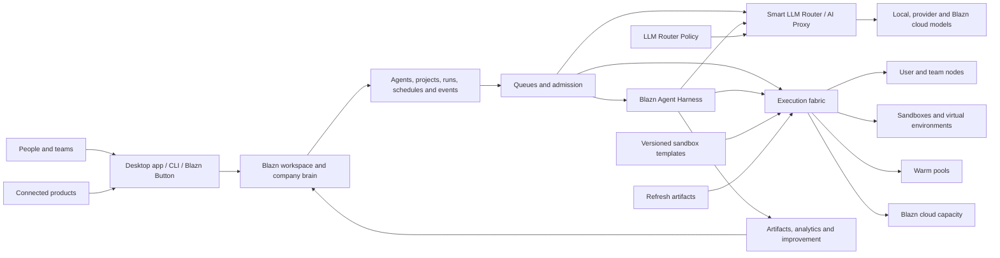

# Blazn Product Overview

**Status:** Vision draft  
**Audience:** Founders, product, design, engineering, and early collaborators  
**Scope:** High-level product definition; detailed requirements and architecture will follow

## Index

- [The idea](#the-idea)
- [The problem](#the-problem)
- [Product promise](#product-promise)
- [Who it is for](#who-it-is-for)
- [The product](#the-product)
- [System design](#system-design)
  - [System component index](#system-component-index)
  - [Nodes](#nodes)
    - [Local model capacity](#local-model-capacity)
  - [Sandbox templates and refreshes](#sandbox-templates-and-refreshes)
  - [Sandboxes](#sandboxes)
  - [Warm pools](#warm-pools)
  - [Queues](#queues)
  - [Blazn Agent Harness](#blazn-agent-harness-system)
  - [Smart LLM Router](#smart-llm-router)
  - [LLM Router Policy](#llm-router-policy)
- [How the pieces fit](#how-the-pieces-fit)
- [Product principles](#product-principles)
- [Brand direction](#brand-direction)
- [Initial product boundary](#initial-product-boundary)
- [What Blazn is not](#what-blazn-is-not)
- [Measures of success](#measures-of-success)
- [Documents to develop next](#documents-to-develop-next)

## The idea

Blazn is the operating workspace for an AI-enabled company.

It allows individuals and teams to interact with agents as a coordinated team at scale. People, agents, models, tools, knowledge, projects, and compute live in a shared workspace, so useful context and learning accumulate into a unified company brain instead of disappearing inside isolated chats and applications.

Blazn is available as a desktop application for macOS, Windows, and Linux, a CLI, and an optional managed cloud. A user can begin on one computer, invite a team, contribute additional machines as workers, and adopt managed infrastructure only where it is useful.

## The problem

AI work today is fragmented:

- Conversations and decisions are scattered across Slack channels, source code, email, documents, project tools, assistants, IDEs, and terminals.
- Agents operate independently, with limited knowledge of company goals, prior work, or one another.
- Local and cloud models require separate configuration, credentials, routing, and harness-specific integrations.
- Individuals and teams quickly exhaust AI subscription allowances when operating multiple agents, while direct API usage can become unpredictable and significantly more expensive at scale.
- Agents running directly on a local machine can consume its CPU, memory, storage, and thermal capacity, disrupting normal work or causing instability and restarts.
- A single local machine limits agent concurrency and throughput; scaling beyond it usually requires manually assembling more hardware or paying a cloud provider.
- Agent environments are difficult to provision consistently, secure, observe, and clean up.
- Runs produce logs and artifacts, but rarely create reusable organizational memory.
- Teams cannot easily understand what agents are doing, why they made a decision, what they cost, or whether their performance is improving.
- Project plans and agent execution live in separate systems, leaving people to translate roadmaps into prompts and results back into tasks.
- Connecting agents to a live product, customer issue, or support interaction usually requires custom infrastructure.

The result is a collection of powerful tools without a shared operating model. Teams spend time managing agents instead of working with them.

## Product promise

Blazn gives every person and team one place to:

1. Organize people and agents around shared objectives.
2. Run agents safely on local, contributed, or managed compute.
3. Use the right model for each request without changing tools.
4. Preserve work, knowledge, artifacts, and decisions as organizational memory.
5. Observe outcomes and help agents improve over time.
6. Connect agent work directly to projects, products, and customers.
7. Pool authorized capacity across company and employee machines, automatically provisioning isolated environments while protecting the owner's work.
8. Run agents through the Blazn Agent Harness while using local models, provider models, and Blazn cloud through one governed routing system.
9. Bring agents into existing applications through the Blazn Button so they can act on what a user is experiencing in the moment.

The experience should feel local-first, collaborative, inspectable, and progressively adoptable: valuable to one person on one machine, then capable of growing into a company-wide agent platform.

## Who it is for

### Individuals

Developers, founders, researchers, operators, and creators who want one interface for their agents, models, machines, projects, and reusable knowledge.

### Teams

Groups that want shared agents, governed access, coordinated execution, common artifacts, project visibility, and a durable record of how work was completed.

### Organizations

Companies that want a unified agent layer across local infrastructure and cloud services, with control over data, models, cost, security, and operational quality.

## The product

### 1. Blazn desktop application

The desktop application is the primary visual workspace on macOS, Windows, and Linux. It allows users to:

- Create, join, and manage workspaces.
- Invite people and manage roles, access, and shared resources.
- Talk with one agent or assemble a team of specialized agents.
- Follow live work, steer active runs, review decisions, and approve sensitive actions.
- Manage local machines, remote workers, sandboxes, and virtual environments.
- Browse agents, projects, runs, schedules, triggers, tools, resources, instructions, objectives, and metrics.
- Pin and share artifacts such as documents, plans, dashboards, reports, code changes, and research.
- Use the Blazn Agent Harness for conversations and work performed in an isolated environment or through an approved local-machine backend.

### 2. Blazn CLI

The CLI gives people and automation access to the same workspace and control plane. It is designed for terminals, scripts, CI systems, and agent-to-agent operation.

Core responsibilities include:

- Authentication and workspace selection.
- Agent creation, discovery, configuration, and invocation.
- Starting, inspecting, steering, and stopping runs.
- Managing nodes, environments, schedules, triggers, tools, and resources.
- Routing model requests through the Blazn AI Proxy.
- Publishing and retrieving artifacts.
- Exposing Blazn capabilities through automation-friendly and MCP-compatible interfaces.

The desktop app and CLI are two clients of the same product, not separate systems.

### 3. Workspaces and the company brain

A workspace is the shared boundary for a person or organization. It contains:

- Members, teams, roles, and policies.
- Agents and their identities, capabilities, objectives, and instructions.
- Knowledge, resources, tools, integrations, and credentials.
- Projects, roadmaps, milestones, tasks, and decisions.
- Runs, events, artifacts, metrics, schedules, and triggers.
- Nodes, execution environments, models, budgets, and usage.

The company brain is the connected, permission-aware memory formed by these elements. It is not simply a document store or transcript archive. It preserves relationships between objectives, decisions, work, evidence, outcomes, and the agents and people involved.

### 4. Agent library and teams

Users can create and manage a reusable library of agents. Each agent can have:

- A name, role, purpose, and measurable objectives.
- Instructions, skills, tools, resources, and LLM Router Policy preferences.
- Environment and machine requirements.
- Permissions, budgets, and escalation rules.
- Schedules, triggers, and event subscriptions.
- Run history, metrics, evaluations, and improvement history.

Agents may work independently, be assigned to projects, or collaborate as a team. Larger coordinating agents can delegate work, combine results, detect gaps, and help specialized agents improve how they work together.

### 5. Blazn Agent Harness

The Blazn Agent Harness is the product's canonical runtime for agents. It owns how an agent receives context, requests a model, uses tools, performs work, collaborates, emits events, pauses, resumes, and completes a run. Blazn does not depend on bring-your-own agent harnesses for its core execution model.

The harness supports:

- Persistent conversations and objective-driven sessions.
- Live progress, events, intermediate results, and structured approvals.
- Follow-up instructions and steering during a run.
- Context assembly from workspace memory, projects, resources, and artifacts.
- Tool and MCP access governed by agent and workspace permissions.
- Work in isolated sandboxes or approved local-machine backends.
- Checkpoints, pause, resume, cancellation, retry, and recovery.
- Temporary agents, delegation, handoffs, and coordinated agent teams.
- Durable outputs, evaluations, and introspection linked to run history.
- Model requests sent exclusively through the Smart LLM Router.

The desktop app, CLI, API, MCP server, schedules, triggers, and Blazn Button all initiate work through this same harness. External applications and developer tools may call Blazn APIs or use its AI Proxy, but they do not redefine Blazn's agent lifecycle or execution semantics.

The harness should make an agent's context, environment, tools, actions, model routing, approvals, and state visible without forcing users to understand the underlying orchestration system.

### 6. Nodes, workers, and environments

A user can choose to make a machine available as a Blazn node. Eligible work is then scheduled onto contributed macOS, Windows, or Linux capacity according to its capabilities and the workspace's policies.

Blazn can provision an isolated sandbox or virtual environment for a run, attach the required tools and resources, stream progress, preserve selected outputs, and clean up when the work is complete. It should support:

- Personal machines and team-owned hardware.
- Linux container and sandbox workloads.
- Native platform workloads, including work that requires macOS or Windows capabilities.
- Managed environments supplied by Blazn cloud.
- Capability-aware placement, queues, quotas, priorities, and concurrency controls.
- Clear consent, pause/drain controls, resource limits, and visibility for machine owners.

Kubernetes Agent Sandbox is a candidate foundation for selected persistent or interactive Linux environments. It is an implementation component, not a requirement for every workload or platform.

### 7. Blazn AI Proxy

The AI Proxy provides one compatible endpoint for the Blazn Agent Harness and external clients such as Codex, Claude Code, IDEs, and internal applications. Its Smart LLM Router evaluates every request against an effective LLM Router Policy before choosing where the request runs.

It can route requests to:

- Models running locally on a user's machine or team hardware.
- Third-party model providers configured by the workspace.
- Models and capacity offered by Blazn cloud.

Routing accounts for model capability, privacy, availability, health, queue depth, latency, cost, policy, and fallback behavior. A caller can request a logical model alias or a capability tier instead of binding an agent to one provider or machine. Users should be able to understand where a request went, why it went there, and whether a retry or fallback occurred, while existing external tools continue to work with minimal configuration.

The AI Proxy is a model-access surface, not an alternative agent harness. External tools may use its compatible APIs for model requests, while agents created and operated by Blazn always run through the Blazn Agent Harness.

This capability builds on the approach established by Blaze Proxy and brings it into the shared Blazn workspace.

### 8. Blazn cloud

Blazn cloud is optional managed infrastructure for teams that do not want to operate every component themselves. It can provide:

- Hosted workspace collaboration and synchronization.
- Managed model access and AI routing.
- On-demand agent environments and elastic execution capacity.
- Durable run history, artifacts, schedules, triggers, and organizational memory.
- Secure remote access to a user's authorized Blazn workspace.
- Administrative controls, usage reporting, policy, and billing.

Local and self-hosted use remain first-class. Cloud adoption should add capacity and convenience without making contributed machines or local models second-class citizens.

### 9. Runs, events, analytics, and improvement

Every meaningful execution is represented as a run. A run connects the initiating person or event, agent, objective, instructions, environment, model activity, tool calls, approvals, outputs, cost, timing, and outcome.

Structured events and metrics make runs observable in real time and reviewable afterward. They support:

- Progress and health monitoring.
- Cost, latency, reliability, and quality analysis.
- Auditing and incident investigation.
- Comparison across agents, models, tools, and workflows.
- Evaluation against the run's objective and expected outcome.

After a run, an agent can perform bounded introspection: identify what worked, what failed, and what reusable learning should be proposed. Improvements to instructions, tools, memory, or collaboration patterns should be evidence-based, versioned, and subject to workspace policy rather than silently rewriting an agent.

Coordinating agents can analyze patterns across multiple agents and runs to improve delegation, handoffs, shared tools, and team performance.

### 10. Projects and execution

Blazn includes project management so plans and agent work share the same context. Workspaces can organize:

- Product and company roadmaps.
- Milestones, projects, tasks, owners, dependencies, and status.
- Objectives, success measures, decisions, risks, and evidence.
- Human and agent assignments.

An agent run can begin from a task, update it with live progress, attach evidence and artifacts, surface blockers, and propose next work. People retain control of priorities and commitments while agents reduce the coordination overhead between planning and execution.

### 11. Artifacts and shared library

Blazn provides a durable, searchable home for useful outputs. Users can pin, organize, version, and share:

- Documents and research.
- Plans, specifications, and decisions.
- Dashboards and reports.
- Code changes and release evidence.
- Data, images, recordings, and other generated files.
- Reusable prompts, instructions, tools, workflows, and agent templates.

Artifacts retain provenance: which objective and run created them, what inputs were used, who approved them, and what superseded them.

### 12. Blazn Button

The Blazn Button connects an application or website to a workspace and its agents. It is the product-facing bridge for real-time work.

Potential experiences include:

- Starting an agent session from the context of the current screen or record.
- Showing live progress and results from a connected execution environment.
- Reporting an issue with relevant application context attached.
- Handling customer support with human and agent collaboration.
- Requesting analysis, remediation, content, or operational work without leaving the host product.

The Button inherits the interaction patterns and visual language of the existing Blaze Button while using Blazn's identity, policy, orchestration, and run history underneath.

The goal is to bring Blazn into the applications people already use. With the user's permission, the Button supplies relevant live context so an agent can understand what the person is seeing, join the experience in the moment, perform work in a connected environment, and return real-time progress and results without forcing the person to reconstruct that context elsewhere.

## System design

This section turns the product vision into a shared system model. It will be developed component by component, beginning with the execution fabric and then defining the resources scheduled onto it.

### System component index

| Component | Purpose | Design status |
| --- | --- | --- |
| [Nodes](#nodes) | Contribute, describe, protect, and operate compute capacity | Initial design |
| [Sandbox templates and refreshes](#sandbox-templates-and-refreshes) | Define, version, update, and efficiently materialize reproducible environments | Initial design |
| [Sandboxes](#sandboxes) | Provide isolated, stateful or disposable execution environments | Initial design |
| [Warm pools](#warm-pools) | Keep policy-controlled environments ready to reduce startup latency | Initial design |
| Analytics and events | Record the structured history of work and system activity | Planned |
| Metrics | Measure health, capacity, cost, performance, and outcomes | Planned |
| [Queues](#queues) | Admit and prioritize work across limited models and compute | Initial design |
| Temporary agents | Create bounded, task-specific agent identities and lifetimes | Planned |
| Agents | Define durable agent identity, objectives, configuration, and history | Planned |
| Development | Build, test, version, evaluate, and release agents and system components | Planned |
| Blazn Agent Harness | Provide the canonical runtime for agent context, tools, execution, collaboration, and recovery | Initial design |
| Credentials and integrations | Connect external systems and safely grant scoped access | Planned |
| MCP | Expose Blazn resources and controls to agents and compatible clients | Planned |
| API | Provide the authoritative programmatic control surface | Planned |
| Smart LLM Router | Select, queue, load-balance, and fail over model requests across local and cloud capacity | Initial design |
| LLM Router Policy | Define allowed routes, preferences, budgets, privacy rules, and fallback behavior | Initial design |

### Nodes

#### Definition

A node is an enrolled machine that makes one or more capabilities available to a Blazn workspace. It may be a person's laptop or desktop, a company workstation, a dedicated server, or capacity managed by Blazn cloud.

Once a machine owner or administrator opts it in, Blazn can automatically create approved virtual environments or sandboxes on that machine and schedule compatible agent work into them. Enrollment does not grant agents unrestricted access to the host. The node contributes only the capabilities, resource envelope, time windows, and data access allowed by its policy.

The node is the unit of capacity and trust. A sandbox is a workload environment created on that capacity. Keeping these concepts separate allows Blazn to use different isolation technologies on macOS, Windows, Linux, and cloud infrastructure without changing how users describe or schedule agent work.

#### Why nodes matter

Nodes turn otherwise isolated machines into a governed compute fabric. A company can use available capacity across employee and company-owned hardware, increase concurrency without immediately purchasing cloud instances, and reserve managed cloud capacity for workloads that require elasticity, availability, or a different trust boundary.

This fabric also protects the local experience. Instead of launching an arbitrary number of agents directly on a workstation, Blazn admits work against declared limits, isolates it where possible, and moves or queues it when the machine cannot safely support more work.

#### Node types

- **Personal node:** A person's macOS, Windows, or Linux machine. It is interactive, may be intermittently available, and always prioritizes the owner's foreground work.
- **Shared team node:** A company-owned machine made available to one or more workspaces under centrally managed policy.
- **Dedicated worker:** A server or workstation intended primarily for agents, with higher concurrency and fewer interactive-use restrictions.
- **Blazn cloud node:** Managed capacity supplied on demand with a defined region, hardware profile, price, and security boundary.
- **Model node:** A machine that exposes local model inference capacity. It may also execute agent environments, but the two capacities are advertised and scheduled independently.

A physical machine may provide multiple execution backends. For example, a Mac could provide a Linux virtual-machine backend for isolated general workloads, a native macOS backend for Xcode work, and a local model endpoint. Each backend has separate limits and trust characteristics even though the UI groups them under one node.

#### Enrollment and identity

Enrollment begins in the desktop application or CLI and should require an explicit user or administrator action. The basic flow is:

1. Authenticate the person and select a workspace.
2. Name the node and show the capabilities Blazn detected.
3. Choose what the machine may contribute, when it is available, and how much capacity must remain reserved for its owner.
4. Apply a workspace-managed node policy and display any settings it controls.
5. Create a unique device identity and register its public identity with the workspace.
6. Establish an outbound authenticated connection to the Blazn control plane.
7. Run compatibility and isolation checks before marking any execution backend ready.

Node identity is distinct from user identity. Removing a user, rotating credentials, reinstalling the node service, or transferring machine ownership must not accidentally preserve access. Device credentials should be revocable, rotated automatically, stored in the platform credential store, and limited to the registered node and workspace.

#### Advertised capabilities

The node service continuously reports a normalized capability inventory that the scheduler can match against workload requirements:

- Operating system, version, CPU architecture, and execution backends.
- CPU, memory, storage, GPU or accelerator capacity, including the amount currently allocatable.
- Installed or managed runtimes, virtualization support, and sandbox providers.
- Native toolchains such as Xcode, Android SDKs, browsers, or Windows build tools.
- Local models and model-server compatibility, context limits, and current inference capacity.
- Network class, allowed destinations, region, data-residency attributes, and trust level.
- Maximum concurrency, availability schedule, battery and thermal restrictions, and owner-defined labels.
- Supported sandbox templates and cached environment versions.

Capabilities are claims, not guarantees. Blazn validates important capabilities during enrollment and refreshes health signals while the node is connected.

#### Local model capacity

A node can contribute one or more locally hosted models as shared inference capacity for authorized agents across the company. For example, a workstation or dedicated GPU server could host DeepSeek V4 Flash or Qwen3.8 and make that model available through the Blazn AI Proxy without requiring every employee or agent to install, configure, or address the model server directly.

Local model capacity is a first-class node backend, parallel to sandbox and native-execution backends. A node may offer models only, execution environments only, or both. The node advertises each model instance with:

- A stable workspace-facing model name and the underlying model, version, quantization, and runtime.
- Supported interfaces and capabilities, such as chat, tool use, structured output, embeddings, vision, streaming, and maximum context.
- Accelerator and memory requirements, loaded or unloaded state, warm-up time, concurrency, token throughput, and current queue depth.
- Data-handling attributes, network exposure, trust class, allowed workspaces or teams, and whether prompts may leave the node.
- Cost or capacity-accounting policy, availability schedule, fallback options, and owner-defined limits.

Agents request a model or capability through the AI Proxy rather than connecting to a machine by address. The proxy authenticates the caller, applies workspace policy and budgets, selects an eligible model instance, queues or load-balances the request, and records operational metrics. Requests reach the node through its authenticated Blazn connection, so contributing a local model does not require exposing its raw inference port to the company network or internet.

The workspace can publish a friendly model alias that maps to several eligible backends. An alias such as `company-fast` could prefer a local Qwen3.8 instance, fail over to another company node when it is saturated, and use an approved Blazn cloud model only when local capacity is unavailable and policy permits. The Blazn Agent Harness and authorized external clients keep using the same model name while routing changes behind it.

Model serving shares the physical node with the owner's applications and possibly with agent sandboxes. The node resource manager therefore reserves memory and accelerator capacity for loaded models, limits concurrent inference, coordinates model loading and eviction, and prevents sandbox admission from exhausting resources promised to inference. The machine owner or administrator can independently pause model serving, sandbox work, or the entire node.

Prompts, responses, and retrieved context remain workspace data. They are not included in infrastructure telemetry by default. Blazn records routing decisions, token counts, latency, errors, saturation, and cost or avoided-cost estimates, while content logging, retention, and evaluation require an explicit workspace policy.

Company-wide model sharing should provide three benefits:

- Turn existing local hardware and approved open models into reusable organizational capacity.
- Reduce dependence on per-user subscription limits and expensive API traffic for suitable workloads.
- Keep sensitive requests inside an approved company-controlled boundary when policy requires it.

#### Lifecycle and state

A node has a small, explicit lifecycle:

- **Enrolling:** Identity exists, but compatibility and policy checks are incomplete.
- **Ready:** At least one backend can accept work.
- **Busy:** The node is healthy but has reached an admission or resource limit.
- **Draining:** Existing work may finish or migrate, but no new work is admitted.
- **Offline:** The node has missed its lease or intentionally disconnected.
- **Quarantined:** Blazn or an administrator has prevented execution because identity, integrity, policy, or health checks failed.
- **Removed:** Trust is revoked and the machine is no longer part of the workspace.

Each execution backend and sandbox also reports its own state. A node can therefore remain ready for local-model requests while its sandbox backend is draining, or remain available for Linux work while native macOS execution is disabled.

#### Placement and admission

Agents request capabilities rather than choosing a machine by hostname. A request may specify an operating system, architecture, sandbox template, native toolchain, model, minimum resources, trust level, region, data boundary, expected duration, and whether interruption is allowed.

The scheduler filters nodes that cannot satisfy hard requirements, then selects among eligible capacity using:

- Workspace and node policy.
- Queue priority, quotas, and fairness.
- Current load and the owner's reserved resources.
- Environment or model cache locality.
- Data location and network restrictions.
- Startup latency, expected reliability, and interruption risk.
- User preference and estimated cost.

Users can pin work to a node for development or specialized hardware, but ordinary runs should remain portable. If no node is eligible, the request waits in a queue, asks the user to relax a constraint, or—when policy permits—offers Blazn cloud capacity with the expected cost visible before admission.

#### Automatic environment provisioning

When the scheduler admits work, the selected node receives a signed workload grant rather than a general command channel. The node then:

1. Resolves an approved sandbox template and exact version.
2. Reuses a compatible warm environment or creates a fresh one.
3. Applies resource, network, filesystem, tool, and credential policy.
4. Starts the Blazn Agent Harness worker and requested agent inside the chosen execution backend.
5. Streams lifecycle events, logs, metrics, and selected artifacts.
6. Suspends, refreshes, or destroys the environment according to its retention policy.

Template refresh, warm-pool behavior, sandbox identity, persistence, and cleanup will be defined in their dedicated sections. The node is responsible for faithfully enforcing those decisions, not inventing them locally.

#### Protecting the machine owner

Personal nodes must remain safe and usable while they contribute capacity. The node service enforces:

- Hard CPU, memory, storage, process, and concurrency limits.
- A configurable reserve that agent workloads cannot consume.
- Low-disk, memory-pressure, thermal, battery, and foreground-activity thresholds.
- Availability windows and idle-only operation when requested.
- Immediate pause, drain, and stop controls in the desktop app and CLI.
- Preemption of interruptible agent work when the owner needs resources.
- Bounded log, cache, image, and sandbox storage with visible cleanup controls.
- Crash recovery that detects and cleans up orphaned environments without restarting the host.

The default personal-node policy should be conservative. Increasing capacity is an informed user choice; joining a workspace should never silently turn a machine into an unrestricted worker.

#### Security model

Nodes operate on the assumption that agent code, repositories, tools, and model output may be untrusted.

- The node initiates outbound connections; enrollment should not require exposing a general-purpose inbound management port.
- Every workload receives a short-lived, audience-bound grant scoped to one run and execution backend.
- Sandbox images and templates are signed, versioned, and policy-approved.
- Host files, sockets, devices, clipboard data, and credentials are unavailable unless explicitly attached.
- Secrets are delivered just in time, scoped to the run and integration, redacted from telemetry, and revoked when possible at completion.
- Network access is denied or constrained by template and workspace policy.
- Native-host execution is identified as a higher-trust backend and requires stronger approval and narrower workloads than a sandboxed backend.
- Node actions and administrative changes produce immutable audit events.

Workspace policy must be able to prohibit personal nodes, require company-managed devices, restrict data to a region or trust class, or allow only specific repositories and integrations.

#### Reliability and disconnection

The node maintains a renewable lease with the control plane. When the lease expires, no new work is assigned. The control plane distinguishes a disconnected node from a failed run and applies the workload's recovery policy:

- Wait for the same node when it owns irreplaceable local state.
- Resume a persistent sandbox after reconnection.
- Retry portable work on another eligible node.
- Fail and request human intervention when replay could duplicate an external action.

The node journals enough local state to report what happened after reconnecting. The control plane remains authoritative for run intent, while the node remains authoritative for the observed state of its local environments until reconciliation completes.

#### Observability and privacy

The workspace needs enough information to schedule work and diagnose failures without turning node enrollment into employee surveillance. Node telemetry should include:

- Availability, heartbeat, software version, and backend health.
- Allocatable and consumed CPU, memory, storage, accelerator, and concurrency capacity.
- Sandbox startup time, queue-to-start time, failures, preemptions, and cleanup results.
- Model capacity, request load, latency, and error rates when the node serves models.
- Workload identifiers and policy decisions required for audit and support.

Blazn should not collect unrelated applications, personal files, keystrokes, screen contents, or browsing activity. Application context is shared only through an explicit integration such as the Blazn Button and is governed separately from infrastructure telemetry.

#### Node controls and experience

The desktop app should make node behavior understandable at a glance:

- Whether the node is accepting work and which backends are ready.
- What is running, for whom, and what resources it is using.
- The capacity reserved for the owner and the capacity contributed to Blazn.
- Which local models are available, loading, serving, saturated, or offline.
- Recent runs, errors, policy changes, and cleanup activity.
- Pause, resume, drain, update, diagnose, and remove actions.
- Estimated local capacity contributed and cloud cost avoided.

Administrators need fleet views for health, versions, capacity, utilization, trust, queues, policy compliance, and current workloads. Machine owners should always retain the local ability to stop Blazn work, even when workspace policy is centrally managed.

#### Initial node record

The first system model should include at least:

- Stable node ID, workspace ID, display name, owner, and enrollment timestamps.
- Device identity, trust class, policy version, and software version.
- Platform and normalized capabilities.
- Execution backends with individual status and allocatable capacity.
- Advertised model instances, aliases, runtime details, access policy, and inference capacity.
- Labels, placement constraints, availability, and resource-reserve policy.
- Current lease, health, drain state, and last-seen time.
- Active environment and workload references.
- Aggregate utilization and reliability metrics.

Secrets, raw device keys, and unrelated host inventory must not be stored in the node record.

#### Version-one boundary

The first node implementation should prove a narrow loop:

1. Enroll one macOS, Windows, or Linux machine from the app or CLI.
2. Contribute a bounded Linux virtualized or containerized backend where the platform supports it.
3. Advertise verified resources and accept capability-matched work.
4. Advertise one local model endpoint and make it available to authorized agents through the AI Proxy.
5. Create an isolated environment from one approved template.
6. Run the Blazn Agent Harness, stream events and resource metrics, and return artifacts.
7. Enforce shared resource reserves, model and agent concurrency, drain, offline, and cleanup behavior.
8. Make the same operations available through the authenticated Blazn API and MCP server.

Native platform execution, additional model runtimes, organization-wide device management, workload migration, and cloud bursting belong in the model from the beginning but can follow after this loop is reliable.

#### Decisions to make next

- Which isolation backend is the default on each operating system?
- Does the first release use a local scheduler, a hosted control plane, or both?
- Which node and sandbox operations continue while the control plane is unavailable?
- How are software, template, and policy updates staged and rolled back?
- What data and workload classes are permitted on personal versus managed nodes?
- How is contributed capacity measured, credited, budgeted, or billed?
- How are local model aliases, compatibility claims, model versions, and fallback chains governed?
- How should inference and agent environments share accelerators and memory without destabilizing the node?
- Which workload types are portable, resumable, interruptible, or bound to one node?
- What compatibility contract allows Kubernetes Agent Sandbox and non-Kubernetes backends to behave consistently?

### Sandbox templates and refreshes

#### Definition

A sandbox template is an immutable, versioned specification for an approved agent environment. It describes what a sandbox must contain, which nodes can run it, how it is initialized, what it may access, and how Blazn determines that it is ready.

A refresh is a controlled materialization process that prepares reusable repository state, dependencies, tool caches, and other safe-to-reuse environment data for a specific template version. The resulting refresh artifact can hydrate a cold sandbox or seed a sandbox maintained in a warm pool.

These are separate concepts:

- **Template:** The desired and governed environment specification.
- **Template version:** An immutable revision of that specification with a unique content digest.
- **Refresh:** The process of resolving current inputs and producing reusable cached state.
- **Refresh artifact:** A content-addressed, validated output produced by a refresh.
- **Sandbox:** A running or suspended instance of one template version, optionally hydrated from a compatible refresh artifact.
- **Warm-pool entry:** A pre-created sandbox based on a template version and, normally, its latest eligible refresh artifact.

Refreshing an environment never silently changes the identity of its template. Changing the operating system, tools, initialization behavior, network policy, repositories, or other declared template content creates a new template version.

#### Template contents

A sandbox template should be able to define:

- Template name, description, owner, version, lifecycle channel, and compatibility contract.
- Base operating-system image, CPU architecture, platform variants, and required isolation backend.
- Minimum and maximum CPU, memory, storage, accelerator, process, and runtime limits.
- The Blazn Agent Harness worker version and required runtime interfaces.
- Language runtimes, package managers, compilers, browsers, CLIs, system packages, and development tools.
- Repositories, source references, checkout strategy, workspace layout, and repository-specific setup.
- Dependency installation, build, initialization, validation, and health-check steps.
- Declared dependency, compiler, package, source, and build caches.
- Tools, MCP servers, integrations, and capabilities that may be attached at runtime.
- Network egress and ingress policy, DNS behavior, allowed services, and proxy configuration.
- Filesystem layout, writable paths, ephemeral and persistent volumes, mounts, and artifact directories.
- Credential requirements by capability and scope, but never secret values.
- Environment variables divided into public configuration and runtime-injected secrets.
- Sandbox persistence, suspension, timeout, cleanup, and artifact-retention behavior.
- Refresh behavior, warm-pool eligibility, cache limits, and invalidation rules.
- Labels for operating system, architecture, trust, data classification, region, and scheduling.
- Provenance, signatures, approvals, security scan requirements, and policy references.

The template is declarative wherever possible. Initialization scripts remain available for work that cannot be represented declaratively, but they are versioned inputs, execute with constrained privileges, and are included in the template digest.

#### Repositories and source state

A template may include one or more repositories. Each repository declaration can specify:

- Repository identity and approved host.
- Default branch, tag, commit, or workspace-supplied source reference.
- Destination path and whether the checkout is read-only or writable.
- Sparse checkout, submodule, Git LFS, and monorepo configuration.
- Required package-manager lockfiles or dependency manifests.
- Bootstrap, dependency, generation, build, and validation commands.
- Cache inputs and outputs relevant to that repository.
- Whether uncommitted changes, generated files, and build artifacts survive suspension or are exported separately.

Credentials are referenced by integration and permission, not embedded in the template or refresh artifact. At sandbox creation time, the harness requests a short-lived repository grant scoped to the exact operation. A reusable checkout or dependency cache must be sanitized before it can become a refresh artifact or warm-pool base.

The template describes the default or allowed source shape, while a run selects the exact revision it needs. This allows one template version to support many feature branches when their environment and dependency fingerprints remain compatible.

#### Versioning and identity

Published template versions are immutable. Any declared change produces a new version and digest, including changes to scripts, repository definitions, base images, tools, policies, or platform variants.

Templates have:

- A human-readable version for release and compatibility communication.
- A content digest covering the fully resolved template and referenced immutable inputs.
- Mutable channels such as `development`, `candidate`, and `stable` that point to immutable versions.
- A compatibility declaration describing whether existing refresh artifacts, suspended sandboxes, and warm-pool entries may be reused.

A run records the exact template version and digest it used. Selecting `stable` resolves that channel to an immutable version at admission time so later promotion does not alter an active or historical run.

Rollback moves a channel back to a prior approved version; it never edits or deletes history. Emergency policy can prevent new use of a vulnerable version while preserving its provenance for prior runs.

#### Composition and platform variants

Templates may extend approved base templates to avoid copying common configuration. For example, an organization can publish a secured development base, a language team can add Node.js and repository tooling, and a project can add its repositories and setup.

Composition is resolved before publication. The published version contains a complete effective specification and digest so execution does not depend on mutable parent templates.

A logical template may have platform variants for Linux `amd64`, Linux `arm64`, macOS-native, Windows-native, or different sandbox backends. Variants must satisfy the same declared agent-facing contract but may use different images, commands, paths, and caches. Blazn chooses a compatible variant after node placement and records the selected variant on the sandbox.

#### Agent update policy

Agents may discover that a template is missing a tool, uses stale dependencies, or contains a broken setup step. They must not silently modify a published template or promote a new version merely because they can edit files inside a sandbox.

A versioned Sandbox Template Policy determines what an agent may do:

| Mode | Agent capability |
| --- | --- |
| **Locked** | Use approved versions and report problems; no template changes |
| **Propose** | Create a structured change proposal or source-control change for review |
| **Build candidate** | Propose and build a new candidate version, run validation, and attach evidence |
| **Publish development** | Publish a validated version only to an authorized development channel |
| **Managed promotion** | Promote a candidate through specified channels only when automated gates and required approvals pass |

The default for ordinary agents should be **Propose**. A workspace can grant stronger capabilities to a dedicated environment-maintainer agent while limiting it to specific templates, repositories, channels, dependency classes, and cost budgets.

The policy should define:

- Which agents, people, or teams may propose, build, approve, publish, promote, deprecate, or revoke versions.
- Which template fields an agent may change.
- Allowed base images, repositories, package sources, scripts, tools, and network destinations.
- Required tests, scans, signatures, evidence, and human approvals.
- Channels an agent may update and whether production or stable promotion is ever automatic.
- Dependency-update limits, such as patch-only changes or approved package registries.
- Maximum build resources, refresh frequency, storage usage, and spending.
- Whether an agent may trigger refreshes without changing a template.

An agent's update attempt is an auditable run. Its proposal contains the reason, diff, affected variants, test evidence, security results, compatibility assessment, refresh impact, and rollback target.

#### Template update lifecycle

An authorized update follows a controlled lifecycle:

1. Fork the current immutable specification into a draft.
2. Apply the proposed change and resolve inherited configuration.
3. Validate schema, policy, repository access, and platform compatibility.
4. Build every required platform variant in an isolated builder.
5. Run initialization, health, reproducibility, security, and smoke tests.
6. Generate provenance, software inventory, content digest, and signatures.
7. Publish an immutable candidate version.
8. Create compatible refresh artifacts and optional warm-pool canaries.
9. Evaluate required evidence and obtain approvals.
10. Move an authorized channel to the new version and roll it out gradually.

Failed builds or validations do not alter the active version. Promotion and rollback generate events that link the actor, policy, evidence, affected pools, and versions.

#### Refresh definition

A refresh prepares expensive but reusable state ahead of agent execution. Typical refresh outputs include:

- Repository object stores or sanitized checkouts at an approved source revision.
- Installed dependencies selected by exact lockfiles.
- Package-manager download caches.
- Compiled dependencies and generated sources when they are deterministic and portable.
- Language, compiler, linker, build-system, browser, and model-support caches.
- Pre-pulled tool or sidecar images.
- Verified indexes or metadata needed during initialization.

A refresh does not contain active credentials, access tokens, user-specific configuration, unreviewed workspace changes, conversation context, or secrets. It also does not replace run-time synchronization: the sandbox still verifies and checks out the requested source revision before the harness begins work.

#### Refresh identity and cache keys

Each refresh artifact is content-addressed and tied to the inputs that make it safe to reuse. Its key should include at least:

- Template version and resolved platform variant.
- Operating system, architecture, isolation backend, and relevant runtime versions.
- Repository identity and selected source or object-store state.
- Dependency manifests and lockfile digests.
- Initialization and build-step digests.
- Package source, compiler, and important environment configuration.
- Cache schema version and any portability boundary, such as node-local versus shared.

Blazn may produce several artifacts for one template: a broadly reusable base dependency cache, a repository-specific cache, an architecture-specific build cache, and a full sanitized environment snapshot. Smaller layers improve reuse; fuller snapshots improve startup time. Policy determines which forms are allowed.

If a required fingerprint does not match, Blazn treats the artifact as a partial optimization or a cache miss. It never presents stale dependencies as the environment requested by the run.

#### Refresh triggers

A refresh may be initiated by:

- Publishing or promoting a template version.
- A repository branch or approved source revision changing.
- A lockfile, dependency manifest, or initialization script changing.
- A base image, toolchain, package index, certificate, or security advisory changing.
- A refresh time-to-live expiring.
- Warm-pool demand or cache-miss metrics crossing a policy threshold.
- A person, maintainer agent, schedule, API client, or MCP client requesting it.

Triggers are coalesced by refresh key so many runs do not rebuild the same cache concurrently. Refresh work has its own queue, priority, concurrency, storage, and cost limits and should yield to higher-priority interactive agent work when appropriate.

#### Cold-start flow

For a cold sandbox, Blazn:

1. Selects the exact template version and compatible platform variant.
2. Chooses a node and ensures the immutable base layers are present.
3. Locates the newest policy-eligible refresh artifacts whose fingerprints match.
4. Creates the isolated sandbox and hydrates reusable caches or a sanitized snapshot.
5. Injects short-lived repository access and synchronizes the exact requested revision.
6. Verifies lockfiles and applies only the dependency or build delta that remains.
7. Removes setup credentials, attaches run-scoped credentials and tools, and executes health checks.
8. Hands the ready sandbox to the Blazn Agent Harness.

When no compatible refresh exists, the same flow performs a full initialization from the template. If policy permits, successful reusable outputs can be sanitized and published as a new refresh artifact for later runs.

#### Warm-pool flow

A warm pool maintains a target number of sandboxes for a template version and platform variant. Those sandboxes are normally hydrated from the same refresh artifacts used by cold starts, then initialized through the readiness boundary before a run arrives.

When claimed, a warm sandbox still receives a fresh run identity, exact source synchronization, scoped credentials, policy overlays, and final health check. Warm does not mean trusted without verification.

When a new refresh artifact becomes eligible, the warm-pool controller gradually replaces stale entries rather than mutating running sandboxes in place. Active sandboxes continue with their captured template and refresh identities unless an emergency policy requires suspension or termination.

Warm pools reduce sandbox creation and initialization latency. Refresh artifacts reduce repository, dependency, and build preparation latency for both warm and cold sandboxes. The two mechanisms complement one another but remain independently configurable.

#### Storage and distribution

Refresh artifacts may be stored:

- In a node-local cache for maximum speed and data locality.
- In a workspace-controlled artifact registry for reuse across nodes.
- In Blazn cloud storage for managed environments.
- As layered snapshots or images supported by a sandbox backend.

Every artifact carries its digest, size, provenance, compatibility metadata, security status, creation policy, last-used time, and retention class. Distribution verifies signatures and digests before mounting or extraction.

Scheduling can prefer a node that already holds a compatible artifact, but cache locality is a preference rather than permission to violate trust, resource, data-residency, or queue policy.

#### Security and supply chain

Template builds and refreshes execute repository and dependency installation code, so they are treated as untrusted workloads.

- Builds run in isolated, minimally privileged environments rather than on the node host.
- Package and image sources are restricted by policy.
- Network access during build and refresh is declared and auditable.
- Secret mounts are non-exportable and excluded from layers, logs, and artifacts.
- Refresh publication includes secret scanning and sanitation checks.
- Templates and refresh artifacts carry provenance and signatures.
- Software inventory and vulnerability results are attached to the version.
- Promotion can be blocked by severity, license, provenance, or policy violations.
- Consumers re-verify digests and eligibility before use.

A compromised or vulnerable artifact can be revoked. Nodes stop using it for new sandboxes, warm pools replace affected entries, and active runs are evaluated according to an emergency response policy.

#### Lifecycle and garbage collection

Template versions move through draft, building, candidate, stable, deprecated, revoked, and archived states. Refresh artifacts move through building, validating, ready, stale, revoked, and deleted states.

Retention considers channel references, active and suspended sandboxes, warm pools, recent use, reproducibility requirements, storage budgets, and security status. Blazn never deletes a layer still required by an active sandbox. Historical run records retain metadata and digests even when policy permits the underlying large artifact to be removed.

Node-local garbage collection honors a reserved free-space threshold, evicts least-valuable unpinned artifacts first, and reports what it removed. A node must not traverse host paths or delete data outside Blazn-managed storage.

#### Observability

For templates and refreshes, Blazn records:

- Build, validation, publication, promotion, rollback, deprecation, and revocation events.
- Build and refresh duration, queue time, resource usage, and cost.
- Artifact size, distribution time, hit rate, miss reason, and last use.
- Cold-start and warm-start latency broken down by image, repository, dependency, initialization, and health-check stages.
- Dependency delta work performed after hydration.
- Validation, compatibility, security, and sanitation failures.
- Template versions, refresh artifacts, and warm-pool entries used by each sandbox and run.
- Time and compute saved compared with a full uncached initialization.

These measurements determine whether a refresh artifact or warm pool is worth retaining instead of assuming that every cache improves the system.

#### Initial records

The initial template record should include:

- Stable template ID, workspace, name, owner, description, and lifecycle channel.
- Immutable version, digest, resolved specification, parent references, and platform variants.
- Repository declarations, setup steps, resource profiles, policies, and required capabilities.
- Update permissions, approval rules, signatures, provenance, and security status.
- Refresh policy, warm-pool policy, retention policy, and current eligible artifacts.
- Creation, publication, promotion, deprecation, and revocation history.

The initial refresh record should include:

- Stable refresh ID, template version, variant, cache key, and content digest.
- Input fingerprints, repository and lockfile state, and refresh type.
- Artifact location, size, portability, and storage class.
- Builder identity, policy version, provenance, signatures, and security results.
- Status, compatibility, creation and expiration times, last use, and use count.
- Build metrics, failure details, and superseding refresh reference.

#### Version-one boundary

The first implementation should prove:

1. One versioned Linux template with one repository, runtime, dependency lockfile, resource profile, network policy, and health check.
2. Immutable publication with a content digest, development and stable channels, validation, and rollback.
3. A default proposal-only agent update policy and a maintainer-approved promotion path.
4. One refresh job that creates a sanitized repository and dependency artifact keyed by template, architecture, source, and lockfile.
5. Cold sandbox hydration from that artifact with source and dependency verification.
6. Warm-pool creation from the same template and refresh artifact.
7. Invalidation after a template, source, or lockfile change.
8. Metrics comparing full cold start, refreshed cold start, and warm-pool claim.
9. Signed artifact distribution to at least one eligible node and safe garbage collection.

#### Decisions to make next

- What is the canonical template authoring format and where is its source of truth?
- Which fields are portable across sandbox backends and which belong to platform variants?
- Which cache and snapshot formats can be shared safely across nodes and operating systems?
- How granular should refresh layers be before coordination and storage cost outweigh reuse?
- Which repository revisions trigger proactive refreshes and which refresh on demand?
- When may a maintainer agent publish or promote without a person approving the change?
- How are template changes evaluated against active sandboxes, scheduled runs, and warm-pool capacity?
- Which artifacts must be retained to reproduce a historical run?

### Sandboxes

#### Definition

A sandbox is an isolated execution environment created from one immutable sandbox template version and, optionally, hydrated from compatible refresh artifacts. It provides the filesystem, processes, network boundary, resource envelope, tools, and runtime connection in which the Blazn Agent Harness performs work.

The Blazn sandbox is a product-level resource rather than a Kubernetes-specific object. A backend may implement it with Kubernetes Agent Sandbox, a container, a microVM, a platform virtual machine, or managed Blazn cloud infrastructure. Every backend must report which parts of the Blazn sandbox contract it can enforce.

Native macOS or Windows host execution is a related execution backend but is not described as having the same isolation as a sandbox. Runs requiring host-native tools use an explicitly lower-isolation class, narrower permissions, and stronger approval policy.

#### Ownership model

A sandbox has one owning session and may support multiple linked runs in that session. Ownership creates a durable relationship between the conversation, working tree, environment state, artifacts, and agent work without forcing every follow-up request to start from an empty machine.

One active writer lease is allowed by default. The Blazn Agent Harness holds that lease for the active run and coordinates interactive human access within the same session. Multiple viewers may inspect logs, files, terminals, previews, and metrics, but another agent or session cannot modify the sandbox unless an explicit collaboration policy grants a shared writer mode.

Temporary agents receive separate sandboxes by default. They exchange instructions, artifacts, patches, and results through the harness rather than concurrently modifying the parent's working directory. This reduces accidental conflicts and provides clean provenance. A deliberate shared-sandbox policy may be used for tightly coordinated work, but it must define writer fencing, path ownership, and conflict handling.

Before claim, a warm-pool sandbox is owned by its pool. Claiming it atomically transfers ownership to one session and assigns a fresh run identity and writer lease. A claimed sandbox cannot be handed to another session without release, sanitation, and policy-controlled recycling.

#### Sandbox types

| Type | Intended use | Default retention |
| --- | --- | --- |
| **Run sandbox** | One bounded, disposable unit of work | Destroy after result and artifact export |
| **Session sandbox** | Conversation and follow-up work that benefits from persistent files and processes | Suspend between runs, expire after policy limit |
| **Development sandbox** | Interactive human-and-agent development with terminal, editor, preview, and debugging access | Persist while the project or user retains it |
| **Warm-pool sandbox** | Unclaimed, pre-created capacity for fast assignment | Recycle or replace according to pool policy |
| **Shared sandbox** | Explicit collaboration among approved agents or people | Persist only while the shared lease policy is satisfied |

These are lifecycle and policy profiles over one sandbox resource. A sandbox records its type, and policy controls whether it can change type after creation.

#### Identity and relationships

Every sandbox has a stable ID independent of its backend object name. The record links:

- Workspace, owning session, active run, agent, and requesting principal.
- Exact template version, content digest, and selected platform variant.
- Refresh artifacts and cache layers used during hydration.
- Node, execution backend, isolation class, region, and trust class.
- Repository revisions, writable workspace, volumes, exposed services, and artifacts.
- Resource profile, queue admission, priority, and cost attribution.
- Harness attachment, writer lease, viewers, credentials, and policy versions.
- Desired state, observed state, health, timestamps, and terminal reason.

A backend object may be recreated while the Blazn sandbox identity remains stable, provided the recovery policy and persisted state support it. Backend identifiers are recorded as implementation references rather than used as the user-facing identity.

#### Desired and observed state

The control plane stores the desired sandbox state. The node or backend reports observed state and conditions. A reconciler continuously compares them and performs bounded, idempotent transitions.

Examples of desired state include ready, running, suspended, stopped, and destroyed. Conditions explain whether the template resolved, a node was assigned, refresh hydration succeeded, credentials attached, the harness connected, health checks passed, storage persisted, or cleanup completed.

Commands such as pause or delete become desired-state changes with an operation ID. Clients do not issue unaudited raw infrastructure commands directly to a node.

#### Lifecycle

The initial sandbox lifecycle is:

- **Requested:** Identity and requirements are recorded.
- **Queued:** The request awaits quota, priority admission, eligible node capacity, or a warm-pool claim.
- **Provisioning:** The backend object, isolation boundary, filesystem, and resource controls are being created.
- **Hydrating:** Refresh artifacts, repositories, dependencies, caches, and runtime configuration are being materialized.
- **Ready:** Health checks passed and the sandbox can accept a harness attachment.
- **Claimed:** A session owns the sandbox and has received the writer lease.
- **Running:** The harness or an approved interactive attachment is actively using it.
- **Waiting:** The sandbox remains allocated while its run waits for a person or external dependency.
- **Suspending:** Writable state and required metadata are being checkpointed.
- **Suspended:** Compute is released or reduced while resumable state is retained.
- **Resuming:** The same or a compatible backend is restoring persisted state and revalidating readiness.
- **Releasing:** Artifacts are exported, credentials revoked, leases ended, and cleanup or recycling begins.
- **Destroyed:** Runtime resources and policy-selected state are removed.
- **Failed:** A transition cannot complete and requires retry, recovery, or intervention.
- **Quarantined:** Security or integrity policy prevents access, reuse, or normal cleanup until inspected.

`Failed` is accompanied by a failed phase and reason rather than hiding where the error occurred. Terminal runs and sandboxes are related but separate: a run can fail while its session sandbox remains available for diagnosis, or a sandbox can fail and the harness can recover a portable run elsewhere.

#### Provisioning and readiness

After queue admission, sandbox provisioning follows a consistent sequence:

1. Resolve the exact template version, platform variant, policies, and workload requirements.
2. Claim a compatible warm sandbox or select an eligible node and backend.
3. Create the isolation boundary, resource controls, network policy, and storage layout.
4. Mount immutable template layers and policy-eligible refresh artifacts.
5. Create a fresh writable workspace and synchronize exact repository revisions.
6. Verify dependency fingerprints and apply remaining initialization work.
7. Attach run-scoped integrations, credentials, tools, and environment configuration.
8. Start the Blazn Agent Harness worker and sandbox control endpoint.
9. Run template and platform health checks.
10. Mark the sandbox ready and issue a time-limited ownership and writer lease.

Readiness is based on declared checks, not merely on the backend process existing. A sandbox is not assigned to a run until its filesystem, network, harness endpoint, and required tools are usable.

#### Filesystem and repository state

The sandbox filesystem is divided into explicit classes:

- **Immutable base:** Template image, runtime, and verified system tooling.
- **Reusable cache:** Refresh artifacts and package or build caches mounted read-only where possible or through controlled copy-on-write layers.
- **Writable workspace:** Repositories, generated files, patches, and run-created working state.
- **Scratch:** Temporary data that can be discarded without affecting recovery.
- **Persistent volumes:** Policy-approved session or project data that survives suspension or backend recreation.
- **Artifact staging:** Outputs selected for durable export to the workspace artifact system.

Host directories are not mounted by default. A user may explicitly attach an approved local folder to a development sandbox, but the mount records its path class, permissions, owning user, and risk. Company-wide scheduled agents should use managed repository checkouts and volumes rather than personal host paths.

Repository state records the starting revision, current revision, branch or detached state, dirty files, generated outputs, and patch or commit artifacts. Before release or destruction, policy determines whether Blazn commits, exports a patch, uploads selected files, checkpoints the volume, or discards the changes. Agents cannot assume that uncommitted files will persist unless the sandbox retention policy says so.

#### Persistence, suspension, and checkpoints

Suspension preserves the durable state required for the session while releasing as much compute as the backend supports. At minimum, Blazn records filesystem or volume snapshots, repository status, harness checkpoint references, active service declarations, template and refresh identities, pending approvals, and credentials that must be reissued.

Secrets are never persisted in a portable checkpoint. On resume, the sandbox reacquires authorized credentials and revalidates network, repository, dependency, template, and policy conditions before the writer lease returns.

Process-memory checkpointing may be used when a trusted backend supports it, but it is an optimization rather than the portable contract. The portable recovery path assumes processes can restart from filesystem state and the durable harness checkpoint.

A suspended sandbox remains pinned to its captured template version. Upgrading it creates a controlled migration or replacement sandbox; it does not silently apply a new template or refresh artifact to existing writable state.

#### Resume and migration

Resume prefers the original node when it owns node-local state or caches, then considers another compatible node if all required durable state is portable. Migration is allowed only when the destination satisfies the original template, architecture, isolation, trust, region, resource, and data-boundary requirements.

Migration creates a new backend instance under the same sandbox identity, restores durable state, runs readiness and integrity checks, and then moves the writer lease. Source and destination may not both hold an active writer lease. If fencing cannot be proven, Blazn stops and requests intervention rather than risking divergent workspaces.

Not every sandbox is migratable. Native host execution, attached personal folders, specialized hardware, active GUI state, and node-local secrets can bind work to one node. The UI and scheduler should make this constraint visible before the run begins.

#### Resource controls and resizing

Every sandbox has requested, admitted, minimum, and maximum resources. The backend enforces CPU, memory, storage, accelerator, process, file-descriptor, and execution-time limits where supported.

Resource pressure is reported before the host becomes unstable. A policy may throttle the sandbox, preempt interruptible work, suspend it, request a larger profile, migrate it, or fail it with a clear resource reason. Personal-node reserves always outrank sandbox requests.

Live resizing is used only when the backend supports it safely. Otherwise, changing the resource profile creates a restart or migration operation with a checkpoint and explicit event. Agents may request more resources, but queue, budget, node, and approval policies decide whether the request is granted.

#### Networking and services

Each sandbox receives an isolated network identity and a default-deny or template-defined egress policy. Network access is evaluated using workspace, template, integration, and data-classification rules.

Services started inside a sandbox are private by default. Terminal, editor, browser preview, API, and debugging access use an authenticated Blazn tunnel or service gateway tied to the sandbox, user, session, and expiration time. Raw ports are not exposed publicly merely because a process starts listening.

The service gateway provides stable logical endpoints even when the backend object or node changes. It can enforce authentication, authorization, TLS, origin checks, request limits, audit events, and optional human approval before exposure.

Network policy changes are recorded and reconciled. An agent cannot expand its own egress or publish a service unless its permissions and the sandbox policy allow it.

#### Credentials and integrations

The template declares credential capabilities; the sandbox receives actual credentials only after ownership, run, tool, and policy checks pass. Credentials are short-lived, audience-bound where supported, and injected through a backend mechanism that avoids writing them into reusable layers.

The sandbox control endpoint tracks which grants are attached, their scopes, expiry, and revocation status without exposing secret values. Grants are revoked on run completion, suspension, ownership transfer, quarantine, or policy change. Resuming a sandbox requires fresh authorization.

Repository access, MCP servers, cloud providers, databases, customer systems, and other integrations remain distinct grants. Access to one does not imply general workspace credentials or host access.

#### Harness and user attachment

The Blazn Agent Harness communicates with the sandbox through a versioned control protocol for commands, files, processes, terminals, services, events, health, and artifacts. The protocol should support reconnecting after either side restarts without losing operation identity or repeating completed actions.

Authorized users can attach through the desktop app or CLI to:

- View and search files.
- Open a terminal or approved editor session.
- Observe processes, logs, resource usage, and active network services.
- Preview web applications or other declared services.
- Upload, download, pin, or publish artifacts.
- Pause, resume, drain, checkpoint, or request destruction.

Interactive access is attributed to the user and appears in the same event stream as agent actions. The UI distinguishes human and agent changes rather than presenting all filesystem activity as agent work.

#### Collaboration and shared access

The safe default is one session, one active writer lease, and multiple observers. Collaboration policy may additionally allow:

- Several people to share the session under one coordinated writer lease.
- Read-only mounts of another sandbox's published artifact or snapshot.
- A temporary agent to receive a copy-on-write branch of the parent's workspace.
- Multiple agents to work in separate worktrees or declared path partitions.
- A coordinating agent to merge patches or artifacts after delegated runs complete.

Unfenced concurrent writes to the same checkout are not a supported coordination mechanism. When shared write access is enabled, Blazn records lease transitions, path ownership when applicable, conflicts, and merge outcomes.

#### Isolation and backend capability

Every sandbox advertises an isolation class so users and policy can distinguish enforcement strength:

- **Container isolation:** Namespaces and resource controls sharing a host kernel.
- **Sandboxed-container isolation:** Additional syscall or user-space kernel boundary.
- **MicroVM or VM isolation:** A dedicated guest kernel and stronger machine boundary.
- **Managed cloud isolation:** Blazn-operated environment with a declared tenancy and security profile.

Native host execution is listed separately rather than assigned a misleading sandbox isolation class.

Backend capabilities include suspend and resume, portable snapshots, live resize, accelerator access, nested virtualization, GUI support, network-policy strength, filesystem semantics, maximum lifetime, and warm-pool support. Templates and policies require capabilities; they do not infer equivalent security from different backend names.

Kubernetes Agent Sandbox can serve as a Linux backend adapter. Blazn maps its sandbox identity and lifecycle onto the Kubernetes resource while retaining Blazn ownership, run, queue, policy, credential, event, and artifact semantics. Non-Kubernetes and native-platform backends implement the same Blazn control contract to the degree declared by their capability profile.

#### Security and sanitation

Sandbox contents and processes are treated as untrusted even when the template is approved.

- Workloads run without host administrator privileges by default.
- Host files, sockets, devices, metadata services, and control-plane credentials are unavailable unless explicitly granted.
- Template, refresh, and runtime layers are verified before use.
- Network access, process privileges, mounts, devices, and service exposure are policy-controlled.
- Control endpoints authenticate both the harness and node and authorize every operation.
- Logs and artifacts pass through secret-detection and policy filters where appropriate.
- Sandbox escape, integrity, malware, or credential-leak indicators trigger quarantine.
- Release and warm-pool recycling include credential revocation, process termination, writable-state sanitation, and verification.

A sandbox that cannot prove sanitation is destroyed rather than returned to a warm pool.

#### Timeouts, release, and cleanup

Sandbox policy defines queue timeout, provisioning timeout, idle timeout, maximum running time, maximum suspended time, and absolute lifetime. Activity from the harness, an attached user, approved services, or pending work updates the appropriate lease; background noise does not keep a sandbox alive indefinitely.

Release follows an ordered process:

1. Stop admission of new operations and expire the writer lease.
2. Let bounded in-flight operations finish or cancel them according to policy.
3. Export required results, patches, artifacts, logs, and diagnostics.
4. Create an approved checkpoint or snapshot when retention requires it.
5. Revoke credentials, tunnels, integration grants, and service endpoints.
6. Terminate processes and detach mounts and volumes.
7. Sanitize for warm-pool recycling or destroy the backend object.
8. Verify cleanup and record any residual resources.

Orphan detection compares backend resources with authoritative sandbox records. Unknown, expired, or ownerless resources are quarantined and then cleaned through the same validated process rather than deleted through broad selectors.

#### Failure and node loss

Failure policy distinguishes provisioning failure, refresh or dependency failure, harness failure, resource exhaustion, policy denial, backend failure, node disconnection, and security quarantine.

For node loss, Blazn determines whether:

- The node may reconnect and resume the same sandbox.
- Durable state can restore the sandbox on another eligible node.
- The run can restart from a harness checkpoint in a replacement sandbox.
- An external action may have occurred and requires reconciliation.
- Irreplaceable local state makes human intervention necessary.

Retries preserve the logical sandbox and operation history when recovering the same environment. Creating a clean replacement produces a new sandbox ID linked by a replacement relationship so provenance is not blurred.

#### Events, logs, and metrics

Sandbox events cover every desired-state request, backend transition, condition, lease, attachment, credential grant, policy decision, service exposure, checkpoint, artifact export, failure, and cleanup result.

Core metrics include:

- Queue, provisioning, hydration, readiness, claim, resume, and cleanup latency.
- CPU, memory, storage, accelerator, process, network, and open-service usage.
- Resource throttling, pressure, out-of-memory termination, and preemption.
- Refresh cache hit, dependency delta, and warm-pool claim effectiveness.
- Active, idle, waiting, suspended, failed, quarantined, and orphaned counts.
- Session reuse, lifetime, migration, recovery, and replacement rates.
- Cost, contributed-node usage, and cloud-cost avoidance.

Logs are separated into system lifecycle, harness, agent process, tool, service, and audit streams. Content retention follows workspace policy and avoids collecting unrelated host activity.

#### Initial sandbox record

The first record should include:

- Stable sandbox ID, workspace, type, owner session, active run, agent, and requester.
- Template version, digest, variant, refresh artifacts, and requested source revisions.
- Node, backend object reference, isolation and trust class, region, and capabilities.
- Desired and observed state, conditions, health, operation IDs, and transition times.
- Resource request, admission, actual use, limits, priority, and queue reference.
- Filesystem, volumes, repository state, checkpoint, and artifact references.
- Harness endpoint and version, ownership lease, writer lease, and viewer attachments.
- Network policy, private services, tunnels, and expiration.
- Credential grant references and policy versions without secret values.
- Retention, timeout, migration, release, replacement, and terminal information.

#### API and MCP surface

The initial control surface should support:

- List and inspect authorized sandboxes and their conditions.
- Request a sandbox from a template, source revision, resource profile, and policy context.
- Claim an eligible warm sandbox for a session.
- Attach the harness or an authorized interactive client.
- Stream lifecycle events, logs, metrics, files, processes, and services.
- Request checkpoint, suspend, resume, resize, release, or destruction.
- Publish an artifact, patch, snapshot, or service endpoint.
- Diagnose readiness, policy, resource, network, and backend failures.

All mutations are asynchronous operations with an operation ID, idempotency key, authorization decision, and eventual result. Force operations require a distinct permission and produce elevated audit events.

#### Version-one boundary

The first sandbox implementation should prove:

1. Create one Linux sandbox from an immutable template on an eligible node.
2. Hydrate a repository and dependencies from a compatible refresh artifact.
3. Enforce CPU, memory, storage, process, filesystem, and network limits.
4. Attach the Blazn Agent Harness using a session-scoped writer lease.
5. Stream lifecycle events, logs, resource metrics, files, and artifacts.
6. Support follow-up runs in the same session sandbox.
7. Suspend, resume, and reconnect without losing durable workspace state.
8. Revoke credentials and destroy or sanitize the sandbox reliably.
9. Recover from a harness restart and report a simulated node loss clearly.
10. Expose authenticated desktop, CLI, API, and MCP controls.

Kubernetes Agent Sandbox is a candidate first Linux adapter, but the version-one Blazn API and data model should not expose Kubernetes as the required product contract.

#### Decisions to make next

- Which Linux isolation backend should be the first supported implementation?
- What exact state belongs to a session sandbox versus a project volume or artifact?
- Which suspension and snapshot format is portable across nodes and backend versions?
- When should a failed run retain its sandbox for diagnosis, and for how long?
- Which interactive access features are required in the first desktop release?
- Can any multi-agent shared-writer mode be made safe enough for version one?
- How should personal-node storage and network policies differ from dedicated workers?
- Which sandbox states consume queue quota, node capacity, or customer billing?
- What guarantees must a backend satisfy before Blazn labels it production-safe?

### Warm pools

#### Definition

A warm pool is a policy-controlled supply of unclaimed sandboxes prepared ahead of demand for a specific class of work. Its purpose is to reduce the time between queue admission and a ready Blazn Agent Harness environment.

A pool does not contain generic machines that can run anything. Each pool is bound to an immutable template version, platform variant, resource profile, isolation and trust class, region or placement boundary, and refresh compatibility policy. A request may claim an entry only when all hard requirements match.

Warm pools are an optimization, not an authorization boundary and not a separate execution system. Every request still passes through identity, policy, quota, budget, queue admission, source synchronization, credential issuance, and final readiness checks.

#### Relationship to templates, refreshes, and sandboxes

Templates, refreshes, sandboxes, and warm pools reduce different parts of startup time:

- A **template** defines the reproducible environment.
- A **refresh artifact** caches safe, reusable repository, dependency, package, and build state for warm or cold creation.
- A **sandbox** is the isolated running or suspended environment assigned to a session.
- A **warm pool** keeps compatible, unclaimed sandboxes near or at the ready boundary.

A refreshed cold start still creates a new sandbox but avoids repeating most repository and dependency work. A warm claim avoids much of the backend creation and initialization work as well. Warm pools should normally be created from the same refresh artifacts available to cold starts so behavior does not diverge.

The system always retains a cold-start path. A run must not fail merely because its pool is empty when eligible nodes, policy, time, and budget allow a fresh sandbox to be created.

#### Pool key and compatibility

Every pool has a normalized key containing the fields that must match before claim:

- Workspace and optional team or project scope.
- Template ID, immutable version, digest, and platform variant.
- Operating system, architecture, sandbox backend, and isolation class.
- Resource profile, accelerator class, storage class, and required node capabilities.
- Region, data-residency boundary, network class, and node trust class.
- Harness worker compatibility and control-protocol version.
- Refresh compatibility class and required security status.
- Service, GUI, browser, or other special environment capabilities.

Fields such as the exact feature branch, agent identity, session, run, user credentials, and temporary integrations are deliberately absent from the reusable pool key. They are applied after claim. If a workload requires those properties before readiness, it receives a more narrowly scoped pool or uses a cold start.

#### Pool profiles

Warm pools can use different readiness and cost profiles:

| Profile | Prepared state | Tradeoff |
| --- | --- | --- |
| **Cached cold** | No sandbox exists; nodes hold template and refresh artifacts | Lowest idle cost, slower than a warm claim |
| **Suspended warm** | Sandbox storage and initialized state exist, but most compute is released | Moderate resume latency and storage cost |
| **Ready warm** | Sandbox and control endpoint are running and health-checked | Fastest claim, highest idle resource cost |
| **Scheduled warm** | Target capacity changes around known working hours or scheduled demand | Efficient for predictable usage |

One logical pool may manage a combination of ready and suspended entries. Policy defines the target for each state and the maximum total footprint.

#### Pool specification

A warm-pool specification should define:

- Pool identity, owner, workspace scope, and pool key.
- Minimum, target, burst, and maximum entry counts.
- Desired ready and suspended counts.
- Scale-up, scale-down, cooldown, and replacement limits.
- Demand window, schedule, forecast settings, and idle expiration.
- Node selectors, preferred placement, spread, and anti-affinity.
- Personal-node eligibility and resource-reserve requirements.
- Queue priority, quota class, resource budget, storage budget, and maximum idle cost.
- Template channel tracking or exact-version pinning.
- Eligible refresh-artifact policy and maximum refresh age.
- Claim timeout, readiness checks, sanitation behavior, and reuse policy.
- Failure thresholds, circuit breakers, rollout, rollback, and drain policy.

Pool policy can be managed by an administrator or an authorized capacity agent, but automatic changes remain bounded by declared minimums, maximums, budgets, and placement restrictions.

#### Pool lifecycle

The pool itself has an explicit lifecycle:

- **Draft:** The specification is not creating capacity.
- **Active:** The controller is reconciling desired warm capacity.
- **Scaling:** Entries are being added, resumed, suspended, or removed.
- **Healthy:** Ready and suspended capacity satisfy policy.
- **Degraded:** Some entries or placement targets are unhealthy, but claims may continue.
- **Exhausted:** No claimable entries remain.
- **Draining:** No new claims are accepted and entries are being released.
- **Paused:** The specification and history remain, but capacity is not reconciled.
- **Failed:** Repeated build, capacity, policy, or backend errors prevent useful operation.
- **Deleted:** Entries and retained resources have completed verified cleanup.

An exhausted pool is not necessarily unhealthy; it can reflect legitimate demand. Conditions distinguish demand exhaustion from provisioning failure or policy denial.

#### Entry lifecycle

Each entry is a real sandbox with pool ownership before claim:

- **Planned:** Desired capacity exists but no backend object has been created.
- **Provisioning:** The sandbox isolation boundary and resources are being created.
- **Hydrating:** Template and refresh state are being materialized.
- **Validating:** Readiness, integrity, security, and sanitation checks are running.
- **Ready:** The entry is eligible for atomic claim.
- **Suspending or suspended:** Compute is being reduced or remains released while state is retained.
- **Resuming:** A suspended entry is returning to the ready boundary.
- **Claiming:** One admitted request holds an exclusive conditional claim.
- **Claimed:** Ownership has transferred to a session and the entry is no longer pool capacity.
- **Recycling:** Policy-approved cleanup is attempting to return a released sandbox to a trusted base.
- **Replacing:** The entry is stale, unhealthy, or part of a rollout and a successor is being prepared.
- **Failed or quarantined:** The entry cannot be claimed or reused.
- **Destroyed:** The backend resources have been verified as removed.

Ready entries have no user, agent, session, or run credentials and no active writer lease. Their control endpoints accept only pool-controller health and lifecycle operations until a claim succeeds.

#### Creating warm capacity

To create an entry, the controller:

1. Resolves the exact template version and platform variant from the pool specification.
2. Selects an eligible refresh artifact and verifies its digest, provenance, security status, and compatibility.
3. Requests low-priority capacity through the normal quota and node-admission path.
4. Places the entry on an eligible node using policy, cache locality, spread, reliability, and resource availability.
5. Creates the sandbox and hydrates its sanitized reusable state.
6. Starts only the system components required for readiness; no run-scoped credentials or context are attached.
7. Executes template, backend, control-endpoint, network, filesystem, and sanitation checks.
8. Marks the entry ready or suspends it according to the pool profile.

Warm creation should be preemptible when interactive or higher-priority work needs capacity. An interrupted pool build can resume only if its partial state remains verified; otherwise it is discarded.

#### Queue admission and fairness

Warm capacity never bypasses the workload queue. A request must first satisfy workspace concurrency, priority, quota, budget, and fairness rules. Only an admitted request may claim an entry.

The resources occupied by ready entries are visible to capacity accounting. A pool uses a prewarm quota or resource budget rather than hiding idle reservations from the scheduler. When capacity is constrained, policy may suspend or destroy warm entries so admitted work can run.

A warm claim improves provisioning latency but does not increase a team's entitlement to concurrent work. The queue can reserve an entry briefly for an admitted high-priority request, but reservations expire and return the entry if claim customization does not begin.

Pool replenishment runs at lower priority than user work by default. Organizations may reserve dedicated pool capacity when predictable latency is more important than maximum utilization.

#### Atomic claim and ownership transfer

Claiming must prevent two requests from receiving the same sandbox. The control plane uses the entry version, pool ownership, request ID, and an idempotency key in one conditional operation.

The claim flow is:

1. Match an admitted request against ready entries using the complete pool key and current conditions.
2. Atomically move one entry from ready to claiming for that request.
3. Assign the owning workspace session, run reference, agent, requester, and expiration.
4. Issue a new ownership lease and session-scoped writer lease.
5. Synchronize the exact requested repository revisions and verify dependency fingerprints.
6. Apply agent, project, and run configuration that does not change the template contract.
7. Attach short-lived credentials, integrations, tools, and network grants.
8. Start or attach the Blazn Agent Harness worker and run final health checks.
9. Mark the sandbox claimed and running, then emit its endpoint and identity to the harness.

If customization or readiness fails after the atomic claim, the entry is not returned directly to ready. It is sanitized and fully revalidated or destroyed. The request may claim another entry or take the cold-start path according to queue and retry policy.

Repeated claim requests with the same idempotency key return the same result instead of consuming additional entries.

#### Source and dependency freshness

Warm entries can contain a sanitized repository object store, a default checkout, and installed dependencies from a refresh artifact. They do not assume that cached source is the exact state required by the run.

At claim time, Blazn:

- Fetches or resolves the requested source revision using a run-scoped repository grant.
- Creates a clean writable checkout or worktree for that revision.
- Recomputes source, manifest, lockfile, runtime, and cache fingerprints.
- Reuses compatible dependencies and build outputs.
- Applies only the remaining delta.
- Runs the declared post-sync and readiness checks.

A mismatch may make claim slower, but it must not make the environment incorrect. If the delta violates the pool's compatibility boundary, Blazn abandons that entry for the request and chooses another pool or a cold start.

#### Freshness and rolling replacement

Entries are pinned to an immutable template version. A pool that follows a channel resolves a new version and performs a rolling replacement rather than mutating entries in place.

The controller can:

1. Create canary entries for the new template and refresh combination.
2. Validate readiness, claim, sanitation, and representative startup behavior.
3. Increase new-version capacity while draining old ready entries.
4. Let already claimed sandboxes continue with their captured versions.
5. Roll back the pool channel when health or latency gates fail.

A new refresh artifact that remains compatible can replace entries gradually. Stale entries stop receiving claims once their maximum refresh age or security eligibility expires. Emergency revocation immediately prevents new claims and evaluates whether claimed sandboxes must be quarantined or terminated.

#### Placement and distribution

Pools may be node-local, fleet-wide, regional, or cloud-managed. The logical pool can span several nodes while each entry remains bound to one node until claimed or migrated.

Placement considers:

- Exact platform, backend, isolation, trust, resource, region, and data requirements.
- Template and refresh cache locality.
- Node availability schedule, health, reliability, and owner reserves.
- Failure-domain spread so one node loss does not empty the pool.
- Network distance to repositories, integrations, model nodes, and users.
- Storage pressure and the cost of keeping an entry ready or suspended.
- Queue demand by architecture and capability.

Separate pools are normally used for different architectures, resource profiles, trust classes, or platform variants. A single pool label may provide a user-friendly alias over these concrete pools, but the controller does not treat incompatible entries as interchangeable.

#### Personal and employee nodes

Ready warm sandboxes consume resources even when no agent is running, so personal nodes require conservative defaults:

- Minimum ready capacity is zero unless the machine owner explicitly opts in.
- Suspended warm entries or node-local refresh caches are preferred over always-running entries.
- Foreground use, battery, thermal, memory, disk, and idle policies can immediately reduce pool targets.
- Warm entries are preemptible before admitted session work or the owner's applications.
- Pool storage has a visible limit and can be cleared independently of active session state.
- The owner can pause warm-pool participation without disabling model serving or active approved work.

Team servers and dedicated workers can maintain guaranteed ready capacity under an administrator-managed budget. Blazn cloud pools can offer explicit latency and availability tiers.

#### Scaling policy

The controller scales using policy-bounded signals:

- Current ready, suspended, claiming, and provisioning counts.
- Queue depth and age for exactly compatible requests.
- Request arrival rate, burst history, and time-of-day patterns.
- Warm-hit rate, cold-start latency, resume latency, and claim customization time.
- Entry failure, staleness, sanitation, and preemption rates.
- Node capacity forecasts, personal-node availability, and scheduled drains.
- Idle resource cost, storage cost, cloud cost, and avoided startup time.

An initial deterministic policy should use schedules, minimum and maximum counts, queue thresholds, and cooldowns. Predictive scaling can be added after sufficient measurements exist. Forecasting may recommend or adjust capacity only inside hard resource, cost, trust, and privacy bounds.

Scale-down removes the least valuable entries first based on health, age, template and refresh freshness, cache locality, expected near-term demand, and reclamation cost. It never removes a claimed sandbox as a pool scale-down operation.

#### Reuse and sanitation

The safest default is single-claim warm capacity: after the owning session releases the sandbox, Blazn exports required state and destroys it. The pool replenishes with a clean entry derived from trusted template and refresh inputs.

Backends that can prove reset to a trusted snapshot may enable recycling. Recycling must:

1. Expire ownership and writer leases.
2. Revoke credentials, tunnels, integrations, and service endpoints.
3. Terminate all user and agent processes.
4. Remove writable workspace, logs, temporary data, and session-specific volumes.
5. Restore the exact trusted base snapshot or recreate writable layers.
6. Verify mounts, network policy, process state, secret sanitation, template digest, and refresh eligibility.
7. Run the complete pool readiness suite.

Failure at any step destroys or quarantines the entry. Pools never recycle across workspaces or trust boundaries, and policy may forbid recycling for regulated or sensitive workloads.

#### Failure handling

The pool controller distinguishes insufficient capacity, quota denial, template failure, refresh failure, backend failure, node loss, readiness failure, claim failure, sanitation failure, and policy revocation.

Repeated failures for the same template, refresh, node class, or backend trip a circuit breaker. The pool stops creating identical failing entries, marks itself degraded, retains diagnostic evidence, and uses cold starts or another compatible pool when permitted. It does not create an unbounded failure loop that consumes fleet capacity.

Node loss removes affected ready capacity immediately from matching. The controller replaces entries elsewhere when the pool's placement and budget allow it. Claimed sandboxes follow sandbox recovery policy rather than pool replenishment policy.

#### Cost, quota, and capacity accounting

Warm pools exchange idle resource cost for lower startup latency. Blazn tracks that tradeoff explicitly.

Accounting includes:

- CPU, memory, accelerator, and storage reserved while ready or suspended.
- Template build, refresh, provisioning, resume, sanitation, and distribution work.
- Node-local contributed capacity and managed cloud cost.
- Entry idle time, claims, useful running time, and destruction without claim.
- Queue time and startup time saved compared with the available cold path.

Policy can cap hourly idle cost, total pool cost, per-workspace pool resources, storage, and unused-entry age. When the observed value falls below a threshold, Blazn recommends shrinking or suspending the pool.

#### Observability

Warm-pool events include specification changes, target changes, entry creation, readiness, suspension, resume, reservation, claim, ownership transfer, failed customization, replacement, sanitation, quarantine, drain, and destruction.

Core metrics include:

- Desired, provisioning, ready, suspended, claiming, failed, and draining entries.
- Warm-hit, suspended-hit, cache-only, and full-cold-start rates.
- Queue-to-claim, claim customization, resume, and full readiness latency.
- Demand that could not use a pool and the mismatch reason.
- Entry age, idle duration, claims per entry, and unused-destruction rate.
- Template and refresh version distribution and stale-entry count.
- Scale reaction time, forecast error, preemption, and replenishment time.
- Resource reservation, utilization after claim, storage, and idle cost.
- Startup time saved and cost per second of latency reduction.
- Readiness, claim, sanitation, backend, and node-loss failure rates.

Metrics are segmented by workspace, pool, template, variant, backend, node class, and region without exposing repository contents or user prompts.

#### Initial pool and entry records

The pool record should include:

- Stable pool ID, workspace, owner, display name, scope, and policy versions.
- Complete normalized pool key and template channel or exact version.
- Minimum, target, burst, maximum, ready, and suspended settings.
- Placement, spread, personal-node, quota, priority, budget, and schedule configuration.
- Refresh eligibility, freshness, claim, sanitation, reuse, retention, and failure policy.
- Desired and observed counts, lifecycle status, conditions, and last reconciliation.
- Rolling-update, circuit-breaker, cost, and aggregate metric state.

Each entry record extends the sandbox record with:

- Owning pool, entry generation, and creation reason.
- Template and refresh identity used for prewarming.
- Ready, suspended, reservation, and claim timestamps.
- Conditional claim version, request ID, and idempotency key.
- Sanitation generation, readiness results, reuse count, and replacement reason.
- Idle resource cost and startup-latency measurements.

#### API and MCP surface

The first control surface should support:

- Create, inspect, update, pause, resume, drain, and delete a warm pool.
- List pool entries, states, placement, freshness, cost, and health conditions.
- Set bounded capacity targets, schedules, and budgets.
- Trigger a reconcile, canary rollout, refresh replacement, or diagnostic run.
- Atomically claim a matching entry for an admitted session.
- Release a failed claim for sanitation or destruction.
- Stream pool and entry events and metrics.
- Explain why a request missed a pool or why an entry is not claimable.

Agent access is scoped separately from administrative access. An ordinary agent may request compatible warm capacity; it cannot enlarge a pool, change placement, raise a budget, or weaken sanitation policy unless explicitly granted that operation.

#### Kubernetes and backend adapters

A Kubernetes warm-pool implementation may use Kubernetes Agent Sandbox warm-pool resources or a Blazn controller over sandbox resources. Blazn still owns the product-level pool key, queue admission, budgets, atomic session claim, credentials, events, metrics, and sanitation requirements.

Other backends may maintain suspended VM snapshots, pre-created microVMs, container sandboxes, or managed cloud environments. Backend-specific efficiencies are welcome, but every adapter must preserve claim fencing and declare whether it supports ready, suspended, recycling, migration, and personal-node preemption.

#### Version-one boundary

The first warm-pool implementation should prove:

1. One Linux pool pinned to an immutable template version, platform variant, resource profile, and refresh artifact.
2. Configurable target and maximum ready counts with a fixed resource budget.
3. Normal queue admission followed by one atomic, idempotent session claim.
4. Exact source synchronization, run-scoped credential injection, and final readiness after claim.
5. Replenishment after claim and rolling replacement after a new compatible refresh.
6. Scale-to-zero, pause, drain, and cleanup behavior.
7. Conservative personal-node behavior with ready capacity disabled by default.
8. Single-use destruction after session release; no recycling in the initial security boundary.
9. Metrics comparing full cold, refreshed cold, suspended warm, and ready warm startup.
10. Authenticated desktop, CLI, API, and MCP inspection and administration.

#### Decisions to make next

- Should version one support suspended entries, ready entries, or both?
- Which scheduler owns prewarm quota and how does it reclaim pool reservations for admitted work?
- Which demand signals are reliable enough for the initial deterministic scaler?
- How much post-claim repository and dependency work is acceptable before an entry is no longer considered warm?
- Which backends can prove sanitation strongly enough to enable recycling later?
- Should pools be workspace-owned only, or can organizations safely share a base pool across workspaces?
- How are cloud latency tiers and contributed-node capacity priced or credited?
- How should pool capacity follow template-channel promotion without causing a readiness gap?
- Which metrics determine that a pool should be resized, suspended, or removed?

### Queues

#### Definition

Queues are Blazn's durable admission, ordering, fairness, and backpressure system for work competing over limited capacity. They decide when work may consume resources; schedulers and routers decide where admitted work executes.

Blazn does not use one global FIFO queue. Agent runs, sandbox provisioning, model inference, template builds, refreshes, warm-pool maintenance, and rate-limited integration work have different resource units and latency requirements. They use separate queue domains connected by shared identity, priority, quota, budget, and policy context.

Queue state is authoritative and durable. Closing a client, restarting a controller, or temporarily losing a node does not erase a request or silently duplicate it.

#### Goals

The queue system should:

- Give interactive users responsive service without starving scheduled or background work indefinitely.
- Isolate workspaces, teams, agents, and principals with explicit concurrency and resource limits.
- Allocate heterogeneous CPU, memory, accelerator, model, provider, storage, and network capacity fairly.
- Make contributed personal nodes useful without assuming they are continuously available.
- Preserve policy, trust, region, architecture, template, model, and data-boundary requirements.
- Apply budgets and provider limits before expensive work begins.
- Support deadlines, reservations, preemption, retry, cancellation, and recovery safely.
- Explain why an item is waiting, when it may run, and what would make it eligible.
- Prevent warm pools, refreshes, and maintenance from hiding or monopolizing capacity.

#### Queue domains

| Domain | Work item | Capacity governed |
| --- | --- | --- |
| **Run admission** | A Blazn Agent Harness run or delegated temporary-agent run | Workspace and agent concurrency, run budget, environment entitlement |
| **Environment** | Sandbox create, claim, resume, resize, migrate, or replacement | Node CPU, memory, storage, accelerator, backend, warm entries |
| **Inference** | One logical LLM request and its policy-controlled attempts | Model concurrency, tokens in flight, accelerator memory, provider limits and spend |
| **Template build** | Build, validate, scan, sign, or promote a template version | Builder capacity, platform variants, artifact storage and budget |
| **Refresh** | Create or update reusable repository and dependency artifacts | Build capacity, repositories, package sources, storage and refresh budget |
| **Warm-pool maintenance** | Prewarm, resume, suspend, replace, sanitize, or destroy entries | Prewarm quota, node resources, storage and idle-cost budget |
| **Integration** | Rate-limited or asynchronous work against an external system | Provider quotas, connection limits, action budgets and safety rules |

Schedules, triggers, API calls, MCP tools, user actions, and agent delegation create items in these domains; they are not separate capacity systems. A scheduled agent run enters normal run admission with its schedule-derived priority and deadline.

#### Queue topology and scope

Queue policy is hierarchical:

```text
Organization capacity and hard limits
  -> Workspace allocation and budget
    -> Team or project allocation
      -> Agent and principal concurrency
        -> Queue domain and priority class
```

A workspace can have logical queues such as `interactive`, `scheduled`, `delivery`, or `research`, but these map into shared physical capacity and organization policy. Creating another queue name does not create more entitlement.

Capacity providers expose admission pools by capability and boundary—for example Linux CPU workers, Linux GPU workers, native macOS, a local Qwen pool, an external model provider, or Blazn cloud in a specific region. Queue items request capabilities rather than internal pool names unless administrators intentionally pin them.

#### Work-item envelope

Every queued item carries a normalized envelope:

- Stable item ID, queue domain, workspace, principal, agent, session, run, and parent item.
- Idempotency and deduplication keys.
- Submission source, objective class, project, and cost attribution.
- Priority class, numeric position within the class, creation time, deadline, and maximum queue time.
- Hard capability, platform, trust, region, data, model, template, and backend requirements.
- Requested and maximum resources or rate units.
- Estimated duration, tokens, cost, storage, and external quota where available.
- Preemptible, resumable, migratable, retry-safe, and side-effect classifications.
- Dependency, approval, schedule, and not-before conditions.
- Queue Policy, LLM Router Policy, sandbox, security, and budget versions.
- Retry policy, attempt count, lease, reservation, and terminal result references.

Estimates help scheduling but are not trusted as exact. Blazn records actual usage and can adjust later admission when an agent, project, or workload class consistently underestimates demand.

#### Item lifecycle

The initial queue-item lifecycle is:

- **Submitted:** The request has a durable identity.
- **Validating:** Schema, identity, policy, capability, and budget checks are running.
- **Blocked:** A dependency, approval, schedule, credential setup, or policy decision prevents eligibility.
- **Queued:** The item is valid and waiting for its queue class to be considered.
- **Eligible:** All non-capacity conditions are satisfied.
- **Reserving:** Blazn is attempting a bounded resource reservation.
- **Admitted:** Required admission tokens or resource leases are held.
- **Dispatching:** The item is being handed to a scheduler, router, controller, node, or provider.
- **Running:** The consumer acknowledged the dispatch and holds a renewable execution lease.
- **Yielded:** Preemptible work checkpointed and returned to its queue without becoming a new logical item.
- **Completing:** Usage, result, resource release, and accounting are being finalized.
- **Succeeded, failed, canceled, or expired:** The terminal result and reason are recorded.

Blocked time, eligible queue time, reservation time, dispatch time, and running time are measured separately. This distinguishes lack of capacity from waiting for approval or a broken dispatcher.

#### Queue Policy

A versioned Queue Policy determines admission behavior for a scope and domain. It can define:

- Allowed work types and submission sources.
- Priority classes and who may assign or override them.
- Workspace, team, project, agent, and principal concurrency limits.
- CPU, memory, accelerator, storage, sandbox, token, request, and provider quotas.
- Reserved, shared, burst, and maximum capacity.
- Maximum queue time, deadlines, aging, cooldowns, and retry limits.
- Preemption eligibility, victim order, checkpoint requirements, and grace periods.
- Cost, token, provider, and time budgets.
- Region, trust, node class, model, template, and data-boundary restrictions.
- Admission behavior when estimates are missing or actual usage exceeds them.
- Fairness weights and protections against one principal or agent flooding a queue.

Lower scopes can choose within an allocation but cannot exceed or weaken higher-level hard limits. The effective policy and its source versions are captured on each item.

#### Priority classes

The initial system should use a small, understandable set of priority classes:

| Class | Examples | Typical behavior |
| --- | --- | --- |
| **Urgent approved** | Human-approved incident response or production recovery | Highest bounded priority; tightly permissioned and audited |
| **Interactive** | A person actively waiting in desktop, CLI, or Blazn Button | Low latency and protected capacity |
| **User initiated** | A person starts work but is not waiting synchronously | Normal foreground priority |
| **Scheduled** | Monitors, reports, maintenance windows, recurring agents | Deadline-aware and predictable |
| **Background** | Research, evaluations, indexing, large batch work | Uses available capacity and is preemptible when safe |
| **Maintenance** | Refreshes, template builds, cleanup, warm-pool replenishment | Lowest by default unless needed to unblock admitted work |

Users cannot label ordinary work urgent merely by supplying a number. Priority escalation is a separately authorized operation with a reason and expiration.

Within a class, fairness and age matter. A continuous stream of new interactive work cannot starve already admitted deadline-bound work, and a large background request cannot block every smaller request solely because it arrived first.

#### Fairness

Blazn should begin with deterministic weighted fairness across workspaces and use dominant-resource awareness for heterogeneous capacity. The scheduler considers each scope's share of its most constrained resource rather than comparing CPU-only quantities.

Fairness includes:

- Organization allocations and workspace weights.
- Per-team, project, agent, and principal concurrency caps.
- Bounded aging so long-waiting eligible work gains consideration without overtaking hard priority boundaries.
- Small-request progress so one large item cannot create head-of-line blocking when smaller items fit.
- Burst credits that decay and never replace a hard maximum.
- Reserved capacity that returns to shared use when its owner has no eligible demand.
- Separate fairness accounting for scarce accelerators, native-platform nodes, and model/provider capacity.

The system should expose the fairness reason for a decision, including the resource or allocation currently constraining an item.

#### Quotas and budgets

Quotas govern entitlement to capacity; budgets govern permitted consumption or spend. Both are hierarchical and multidimensional.

Capacity quotas may include:

- Active runs and temporary agents.
- Provisioning, ready, running, waiting, and suspended sandboxes.
- CPU, memory, storage, accelerator, and native-platform slots.
- Warm-pool ready and suspended reservations.
- Template builders, refresh jobs, and artifact storage.
- Model requests, concurrency, tokens in flight, and context size.
- Integration calls, concurrent connections, and provider rate units.

Budgets may include tokens, provider cost, Blazn cloud spend, node-hours, accelerator-hours, storage, network egress, or action-specific limits. Admission checks the expected worst permitted consumption where possible and reconciles against actual usage afterward.

Hard limits reject or block work. Reserved allocations protect capacity. Shared allocations support fairness. Burst allocations permit temporary excess when capacity and budget exist. Borrowed capacity remains reclaimable and does not become a permanent entitlement.

#### Capability and placement eligibility

Before an item competes on priority or fairness, Blazn determines whether any capacity can satisfy its hard requirements. Requirements may include:

- Operating system, architecture, sandbox backend, isolation class, or native toolchain.
- Template and platform variant.
- Minimum resources, accelerator type, local model, or attached device.
- Region, data residency, workspace trust, or company-managed node.
- Network class, approved integration, repository reachability, or required service.
- Persistence, suspension, migration, GUI, browser, or warm-pool capability.

An item with no possible route is marked blocked or rejected with an explanation rather than waiting forever. Temporary lack of matching capacity remains queued; a structurally impossible request requires a policy, template, or requirement change.

Placement occurs after or as part of a bounded reservation. Queue admission does not authorize a scheduler to ignore the original capability or policy envelope.

#### Run-admission plan

An agent run can depend on several scarce resources, but Blazn should avoid holding one resource indefinitely while waiting for another. The run queue creates an admission plan:

1. Validate the agent, objective, policy, budget, and required environment.
2. Reserve a workspace run slot and compatible environment entitlement with a short expiration.
3. Atomically claim a warm sandbox or dispatch a cold sandbox request.
4. Release or renew provisional reservations while the sandbox becomes ready.
5. Start the harness and convert reservations into running usage.
6. Request model capacity through the inference queue for each LLM call rather than reserving one model for the full run.

When a workload truly requires simultaneous scarce resources—such as a GPU sandbox and a dedicated local model instance—the plan reserves them as one bounded group or releases all partial reservations on failure. It does not wait indefinitely while holding only half of the required capacity.

#### Environment admission

Environment items request or modify sandbox capacity. The queue can satisfy creation with:

- An atomic claim from an eligible warm pool.
- Resume of the owning session's suspended sandbox.
- Cold creation on a contributed or dedicated node.
- Blazn cloud capacity when workspace policy and budget permit it.

Warm claims and cold starts compete under the same workspace run and environment entitlement. A pool hit changes startup time, not priority or quota.

Resume may receive preference over new background work because it preserves a user's session, but it still respects hard node, resource, trust, and budget constraints.

#### Inference queues

The Smart LLM Router owns inference-domain dispatch while the queue system provides durable identity, priority, quotas, and backpressure. Each logical LLM request enters with the run's workspace, agent, priority, deadline, data class, and effective LLM Router Policy.

Inference admission considers:

- Model and capability eligibility.
- Instance health, loaded state, context support, and tokens in flight.
- Local-node inference limits and shared accelerator reservations.
- Provider requests-per-minute, tokens-per-minute, concurrency, and spend.
- Interactive latency targets and background batch efficiency.
- Queue wait versus policy-permitted fallback.

Fallback creates another attempt under the same logical item and budget. It does not jump ahead of already eligible work unless the original item retains its lawful priority. Partial streaming, cancellation, and retry safety remain visible to the router and harness.

#### Template, refresh, and warm-pool queues

Template builds and refreshes can be expensive and may execute untrusted repository code. They use isolated builder capacity, explicit concurrency, deduplication by content key, and storage budgets.

If many runs request the same missing refresh, one refresh item is created and the others reference it as an optional dependency. Runs may wait, use an older compatible artifact, or take the full cold path according to policy rather than launching duplicate builds.

Warm-pool maintenance uses prewarm quota and is low priority by default. Replenishment needed for an already admitted request can be elevated within a bounded class, but speculative forecast capacity cannot displace active user work.

Security refreshes and cleanup may receive a distinct administrator-controlled priority because delaying revocation or orphan cleanup carries risk. That priority remains narrow to the affected operation.

#### Integration queues

External integrations have limits and side effects that differ from compute. A queue may govern calls to source control, messaging, ticketing, databases, customer-support systems, deployment systems, or other services.

Integration admission considers provider rate limits, per-credential limits, concurrency, approval, action budget, and idempotency. Read operations may batch or retry under policy. Writes require an operation key and clear replay classification.

Queueing an external write does not mean it can be safely replayed. After a timeout or lost acknowledgment, the integration worker reconciles the remote state before another attempt.

#### Dependencies and blocking

An item can depend on:

- A parent run or delegated objective.
- Human approval or a policy exception.
- Template publication, refresh completion, or sandbox readiness.
- Credential or integration authorization.
- A scheduled time, external event, or project milestone.
- An artifact, repository revision, test result, or prior action.

Dependencies form a bounded directed graph. Blazn rejects cycles and excessive fan-out. A blocked item does not consume running capacity, but policy may count large blocked populations against submission limits to prevent unbounded accumulation.

When a dependency fails, the item follows its declared behavior: fail, cancel, use an alternative, request approval, or remain blocked for intervention. It does not silently ignore the dependency.

#### Scheduling, deadlines, and triggers

Scheduled work is materialized into a queue item with a stable schedule occurrence key. Reconciliation can recreate a missing item without producing duplicates.

Policies define behavior when an occurrence is late:

- Run immediately within a grace window.
- Skip and record a missed occurrence.
- Coalesce several missed occurrences into one run.
- Catch up each occurrence up to a maximum.
- Escalate only when a deadline or service objective requires it.

Deadlines influence eligibility and placement but do not permit policy violations. If Blazn predicts that no eligible capacity can meet a deadline, it reports that early and may offer policy-approved cloud capacity or a reduced workload instead of waiting until failure is unavoidable.

#### Backpressure and admission control

Every submission endpoint has bounded request rate, outstanding-item count, payload size, and fan-out. The system can return:

- Accepted with item identity and estimated conditions.
- Blocked with a resolvable dependency or policy reason.
- Rate limited with a retry time.
- Rejected because the request is structurally invalid or prohibited.
- Deferred because a queue or provider circuit breaker is open.

Agents receive the same backpressure signals as people and automation. They cannot create unbounded temporary agents, inference requests, refreshes, or integration calls merely because previous work is waiting.

#### Preemption and yielding

Preemption reclaims capacity from lower-value interruptible work. The default victim order is:

1. Speculative warm-pool creation and unused ready entries.
2. Background refresh, indexing, evaluation, or batch work.
3. Scheduled work that can safely checkpoint and still meet its deadline.
4. User-initiated work explicitly marked interruptible.

Interactive work is not automatically non-preemptible, and urgent work is not automatically safe to interrupt others. Queue Policy defines allowed victim and request classes.

Before preemption, Blazn requests a checkpoint and allows a bounded grace period. Work yields only at a safe point. External writes, non-repeatable operations, and native tasks without a recovery contract are not forcibly replayed. If emergency host protection terminates them, the result is marked uncertain and requires reconciliation.

A yielded item retains its age and identity so preemption cannot reset it to the back of the queue indefinitely.

#### Reservations and leases

Reservations are short-lived promises of specific or interchangeable capacity. Leases prove that an admitted worker still owns that capacity.

- Reservations have a scope, resource vector, expiration, and owner item.
- Dispatch converts a reservation into a renewable execution lease.
- Workers acknowledge dispatch with the item and attempt identity.
- Missed heartbeats expire the lease and trigger reconciliation.
- Expiration does not automatically mean the underlying work stopped; the controller fences the old attempt before replacement.
- Capacity is released only after accounting and cleanup reach a known outcome.

The queue never assumes process state from a missing heartbeat alone. Node, sandbox, harness, router, and integration observations participate in reconciliation.

#### Retry, idempotency, and deduplication

Submission idempotency prevents repeated client requests from creating duplicate logical items. Attempt identity distinguishes safe retries from new work.

Retry policy depends on operation type:

- Pure validation, lookup, and deterministic build steps may retry automatically.
- Sandbox creation retries through backend reconciliation and cleanup.
- Inference retries follow streaming and LLM Router Policy rules.
- Agent runs resume from a harness checkpoint when possible.
- External writes reconcile remote state before retry.
- Security or policy denial does not retry until an input or policy changes.

Exponential delay, attempt limits, deadlines, and circuit breakers prevent retry storms. A new manual attempt links to the failed item rather than erasing its history.

#### Dynamic node capacity

Contributed node capacity changes as employees connect, disconnect, use their machines, or adjust limits. Nodes publish allocatable capacity with a lease and confidence class.

The queue considers only healthy, current offers. Personal-node capacity is opportunistic unless explicitly guaranteed. An item can choose to wait for contributed capacity, accept eligible Blazn cloud fallback, or fail at a deadline according to policy and budget.

Pool and scheduler forecasts must not count the same capacity twice. Model serving, sandboxes, native execution, and warm entries on one physical node share its enforced resource ledger.

When capacity disappears, admitted work follows its run, sandbox, or inference recovery policy. The queue does not blindly dispatch a second attempt until the first is fenced or declared safe to duplicate.

#### Multi-region and control-plane behavior

Queue intent and item identity are globally durable for the workspace, while admission pools can be regional or backend-specific. A request's residency and latency policy determines which pools may consider it.

Only one controller holds the admission lease for an item at a time. Regional controllers use fenced leases and monotonic item versions so a network partition cannot admit the same item twice.

If the central control plane is temporarily unavailable, already leased work may continue within its grant. New admission, priority changes, budget expansion, or cross-region fallback require an authoritative policy decision unless a narrowly defined offline policy permits them.

#### Cost-aware admission

When several eligible capacity sources exist, Blazn considers expected queue delay, startup time, run duration, reliability, and cost. Policy can express preferences such as:

- Wait for contributed capacity for up to ten minutes, then offer cloud.
- Use cloud immediately for interactive work under a per-run limit.
- Never use paid capacity for background evaluation.
- Prefer a local model, then another company node, then an approved provider.
- Require approval before crossing a specified cost or data boundary.

Cost optimization happens only among policy-compliant options. Estimated savings and delays are shown to users, and actual usage improves future estimates.

#### Explainability and user experience

Every queued item should answer:

- What is waiting?
- Which queue and priority class is it in?
- Is it blocked, eligible, reserving, admitted, or dispatched?
- Which policy, quota, budget, dependency, or capability currently constrains it?
- How much eligible work is ahead under fairness rules?
- What is the estimated wait range and confidence?
- Would another approved node, model, template, resource profile, or cloud route start sooner?
- Can the user cancel, lower cost, change requirements, approve fallback, or request an authorized priority change?

Blazn should avoid false precision. When contributed capacity or provider limits make an estimate uncertain, the UI shows a range and the factors that could change it.

#### Events and metrics

Queue events include submission, validation, block and unblock, eligibility, priority change, reservation, admission, dispatch, acknowledgment, lease renewal, yield, preemption, retry, cancellation, expiration, completion, and resource release.

Core metrics include:

- Submitted, blocked, eligible, admitted, running, yielded, and terminal items by domain.
- Queue depth, wait time, age, deadline risk, and throughput by priority and scope.
- Validation, policy, quota, budget, capability, dependency, and no-capacity block reasons.
- Reservation success, dispatch latency, lease loss, retry, duplicate suppression, and circuit-breaker rates.
- Allocation, dominant-resource share, burst use, borrowed capacity, and fairness deviation.
- Preemption victims, checkpoint duration, resumed work, lost work, and starvation indicators.
- Estimate error for duration, resources, tokens, and cost.
- Contributed, dedicated, provider, and Blazn cloud usage.
- Warm-hit, cold-start, model fallback, refresh deduplication, and integration rate-limit effects.

Metrics link queue decisions to run outcomes so Blazn can learn whether a faster or cheaper admission choice actually produced useful work.

#### Initial queue record

The first queue-item record should include:

- Stable item ID, domain, scope, principal, agent, session, run, parent, and submission source.
- Idempotency key, deduplication key, logical operation, and attempt lineage.
- Priority, fairness class, timestamps, deadline, maximum wait, and schedule occurrence.
- Requirements, estimated resource vector, actual usage, and capability constraints.
- Effective Queue Policy, budget, security, template, sandbox, and LLM Router Policy references.
- State, block reasons, queue position factors, reservations, lease, dispatcher, and worker.
- Retry, preemption, checkpoint, cancellation, and terminal result information.
- Cost attribution, accounting status, and linked events and metrics.

Queue definitions should record their scope, domain, policy, parent allocation, priority classes, fairness weight, quotas, budgets, admission pools, health, and aggregate status.

#### API and MCP surface

The initial control surface should support:

- Submit work with an idempotency key and receive a durable item identity.
- List and inspect authorized queues and items.
- Explain state, block reasons, fairness, quota, budget, capability, and estimated wait.
- Cancel an item or request an authorized priority, deadline, or requirement change.
- Approve a blocked fallback, budget, credential, or external action.
- Stream queue events and aggregate metrics.
- Inspect allocations, usage, reservations, leases, and capacity by scope and domain.
- Pause, drain, resume, or rate-limit a queue with administrative permission.
- Retry or reconcile a failed item without losing attempt history.

Agents can submit and inspect work within their delegated scope. Raising priority, expanding budget, changing data boundaries, draining shared queues, or force-releasing leases require distinct administrative permissions.

#### Version-one boundary

The first queue implementation should prove:

1. Durable run, environment, inference, refresh, and warm-maintenance domains.
2. Workspace and agent concurrency limits with interactive, scheduled, background, and maintenance priorities.
3. CPU, memory, sandbox, local-model concurrency, and provider-request quotas.
4. Deterministic weighted fairness with bounded aging and no FIFO head-of-line blocking.
5. Normal run admission followed by an atomic warm claim or cold sandbox dispatch.
6. Per-request inference admission with local-to-approved-cloud fallback governed by LLM Router Policy.
7. Low-priority, preemptible refresh and warm-pool replenishment.
8. Durable idempotency, reservations, dispatch leases, cancellation, retry, and recovery after controller restart.
9. Clear blocked and no-capacity explanations with queue events and metrics.
10. Authenticated desktop, CLI, API, and MCP controls.

#### Decisions to make next

- Which fairness algorithm and resource dimensions should version one implement?
- Which quotas are hard reservations versus shared or burst allocations?
- How long may run admission reserve an environment slot while a sandbox becomes ready?
- Which workloads can safely yield and resume in the first release?
- How should queue age interact with interactive priority and deadlines?
- Which capacity and cost estimates are required before admission?
- How are provider rate limits and model queues shared across workspaces without leaking usage information?
- What limited offline admission, if any, is safe on disconnected nodes?
- When should Blazn automatically offer cloud fallback versus ask for approval?
- How should queue policy be simulated against historical demand before activation?

### Blazn Agent Harness system

#### Definition and authority

The Blazn Agent Harness is the authoritative runtime for every Blazn-managed agent. It converts an objective, conversation, schedule, trigger, API call, or delegated assignment into a durable run and coordinates that run until it reaches a terminal or explicitly suspended state.

Blazn owns the harness contract. This provides one consistent model for identity, context, tools, approvals, environments, events, artifacts, metrics, recovery, and improvement across desktop, CLI, cloud, and embedded experiences. Supporting an external tool or model API does not mean delegating control of the agent lifecycle to an external harness.

#### Harness responsibilities

For each run, the harness is responsible for:

- Resolving the agent version, objective, instructions, skills, permissions, and effective LLM Router Policy.
- Building a bounded context from the current conversation, workspace memory, project state, pinned resources, prior run evidence, and explicit user input.
- Acquiring a sandbox or approved native execution backend with the required capabilities.
- Making tools, MCP servers, integrations, and credentials available according to least-privilege grants.
- Sending all inference requests through the Smart LLM Router.
- Executing the agent loop and recording model responses, reasoning summaries where supported, tool requests, approvals, results, and errors as structured events.
- Accepting live user messages, steering, cancellation, and approval decisions without losing run identity.
- Creating temporary agents or delegating bounded objectives when the parent agent is permitted to do so.
- Producing artifacts, a final result, outcome metrics, and post-run introspection.
- Releasing or retaining environments and credentials according to policy.

#### Run and session model

A session is the durable interaction boundary between people and one or more agents. A run is one execution attempt within that session. Follow-up instructions may continue the current run when it is still active or create a new run linked to the same session and prior evidence.

The initial run lifecycle should include:

- **Created:** Intent is recorded but has not entered admission.
- **Queued:** The run is waiting for agent, model, environment, budget, or approval capacity.
- **Preparing:** Context, credentials, tools, and an execution environment are being resolved.
- **Running:** The harness is actively executing the agent loop.
- **Waiting:** The run is waiting for a person, dependency, scheduled time, or external event.
- **Suspended:** State is checkpointed and resources may be released.
- **Completing:** Outputs, artifacts, evaluations, and cleanup are being finalized.
- **Succeeded, failed, or canceled:** The terminal outcome and reason are recorded.

Run state is durable in the control plane. A desktop application closing, a client disconnecting, or an execution worker restarting must not erase the run or make its outcome unknowable.

#### Context and memory

The harness assembles context intentionally rather than placing the entire company brain into every prompt. Context sources are permission-filtered, ranked for the objective, budgeted against the selected model's context window, and recorded by reference for provenance.

The harness distinguishes:

- User-authored instructions and current conversation.
- Agent identity, role, skills, and versioned operating instructions.
- Project objectives, tasks, decisions, and current status.
- Retrieved workspace knowledge and pinned resources.
- Environment observations and tool results from the current run.
- Summaries and evaluated evidence from prior runs.

Important outputs return to the workspace as versioned artifacts or proposed memories. Raw model output does not silently become trusted company knowledge.

#### Tools, actions, and approvals

The harness exposes tools through a normalized contract regardless of whether they are native Blazn tools, MCP tools, workspace integrations, or environment operations. Each call carries the run and agent identity, a scoped authorization grant, a deadline, and an idempotency or replay policy.

Read-only and reversible actions may run automatically under policy. External writes, financial actions, production changes, secrets access, destructive operations, and actions affecting other people can require explicit approval. If execution fails after an action may have occurred, the harness must reconcile the result rather than blindly repeating it.

#### Temporary agents and delegation

A durable agent may create a temporary agent for a bounded sub-objective. The temporary agent inherits only explicitly delegated context, tools, credentials, budget, routing policy, environment requirements, and deadline. It has its own run identity and event stream while remaining linked to its parent.

The parent agent or coordinating agent is responsible for evaluating and integrating delegated results. Temporary agents expire after their assignment and do not silently become permanent members of the workspace or retain credentials.

#### Checkpointing and recovery

Checkpoints capture the durable information required to resume safely: conversation state, completed tool actions, pending approvals, selected artifacts, environment references, routing history, budgets, and the next intended step. Checkpoints do not assume that a model's hidden internal state can be transferred between providers.

After a harness, node, or model failure, the reconciler determines whether to resume, retry a pure operation, select another model, move portable work, wait for the original environment, or request human intervention. Recovery follows recorded policy and idempotency rules.

#### External clients

Codex, Claude Code, IDEs, and other applications can use the Blazn AI Proxy, API, MCP server, tools, and artifacts. They remain external clients with their own execution behavior. When a user creates an agent in Blazn, however, that agent runs through the Blazn Agent Harness so the workspace receives consistent controls, events, metrics, and recovery semantics.

#### Version-one boundary

The first harness should prove one durable end-to-end loop:

1. Start a session from desktop, CLI, API, or MCP.
2. Resolve one versioned agent and its effective policy.
3. Acquire one sandbox, assemble bounded context, and attach approved tools.
4. Route all model requests through the Smart LLM Router.
5. Stream events and accept a follow-up message, cancellation, or approval.
6. Survive a harness process restart without losing the run.
7. Produce a final result, artifacts, metrics, and cleanup outcome.

Multi-agent delegation, advanced introspection, long-lived suspension, and broader tool compatibility can build on this contract after the single-agent loop is reliable.

### Smart LLM Router

#### Definition

The Smart LLM Router is the decision and traffic layer inside the Blazn AI Proxy. It receives model requests from the Blazn Agent Harness or an authorized external client, evaluates the effective LLM Router Policy, selects an eligible model instance, manages queueing and fallback, and returns a normalized response.

The router separates an agent's need from a provider-specific model name. A request may ask for a logical alias such as `company-fast`, `coding-best`, or `private-reasoning`, or describe required capabilities such as tool use, vision, structured output, minimum context, latency class, and quality tier.

#### Request contract

A routed request should include:

- Workspace, principal, agent, run, and session identity where applicable.
- Logical model alias or required capabilities.
- Input messages and estimated context size.
- Required modalities, tool-calling behavior, structured-output schema, and streaming mode.
- Data classification, residency, retention, and provider restrictions.
- Latency target, priority, deadline, token limit, and remaining budget.
- Retry and fallback safety markers.
- Optional preference for local, company-managed, provider, or Blazn cloud capacity.

External compatibility endpoints derive this metadata from the caller's credential, selected alias, headers, and workspace defaults. Missing metadata never bypasses policy.

#### Selection pipeline

For each request, the router:

1. Authenticates the caller and resolves the effective policy.
2. Rejects destinations that violate security, privacy, residency, capability, or budget constraints.
3. Discovers healthy model instances across local nodes, company infrastructure, approved providers, and Blazn cloud.
4. Scores eligible destinations using capability fit, measured quality, availability, queue time, latency, cost, cache locality, and policy preference.
5. Reserves inference capacity or places the request in the appropriate model queue.
6. Sends the request through a provider adapter and normalizes streaming events, usage, tool calls, structured output, and errors.
7. Evaluates retry or fallback rules when the selected route cannot complete.
8. Records the routing decision and outcome without retaining prompt content unless policy allows it.

Hard policy constraints always outrank optimization. The router does not send restricted data to a cheaper or faster destination that is not permitted.

#### Aliases and route pools

A model alias points to a policy-controlled pool, not a single endpoint. For example, `company-fast` might contain local Qwen3.8 instances on several nodes, followed by a compatible Blazn cloud model. `private-reasoning` might allow only models running on company-managed nodes and prohibit external fallback entirely.

Aliases allow agents and external clients to remain stable while administrators add hardware, update a model, change providers, or alter preferences. Exact model pinning remains available for evaluation, reproducibility, and specialized workloads but is subject to the same hard policy constraints.

#### Fallback behavior

Fallback is a policy decision with an explicit reason, not an unconditional retry list. It may be triggered by unavailability, saturation, timeout, rate limiting, context overflow, unsupported capabilities, provider error, quality-gate failure, or exhausted local capacity.

Before falling back, the router considers:

- Whether the request may be safely replayed.
- Whether a partial streamed response has already been exposed.
- Whether the next destination supports the same modalities, tools, schema, and context.
- Whether moving the request changes its privacy, residency, retention, or cost boundary.
- Whether the policy prefers waiting locally over paying for cloud capacity.
- Whether the run's deadline and remaining budget allow another attempt.

The router attaches every attempt to one logical request so the harness and analytics system can distinguish retries from new model turns. It never retries tool side effects; the harness owns tool execution and reconciliation.

#### Queueing and capacity

Inference has its own queues and admission controls because model capacity may be scarce even when agent execution capacity is available. The router accounts for per-model concurrency, tokens in flight, accelerator memory, warm-up time, provider rate limits, team quotas, priority, and fairness.

A policy can choose among waiting, using another local node, switching to a compatible smaller model, using a paid provider, or failing fast. The user and harness should receive queue position or expected delay when it is meaningful.

#### Routing intelligence

The first router should be deterministic and policy-led. Over time, measured results can improve scoring using task class, model quality, successful tool use, latency, failure rate, and cost. Learned routing may rank options only within the destinations already permitted by policy, and its reasoning must remain inspectable and reversible.

#### Observability

For every logical request, Blazn records:

- Effective policy and alias version.
- Eligible and rejected route classes with reason codes.
- Selected model, runtime, node or provider, and selection reason.
- Queue time, attempts, retries, fallbacks, latency, tokens, and cost.
- Whether data remained local, stayed on company infrastructure, or used an external provider.
- Errors, cancellation, saturation, and normalized completion status.
- Quality or outcome measurements linked later by the harness.

Prompt and response content are governed separately from operational routing telemetry.

#### Version-one boundary

The first Smart LLM Router should support:

- One OpenAI-compatible entrypoint used by the Blazn Agent Harness and authorized external clients.
- Logical aliases mapped to a local model, one approved provider, and one Blazn cloud route.
- Capability and policy filtering before selection.
- Health-aware routing, queueing, timeout, and ordered fallback.
- Streaming and non-streaming responses with normalized errors and usage.
- An auditable explanation for every route and fallback.

### LLM Router Policy

#### Definition

An LLM Router Policy is a versioned workspace resource that determines which models may receive a request, which routes are preferred, how long Blazn should wait, and what fallback behavior is allowed. It separates routing governance from agent instructions and application code.

Policies can be attached at several scopes:

```text
Organization constraints
  -> Workspace defaults
    -> Team or project policy
      -> Agent policy
        -> Run request
```

More specific scopes can choose among allowed behavior but cannot weaken a higher-level security, privacy, residency, provider, retention, or budget restriction. The effective policy and all source versions are captured on the run and each routed request.

#### Policy contents

An LLM Router Policy should be able to define:

- Allowed and prohibited models, aliases, providers, node trust classes, and regions.
- Required capabilities, minimum context, modalities, tool use, and structured-output support.
- Local-first, company-only, cloud-first, cloud-disabled, or balanced routing preferences.
- Data classifications and the destinations permitted to process each class.
- Prompt, response, and provider-retention rules.
- Maximum tokens, request cost, run budget, daily budget, and concurrency.
- Queue wait limits, latency targets, deadlines, provider rate limits, and fairness class.
- Primary route pools, fallback chains, retry limits, timeouts, and fail-closed behavior.
- Whether a boundary-changing fallback requires user approval.
- Quality tiers, evaluation thresholds, and exact-model requirements.
- Whether routing intelligence may use historical performance to rank eligible destinations.

#### Example policy

```yaml
name: company-fast
version: 1
requirements:
  tools: true
  data_classification: internal
routing:
  preference: local-first
  primary:
    alias: local-qwen
  wait_for_local: 20s
  fallback:
    - alias: company-qwen-pool
    - alias: blazn-cloud-fast
limits:
  max_cost_usd_per_request: 0.10
  max_attempts: 3
privacy:
  external_providers: denied
  content_logging: denied
on_no_compliant_route: fail
```

This example prefers a local model, waits briefly when it is saturated, tries another company-controlled instance, and then uses a permitted Blazn cloud route. If no route satisfies the privacy and cost rules, the request fails clearly rather than escaping policy.

#### Evaluation and changes

Policies are validated before activation. Blazn should detect aliases with no eligible destinations, impossible capability combinations, fallback cycles, routes that exceed their budget, and privacy rules contradicted by a provider's retention behavior.

Policy changes are versioned, auditable, previewable against recent traffic, and reversible. Administrators should be able to simulate how a proposed policy would route representative requests before applying it. Active runs retain their captured version unless an emergency organization policy revokes a destination.

#### Version-one boundary

The first policy model should include:

- Workspace defaults with optional agent-level specialization.
- Allowed destinations and logical aliases.
- Local-first or cloud-first preference.
- Data-boundary and content-retention restrictions.
- Queue timeout, maximum attempts, and ordered fallback.
- Per-request and per-run cost limits.
- Fail-closed behavior and optional approval before cloud fallback.
- Versioning, validation, audit history, and route simulation.

## How the pieces fit



## Product principles

### Local-first, cloud-optional

One person and one machine should be enough to get value. Cloud services add collaboration, reach, and capacity without taking ownership away from the user.

### People remain in control

Users can see what agents are doing, interrupt work, approve sensitive actions, set boundaries, and understand outcomes.

### One harness, many models and tools

Blazn should provide one consistent agent runtime across different model providers, tools, MCP servers, local and cloud environments, and product surfaces. External developer tools can use Blazn services, but Blazn-managed agents retain one observable and recoverable lifecycle.

### Work creates memory

Important context, decisions, evidence, and artifacts should become reusable workspace knowledge with provenance and permissions.

### Improvement is observable and governed

Agents learn through measured outcomes and explicit, versioned changes. Improvement must remain reviewable, reversible, and aligned with workspace policy.

### Secure by default

Isolation, identity, least privilege, secrets handling, auditability, and data boundaries are product requirements, not deployment options.

### Progressive complexity

Simple tasks should feel simple. Infrastructure, routing, queues, and orchestration details should become visible only when a user needs control over them.

## Brand direction

Blazn belongs to the existing Blaze product family and should reuse the visual system established by Blaze Proxy and Blaze Button:

- Dark, focused surfaces led by a `#101010` canvas and `#171717` panels.
- Blaze orange as the primary signal color, using the established orange/red range (`#f97316` and `#ff2e00`).
- Clear neutral typography with restrained status colors.
- Rounded, compact application surfaces and the existing flame language for iconography.
- A technical, fast, confident tone without making the product feel inaccessible.

The visual identity should evolve as one system across desktop, CLI output, web surfaces, embedded Button experiences, documentation, and cloud administration. Existing Blaze assets are references; final naming, trademarks, and asset licensing should be confirmed before public release.

## Initial product boundary

The first version should prove the core loop:

> Create a workspace, configure an agent, choose a model, run useful work in a controlled environment, follow and steer it, and preserve the outcome for the team.

It does not need to deliver the full company-brain vision on day one. The early product can focus on:

- A single-user workspace with a clear path to team collaboration.
- Desktop and CLI access to the same local control plane.
- A small agent library running through the Blazn Agent Harness.
- Smart LLM Router access to a local model and selected cloud providers.
- A versioned LLM Router Policy defining allowed routes, budgets, queueing, and fallback.
- One contributed machine acting as a worker.
- One immutable, versioned sandbox template with repository and dependency refresh artifacts used by cold starts and warm pools.
- Isolated Linux execution for an initial class of workloads.
- Durable queues coordinating run, environment, inference, refresh, and warm-pool capacity with visible fairness and limits.
- Runs with live events, logs, artifacts, and basic metrics.
- A minimal project/task connection.
- Secure remote control through an MCP-compatible interface.

Native macOS and Windows execution, broad multi-agent coordination, advanced organizational memory, autonomous improvement, elastic cloud capacity, and the full Blazn Button platform can then be introduced in deliberate stages.

## What Blazn is not

- It is not only another chat interface.
- It is not only a model gateway.
- It is not only a Kubernetes or sandbox manager.
- It is not a replacement for every specialized IDE, model provider, or project tool.
- It does not give agents unrestricted access to a user's machines or company data.
- It does not treat unreviewed self-modification as learning.

Blazn is the connective operating layer that makes these capabilities work together as a trusted agent team.

## Measures of success

At a high level, Blazn succeeds when:

- A new user completes useful agent work quickly on their existing machine.
- A team can find and reuse prior work instead of recreating context.
- Agents complete more objectives with fewer failed runs and less human coordination.
- Users can understand and control model routing, execution, cost, permissions, and data location.
- Adding a machine or managed capacity increases throughput without increasing operational burden.
- Agent and team improvements are supported by measurable run evidence.
- Product and customer interactions initiated through the Blazn Button become traceable work with timely outcomes.

## Documents to develop next

This overview establishes the product direction. Follow-on documents should define:

1. Target users, jobs to be done, and initial launch persona.
2. Version-one scope and end-to-end user journeys.
3. Product architecture and trust boundaries.
4. Workspace, agent, run, artifact, project, and event data models.
5. Node enrollment, sandboxing, native execution, and scheduling model.
6. AI Proxy compatibility, Smart LLM Router architecture, policy evaluation, and provider strategy.
7. MCP and public API surface, authentication, and authorization.
8. Company-brain memory, retrieval, provenance, retention, and privacy model.
9. Agent evaluation, introspection, and governed improvement process.
10. Blazn Button SDK and embedded interaction model.
11. Desktop/CLI technology choices and release strategy.
12. Commercial model for local, team, and cloud offerings.
