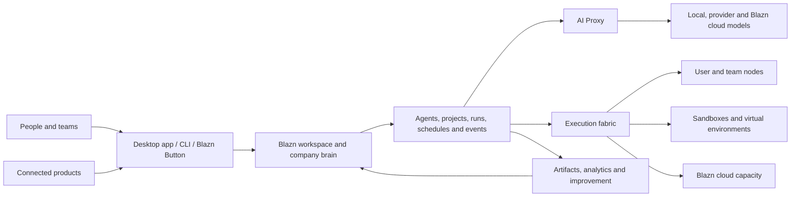

# Blazn Product Overview

**Status:** Vision draft  
**Audience:** Founders, product, design, engineering, and early collaborators  
**Scope:** High-level product definition; detailed requirements and architecture will follow

## Index

- [The idea](#the-idea)
- [The problem](#the-problem)
- [Product promise](#product-promise)
- [Who it is for](#who-it-is-for)
- [The product](#the-product)
- [System design](#system-design)
  - [System component index](#system-component-index)
  - [Nodes](#nodes)
- [How the pieces fit](#how-the-pieces-fit)
- [Product principles](#product-principles)
- [Brand direction](#brand-direction)
- [Initial product boundary](#initial-product-boundary)
- [What Blazn is not](#what-blazn-is-not)
- [Measures of success](#measures-of-success)
- [Documents to develop next](#documents-to-develop-next)

## The idea

Blazn is the operating workspace for an AI-enabled company.

It allows individuals and teams to interact with agents as a coordinated team at scale. People, agents, models, tools, knowledge, projects, and compute live in a shared workspace, so useful context and learning accumulate into a unified company brain instead of disappearing inside isolated chats and applications.

Blazn is available as a desktop application for macOS, Windows, and Linux, a CLI, and an optional managed cloud. A user can begin on one computer, invite a team, contribute additional machines as workers, and adopt managed infrastructure only where it is useful.

## The problem

AI work today is fragmented:

- Conversations and decisions are scattered across Slack channels, source code, email, documents, project tools, assistants, IDEs, and terminals.
- Agents operate independently, with limited knowledge of company goals, prior work, or one another.
- Local and cloud models require separate configuration, credentials, routing, and harness-specific integrations.
- Individuals and teams quickly exhaust AI subscription allowances when operating multiple agents, while direct API usage can become unpredictable and significantly more expensive at scale.
- Agents running directly on a local machine can consume its CPU, memory, storage, and thermal capacity, disrupting normal work or causing instability and restarts.
- A single local machine limits agent concurrency and throughput; scaling beyond it usually requires manually assembling more hardware or paying a cloud provider.
- Agent environments are difficult to provision consistently, secure, observe, and clean up.
- Runs produce logs and artifacts, but rarely create reusable organizational memory.
- Teams cannot easily understand what agents are doing, why they made a decision, what they cost, or whether their performance is improving.
- Project plans and agent execution live in separate systems, leaving people to translate roadmaps into prompts and results back into tasks.
- Connecting agents to a live product, customer issue, or support interaction usually requires custom infrastructure.

The result is a collection of powerful tools without a shared operating model. Teams spend time managing agents instead of working with them.

## Product promise

Blazn gives every person and team one place to:

1. Organize people and agents around shared objectives.
2. Run agents safely on local, contributed, or managed compute.
3. Use the right model for each request without changing tools.
4. Preserve work, knowledge, artifacts, and decisions as organizational memory.
5. Observe outcomes and help agents improve over time.
6. Connect agent work directly to projects, products, and customers.
7. Pool authorized capacity across company and employee machines, automatically provisioning isolated environments while protecting the owner's work.
8. Let agents use local models, cloud models, Blazn cloud, and compatible agent harnesses through one governed system.
9. Bring agents into existing applications through the Blazn Button so they can act on what a user is experiencing in the moment.

The experience should feel local-first, collaborative, inspectable, and progressively adoptable: valuable to one person on one machine, then capable of growing into a company-wide agent platform.

## Who it is for

### Individuals

Developers, founders, researchers, operators, and creators who want one interface for their agents, models, machines, projects, and reusable knowledge.

### Teams

Groups that want shared agents, governed access, coordinated execution, common artifacts, project visibility, and a durable record of how work was completed.

### Organizations

Companies that want a unified agent layer across local infrastructure and cloud services, with control over data, models, cost, security, and operational quality.

## The product

### 1. Blazn desktop application

The desktop application is the primary visual workspace on macOS, Windows, and Linux. It allows users to:

- Create, join, and manage workspaces.
- Invite people and manage roles, access, and shared resources.
- Talk with one agent or assemble a team of specialized agents.
- Follow live work, steer active runs, review decisions, and approve sensitive actions.
- Manage local machines, remote workers, sandboxes, and virtual environments.
- Browse agents, projects, runs, schedules, triggers, tools, resources, instructions, objectives, and metrics.
- Pin and share artifacts such as documents, plans, dashboards, reports, code changes, and research.
- Use an integrated agent harness for conversations and work performed in an isolated environment or directly on the local machine.

### 2. Blazn CLI

The CLI gives people and automation access to the same workspace and control plane. It is designed for terminals, scripts, CI systems, and agent-to-agent operation.

Core responsibilities include:

- Authentication and workspace selection.
- Agent creation, discovery, configuration, and invocation.
- Starting, inspecting, steering, and stopping runs.
- Managing nodes, environments, schedules, triggers, tools, and resources.
- Routing model requests through the Blazn AI Proxy.
- Publishing and retrieving artifacts.
- Exposing Blazn capabilities through automation-friendly and MCP-compatible interfaces.

The desktop app and CLI are two clients of the same product, not separate systems.

### 3. Workspaces and the company brain

A workspace is the shared boundary for a person or organization. It contains:

- Members, teams, roles, and policies.
- Agents and their identities, capabilities, objectives, and instructions.
- Knowledge, resources, tools, integrations, and credentials.
- Projects, roadmaps, milestones, tasks, and decisions.
- Runs, events, artifacts, metrics, schedules, and triggers.
- Nodes, execution environments, models, budgets, and usage.

The company brain is the connected, permission-aware memory formed by these elements. It is not simply a document store or transcript archive. It preserves relationships between objectives, decisions, work, evidence, outcomes, and the agents and people involved.

### 4. Agent library and teams

Users can create and manage a reusable library of agents. Each agent can have:

- A name, role, purpose, and measurable objectives.
- Instructions, skills, tools, resources, and model preferences.
- Environment and machine requirements.
- Permissions, budgets, and escalation rules.
- Schedules, triggers, and event subscriptions.
- Run history, metrics, evaluations, and improvement history.

Agents may work independently, be assigned to projects, or collaborate as a team. Larger coordinating agents can delegate work, combine results, detect gaps, and help specialized agents improve how they work together.

### 5. Agent harness

The built-in harness is where people and agents work together. It supports:

- Persistent conversations and task-oriented sessions.
- Live progress, events, intermediate results, and structured approvals.
- Follow-up instructions and steering during a run.
- Work in isolated sandboxes or approved local-machine contexts.
- Multiple harnesses and agent runtimes behind a consistent Blazn experience.
- Resumable work and durable outputs rather than disposable chat history.

The harness should make an agent's environment, tools, actions, and state visible without forcing users to understand the underlying orchestration system.

### 6. Nodes, workers, and environments

A user can choose to make a machine available as a Blazn node. Eligible work is then scheduled onto contributed macOS, Windows, or Linux capacity according to its capabilities and the workspace's policies.

Blazn can provision an isolated sandbox or virtual environment for a run, attach the required tools and resources, stream progress, preserve selected outputs, and clean up when the work is complete. It should support:

- Personal machines and team-owned hardware.
- Linux container and sandbox workloads.
- Native platform workloads, including work that requires macOS or Windows capabilities.
- Managed environments supplied by Blazn cloud.
- Capability-aware placement, queues, quotas, priorities, and concurrency controls.
- Clear consent, pause/drain controls, resource limits, and visibility for machine owners.

Kubernetes Agent Sandbox is a candidate foundation for selected persistent or interactive Linux environments. It is an implementation component, not a requirement for every workload or platform.

### 7. Blazn AI Proxy

The AI Proxy provides one compatible endpoint for tools such as Codex, Claude Code, IDEs, agents, and internal applications. It can route requests to:

- Models running locally on a user's machine or team hardware.
- Third-party model providers configured by the workspace.
- Models and capacity offered by Blazn cloud.

Routing can account for model capability, privacy, availability, latency, cost, policy, and fallback preferences. Users should be able to understand where a request went and why, while existing tools continue to work with minimal configuration.

This capability builds on the approach established by Blaze Proxy and brings it into the shared Blazn workspace.

### 8. Blazn cloud

Blazn cloud is optional managed infrastructure for teams that do not want to operate every component themselves. It can provide:

- Hosted workspace collaboration and synchronization.
- Managed model access and AI routing.
- On-demand agent environments and elastic execution capacity.
- Durable run history, artifacts, schedules, triggers, and organizational memory.
- Secure remote access to a user's authorized Blazn workspace.
- Administrative controls, usage reporting, policy, and billing.

Local and self-hosted use remain first-class. Cloud adoption should add capacity and convenience without making contributed machines or local models second-class citizens.

### 9. Runs, events, analytics, and improvement

Every meaningful execution is represented as a run. A run connects the initiating person or event, agent, objective, instructions, environment, model activity, tool calls, approvals, outputs, cost, timing, and outcome.

Structured events and metrics make runs observable in real time and reviewable afterward. They support:

- Progress and health monitoring.
- Cost, latency, reliability, and quality analysis.
- Auditing and incident investigation.
- Comparison across agents, models, tools, and workflows.
- Evaluation against the run's objective and expected outcome.

After a run, an agent can perform bounded introspection: identify what worked, what failed, and what reusable learning should be proposed. Improvements to instructions, tools, memory, or collaboration patterns should be evidence-based, versioned, and subject to workspace policy rather than silently rewriting an agent.

Coordinating agents can analyze patterns across multiple agents and runs to improve delegation, handoffs, shared tools, and team performance.

### 10. Projects and execution

Blazn includes project management so plans and agent work share the same context. Workspaces can organize:

- Product and company roadmaps.
- Milestones, projects, tasks, owners, dependencies, and status.
- Objectives, success measures, decisions, risks, and evidence.
- Human and agent assignments.

An agent run can begin from a task, update it with live progress, attach evidence and artifacts, surface blockers, and propose next work. People retain control of priorities and commitments while agents reduce the coordination overhead between planning and execution.

### 11. Artifacts and shared library

Blazn provides a durable, searchable home for useful outputs. Users can pin, organize, version, and share:

- Documents and research.
- Plans, specifications, and decisions.
- Dashboards and reports.
- Code changes and release evidence.
- Data, images, recordings, and other generated files.
- Reusable prompts, instructions, tools, workflows, and agent templates.

Artifacts retain provenance: which objective and run created them, what inputs were used, who approved them, and what superseded them.

### 12. Blazn Button

The Blazn Button connects an application or website to a workspace and its agents. It is the product-facing bridge for real-time work.

Potential experiences include:

- Starting an agent session from the context of the current screen or record.
- Showing live progress and results from a connected execution environment.
- Reporting an issue with relevant application context attached.
- Handling customer support with human and agent collaboration.
- Requesting analysis, remediation, content, or operational work without leaving the host product.

The Button inherits the interaction patterns and visual language of the existing Blaze Button while using Blazn's identity, policy, orchestration, and run history underneath.

The goal is to bring Blazn into the applications people already use. With the user's permission, the Button supplies relevant live context so an agent can understand what the person is seeing, join the experience in the moment, perform work in a connected environment, and return real-time progress and results without forcing the person to reconstruct that context elsewhere.

## System design

This section turns the product vision into a shared system model. It will be developed component by component, beginning with the execution fabric and then defining the resources scheduled onto it.

### System component index

| Component | Purpose | Design status |
| --- | --- | --- |
| [Nodes](#nodes) | Contribute, describe, protect, and operate compute capacity | Initial design |
| Sandbox templates and refreshes | Define reproducible environments and how their base state is updated | Planned |
| Sandboxes | Provide isolated, stateful or disposable execution environments | Planned |
| Warm pools | Keep policy-controlled environments ready to reduce startup latency | Planned |
| Analytics and events | Record the structured history of work and system activity | Planned |
| Metrics | Measure health, capacity, cost, performance, and outcomes | Planned |
| Queues | Admit and prioritize work across limited models and compute | Planned |
| Temporary agents | Create bounded, task-specific agent identities and lifetimes | Planned |
| Agents | Define durable agent identity, objectives, configuration, and history | Planned |
| Development | Build, test, version, evaluate, and release agents and system components | Planned |
| Agent harness | Run and steer conversations and work across compatible harnesses | Planned |
| Credentials and integrations | Connect external systems and safely grant scoped access | Planned |
| MCP | Expose Blazn resources and controls to agents and compatible clients | Planned |
| API | Provide the authoritative programmatic control surface | Planned |
| AI request proxy | Route, govern, observe, and optimize model requests | Planned |

### Nodes

#### Definition

A node is an enrolled machine that makes one or more capabilities available to a Blazn workspace. It may be a person's laptop or desktop, a company workstation, a dedicated server, or capacity managed by Blazn cloud.

Once a machine owner or administrator opts it in, Blazn can automatically create approved virtual environments or sandboxes on that machine and schedule compatible agent work into them. Enrollment does not grant agents unrestricted access to the host. The node contributes only the capabilities, resource envelope, time windows, and data access allowed by its policy.

The node is the unit of capacity and trust. A sandbox is a workload environment created on that capacity. Keeping these concepts separate allows Blazn to use different isolation technologies on macOS, Windows, Linux, and cloud infrastructure without changing how users describe or schedule agent work.

#### Why nodes matter

Nodes turn otherwise isolated machines into a governed compute fabric. A company can use available capacity across employee and company-owned hardware, increase concurrency without immediately purchasing cloud instances, and reserve managed cloud capacity for workloads that require elasticity, availability, or a different trust boundary.

This fabric also protects the local experience. Instead of launching an arbitrary number of agents directly on a workstation, Blazn admits work against declared limits, isolates it where possible, and moves or queues it when the machine cannot safely support more work.

#### Node types

- **Personal node:** A person's macOS, Windows, or Linux machine. It is interactive, may be intermittently available, and always prioritizes the owner's foreground work.
- **Shared team node:** A company-owned machine made available to one or more workspaces under centrally managed policy.
- **Dedicated worker:** A server or workstation intended primarily for agents, with higher concurrency and fewer interactive-use restrictions.
- **Blazn cloud node:** Managed capacity supplied on demand with a defined region, hardware profile, price, and security boundary.
- **Model node:** A machine that exposes local model inference capacity. It may also execute agent environments, but the two capacities are advertised and scheduled independently.

A physical machine may provide multiple execution backends. For example, a Mac could provide a Linux virtual-machine backend for isolated general workloads, a native macOS backend for Xcode work, and a local model endpoint. Each backend has separate limits and trust characteristics even though the UI groups them under one node.

#### Enrollment and identity

Enrollment begins in the desktop application or CLI and should require an explicit user or administrator action. The basic flow is:

1. Authenticate the person and select a workspace.
2. Name the node and show the capabilities Blazn detected.
3. Choose what the machine may contribute, when it is available, and how much capacity must remain reserved for its owner.
4. Apply a workspace-managed node policy and display any settings it controls.
5. Create a unique device identity and register its public identity with the workspace.
6. Establish an outbound authenticated connection to the Blazn control plane.
7. Run compatibility and isolation checks before marking any execution backend ready.

Node identity is distinct from user identity. Removing a user, rotating credentials, reinstalling the node service, or transferring machine ownership must not accidentally preserve access. Device credentials should be revocable, rotated automatically, stored in the platform credential store, and limited to the registered node and workspace.

#### Advertised capabilities

The node service continuously reports a normalized capability inventory that the scheduler can match against workload requirements:

- Operating system, version, CPU architecture, and execution backends.
- CPU, memory, storage, GPU or accelerator capacity, including the amount currently allocatable.
- Installed or managed runtimes, virtualization support, and sandbox providers.
- Native toolchains such as Xcode, Android SDKs, browsers, or Windows build tools.
- Local models and model-server compatibility, context limits, and current inference capacity.
- Network class, allowed destinations, region, data-residency attributes, and trust level.
- Maximum concurrency, availability schedule, battery and thermal restrictions, and owner-defined labels.
- Supported sandbox templates and cached environment versions.

Capabilities are claims, not guarantees. Blazn validates important capabilities during enrollment and refreshes health signals while the node is connected.

#### Lifecycle and state

A node has a small, explicit lifecycle:

- **Enrolling:** Identity exists, but compatibility and policy checks are incomplete.
- **Ready:** At least one backend can accept work.
- **Busy:** The node is healthy but has reached an admission or resource limit.
- **Draining:** Existing work may finish or migrate, but no new work is admitted.
- **Offline:** The node has missed its lease or intentionally disconnected.
- **Quarantined:** Blazn or an administrator has prevented execution because identity, integrity, policy, or health checks failed.
- **Removed:** Trust is revoked and the machine is no longer part of the workspace.

Each execution backend and sandbox also reports its own state. A node can therefore remain ready for local-model requests while its sandbox backend is draining, or remain available for Linux work while native macOS execution is disabled.

#### Placement and admission

Agents request capabilities rather than choosing a machine by hostname. A request may specify an operating system, architecture, sandbox template, native toolchain, model, minimum resources, trust level, region, data boundary, expected duration, and whether interruption is allowed.

The scheduler filters nodes that cannot satisfy hard requirements, then selects among eligible capacity using:

- Workspace and node policy.
- Queue priority, quotas, and fairness.
- Current load and the owner's reserved resources.
- Environment or model cache locality.
- Data location and network restrictions.
- Startup latency, expected reliability, and interruption risk.
- User preference and estimated cost.

Users can pin work to a node for development or specialized hardware, but ordinary runs should remain portable. If no node is eligible, the request waits in a queue, asks the user to relax a constraint, or—when policy permits—offers Blazn cloud capacity with the expected cost visible before admission.

#### Automatic environment provisioning

When the scheduler admits work, the selected node receives a signed workload grant rather than a general command channel. The node then:

1. Resolves an approved sandbox template and exact version.
2. Reuses a compatible warm environment or creates a fresh one.
3. Applies resource, network, filesystem, tool, and credential policy.
4. Starts the requested harness and agent inside the chosen execution backend.
5. Streams lifecycle events, logs, metrics, and selected artifacts.
6. Suspends, refreshes, or destroys the environment according to its retention policy.

Template refresh, warm-pool behavior, sandbox identity, persistence, and cleanup will be defined in their dedicated sections. The node is responsible for faithfully enforcing those decisions, not inventing them locally.

#### Protecting the machine owner

Personal nodes must remain safe and usable while they contribute capacity. The node service enforces:

- Hard CPU, memory, storage, process, and concurrency limits.
- A configurable reserve that agent workloads cannot consume.
- Low-disk, memory-pressure, thermal, battery, and foreground-activity thresholds.
- Availability windows and idle-only operation when requested.
- Immediate pause, drain, and stop controls in the desktop app and CLI.
- Preemption of interruptible agent work when the owner needs resources.
- Bounded log, cache, image, and sandbox storage with visible cleanup controls.
- Crash recovery that detects and cleans up orphaned environments without restarting the host.

The default personal-node policy should be conservative. Increasing capacity is an informed user choice; joining a workspace should never silently turn a machine into an unrestricted worker.

#### Security model

Nodes operate on the assumption that agent code, repositories, tools, and model output may be untrusted.

- The node initiates outbound connections; enrollment should not require exposing a general-purpose inbound management port.
- Every workload receives a short-lived, audience-bound grant scoped to one run and execution backend.
- Sandbox images and templates are signed, versioned, and policy-approved.
- Host files, sockets, devices, clipboard data, and credentials are unavailable unless explicitly attached.
- Secrets are delivered just in time, scoped to the run and integration, redacted from telemetry, and revoked when possible at completion.
- Network access is denied or constrained by template and workspace policy.
- Native-host execution is identified as a higher-trust backend and requires stronger approval and narrower workloads than a sandboxed backend.
- Node actions and administrative changes produce immutable audit events.

Workspace policy must be able to prohibit personal nodes, require company-managed devices, restrict data to a region or trust class, or allow only specific repositories and integrations.

#### Reliability and disconnection

The node maintains a renewable lease with the control plane. When the lease expires, no new work is assigned. The control plane distinguishes a disconnected node from a failed run and applies the workload's recovery policy:

- Wait for the same node when it owns irreplaceable local state.
- Resume a persistent sandbox after reconnection.
- Retry portable work on another eligible node.
- Fail and request human intervention when replay could duplicate an external action.

The node journals enough local state to report what happened after reconnecting. The control plane remains authoritative for run intent, while the node remains authoritative for the observed state of its local environments until reconciliation completes.

#### Observability and privacy

The workspace needs enough information to schedule work and diagnose failures without turning node enrollment into employee surveillance. Node telemetry should include:

- Availability, heartbeat, software version, and backend health.
- Allocatable and consumed CPU, memory, storage, accelerator, and concurrency capacity.
- Sandbox startup time, queue-to-start time, failures, preemptions, and cleanup results.
- Model capacity, request load, latency, and error rates when the node serves models.
- Workload identifiers and policy decisions required for audit and support.

Blazn should not collect unrelated applications, personal files, keystrokes, screen contents, or browsing activity. Application context is shared only through an explicit integration such as the Blazn Button and is governed separately from infrastructure telemetry.

#### Node controls and experience

The desktop app should make node behavior understandable at a glance:

- Whether the node is accepting work and which backends are ready.
- What is running, for whom, and what resources it is using.
- The capacity reserved for the owner and the capacity contributed to Blazn.
- Recent runs, errors, policy changes, and cleanup activity.
- Pause, resume, drain, update, diagnose, and remove actions.
- Estimated local capacity contributed and cloud cost avoided.

Administrators need fleet views for health, versions, capacity, utilization, trust, queues, policy compliance, and current workloads. Machine owners should always retain the local ability to stop Blazn work, even when workspace policy is centrally managed.

#### Initial node record

The first system model should include at least:

- Stable node ID, workspace ID, display name, owner, and enrollment timestamps.
- Device identity, trust class, policy version, and software version.
- Platform and normalized capabilities.
- Execution backends with individual status and allocatable capacity.
- Labels, placement constraints, availability, and resource-reserve policy.
- Current lease, health, drain state, and last-seen time.
- Active environment and workload references.
- Aggregate utilization and reliability metrics.

Secrets, raw device keys, and unrelated host inventory must not be stored in the node record.

#### Version-one boundary

The first node implementation should prove a narrow loop:

1. Enroll one macOS, Windows, or Linux machine from the app or CLI.
2. Contribute a bounded Linux virtualized or containerized backend where the platform supports it.
3. Advertise verified resources and accept capability-matched work.
4. Create an isolated environment from one approved template.
5. Run one harness, stream events and resource metrics, and return artifacts.
6. Enforce resource reserves, concurrency, drain, offline, and cleanup behavior.
7. Make the same operations available through the authenticated Blazn API and MCP server.

Native platform execution, local model serving, organization-wide device management, workload migration, and cloud bursting belong in the model from the beginning but can follow after this loop is reliable.

#### Decisions to make next

- Which isolation backend is the default on each operating system?
- Does the first release use a local scheduler, a hosted control plane, or both?
- Which node and sandbox operations continue while the control plane is unavailable?
- How are software, template, and policy updates staged and rolled back?
- What data and workload classes are permitted on personal versus managed nodes?
- How is contributed capacity measured, credited, budgeted, or billed?
- Which workload types are portable, resumable, interruptible, or bound to one node?
- What compatibility contract allows Kubernetes Agent Sandbox and non-Kubernetes backends to behave consistently?

## How the pieces fit

## Product principles

### Local-first, cloud-optional

One person and one machine should be enough to get value. Cloud services add collaboration, reach, and capacity without taking ownership away from the user.

### People remain in control

Users can see what agents are doing, interrupt work, approve sensitive actions, set boundaries, and understand outcomes.

### One system, many models and harnesses

Blazn should provide a stable experience across different model providers, coding agents, general agents, and execution runtimes rather than locking the workspace to one vendor.

### Work creates memory

Important context, decisions, evidence, and artifacts should become reusable workspace knowledge with provenance and permissions.

### Improvement is observable and governed

Agents learn through measured outcomes and explicit, versioned changes. Improvement must remain reviewable, reversible, and aligned with workspace policy.

### Secure by default

Isolation, identity, least privilege, secrets handling, auditability, and data boundaries are product requirements, not deployment options.

### Progressive complexity

Simple tasks should feel simple. Infrastructure, routing, queues, and orchestration details should become visible only when a user needs control over them.

## Brand direction

Blazn belongs to the existing Blaze product family and should reuse the visual system established by Blaze Proxy and Blaze Button:

- Dark, focused surfaces led by a `#101010` canvas and `#171717` panels.
- Blaze orange as the primary signal color, using the established orange/red range (`#f97316` and `#ff2e00`).
- Clear neutral typography with restrained status colors.
- Rounded, compact application surfaces and the existing flame language for iconography.
- A technical, fast, confident tone without making the product feel inaccessible.

The visual identity should evolve as one system across desktop, CLI output, web surfaces, embedded Button experiences, documentation, and cloud administration. Existing Blaze assets are references; final naming, trademarks, and asset licensing should be confirmed before public release.

## Initial product boundary

The first version should prove the core loop:

> Create a workspace, configure an agent, choose a model, run useful work in a controlled environment, follow and steer it, and preserve the outcome for the team.

It does not need to deliver the full company-brain vision on day one. The early product can focus on:

- A single-user workspace with a clear path to team collaboration.
- Desktop and CLI access to the same local control plane.
- A small agent library and one integrated harness.
- Blazn AI Proxy routing across a local model and selected cloud providers.
- One contributed machine acting as a worker.
- Isolated Linux execution for an initial class of workloads.
- Runs with live events, logs, artifacts, and basic metrics.
- A minimal project/task connection.
- Secure remote control through an MCP-compatible interface.

Native macOS and Windows execution, broad multi-agent coordination, advanced organizational memory, autonomous improvement, elastic cloud capacity, and the full Blazn Button platform can then be introduced in deliberate stages.

## What Blazn is not

- It is not only another chat interface.
- It is not only a model gateway.
- It is not only a Kubernetes or sandbox manager.
- It is not a replacement for every specialized IDE, model provider, or project tool.
- It does not give agents unrestricted access to a user's machines or company data.
- It does not treat unreviewed self-modification as learning.

Blazn is the connective operating layer that makes these capabilities work together as a trusted agent team.

## Measures of success

At a high level, Blazn succeeds when:

- A new user completes useful agent work quickly on their existing machine.
- A team can find and reuse prior work instead of recreating context.
- Agents complete more objectives with fewer failed runs and less human coordination.
- Users can understand and control model routing, execution, cost, permissions, and data location.
- Adding a machine or managed capacity increases throughput without increasing operational burden.
- Agent and team improvements are supported by measurable run evidence.
- Product and customer interactions initiated through the Blazn Button become traceable work with timely outcomes.

## Documents to develop next

This overview establishes the product direction. Follow-on documents should define:

1. Target users, jobs to be done, and initial launch persona.
2. Version-one scope and end-to-end user journeys.
3. Product architecture and trust boundaries.
4. Workspace, agent, run, artifact, project, and event data models.
5. Node enrollment, sandboxing, native execution, and scheduling model.
6. AI Proxy compatibility, routing, policy, and provider strategy.
7. MCP and public API surface, authentication, and authorization.
8. Company-brain memory, retrieval, provenance, retention, and privacy model.
9. Agent evaluation, introspection, and governed improvement process.
10. Blazn Button SDK and embedded interaction model.
11. Desktop/CLI technology choices and release strategy.
12. Commercial model for local, team, and cloud offerings.
